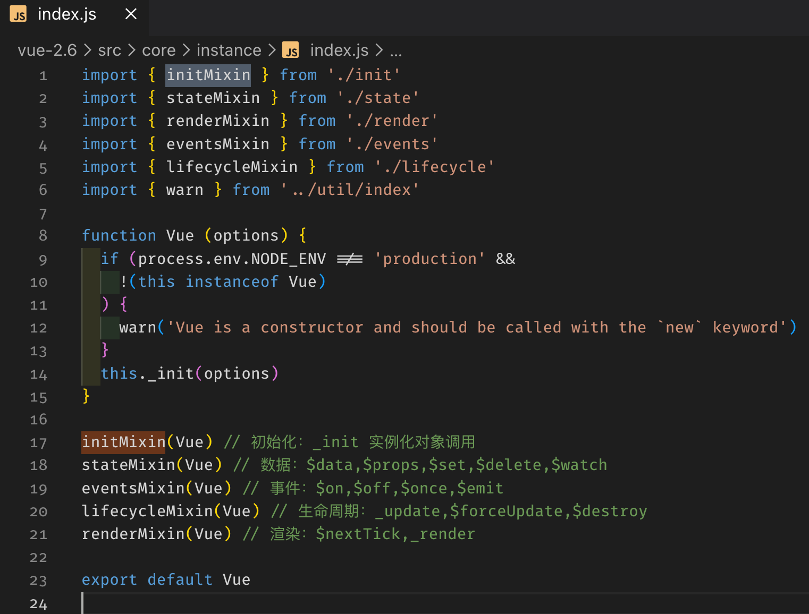
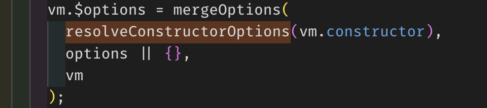
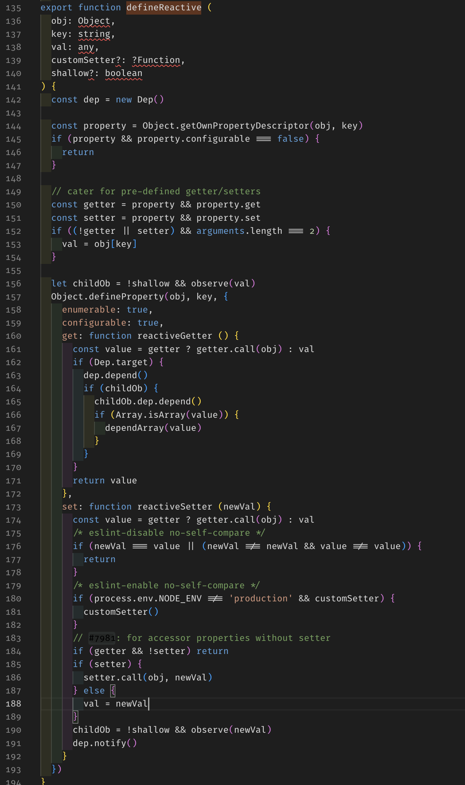
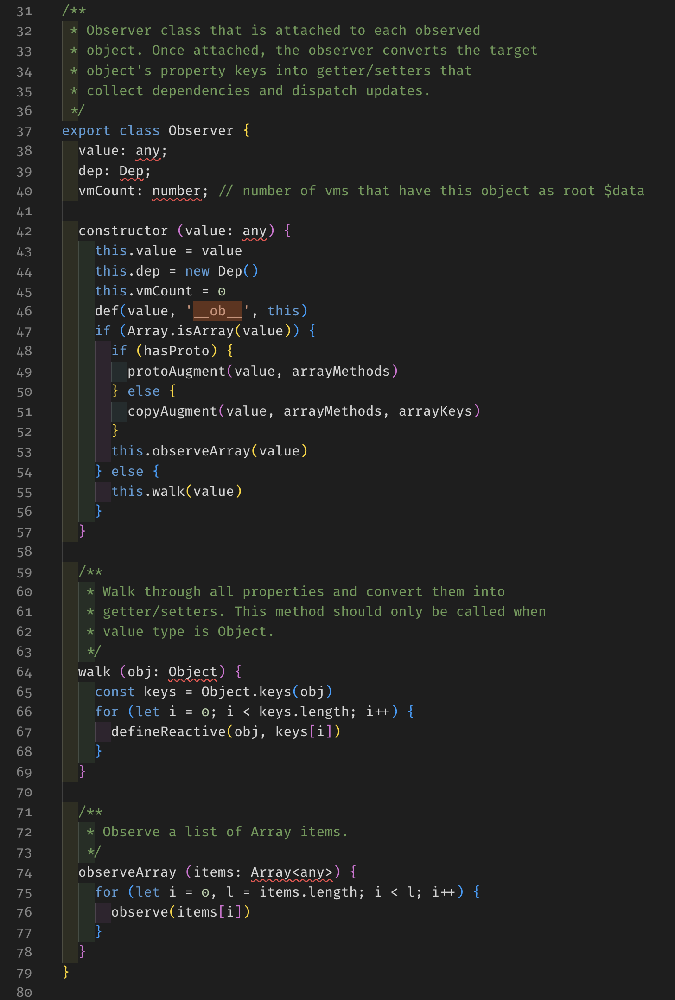

# Vue 源码分析

入口文件：`/src/core/index.js`

## 1、Vue 初始化函数，未 new Vue 的时候

### 1.1 为 Vue prototype 原型添加方法

文件位置：`/src/core/instance/index.js`

1. initMixin 为 Vue prototype 添加 _init 方法，Vue 构造函数实例化对象时候就会调用该方法。
2. stateMixin 为 Vue prototype 添加 set，$delete，$watch 方法。
3. eventsMixin 为事件初始化，为 Vue prototype 添加 $on，$once，$off，$emit 方法。
4. lifecycleMixin 方法是，为 Vue prototype 添加 _update，$forceUpdate，$destroy 方法。
5. renderMixin 渲染方法，Vue prototype 添加 _o，_n，_s，_l，_q，_i，_m，_f，_k，_b，_v，_e，_u，_g，$nextTick，_render 方法。

此时 Vue prototype 原型中已经含有 _init，set，$delete，$watch，$on，$once，$off，$emit，update，$forceUpdate，$destroy，_o，_n，_s，_l，_q，_i，_m，_f，_k，_b，_v，_e，_u，_g，$nextTick，_render 方法，在一万多行中又添加了 `_patch_` 和 $mount 方法。

### 1.2 initGlobalAPI 为 Vue 添加静态方法和属性

文件位置：`/src/core/global-api/index`

1. defineProperty 监听 ‘config’ 设置配置该值不可以修改。
2. 添加 Vue.util 工具类，但是这不是公共 api 外部用户最好不要用。（warn, extend, mergeOptions, defineReactive）
3. 添加 Vue.set 静态方法，用于更新视图。
4. 添加 Vue.delete 静态方法，用于删除数据。
5. 添加 Vue.nextTick 静态方法，用于更新视图后回调递归。
6. 添加 Vue.options 静态属性，并且在该对象中添加 components、directives、filters 静态对象，记录静态组件。
7. initUse 方法为 Vue 添加 Vue.use 静态方法，安装插件。
8. initMixin$1 方法为 Vue 添加 Vue.mixin 静态方法，合并参数。
9. initExtend 方法为 Vue 添加 Vue.extend 静态方法，继承。
10. initAssetRegisters 方法为 Vue 添加 component, directives, filter 静态方法，定义组件，指令和过滤器。

此时 Vue 静态方法有 set、delete、nextTick、use、mixin、extend、component、directive、filter。

## 2、new Vue 实例化对象

1.1 中的图片 14 行 `this._init(options)`；调用 _init 方法传 options 进去，创建 vm._uid。

### _isComponent: true

判断 `_isComponent` 为真，调用 `initInternalComponent(vm, options)`（初始化内部组件）。优化内部组件实例化。因为动态选项合并非常缓慢，并且内部组件选项都不需要特殊处理。

### _isComponent: false

判断 `_isComponent` 为假，调用 `mergeOptions(resolveConstructorOptions(vm.constructor), options, vm)`（选项合并）。

**选项检查**（`components`\ `prop`\ `inject`\ `directive`），然后**选项合并**（常规、默认资源、生命周期钩子函数、`watch`选项和 `props`, `methods`, `inject`, `computed` 类似选项合并）。

调用 resolveConstructorOptions 合并 vm.constructor 构造函数的属性 options，就是当用户用了 vue 的静态方法拓展了一些组件或者参数。最终集合在 vm.$options 。

### initProxy

对 vm 实例进行一层代理，为 vm 实例化对象添加了 _renderProxy 方法。拦截 with 语句下的作用对象, 对非法没有定义的变量进行筛选判断。

### initLifecycle

初始化生命周期标志此时 vm 构造对象添加 `$root`，`$children`，`$refs`，`_watcher`，`_inactive`，`_directInactive`，`_isMounted`，`_isBeingDestroyed` 等属性和标志。

为 vm 添加了 `$root`、 `$parent`、 `$children`、 `$refs`等属性。

### initEvents

初始化组件事件。

如果 vm.$options._parentListeners 事件存在。updateComponentListeners 更新组件事件，删除旧事件，添加新的事件。updateListeners 更新事件。add 添加事件。

#### 判断 once 标志为真

调用 `$once` 只执行一次函数就解绑

#### 判断 once 标志为假

`$on` 添加事件，把事件推进队列去 `vm._events[event]`

### initRender

初始化渲染，为 vm 实例化的对象添加 `_vnode`，`_staticTrees`，`renderContext`，`$slots`，`$scopeSlots` 等属性或者对象，更重要的是添加了 `_c` 和 `$createElement` 这两个渲染方法，并且把 `$attr` 属性和 `$listeners` 事件属性添加到 `defineReactive` 观察者中。

#### vue 响应式双向数据绑定从这里开始。

defineReactive 过 defineProperty 的 set, get 方法监听数据变化，实例化 dep 对象。

- 判断 property.get 是否存在，如果存在则说明该数据已经添加过 defineProperty 则使用 property.get 否则直接获取值。
- 判断 property.set 是否存在，如果存在则说明该数据已经添加过 defineProperty 则使用 property.set 否则直接设置值。
- 如果 shallow 为假，observe value 必须是对象，如果不是对象或者 value 对象属性，则退出函数，所以递归跳出条件在这里，实例化 dep 对象，获取 dep 对象，为 value 添加 `__ob__` 属性，返回 `new Observer` 实例化的对象。
  - 判断 value 是否有 `__ob__` 属性，如果没有。Observer 为 value 添加 dep 对象，vmCount 标记，如果 value 为对象并且值是 `{msg: 'hello'}`，此时  value 数据变成这样 `{ value: {__ob__: {value: value, dep: new Dep(), vmCount: 0}} }` `__ob__` 即 Observer 构造实例化的对象，`__ob__` 对象 prototype 还包含两个方法 `walk` 和 `observeArray`。
    - 判断 value 是否是数组，如果是数组，则先变成真正的数组，获取数组的方法。
      - observeArray 循环 value 把数组拆分调用 observe，如果多层数据是数组则会递归下去。把数组 value 数组数据拆分递归，数组和数据都加入监听。
    - 如果 value 不是数组，而是对象。`walk` 遍历对象，调用 `defineReactive` 形成递归。

### initInjections

`Object.keys(注入的数组)` 进行 `defineReactive`。

### initState

构建响应式系统。

`observe` -》 `Observer` -》 `observeArray（observe(items[i])）` | `walk（defineReactive(obj, keys[i])）` -》 `defineReactive`

* 依赖收集的过程（每个数据都是一个依赖管理器，每个使用的数据就是一个依赖，当访问到数据时会将当前访问的场景作为一个依赖收集到依赖管理器中。）
* 派发更新的过程 1.判断数据更改前后一致情况；2.新值为对象，对属性做依赖收集；3.通知该数据收集watcher依赖，遍历每个watcher，进行更新，调用dep.notify()；4.更新时将每个watcher推到队列中，下个tick进行run操作。5.执行run方法，执行get方法，重新计算新值，依赖的清除。

### initProvide

给实例 vm 上添加 `_provided`。

### $mount

实例挂载和模板编译。

[内部流程图](https://www.wenreq.site/blog/technology/vue2/sourceCode/01.html)

#### 编译

compile 编译可以分成 `parse` 、 `optimize` 与 `generate` 三个阶段，最终需要得到 `render function`。

- `parse` 会用正则等方式解析 template 模板中的指令、class、style等数据，形成 AST。
- `optimize` 的主要作用是标记 static 静态节点，这是 Vue 在编译过程中的一处优化，后面当 update 更新界面时，会有一个 patch 的过程，diff 算法会直接跳过静态节点，从而减少了比较的过程，优化了 patch 的性能。
- `generate` 是将 AST 转化成 render function 字符串的过程，得到结果是 render 的字符串以及 staticRenderFns 字符串。

在经历过 parse 、optimize 与 generate 这三个阶段以后，组件中就会存在渲染 VNode 所需的 render function 了。

#### 响应式

当 render function 被渲染的时候，因为会读取所需对象的值，所以会触发 getter 函数进行 [依赖收集]，[依赖收集] 的目的是将观察者 Watcher 对象存放到当前闭包中的订阅 Dep 的 subs 中。

在修改对象的值的时候，会触发 setter，setter 通知之前 [依赖收集] 得到的 Dep 中的每一个 Watcher，告诉它们自己的值改变了，需要重新渲染视图。这时候这些 Watcher 就会开始调用 update 来更新视图，当然这中间还有一个 patch 的过程以及使用队列来异步更新的策略。

