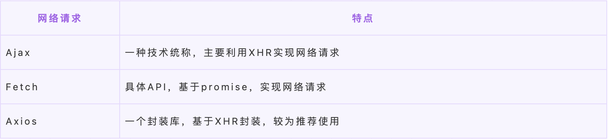

# JavaScript

## 1、js 数据类型和存储方式？null 和 undefined 区别？
### 基本类型

`String`、`Number`、`Boolean`、`Null`、`Undefined`。

存储在**栈**内存，占用空间小，大小固定，属于被频繁使用的数据。
### 引用类型

`Object`、`Function`、`Array`、`Date`。

同时存储在**栈**与**堆**内存中，占据空间大，大小不固定。指针存在**栈**中，将值存在**堆**中。把对象赋值给另外一个变量时，复制的是对象的**指针**，指向同一块内存地址。
### null 和 undefined

`null` 空对象，`undefined` 未定义；`typeof null` 返回 `object`（`null` 不是对象，000 开头代表是对象，然后 `null` 表示为全零，所以将它错误判断为 `object`。），`undefined` 返回 `undefined`。
## 2、js 判断数据类型的几种方法？
### typeof

- 一般用来判断基本数据类型，除了 `null` 输出 `object`，其他都正确。
- 引用类型时，除了判断函数会输出 `function`，其他都是 `object`。

### instanceof

可以准确判断引用数据类型，检测构造函数的 `prototype` 属性是否在某个实例对象的原型链上。


### Object.prototype.toString.call()

`toString()`是 Object 的原型方法，调用该方法，默认返回当前对象的`[[Class]]`。可以判断基本和引用类型。

### 类型转换

- 转为数字（调用 `Number()`、`parseInt()`、`parseFloat()`）
- 转为字符串（调用 `toString()` 或 `String()` 方法）
- 转为布尔值（调用 `Boolean()` 方法）

#### 转换为数字

- `Number()`：可以把任意值转换成数字，如果要转换的字符串有不是数字的值，则会返回 `NaN`。

```js
Number('1')   // 1
Number(true)  // 1
Number('123s') // NaN
Number({})  //NaN
```

- `parseInt(string, radix)`：解析一个字符串并返回指定基数的**十进制整数**，radix 是 2-36 之间的整数，表示被解析字符串的基数。

```js
parseInt('2') //2
parseInt('2',10) // 2
parseInt('2',2)  // NaN
parseInt('a123')  // NaN  如果第一个字符不是数字或者符号就返回NaN
parseInt('123a')  // 123
```

- `parseFloat(string)`：解析一个参数并返回一个**浮点数**

```js
parseFloat('123a')
//123
parseFloat('123a.01')
//123
parseFloat('123.01')
//123.01
parseFloat('123.01.1')
//123.01
```

- 隐式转换

```js
let str = '123'
let res = str - 1 //122

str+1 // '1231'
+str+1 // 124
```

#### 转为字符串

- `toString()` 注意：null undefined 不能调用
- `String()` 都能转
- 隐式转换：当 `+` 两边有一个是字符串，另一个是其它类型时，会先把其它类型**转换为字符串再进行字符串拼接**，返回字符串

#### 转换为布尔

`0`, `''`(空字符串), `null`, `undefined`, `NaN` 会转成 false，其它都是 true。

- `Boolean()`
- 条件语句：如果一个变量作为条件，`undefined` 会转为 false。
- 隐式转换 `!!`

#### 显示转换和隐式转换

显示转换：`Number()` `parseInt()` `parseFloat()` `toString()` `String()` `Boolean()` 的函数方法的转换。

隐式转换：通过操作符 `+` `-` `!!` 进行的转换。计算前要先进行类型的转换。

### {} 和 [] 的 valueOf 和 toString 的返回结果？

- `valueOf`：返回指定对象的**原始值**。
- `toString`：返回一个表示对象的**字符串**。默认情况下，`toString()` 方法被每个 `Object` 对象继承。如果此方法在自定义对象中未被覆盖，`toString()` 返回 "[object type]"，其中 `type` 是对象的类型。

```js
({}).valueOf()   // {}
({}).toString()  // '[object Object]'
[].valueOf()    // []
[].toString()   // ''
```

## 3、let const var 的区别？

- **变量提升**：let,const 定义的变量不会出现变量提升，而 var 会。
- **块级作用域**：let,const 是块级作用域，即其在整个大口号 {} 之内可见，var：只有全局作用域和函数作用域概念，没有块级作用域的概念。
- **重复声明**：同一作用域下 let,const 声明的变量不允许重复声明，而 var 可以。
- **暂时性死区**：let,const 声明的变量不能在声明前使用，而 var 可以。
- const 声明的是一个**只读的常量**，不允许修改。

## 4、js 作用域和作用域链？

作用域：

> 简单来说，作用域是指**程序中定义变量的区域**，它决定了**当前执行代码对变量的访问权限**。

作用域链：

> 当执行代码，访问内部变量时，会先查找当前作用域下有无变量，有则立即返回，没有的话则回去父级作用域中查找，一直找到全局作用域，我们把这种作用域的嵌套机制称为 “作用域链”。

## 5、如何判断this指向？

this的绑定规则有四种：默认绑定，隐式绑定，显式绑定，new绑定。

1. **new 绑定**：this 绑定的是 `new` 中**创建的对象**。
2. **显式绑定**：通过 `call` `apply` `bind` 调用，this 绑定的是**指定的对象**。
3. **隐式绑定**：在某个上下文对象中调用，this 绑定的是那个上下文对象。
4. 如果以上都不是，那么使用**默认绑定**。如果在严格模式下，则绑定到 `undefined`，否则绑定到**全局对象**。
5. 如果把 null 或者 undefined 作为 this 的绑定对象传入 call、apply 或者 bind, 这些值在调用时会被忽略，实际应用的是默认绑定规则。
6. 箭头函数没有自己的 this, 它的 this **继承于上一层代码块的 this**。

## 6、for...of，for...in，forEach，map 的区别？

### for...of （不能遍历对象）

> for...of 语句在可迭代对象（包括 Array,Map,Set,String,TypeArray,argument 对象等等）上创建一个迭代循环，调用自定义迭代钩子，并为每个不同属性的值执行语句。

无论是 `for...in` 还是 `for...of` 语句都是迭代一些东西。它们之间的主要区别在于它们的迭代方式。

`for...in` 语句以任意顺序迭代对象的**可枚举属性**。

`for...of` 语句遍历**可迭代对象**定义要迭代的数据。

### for...in

> for...in 循环：遍历对象自身的和继承的可枚举的属性，不能直接获取属性值。可以中断循环。

### forEach

> forEach: 只能遍历数组，不能中断，没有返回值。

### map

> map: 只能遍历数组，不能中断，返回值是修改后的数组。

### 总结

- `forEach` 遍历列表值，不能使用 break 语句或使用 return 语句。
- `for in` 遍历对象键值，或者数组下标，不推荐循环一个数组。
- `for of` 遍历列表值，允许遍历数组、字符串、映射、集合等可迭代的数据结构等，在 ES6 中引用了 `for of` 循环，以替代 `for in` 和 `forEach()`，并支持新的迭代协议。
- `for in` 循环出的是 `key`，`for of` 循环出的是 `value`；
- `for of` 是ES6新引入的特性。修复了ES5的for in的不足；
- `for of` 不能循环普通的对象，需要通过和 `Object.keys()` 搭配使用。

## 7、说下你对原型链的理解？

JavaScript 是面向对象的，每个实例都有一个隐式原型 `__proto__` 属性，该属性指向它的原型对象（实例原型），这个实例的构造函数有个显示原型属性 `prototype`，该属性和实例上的 `__proto__` 属性指向一个对象。

当一个试图获取对象查某个属性时，自身没有就会去 `__proto__` 隐式原型上找，只到找到 `Object.prototype.__proto__` 为 null。这样就形成了原型链。

## 8、js 延迟加载的方式?

JavaScript 会阻塞 DOM 的解析，因此也就会阻塞 DOM 的加载。所以有时候我们希望延迟 JS 的加载来提高页面的加载速度。

- JS 放在页面最底部。
- script 标签的 `defer` 属性：脚本会立即下载但**延迟**到页面加载完毕再执行。该属性对于内联脚本无作用（即没有 src 属性的脚本）。
- `async` 是在外部 JS 加载完成后，浏览器空闲时，Load 事件触发前执行，标记为 async 的脚本并不保证按照指定他们的先后顺序执行，该属性对于内联脚本无作用（即没有  src 属性的脚本）。
- 动态创建 script 标签，监听 dom 加载完毕在引入 js 文件。

## 9、说说什么是模块化开发？

> 模块化的开发方式可以提高代码复用率，方便进行代码的管理。通常一个文件就是一个模块，有自己的作用域，只向外暴露特定的变量和函数。

几种模块化方案：

- 第一种是 `CommonJS` 方案，它通过 `require` 来引入模块，通过 `module.exports` 定义模块的输出接口。
- 第二种是 `AMD` 方案，这种方案采用**异步加载**的方式来加载模块，模块的加载不影响后面语句的执行，所有依赖这个模块的语句都定义在一个回调函数里，等到加载完成后执行回调函数。`require.js` 实现了 `AMD` 规范。
- 第三种是 `CMD` 方案，这种方案和 `AMD` 方案都是为了解决异步模块加载的问题，`sea.js` 实现了 `CMD` 规范。它和 `require.js` 的区别在于模块定义时对依赖的处理不同和对依赖模块的执行时机的处理不同。
- 第四种是 ES6 的方法，使用 `import` 和 `export` 的形式来导入导出模块。

### CommonJS

Node.js 是 commonJS 规范的主要践行者。这种模块加载方案是服务器端的解决方案，它是以同步的方式来引入模块的。

### AMD 与 require.js

AMD 规范采用异步方式加载模块，模块的加载不影响后面语句的执行，所有依赖这个模块的语句定义在一个回调函数里，等到加载完成后，这个回调函数才会运行。这里介绍用 `require.js` 实现 `AMD` 规范的模块化：用 `require.config()` 指定引用路径等，用 `define()` 定义模块，用 `require()` 加载模块。

### CMD 与 sea.js

CMD 是另一种 js 模块化方案，它与 AMD 很类似，不同点在于：AMD 推崇依赖前置、提前执行，CMD 推崇依赖就近、延迟执行。此规范是 sea.js 推广过程中产生的。

### ES6 Module

旨在成为浏览器和服务器通用的模块解决方案。其模块功能主要由两个命令构成：`export` 和 `import`。`export` 命令用于规定模块的**对外接口**，`import` 命令用于输入**其他模块提供的功能**。

### CommonJS 与 ES6 Module 的差异

- CommonJS 模块输出的是一个**值的拷贝**，ES6 模块输出的是**值的引用**。
- CommonJS 模块是**运行时加载**，ES6 模块是**编译时输出接口**。
- CommonJS 加载的是一个对象（即 module.export 属性），该对象只有在脚本运行完才会生成。而 ES6 模块不是对象，它的对外接口知识一种静态定义，在代码静态解析阶段就会发生。

## 10、说说 js 的运行机制（EventLoop）

因为 JS 是单线程的，JS 会把所有待执行的任务都放在主线程上，任务分为同步任务和异步任务，同步任务放在主线程的执行栈中执行，遵循先进先出的策略，异步任务分为微任务和宏任务，异步任务放在对应的 Web API 中进行执行，执行完毕的回调函数会依次放入任务队列里面，事件循环会不定时的去检查任务队列，当执行栈中的没有任务的时候，会将任务队列中的任务入栈执行，出栈，直至执行完任务队列中的所有任务。


## 11、如何在 js 中比较两个对象？

一般比较两个对象会采用递归来比较。在 JavaScript 中，比较两个对象并不像比较两个基本类型的值那么简单。这是因为当你比较两个对象时，你实际上是比较它们的引用，而不是它们的内容。如果你想比较两个对象的内容，你需要自己写代码来实现。

```js
function deepEqual(obj1, obj2) {
  if(obj1 === obj2) {
    return true;
  }

  if(isPrimitive(obj1) && isPrimitive(obj2)) {
    return obj1 === obj2;
  }

  if (Object.keys(obj1).length !== Object.keys(obj2).length) {
    return false;
  }

  for (let key in obj1) {
    if (!(key in obj2)) return false; // other object doesn't have this prop
    if (!deepEqual(obj1[key], obj2[key])) return false;
  }

  return true;
}

function isPrimitive(obj) {
  return (obj !== Object(obj));
}
```

这个 `deepEqual` 函数首先检查两个对象是否是同一个对象。如果是，那么它们肯定是相等的。然后，它检查两个对象是否都是基本类型的值。如果是，那么它们可以直接比较。如果两个对象有不同数量的键，那么它们肯定是不相等的。最后，它遍历第一个对象的每个键，检查第二个对象是否有相同的键，以及对应的值是否相等。

## 12、说说你对闭包的理解，以及它的原理和应用场景？哪些操作会导致内存泄露？怎么方式内存泄露？

一个函数和对其周围的引用捆绑在一起，这样一个组合就是闭包。

### 闭包原理

函数执行分成两个阶段（预编译阶段和执行阶段）。

- 在预编译阶段，如果发现内部函数使用了外部函数的变量，则会在内存中创建一个“闭包”对象并保存对应变量值，如果已存在“闭包”，则只需要增加对应属性值即可。
- 执行完后，函数执行上下文会被销毁，函数对“闭包”对象的引用也会被销毁，但其内部函数还持用该“闭包”的引用，所以内部函数可以继续使用“外部函数”中的变量。

### 优点

1. 可以从内部函数访问外部函数的作用域中的变量，且访问到的变量长期驻扎在内存中，可供之后使用。
2. 避免变量污染全局。
3. 把变量存到独立的作用域，作为私有成员存在。

### 缺点

1. 对内存消耗有负面影响。因内部函数保存了对外部变量的应用，导致无法被垃圾回收，增大内存使用量，所以使用不当会导致内存泄露。
   - 污染全局(window)
   - 闭包
   - detached 节点（如果某个节点已从 DOM 树移除，但 JavaScript 仍然引用它）
2. 对处理速度具有影响。闭包的层级决定了引用的外部变量在查找时经过的作用域链长度。
3. 可能获取到意外的值（captured value）。

### 应用场景

- 模块封装，防止变量污染全局
- 循环体中创建闭包，保存变量

```js
var Person = (function(){
  var name = '南玖'
    function Person() {
      console.log('work for qtt')
  }
  Person.prototype.work = function() {}
   return Person
})()
```

```js
for(var i=0;i<5;i++){
  (function(j){
    	setTimeOut(() => {
        console.log(j)
      },1000)
  })(i)
}
```

## 13、Object.is() 与比较符 ==、=== 的区别？

- `==` 会先进行类型转换再比较
- `===` 比较时不会进行类型转换，类型不同则直接返回 false
- `Object.is()` 在 `===` 基础上特别处理了 `NaN`,`-0`,`+0`,保证 `-0` 和 `+0` 不相等，但 `NaN` 与 `NaN` 相等。

### == 操作符的强制类型转换规则

- 字符串和数字之间的相等比较，将字符串转换为数字之后再进行比较。
- 其他类型和布尔类型之间的相等比较，先将布尔值转换为数字后，再应用其他规则进行比较。
- null 和 undefined

## 14、call 与 bind、apply 的区别？

都是改变 this 指向和函数调用。`call`（多个参数逗号分割） 与 `apply`（参数是数组） 的功能是相同的，只是两者**传参的方式不一样**。

而 `bind` 传参方式与 `call` 相同，但它不会立即执行，而是返回这个改变了 `this` 指向的函数。

## 15、说说你了解哪些前端本地存储？

- 本地存储：localStorage、sessionStorage、cookies
- 离线缓存：application cache
- 前端数据库：indexDB、webSQL

### cookie

cookie 是与特定域名绑定的，设置 cookie 后，它会与请求一起发送到创建它的域。

cookie 不能超过 300 个；每个 cookie 不超过 4096 字节（4kb）。

- 获取：`document.cookie` 返回包含页面中所有有效cookie的字符串，以分号分隔；「所有名和值都是URL编码，因此必须使用`decodeURIComponent()` 解码」
- 设置：

  ```js
    name=value; expires=expiration_time; path=domain_path; domain=domain_namel secure

    document.cookie = `${encodeURIComponent('name')}=${encodeURIComponent('nanjiu')};domain=bettersong.github.io;`
  ```
- 删除：没有直接删除已有 cookie 的方法，但可以通过设置其过期时间来达到删除效果。

request: 当浏览器发起一个请求时，浏览器会自动检查是否有相应的cookie，如果有则将 cookie 添加到 request headers 的 cookie 字段中。

response: 当服务器需要 cookie 时，在 http 请求的 response headers 字段中添加 set-cookie 字段，浏览器接收到之后会自动解析识别，将 cookie 种下。

### localStorage 和 sessionStorage

> `localStorage` 只要在相同的协议，域名，端口下就能读取或修改同一份 `localStorage` 数据，`sessionStorage` 对象只存储会话数据，这意味着数据只会存储到浏览器关闭。「`sessionStorage`除了协议，域名，端口外，还要求在同一窗口下。」

- `localStorage` 永久存储，除非手动删除。
- `sessionStorage` 存储到浏览期关闭就消失了
- 每个域名给 `localStorage` 和 `sessionStorage` 分配的存储空间时5M ，`cookie`是4kb

### indexedDB

- Database：通过open方法直接打开 `const db = indexDB.open('testDB')`
- Object store: 这个就是 DB 里面具体存储的对象。这个可以对应 SQL 里面的 table 内容。其存储的结构为：
- Index：有点类似于外链，它本身是一种Object store，主要用来本体的store中，索引另外的object store里面的数据。
- transaction: 事务其实就是一系列 CRUD 的集合内容。如果其中一个环节失败了，那么整个事务的处理都会被取消。
- cursor: 主要是用来遍历 DB 里面的数据内容。主要是通过 openCursor 来进行控制。

## 16、js 数组和字符串的常用方法？

### 添加

- push
- unshift
- splice

### 删除

- pop
- shift
- splice

### 排序

- reverse
- sort

### 迭代

- every
- some
- filter
- map
- forEach
- reduce

### 改变元素组（7）

`push` `pop` `shift` `unshift` `reverse` `sort` `splice`

### 不会改变（7）

`concat` `join` `slice` `filter` `reduce` `find` `findIndex`

## 17、js 为什么要进行变量提升，它导致了什么问题？

变量提升的表现是，在变量或函数声明之前访问变量或调用函数而不会报错。

- 解析和预编译过程中的声明提升可以提高性能，让函数可以在执行时预先为变量分配栈空间
- 声明提升还可以提高JS代码的容错性，使一些不规范的代码也可以正常执行
- 函数是一等公民，当函数声明与变量声明冲突时，变量提升时函数优先级更高，会忽略同名的变量声明

## 18、你常用到的 ES6 新特性，有哪些？

- 新增块级作用域（let const）
  1. let const 不存在变量提升
  2. 存在暂时性死区的问题
  3. 块级作用域的内容
  4. 不能再同一个作用域内重复声明
- 定义类的语法糖 class
- 基本数据类型 symbol
- 箭头函数
  1. 不能作为构造函数使用，不能用new，箭头函数就没有原型。
  2. 箭头函数没有 arguments
  3. 箭头函数不能用 call apply bind 去改变 this 的指向
  4. this 指向外层第一个函数的 this
- 解构赋值：从数组或者对象中取值，然后给变量赋值。
- 函数默认值
- 数组新的 API
- 对象和数组的扩展运算符
- Promise


## 19、ajax 中 get 和 post 的区别？
## 20、从输入 url 到页面显示发生了什么？越详细越好。
## 21、new 操作符具体干了什么？

1. 创建一个新对象。`let obj = {}`
2. 新对象的 `__proto__` 属性指向构造函数的原型对象。`obj.__proto__ = Base.prototype`
3. 将构造函数作用域赋值给新对象（this对象指向新对象）。`Base.call(obj)`
4. 执行构造函数内部的代码，将属性添加给新对象。
5. 返回新的 obj。

---

箭头函数是 ES6 中提出来的，它没有 prototype，也没有自己的 this 指向，更不可使用 arguments 参数，所以不能 new 一个箭头函数。

1. 创建一个对象 `let obj = {}`
2. 将构造函数的作用域赋值给新对象（也就是将对象的 `__proto__` 属性指向构造函数的 prototype 属性）`obj.__proto__ = Base.prototype`
3. 构造函数中的 this 指向该对象（也就是为这个对象添加属性和方法） `Base.call(obj)`
4. 返回新对象 `return obj`

---

自己理解总结：

1. 创建一个空对象。`let obj = {}`
2. 将构造函数的 `prototype` （显示原型）属性（原型对象）赋值给空对象的 `__proto__` （隐式原型）属性(原型对象)。`obj.__proto__ = Base.prototype`
3. 将构造函数的 this 指向新对象（给这个空对象添加属性和方法）`Base.call(obj)`
4. 返回新对象 `return obj`

## 22、简述你理解的面向对象？

面向对象的三大特性：封装、继承、多态。利用封装、继承、多态的方式建模，从而大量减少重复代码、降低模块间磨合，像拼积木一样组装了整个“世界”。

### 封装

封装好的类如同一个黑匣子，外部无法看到内部的构造及运转机制，而只能访问其暴露出来的属性或方法。

### 继承

继承可以使父类的属性和方法延续到子类中，这样子类就不需要重复定义，并且子类可以通过重写来修改继承而来的方法实现，或者通过追加达到属性与功能扩展的目的。

类是对象的模板，那么父类（或超类）则可以被看作模板的模板。

继承的目的并不只是全盘照搬，而是可以基于父类的基因灵活扩展。

### 多态

多态其实是利用了继承（或接口实现）这个特性体现出来的另一番景象。

实现多态的方式有两种：覆盖和重载。

- **覆盖**：是指子类重新定义父类的虚函数的做法。
- **重载**：是指允许存在多个同名函数，而这些函数的参数不同（或许参数个数不同，或许参数类型不同，或许两者都不同）。

多态的作用：多态化的外设使计算机功能更加强大、灵活、可扩展、可替代。其实这就是设计模式中非常重要的一种“策略模式”，接口的定义是解决耦合问题的关键所在。

## 23、普通函数和箭头函数的区别？

1. this 方面

  - 普通函数：内部的 `this`，默认指向 `window`，严格模式下指向 `undefined`;
  - 箭头函数：内部的 `this`，与上一级作用域中的 `this` 指向同一个地方。

2. arguments 方面

  - 普通函数：可以通过 `arguments` 来实现重载；
  - 箭头函数：没有 `arguments`，代替它的功能是剩余参数 `rest`(`...`)。

3. 原型对象方面

  - 普通函数：是有自己的原型对象；
  - 箭头函数: 没有原型对象。

4. new 方面

  - 普通函数：可以作为构造函数，通过 new 实例化出子函数；
  - 箭头函数：不能作为构造函数，使用 new 回报错。

5. 简易程度（箭头函数比普通函数的使用简短更多；同时箭头函数通常是匿名函数。）

## 24、深拷贝和浅拷贝的区别？列举几个深拷贝和浅拷贝？

- 浅拷贝：赋值的是对象的**引用地址**，没有开辟新的栈，复制的结果是两个对象指向同一地址，所以修改其中一个对象的属性，另一个对象的属性也跟着改变了。
- 深拷贝：开辟新的栈，两个对象对应两个不同的地址，修改对象 A 的属性，并不会影响到对象 B。

### 数组深拷贝方案：

- `splice()`
- `concat()`
- ES6扩展运算符
- `Array.from()`

### 对象深拷贝之Object.assign问题

如果对象的属性值为**简单类型**（如`Number`，`String`），通过`Object.assign({},Obj)`得到的新对象为深拷贝；如果属性值为对象或其它**引用类型**，那对于这个对象而言其实是浅拷贝的。

- `JSON.parse(JSON.stringify(A))`
- 递归

```js
var clone = function(obj) {
  if(obj === null) return null;
  if(typeof obj !== 'object') return obj;
  if(obj.constructor===Date) return new Date(obj);
  if(obj.constructor === RegExp) return new RegExp(obj);

  var newObj = new obj.constructor(); // 保持继承链
  for (var key in obj) {
    if(obj.hasOwnProperty(key)) { // 不遍历其原型链上的属性
      var val = obj[key];
      newObj[key] = typeof val === 'object' ? arguments.callee(val): val; // 使用 arguments.callee 解除与函数名的耦合
    }
  }
}
```

## 25、js 的几种继承方式?

### 1. 原型链继承

让新实例的原型等于父类的实例。

缺点：多个实例对引用类型的操作会被篡改。

### 2. 借用构造函数继承

用 `call()` 和 `apply()` 将父类构造函数引入子类函数。

缺点：

1. 只能继承父类的实例属性和方法，**不能继承原型属性和方法**。
2. 无法实现复用，每个子类都有父类实例函数的副本，影响性能。

### 3. 组合继承

用原型和构建函数继承两个方式组合实现。用原型链实现对**原型属性和方法**的继承，用借用构造函数技术来实现**实例属性**的继承。

缺点：组合模式的缺点就是**在使用子类创建实例对象时，其原型中会存在两份相同的属性/方法**。

### 4. 原型式继承

利用空对象作为中介，将某个对象直接赋值给空对象构造函数的原型。

```js
function object(obj) {
  function F() {}
  F.prototype = obj;
  return new F();
}
```

缺点:

1. 原型链继承多个实例的引用类型属性指向相同，存在篡改的可能。
2. 无法传递参数

另外，ES5 中存在 `Object.create()` 的方法，能够代替上面的 object 方法。

### 5. 寄生式继承

核心：在原型式继承的基础上，增强对象，返回构造函数

```js
function createAnother(original){
  var clone = object(original); // 通过调用 object() 函数创建一个新对象
  clone.sayHi = function(){  // 以某种方式来增强对象
    alert("hi");
  };
  return clone; // 返回这个对象
}
```

函数的主要作用是为构造函数新增属性和方法，以**增强函数**。

缺点（同原型式继承）：原型链继承多个实例的引用类型属性指向相同，存在篡改的可能。无法传递参数。

### 6. 寄生组合式继承

结合借用构造函数传递参数和寄生模式实现继承

这个例子的高效率体现在它只调用了一次 `SuperType` 构造函数，并且因此避免了在 `SubType.prototype` 上创建不必要的、多余的属性。于此同时，原型链还能保持不变；因此，还能够正常使用 `instanceof` 和 `isPrototypeOf()`

### 8. ES6 继承类 extends

`extends` 继承的核心代码如下，其实现和上述的寄生组合式继承方式一样。

ES6的继承有所不同，实质上是先创建父类的实例对象 this，然后再用子类的构造函数修改 this。因为子类没有自己的 this 对象，所以必须先调用父类的 `super()` 方法，否则新建实例报错。

## 26、什么是事件委托？

也成为 事件代理。就是利用事件冒泡，把子元素的事件都绑定到父元素上。如果子元素阻止了事件冒泡，那么委托就无法实现。

## 27、script 标签里的 async 和 defer 有什么区别？

- `defer` 属性：脚本会立即下载，但会**延迟**到页面加载完毕再执行。按加载顺序执行脚本。
- `async` 属性：在外部 JS 加载完成后，浏览器空闲时，Load 事件触发前执行，标记为 async 的脚本并不保证按照指定他们的先后顺序执行。

## 28、promise 和 async await的区别是什么？

`async/await` 是异步代码的新方式，以前的方法有回调函数和 `Promise`。 `async/await` 是基于 `Promise` 实现的。`async/await` 使得异步代码看起来像同步代码。

`async/await` 让 `try/catch` 可以同时处理同步和异步的错误。

## 29、了解过 JWT 吗？

JSON WEB TOKEN 用于用户与服务器之间安全地传输信息。简单的说，JWT就是一种认证机制。

认证流程：

1. 客户端输入用户名和密码来请求服务器，服务器根据客户端提交的信息，会创建一个Token，并返回给客户端。
2. 客户端获取 Token 后会保存在本地，每次请求时都带上 Token，一般会放在请求的 Header 中。
3. 服务器获取请求信息中的 Token后 ，会直接解析这个 Token，从中获取用户的相关信息，不用去查库；如果解析成功，则代表认证成功，否则代表 Token 无效，认证失败。

后端一般会使用 Redis 等工具来缓存签发的 jwt，设立黑名单。

## 30、js 垃圾回收了解吗？

我们知道写代码时创建一个基本类型、对象、函数……都是需要占用内存的，但是我们并不关注这些，因为这是引擎为我们分配的，我们不需要显式手动的去分配内存。JavaScript 垃圾回收机制的原理说白了也就是定期找出那些不再用到的内存（变量），然后释放其内存。

- 标记清除算法
- 引用计数算法

## 31、Ajax、axios 与 fetch 的区别及优缺点？

### ajax

特点：局部刷新页面，无需重载整个页面。

简单来说，Ajax 是一种思想，`XMLHttpRequest` 只是实现 Ajax 的一种方式。

```js
<body>
  <script>
    function ajax(url) {
      const xhr = new XMLHttpRequest();
      xhr.open("get", url, false);
      xhr.onreadystatechange = function () {
        // 异步回调函数
        if (xhr.readyState === 4) {
          if (xhr.status === 200) {
            console.info("响应结果", xhr.response)
          }
        }
      }
      xhr.send(null);
    }
    ajax('https://smallpig.site/api/category/getCategory')
  </script>
</body>
```

### fetch

Fetch 是在 ES6 出现的，它使用了 ES6 提出的 promise 对象。它是 XMLHttpRequest 的替代品。Fetch 是一个 API，它是真实存在的，它是基于 promise 的。

特点：

- 使用 promise，不使用回调函数。
- 采用模块化设计，比如 rep、res 等对象分散开来，比较友好。
- 通过数据流对象处理数据，可以提高网站性能。

### axios

Axios 是一个基于 promise 封装的网络请求库，它是基于 XHR 进行二次封装。

特点：

- 从浏览器中创建 XMLHttpRequests
- 从 node.js 创建 http 请求
- 支持 Promise API
- 拦截请求和响应
- 转换请求数据和响应数据
- 取消请求
- 自动转换 JSON 数据
- 客户端支持防御 XSRF

Ajax、Fetch、axios三者之间的关系可以用一张图来清晰的表示，如图：




## 32、为什么将 CSS 放在头部，JS 文件放在底部？

外链css无论放在html的任何位置都不影响html的解析，但是影响html的渲染。如果放底部，浏览器会先渲染出一个没有样式的页面，等CSS加载完后会再渲染成一个有样式的页面，页面会出现明显的闪动的现象。其实js的执行是依赖css样式的。即只有css样式全部下载完成后才会执行js。

JavaScript 会阻塞 DOM 的解析，因此也就会阻塞 DOM 的加载。

## 33、什么是防抖和节流？有什么区别？如何实现？

### 防抖

> n 秒内高频事件再次被触发，则**重新计算时间**。

> 每次触发事件时，**取消之前的延时调用方法**。

```js
function debounce(fn) {
  let timeout = null; // 创建一个标记用来存放定时器的返回值
  return function() {
    clearTimeout(timeout); // 每当用户输入的时候把前一个 setTimeout clear 掉
    timeout = setTimeout(() => { // 然后又创建一个新的 setTimeout，这样就能保证输入字符后的 interval 间隔内如果还有输入的话，就不会执行 fn 函数
      fn.apply(this, arguments);
    }, 500)
  }
}
function sayHi() {
  console.log('防抖成功');
}

var inp = document.getElementById('inp');
inp.addEventListener('input', debounce(sayHi)); // 防抖
```

### 节流

> n 秒内执行一次，**稀释函数的执行频率**。

> 每次触发事件时，**判断当前是否有等待执行的延时函数**。

```js
function throttle(fn) {
  let canRun = true; // 通过闭包保存一个标记
  return function() {
    if(!canRun) return; // 在函数开头判断标记是否为 true，不为 true 则 return
    canRun = false; // 立即设为 false
    setTimeout(() => { // 将外部传入的函数的执行放在 setTimeout 中
      fn.apply(this, arguments);
      // 最后在 setTimeout 执行完毕后再把标记设置为 true(关键) 标识可以执行下一次循环了。当定时器没有执行的时候永远是 false，在开头被 return 掉
      canRun = true;
    }, 500)
  }
}

function sayHi(e) {
  console.log(e.target.innerWidth, e.target.innerHeight);
}
window.addEventListener('resize', throttle(sayHi));
```

## 34、get请求传参长度的误区、get和post请求在缓存方面的区别

**误区：我们经常说 get 请求参数的大小存在限制，而 post 请求的参数大小是无限制的。**

对get请求参数的限制是来源与**浏览器**或**web服务器**，浏览器或web服务器限制了url的长度。

- HTTP 协议 未规定 GET 和POST的长度限制
- GET 的最大长度显示是因为 **浏览器**和 **web服务器**限制了 URI的长度
- 不同的浏览器和WEB服务器，限制的最大长度不一样
- 要支持IE，则最大长度为2083byte，若只支持Chrome，则最大长度 8182byte

补充补充一个 get 和 post 在缓存方面的区别：

- get 请求类似于查找的过程，用户获取数据，可以不用每次都与数据库连接，所以可以使用缓存。
- post 不同，post 做的一般是修改和删除的工作，所以必须与数据库交互，所以不能使用缓存。因此 get 请求适合于**请求缓存**。

## 35、模块化发展历程

IIFE、AMD、CMD、CommonJS、UMD、webpack(require.ensure)、ES Module、`<script type="module">`

> 模块化主要用来抽离公共代码，隔离作用域，避免变量冲突等。

- IIFE：使用立即执行函数来编写模块化，特点：**在一个单独的函数作用域中执行代码，避免变量冲突。**

  ```js
  (function() {
    return {
      data: []
    }
  })()
  ```
- AMD：使用 requireJS 来编写模块化，特点：**依赖必须提提前声明好。**

  ```js
  define('./index.js', function() {
    // code 就是 index.js 返回的内容
  })
  ```
- CMD：使用 seaJS 来编写模块化，特点：**支持动态引入依赖文件**。

  ```js
  define(function(require, exports, module) {
    var indexCode = require('./index.js')
  })
  ```
- CommonJS：nodejs 中自带的模块化
  ```js
  var fs = require('fs')
  ```
- UMD：兼容 AMD，CommonJS 模块化语法。
- webpack(require.ensure)：webpack 2.x 版本中的代码分割。
- ES Modules：ES6 引入的模块化，支持 import 来引入另一个 js。
  ```js
  import a from 'a'
  ```

## 36、npm 模块的安装机制，为什么输入 npm install 就可以自动安装对应的模块？

1. npm 模块安装机制：
  - 发出 npm install 命令
  - 查询 node_modules 目录之中是否已经存在指定模块
    - npm 向 registry 查询模块压缩包的网址
    - 下载压缩包，存放在根目录下的 .npm 目录里
    - 解压压缩包到当前项目中的 node_modules 目录
    - 若存在，不再重新安装
    - 若不存在
2. npm 实现原理

  输入npm install 命令并敲下回车后，会经历如下几个阶段（以 npm 5.5.1 为例）：

   1. 执行工程自身 `preinstall`

      当前 npm 工程如果定义了 preinstall 钩子，此时会被执行。

   2. 确定首层依赖模块

      dependencies 和 devDependencies 属性中直接指定的模块。

      工程本身是整棵依赖树的根节点，每个首层依赖模块都是根节点下面的一棵子树，npm 会开启多进程从每个首层依赖模块开始逐步寻找更深层级的节点。

    3. 获取模块

       获取模块是一个递归的过程，分为以下几步：

       - 获取模块信息。
       - 获取模块实体。上一步会获取到模块的压缩包地址（resolved 字段），npm 会用此地址检查本地缓存，缓存中有就直接拿，如果没有则从仓库下载。
       - 查找该模块依赖，如果有依赖则回到第1步，如果没有则停止。

    4. 模块扁平化（dedupe）

       上一步获取到的是一棵完整的依赖树，其中可能包含大量重复模块。比如 A 模块依赖于 loadsh，B 模块同样依赖于 lodash。在 npm3 以前会严格按照依赖树的结构进行安装，因此会造成模块冗余。

    5. 安装模块

       这一步将会更新工程中的 node_modules，并执行模块中的生命周期函数（按照 preinstall、install、postinstall 的顺序）。

    6. 执行工程自身生命周期

## 37、ES5的继承和ES6的继承有什么区别？

ES5 的继承是通过 `prototype` 或 构造函数机制来实现。**ES5 的继承实质上是先创建子类的实例对象，然后再将父类的方法添加到 this 上**。（`Parent.apply(this)`）

Es6 的继承机制完全不同，**实质上是先创建父类的实例对象 this（所以必须先调用父类的 `super()` 方法），然后再用子类的构造函数修改 this**。

具体的：ES6通过 class 关键字定义类，里面有构造方法，类之间通过 extends 关键字实现继承。子类必须在 constructor 方法中调用 super 方法，否则新建实例报错。因为子类没有自己的 this 对象，而是继承了父类的 this 对象，然后对其进行加工。如果不调用 super 方法，子类得不到 this 对象。

ps：super 关键字指代父类的实例，即父类的 this 对象。在子类构造函数中，调用  super 后，才可使用 this 关键字，否则报错。

## 38、setTimeout、Promise、Async/Await 的区别

微任务的优先级要高于宏任务。

- 微任务
  - process.nextTick
  - promise
  - Object.observe (废弃)
  - MutationObserver

- 宏任务
  - setTimeout
  - setImmediate
  - setInterval
  - I/O
  - UI 渲染

## 39、定时器的执行顺序或机制？

因为js是单线程的，浏览器遇到 setTimeout 或者 setInterval 会先执行完当前的代码块，在此之前会把定时器**推入浏览器的待执行事件队列里**面，等到浏览器执行完当前代码之后会看一下事件队列里面有没有任务，有的话才执行定时器的代码。所以即使把定时器的时间设置为0还是会先执行当前的一些代码。

## 40、['1','2','3'].map(parseInt) 输出什么,为什么?

输出：`[1, NaN, NaN]`

- 首先让我们回顾一下，map函数的第一个参数callback：这个callback一共可以接收三个参数，其中第一个参数代表**当前被处理的元素**，而第二个参数代表**该元素的索引**。
- 而parseInt则是用来解析字符串的，使字符串成为指定基数的整数。`parseInt(string, radix)` 接收两个参数，第一个表示被处理的值（字符串），第二个表示为解析时的基数。
- 了解这两个函数后，我们可以模拟一下运行情况

1. `parseInt('1', 0)` // radix为0时，且string参数不以“0x”和“0”开头时，按照10为基数处理。这个时候返回 1
2. `parseInt('2', 1)` // 基数为1（1进制）表示的数中，最大值小于2，所以无法解析，返回NaN
3. `parseInt('3', 2)` // 基数为2（2进制）表示的数中，最大值小于3，所以无法解析，返回NaN

map函数返回的是一个数组，所以最后结果为 `[1, NaN, NaN]`

## 41、Doctype作用? 严格模式与混杂模式如何区分？它们有何意义?

Doctype声明于文档最前面，**告诉浏览器以何种方式来渲染页面**，这里有两种模式，严格模式和混杂模式。

- 严格模式的排版和 JS 运行模式是以该浏览器支持的最高标准运行。
- 混杂模式，向后兼容，模拟老式浏览器，防止浏览器无法兼容。

## 42、fetch发送2次请求的原因

**fetch发送post请求的时候，总是发送2次，第一次状态码是204，第二次才成功？**

原因很简单，因为你用 fetch 的 post 请求的时候，导致 fetch 第一次发送了一个 Options 请求，询问服务器**是否支持修改的请求头**，如果服务器支持，则在第二次中发送真正的请求。

## 43、Promise 构造函数是同步执行还是异步执行，那么 then 方法呢？

promise 构造函数是同步执行的，then 方法是异步执行的。

Promise new 的时候会立即执行里面的代码。then是微任务会在本次任务执行完的时候执行。setTimeout是宏任务会在下次任务执行的时候执行。

## 44、JS的四种设计模式

### 工厂模式

简单的工厂模式可以理解为解决多个相似的问题；

```js
function CreatePerson(name,age,sex) {
    var obj = new Object();
    obj.name = name;
    obj.age = age;
    obj.sex = sex;
    obj.sayName = function(){
        return this.name;
    }
    return obj;
}
var p1 = new CreatePerson("longen",'28','男');
var p2 = new CreatePerson("tugenhua",'27','女');
console.log(p1.name); // longen
console.log(p1.age);  // 28
console.log(p1.sex);  // 男
console.log(p1.sayName()); // longen

console.log(p2.name);  // tugenhua
console.log(p2.age);   // 27
console.log(p2.sex);   // 女
console.log(p2.sayName()); // tugenhua
```

### 单例模式

只能被实例化(构造函数给实例添加属性与方法)一次

```js
// 单体模式
var Singleton = function(name){
    this.name = name;
};
Singleton.prototype.getName = function(){
    return this.name;
}
// 获取实例对象
var getInstance = (function() {
    var instance = null;
    return function(name) {
        if(!instance) {//相当于一个一次性阀门,只能实例化一次
            instance = new Singleton(name);
        }
        return instance;
    }
})();
// 测试单体模式的实例,所以a===b
var a = getInstance("aa");
var b = getInstance("bb");
```

### 沙箱模式

将一些函数放到自执行函数里面,但要用闭包暴露接口,用变量接收暴露的接口,再调用里面的值,否则无法使用里面的值

```js
let sandboxModel=(function(){
    function sayName(){};
    function sayAge(){};
    return{
        sayName:sayName,
        sayAge:sayAge
    }
})()
```

### 发布订阅模式

就例如如我们关注了某一个公众号,然后他对应的有新的消息就会给你推送。

```js
//发布者与订阅模式
var shoeObj = {}; // 定义发布者
shoeObj.list = []; // 缓存列表 存放订阅者回调函数
// 增加订阅者
shoeObj.listen = function(fn) {
    shoeObj.list.push(fn); // 订阅消息添加到缓存列表
}
// 发布消息
shoeObj.trigger = function() {
        for (var i = 0, fn; fn = this.list[i++];) {
            fn.apply(this, arguments);//第一个参数只是改变fn的this,
        }
    }
 // 小红订阅如下消息
shoeObj.listen(function(color, size) {
    console.log("颜色是：" + color);
    console.log("尺码是：" + size);
});
// 小花订阅如下消息
shoeObj.listen(function(color, size) {
    console.log("再次打印颜色是：" + color);
    console.log("再次打印尺码是：" + size);
});
shoeObj.trigger("红色", 40);
shoeObj.trigger("黑色", 42);
```

代码实现逻辑是用数组存贮订阅者, 发布者回调函数里面通知的方式是遍历订阅者数组,并将发布者内容传入订阅者数组。

## 45、列举出集中创建实例的方法

1. 字面量 `let obj = {'name': 'zs'}`
2. Object 构造函数 `let obj = new Object(); obj.name = 'zs';`
3. 使用工厂模式创建对象

   ```js
    function createPerson(name) {
      var obj = new Object();
      obj.name = name;
      return obj;
    }

    var person1 = createPerson('zs');
   ```
4. 使用构造函数创建对象

   ```js
    function Person(name) {
      this.name = name;
    }

    ver person1 = new Person('zs');
   ```

## 46、简述一下前端事件流

什么是事件流：事件流描述的是从页面中接收事件的顺序,DOM2级事件流包括下面几个阶段。

- 事件捕获阶段
- 处于目标阶段
- 事件冒泡阶段

`addEventListener`：`addEventListener` 是DOM2 级事件新增的指定事件处理程序的操作，这个方法接收3个参数：要处理的**事件名**、作为事件**处理程序的函数**和一个**布尔值**。最后这个布尔值参数如果是 true，表示在捕获阶段调用事件处理程序；如果是 false，表示在冒泡阶段调用事件处理程序。

IE只支持事件冒泡。

## 47、Function.__proto__(getPrototypeOf) 是什么？

获取一个对象的原型，在 chrome 中可以通过 __proto__ 的形式，或者在 ES6 中可以通过 `Object.getPrototypeOf` 的形式。

那么 `Function.__proto__` 是什么么？也就是说Function由什么对象继承而来，我们来做如下判别。

```js
Function.__proto__ == Object.prototype   // false
Function.__proto__ == Function.prototype // true
```

我们发现 Function 的原型也是 Function。

## 48、简述一下原型 / 构造函数 / 实例

- 原型（`prototype`）：一个简单的对象，用于实现对象的**属性继承**。可以简单的理解成对象的爹。在 Firefox 和 Chrome 中，每个 JavaScript 对象中都包含一个 `__proto__`(非标准)的属性指向它爹(该对象的原型)，可 `obj.__proto__` 进行访问。
- 构造函数: 可以通过 `new` 来新建一个对象的**函数**。
- 实例: 通过构造函数和 new 创建出来的对象，便是实例。实例通过 `__proto__` 指向原型，通过 `constructor` 指向构造函数。

```
实例.__proto__ === 原型

原型.constructor === 构造函数

构造函数.prototype === 原型
```

## 49、简述一下JS继承，并举例

在 JS 中，继承通常指的便是 **原型链继承**，也就是通过指定原型，并可以通过原型链继承原型上的属性或者方法。

- 最优化: 圣杯模式

```javascript
var inherit = (function(c,p){
  var F = function(){};
  return function(c,p){
      F.prototype = p.prototype;
      c.prototype = new F();
      c.uber = p.prototype;
      c.prototype.constructor = c;
  }
})();
```

- 使用 ES6 的语法糖 `class/extends`

## 50、函数柯里化

函数科里化指的是将能够接受多个参数的函数转化为接收单一参数的函数，并且返回接收余下参数且返回结果的新函数的技术。

函数科里化的主要作用和特点就是**参数复用**、**提前返回**和**延迟执行**。

```js
const add = function(x) {
  return function(y) {
    return x + y;
  }
}

const add1 = add(1)

add1(2) === 3
add1(20) === 21
```

## 51、JS 执行流程


### 准备工作

需要准备执行 JS 时所需要的一些基础环境

- 初始化<span color=#ee3f4d>内存</span>中的<span style=background:#f9f1db color=red>堆和栈</span>结构
- <span color=#ee3f4d>JS 全局执行上下文</span>
   - 包含了执行过程中的全局信息，比如一些<span style=background:#f9f1db color=red>内置函数</span>，<span style=background:#f9f1db color=red>全局变量</span>等信息
- <span color=#ee3f4d>全局作用域</span>
   - 包含了一些<span style=background:#f9f1db color=red>全局变量</span>，在执行过程中的数据都需要存在在内存中
- 初始化<span color=#ee3f4d>消息循环系统</span>
   - 消息驱动器
   - 消息队列


### 执行流程


1. V8 接收到要执行的 JS 源代码
   - 源代码对 V8 来说只是一堆字符串，V8 并不能直接理解字段字符串的含义
2. V8 结构化这段字符串，生成了抽象语法树|AST，同时还会生成相关的作用域
3. 生成字节码（介于 AST 和 机器码的中间代码）
   - 与特定类型的机器代码无关
4. 解释器（ignition），按照顺序解释执行字节码，并输出执行结果。

> 从图中得出一个结论：执行 JS 代码核心流程
> 1. 先编译
> 2. 后执行

通过V8将js转换为字节码然后经过解释器执行输出结果的方式执行JS，有一个弊端就是，如果在浏览器中再次打开相同的页面，当页面中的 JavaScript 文件没有被修改，再次编译之后的二进制代码也会保持不变，意味着编译这一步浪费了 CPU 资源。

为了，更好的利用CPU资源，V8采用JIT（Just In Time）技术提升效率:而是混合编译执行和解释执行这两种手段。

> 1. 解释执行的启动速度快，但是执行时的速度慢
> 2. 编译执行的启动速度慢，但是执行时的速度快

#### Just-in-time 编译器：综合了解释器和编译器的优点

为了解决解释器的低效问题，后来的浏览器把编译器也引入进来，形成混合模式。

在 JavaScript 引擎中增加一个监视器（也叫分析器）。监视器监控着代码的运行情况，记录代码一共运行了多少次、如何运行的等信息。

> 如果同一行代码运行了几次，这个代码段就被标记成了 warm，如果运行了很多次，则被标记成 hot。

##### 基线编译器

如果一段代码变成了 warm，那么 JIT 就把它送到编译器去编译，并且把编译结果存储起来。
代码段的每一行都会被编译成一个“桩”（stub），同时给这个桩分配一个以行号 + 变量类型的索引。如果监视器监视到了执行同样的代码和同样的变量类型，那么就直接把这个已编译的版本 push 出来给浏览器。

##### 优化编译器

如果一个代码段变得 very hot，监视器会把它发送到优化编译器中。生成一个更快速和高效的代码版本出来，并且存储之。

例如，它会假设由同一个构造函数生成的实例都有相同的形状(相同的属性名、同样的顺序初始化)那么就可以针对这一模式进行优化。

整个优化器起作用的链条是这样的

1. 监视器从他所监视代码的执行情况做出自己的判断
2. 接下来把它所整理的信息传递给优化器进行优化
3. 如果某个循环中先前每次迭代的对象都有相同的形状，那么就可以认为它以后迭代的对象的形状都是相同的。

## 52、Promise、async/await

### Promise

分析 Promise 的调用流程：

1. Promise 的构造方法接收一个 executor()，在 new Promise() 时就立刻执行这个 executor 回调
2. executor() 内部的异步任务被放入宏/微任务队列，等待执行
3. then() 被执行，收集成功/失败回调，放入成功/失败队列
4. executor() 的异步任务被执行，触发 resolve/reject，从成功/失败队列中取出回调依次执行

其实熟悉设计模式，很容易就能意识到这是个观察者模式，这种

1. 收集依赖
2. 触发通知
3. 取出依赖执行

在 Promise 里，执行顺序是

1. then收集依赖
2. 异步触发resolve
3. resolve执行依赖。

### async/await

> async/await 实际上是对 Generator（生成器）的封装，是一个语法糖。

`*/yield` 和 `async/await` 看起来其实已经很相似了，它们都提供了暂停执行的功能，但二者又有三点不同：

1. `async/await` 自带执行器，不需要手动调用 `next()` 就能自动执行下一步
2. `async` 函数返回值是 Promise 对象，而 Generator 返回的是生成器对象
3. `await` 能够返回 Promise 的 `resolve/reject` 的值

> 不管 await 后面跟着的是什么，await 都会阻塞后面的代码

### Generator

Generator 实现的核心在于上下文的保存，函数并没有真的被挂起，每一次 yield，其实都执行了一遍传入的生成器函数，只是在这个过程中间用了一个 context 对象储存上下文，使得每次执行生成器函数的时候，都可以从上一个执行结果开始执行，看起来就像函数被挂起了一样。

用 babel 编译后生成 regeneratorRuntime

1. `mark()` 方法为生成器函数绑定了一系列原型
2. `wrap()` 相当于是给 generator 增加了一个_invoke 方法

### 两者的区别

Promise 的出现解决了传统 callback 函数导致的地域回调问题，但它的语法导致了它向纵向发展行成了一个回调链，遇到复杂的业务场景，这样的语法显然也是不美观的。

而 async await 代码看起来会简洁些，使得异步代码看起来像同步代码，await 的本质是可以提供等同于”同步效果“的**等待异步返回能力的语法糖**，只有这一句代码执行完，才会执行下一句。

> async/await与Promise一样，是非阻塞的。

async/await 是基于 Promise 实现的，可以说是改良版的 Promise，它不能用于普通的回调函数。

## 53、ES6 迭代器

> 可以把有些结构称为{可迭代对象|iterable},它们实现了正式的 Iterable 接口 而且可以通过{迭代器|Iterator}消费

{迭代器|Iterator}是按需创建的一次性对象

> 每个迭代器都会关联一个可迭代对象

### 可迭代协议

实现 Iterable 接口（可迭代协议）要求同时具备两种能力

1. 支持迭代的自我识别能力
2. 创建实现 Iterator 接口的对象能力

这意味着**必须暴露一个属性作为默认迭代器,这个属性必须使用特殊的 Symbol.iterator 作为键,这个默认迭代器属性必须引用一个迭代器工厂函数。调用这个工厂函数必须返回一个新迭代器。**

### 内置类型都实现了 Iterable 接口

- 字符串
- 数组
- `Map`
- `Set`
- `arguments` 对象
- `NodeList` 等 DOM 集合类型

### 接收可迭代对象的原生语言特性包括

1. for-of 循环
2. 数组解构
3. 扩展操作符
4. Array.from()
5. 创建 Set
6. 创建 Map
7. Promise.all() 接收由 Promise 组成的可迭代对象
8. Promise.race() 接收由 Promise 组成的可迭代对象
9. yield* 操作符，在生成器中使用

### 迭代协议

> 迭代器是一种**一次性使用**的对象，用于迭代与其关联的可迭代对象

迭代器 API **使用 next() 方法在可迭代对象中遍历数据,每次成功调用 next(),都会返回一个 IteratorResult 对象**，其中包含迭代器返回的下一个值。

next()方法返回的迭代器对象 IteratorResult 包含两个属性

1. done
   - 一个布尔值，表示是否还可以再次调用 next() 取得下一个值
2. value
   - 包含可迭代对象的下一个值

> 每个迭代器都表示对可迭代对象的**一次性有序遍历**

```js
function makeIterator(array) {
  var nextIndex = 0;
  return {
    next: function() {
      return nextIndex < array.length
        ? { value: array[nextIndex++], done: false }
        : { value: undefined, done: true };
    },
  };
}
```

## 54、设计模式的分类

总体来说设计模式分为三大类：(C5S7B11)

1. 创建型模式，共五种：**工厂方法模式**、抽象工厂模式、**单例模式**、建造者模式、**原型模式**。
2. 结构型模式，共七种：**适配器模式**、**装饰器模式**、**代理模式**、外观模式、桥接模式、组合模式、享元模式。
3. 行为型模式，共十一种：策略模式、模板方法模式、**观察者模式/发布订阅模式**、迭代子模式、责任链模式、命令模式、备忘录模式、状态模式、访问者模式、中介者模式、解释器模式。

### 单例模式

```js
let CreateSingleton = (function() {
  let instance;
  return function(name) {
    if(instance){
      return instance
    }
    this.name = name
    return instance = this
  }
})();

CreateSingleton.prototype.getName = function() {
  console.log(this.name)
}
```

### 观察者模式

```js
const queuedObservers = new Set();
const observe = fn => queuedObservers.add(fn);

const observable = obj => new Proxy(obj, {
  set(target, key, value, receiver) {
    const result = Reflect.set(target, key, value, receiver);
    queuedObservers.forEach(observe => observe());
    return result;
  }
});
```

## 55、WebGL和canvas的关系

- Canvas就是画布，只要浏览器支持，可以在canvas上获取2D上下文和3D上下文，其中3D上下文一般就是WebGL，当然WebGL也能用于2D绘制，并且WebGL提供硬件渲染加速，性能更好。
- 但是 WEBGL 的支持性caniuse还不是特别好，所以在不支持 WebGL 的情况下，只能使用 Canvas 2D api，注意这里的降级不是降到 Canvas，它只是一个画布元素，而是降级使用 浏览器提供的 Canvas 2D Api，这就是很多库的兜底策略，如 Three.js, PIXI 等

## 56、CommonJS和ES6 Module的区别

1. CommonJS 是**同步加载**模块，ES6是**异步加载**模块。
2. CommonJS 模块输出的是一个**值的拷贝**，ES6 模块输出的是**值的引用**。
3. CommonJS 模块是**运行时**加载，ES6 模块是**编译时**输出接口。

## 57、Object/Map/WeakMap的区别

ES6 提供了 Map 数据结构。它类似于对象，也是键值对的集合，但是“键”的范围不限于字符串，各种类型的值（包括对象）都可以当作键。

WeakMap与Map的区别有两点。

- 首先，WeakMap**只接受对象作为键名**（null除外），不接受其他类型的值作为键名。
- 其次，WeakMap的键名所指向的对象，**不计入垃圾回收机制**。

## 58、JS 深浅复制

### 浅复制

1. 扩展运算符 `{ ...obj }` = `Object.assign({}, obj)`
2. 对象的合并 `Object.assign(target, source)` 将源对象的所有可枚举属性，复制到目标对象。
3. `Object.getOwnPropertyDescriptors()` + `Object.defineProperties()`

### 深复制

1. 通过嵌套扩展运算符实现深复制

   ```js
    const original = {name: '789', work: {address: 'BeiJing'}};
    const copy = {name: original.name, work: {...original.work}};
    original.work !== copy.work // 指向不同的引用地址
   ```

2. 使用JSON实现数据的深复制 `JSON.parse(JSON.stringify(original));`
3. 手动实现，递归函数实现深复制

   1. 利用 `for-in` 对对象的属性进行遍历(自身属性 + 继承属性)
   2. `source.hasOwnProperty(i)` 判断是否是非继承的可枚举属性
   3. `typeof source[i] === 'object'` 判断值的类型，如果是对象，递归处理

   ```js
    function clone(source) {
        let target = {};
        for(let i in source) {
            if (source.hasOwnProperty(i)) {
                if (typeof source[i] === 'object') {
                    target[i] = clone(source[i]); // 递归处理
                } else {
                    target[i] = source[i];
                }
            }
        }
        return target;
    }
   ```
## 59、PromiseQueue

```js
class PromiseQueue{
    constructor(tasks,concurrentCount=1){
        this.totals = tasks.length;
        this.todo =tasks;
        this.count = concurrentCount;
        this.running =[];
        this.complete =[];
    }

    runNext(){
        return (
            this.running.length < this.count
            && this.todo.length
        )
    }

    run(){
        while(this.runNext()){
            let promise = this.todo.shift();
            promise.then(()=>{
                this.complete.push(this.running.shift());
                this.run();
            })

            this.running.push(promise)
        }
    }
}
```

```js
// 接收一个promise数组，定义窗口大小为3
const taskQueue = new PromiseQueue(tasks, 3);
taskQueue.run();
```

## 60、Proxy 可以实现什么功能？

vue3 通过 proxy 替换 Object.defineProperty 来实现数据响应式。

Proxy 是 Es6 中新增的功能，它可以用来自定义对象中的操作。`let p = new Proxy(target, handler)`。

Proxy 无需一层一层递归为每个属性添加代理，而是直接代理对象，这样效率更高。并且原本的实现有一些数据更新不能监听到，但是 Proxy 可以完美监听任何方式的数据改变，唯一缺陷就是浏览器的兼容性不好。

## 61. 什么是 DOM 和 BOM？

DOM 指的是文档对象模型，它指的是把文档当做一个对象，这个对象主要定义了处理网页内容的方法和接口。

BOM 指的是浏览器对象模型，它指的是把浏览器当做一个对象，这个对象主要定义了与浏览器进行交互的方法和接口。BOM 的核心是 window，而 window 对象具有双重角色，它既是通过 js 访问浏览器窗口的一个接口，又是一个 Global(全局)对象。这意味着网页中定义的任何对象，变量和函数，都作为全局对象的一个属性或方法存在。window 对象包含 location、navigator 和 history 等子对象，并且 DOM 的最根本的对象 document 对象也是 BOM 的 window 对象的子对象。

## 62. escape、encodeURI 和 encodeURIComponent 的区别？

escape 函数用于对字符串进行编码，编码的字符包括：空格、单引号、双引号、与 /。

encodeURI 函数用于对整个 URI 进行编码，所以不能对单引号和双引号进行编码。

encodeURIComponent 函数用于对 URI 的组成部分进行编码，所以可以对单引号和双引号进行编码。

## 63. 对 AJAX 的理解？实现一个 AJAX 请求

AJAX 即“Asynchronous Javascript And XML”（异步 JavaScript 和 XML），是指通过 JavaScript 的异步通信，从服务器获取 XML 文档从中提取数据，再更新当前网页的对应部分，而不用刷新整个网页。

```js
const SERVER_URL = "/server"
let xhr = new XMLHttpRequest();
// 创建 http 请求
xhr.open("GET", SERVER_URL, true);
// 设置状态监听函数
xhr.onreadystatechange = function () {
  // 服务器返回的数据接收完成
  if (xhr.readyState === 4) {
    // 当请求成功时
    if (xhr.status === 200 || xhr.status === 304) {
      // 请求成功
      console.log(xhr.responseText);
    } else {
      // 请求失败
      console.log("Request was unsuccessful: " + xhr.status);
    }
  }
};
// 设置请求失败时的监听函数
xhr.onerror = function() {
  console.log(xhr.statusText)
}
// 设置请求头信息
xhr.responseType = "json"
xhr.setRequestHeader("Accept", "application/json");
// 发送请求
xhr.send(null);
```

## 其他（整理的一些简答题）


