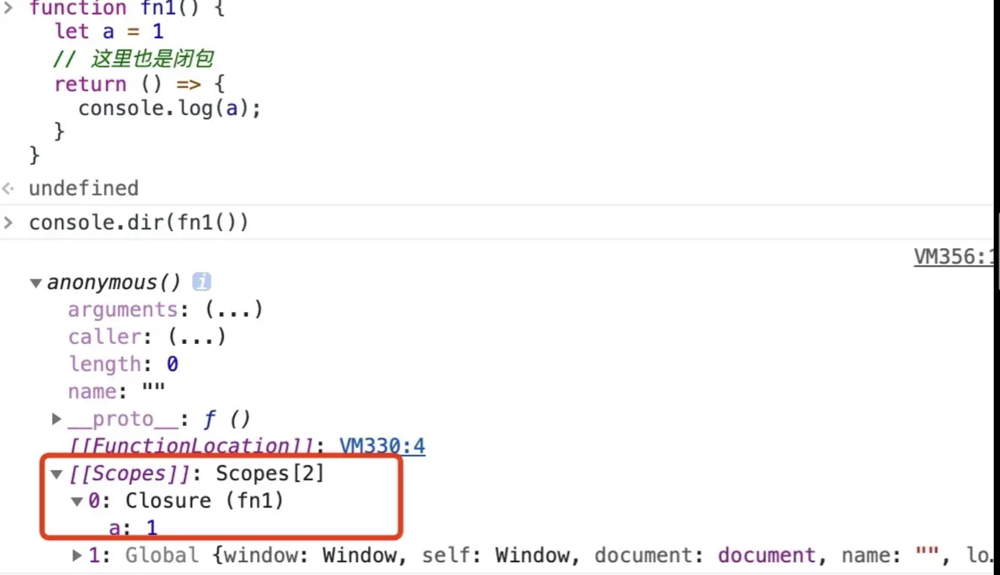
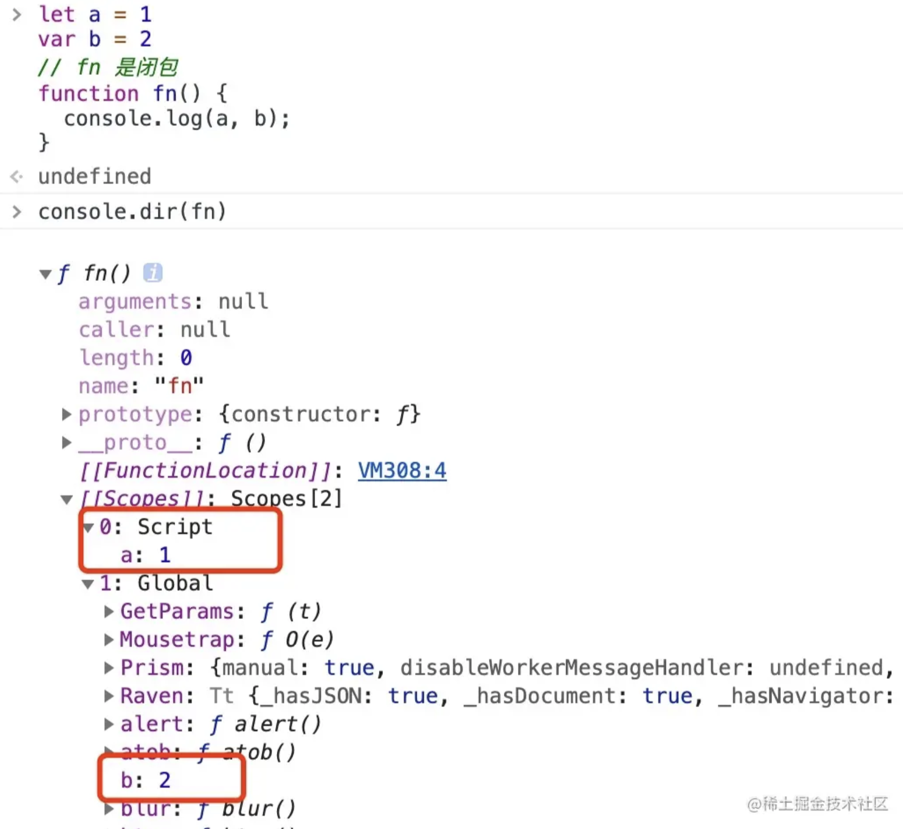

## == vs ===

对于 `==` 来说，如果对比双方的类型**不一样**的话，就会进行**类型转换**。

当我们需要对比 `x` 和 `y` 是否相同时，就会进行如下判断流程：

1. 首先会判断两者类型是否相同。相同的话就是比大小了。
2. 类型不同的话，那么就会进行类型转换
3. 会先判断是否在对比 `null` 和 `undefined`，是的话就会返回 `true`
4. 判断两者类型是否为 `string` 和 `number`，是的话会将字符串转换为 `number`

```js
1 == '1'
      ↓
1 ==  1
```

5. 判断其中一方是否为 `boolean`，是的话就会把 `boolean` 转为 `number` 再进重写进行判断流程

```js
'1' == true
        ↓
'1' ==  1
        ↓
 1  ==  1
```

6. 判断其中一方是否为 `object` 且另一方为 `string`、`number`，是的话就会把 `object` 转为原始类型再进行判断，也就是执行 `x.toString()` 及 `valueOf`。

```js
'1' == { name: 'yck' }
        ↓
'1' == '[object Object]'
```

7. 返回 `false`

最后 `===` 来说，判断简单多了，就是判断两者类型和值是否相同就行。

### 常见面试题

- `==` 和 `===` 操作符有什么区别
- `==` 操作符的类型转化规则

## 闭包

> 很多读者的闭包概念是完全错误的，如果你觉得你理解的闭包概念与我不同，那么请以我的内容为准。

首先闭包正确的定义是：**假如一个函数能访问外部的变量，那么就形成了一个闭包，而不是一定要返回一个函数。**

在《你不知道的 JS》书里，对闭包的描述是：**当函数可以记住并访问所在的词法作用域时，就产生了闭包。闭包指的是作用域的引用。**

```js
let a = 1;
// 产生闭包
function fn() {
  console.log(a);
}

function fn1() {
  let a = 1;
  // 产生闭包
  return () => {
    console.log(a);
  };
}
const fn2 = fn1();
fn2();
```

其实到这里为止闭包的概念已经讲完了，没有别的东西了。接下来我们通过 Chrome 的开发工具来进一步了解**闭包是如何存储外部变量的**。

先来说下数据存放的正确规则是：局部、占用空间确定的数据，一定会存放在栈中，否则就在堆中。



上图中画红框的位置我们能看到一个内部的对象 `[[Scopes]]`，这个对象就是我们常说的**作用域链**。根据作用域链寻找的顺序，其中包含了闭包(`Closure`)、全局对象(`Global`)。据此我们能通过闭包访问到本该销毁的变量。

另外最开始我们对于闭包的定位是：**假如一个函数能访问外部的变量，那么就形成了一个闭包**，因此接下来我们看看在全局下的表现是怎么样的。

```js
let a = 1;
var b = 2;
// 形成闭包
function fn() {
  console.log(a, b);
}
```



从上图我们能发现全局下声明的变量，如果是 var 的话就直接被挂到 `global` 上，如果是其他关键字声明的话就被挂到 `Script` 上。虽然这些数据同样还是存在 `[[Scopes]]` 上，但是全局变量在内存中是存放在静态区域的，因为全局变量无需进行垃圾回收。

最后总结一下原始类型存储位置：**局部变量被存储在栈上，全局变量存储在静态区域上，其它都存储在堆上**。

## 深浅拷贝

### 浅拷贝

`Object.assign()` 函数会拷贝所有的属性值到新的对象中。如果属性值是对象的话，拷贝的是**地址**。

另外我们还可以通过展开运算符 `...` 来实现浅拷贝。

### 深拷贝

深拷贝通常可以通过 `JSON.parse(JSON.stringify(object))` 来解决，这个方式基本能解决大部分情况。

当然了，这个方法是存在局限性的。如果**对象中存在循环引用**，你会发现程序会报错。同时在遇到不支持的数据类型，比如`函数`、 `undefined` 或者 `symbol` 的时候，这些**属性都会被忽略**。

如果你所需拷贝的对象含有内置类型并且不包含函数，可以使用 `MessageChannel`：

```js
function structuralClone(obj) {
  return new Promise((resolve) => {
    const { port1, port2 } = new MessageChannel();
    port2.onmessage = (ev) => resolve(ev.data);
    port1.postMessage(obj);
  });
}

var obj = {
  a: 1,
  b: {
    c: 2,
  },
};

obj.b.d = obj.b;

// 注意该方法是异步的
// 可以处理 undefined 和循环引用对象
const test = async () => {
  const clone = await structuralClone(obj);
  console.log(clone);
};
test();
```

当然我们也可以自己实现一个深拷贝，同时这也是一个非常高频的手写题：

```js
// 利用 WeakMap 解决循环引用
let map = new WeakMap();
function deepClone(obj) {
  // 传入的是 对象
  if (obj instanceof Object) {
    // 如果 map 中有这个对象，则返回这个对象
    if (map.has(obj)) {
      return map.get(obj);
    }
    let newObj;
    // 传入的是 数组
    if (obj instanceof Array) {
      newObj = [];
    } else if (obj instanceof Function) {
      // 传入的是 函数
      newObj = function () {
        return obj.apply(this, arguments);
      };
    } else if (obj instanceof RegExp) {
      // 传入的是 正则
      // 拼接正则
      newObj = new RegExp(obj.source, obj.flags);
    } else if (obj instanceof Date) {
      // 传入的是 日期
      newObj = new Date(obj);
    } else {
      newOb = {};
    }
    // 克隆一份对象出来
    let desc = Object.getOwnPropertyDescriptors(obj); // 用来获取一个对象的所有自身属性的描述符
    let clone = Object.create(Object.getPrototypeOf(obj), desc); // 返回指定对象的原型（内部[[Prototype]]属性的值）
    map.set(obj, clone);
    for (let key in obj) {
      if (obj.hasOwnProperty(key)) {
        newObj[key] = deepClone(obj[key]);
      }
    }
    return newObj;
  }
  return obj;
}
```

### 常见面试题

- 浅拷贝和深拷贝的区别是什么
- `JSON.parse(JSON.stringify(a))` 存在什么问题
- 手写深拷贝函数

## 原型

每个 JS 对象都有 `__proto__` 属性，这个属性指向了原型。这只是浏览器在早期为了让我们访问到内部属性 `[[prototype]]` 来实现的一个东西。

**原型也是一个对象**，并且这个对象中包含了很多函数，所以我们可以得出一个结论：对于 `obj` 来说，可以通过 `__proto__` 找到一个原型对象，在该对象中定义了很多函数让我们来使用。

我们还可以发现一个 `constructor 属性`，也就是**构造函数**。打开 `constructor` 属性我们又可以发现其中还有一个 `prototype` 属性，并且这个属性对应的值和先前我们在 `__proto__` 中看到的一模一样。

所以我们又可以得出一个结论：原型的 `constructor` 属性指向构造函数，构造函数又通过 `prototype` 属性指回原型，但是并不是所有函数都具有这个属性，`Function.prototype.bind()` 就没有这个属性。

原型链就是多个对象通过 `__proto__` 的方式连接了起来。为什么 `obj` 可以访问到 `valueOf` 函数，就是因为 `obj` 通过原型链找到了 `valueOf` 函数。

对于这一小节的知识点，总结起来就是以下几点：

- `Object` 是所有对象的爸爸，所有对象都可以通过 `__proto__` 找到它
- `Function` 是所有函数的爸爸，所有函数都可以通过 `__proto__` 找到它
- 函数的 `prototype` 是一个对象
- 对象的 `__proto__` 属性指向原型， `__proto__` 将对象和原型连接起来组成了原型链

### 常见面试题

- 如何理解原型及原型链
- 如何重写原型
- 原型链指向
