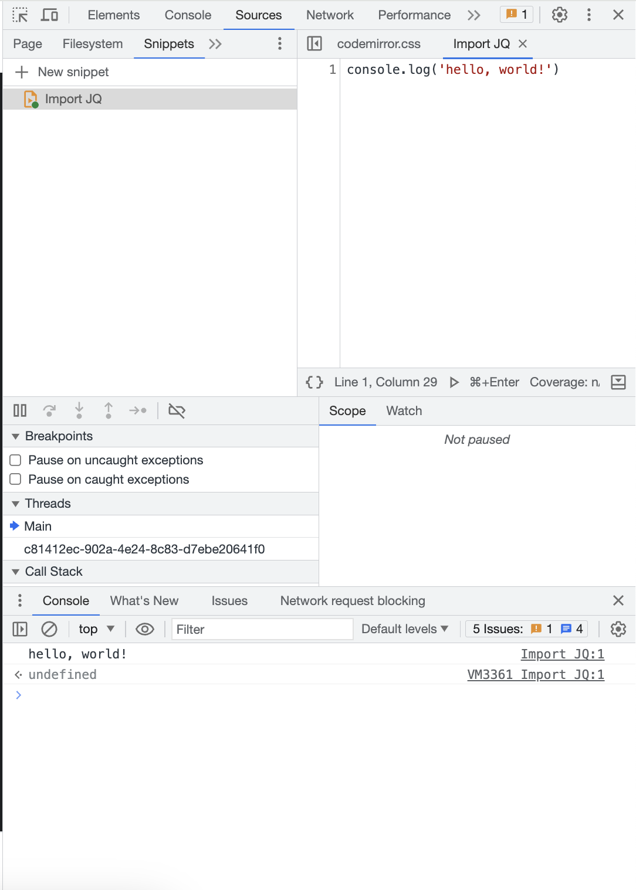

对于 Web 开发者，尤其是前端开发工程师，Chrome 浏览器开发者工具几乎成为我们每天开发调试的必备工具。那么掌握 Chrome 开发者工具会让我们更加全面、高效地进行页面调试和开发。本教程手把手教你全面的掌握 Chrome 开发者工具，让你在页面开发的过程中事半功倍！

## 在 console 中访问节点

使用 esc 可以在打开元素 tab 下打开控制面板。

- `document.querySelectorAll('h1')`
- 聚焦到 dom 元素上，然后 `$0`
- 右键 -> copy -> copyJsPath

## 在 DOM 中断点调式

1. 属性修改时：attribute modifications
2. 节点删除时：node removal
3. 子树修改时：subtree modifications

## log

- `console.log()` 打印信息
- `console.error()` 错误信息
- `console.warn()` 告警信息
- `console.table()` 展示json格式的复杂信息
   ```js
    console.table([
      { name: "zs", age: 28 },
      { name: "we", age: 18 },
      { name: "mz", age: 08 },
    ])
   ```
- `console.group()` 信息组展示
   ```js
    const label = "使用 console.group 打印一组信息"
    console.group(label)
    console.info("Log")
    console.info("Warning")
    console.groupEnd(label)
   ```
- `console.custom()` 定制样式
   ```js
    const spacing = "5px";
    const styles = `padding: ${spacing}; background-color: darkblue; color:white; font-style:italic; border: ${spacing} solid crimson; font-size: 2em;`;
    console.log("%c这里展示定制的样式", styles);
   ```
- `console.time()` `console.timeEnd()`
   ```js
    var fibonacci = function(n) {
      return n < 3 ? 1 : fibonacci(n - 1) + fibonacci(n - 2);
    }
    console.time();
    fibonacci(5);
    console.timeEnd();
   ```



Filesystem 面板可以把本地的源代码添加到浏览器的工作区中，可以进行修改，修改后保存会同步到本地文件中。

## Network

- 资源请求的概览
- 查看请求和响应

使用 Network Waterfall 分析页面载入性能

地理位置：Security
