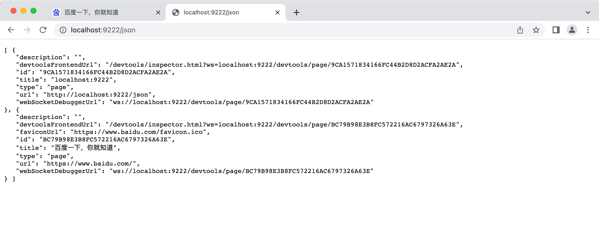

## 1、初识调式

代码在某个平台运行，把运行时的状态通过某种方式暴露出来，传递给开发工具做 UI 的展示和交互，辅助开发者排查问题、梳理流程、了解代码运行状态等，这个就是调试。

### Chrome DevTools 原理

Chrome DevTools 分为两部分，backend 和 frontend：

- backend 和 Chrome 集成，负责把 Chrome 的网页运行时状态通过调试协议暴露出来。
- frontend 是独立的，负责对接调试协议，做 UI 的展示和交互。

两者之间的调试协议叫做 Chrome DevTools Protocol，简称 CDP。

frontend、backend、调试协议（CDP）、信道，这是 Chrome DevTools 的 4 个组成部分。

### VSCode Debugger 原理

VSCode Debugger 的原理和 Chrome DevTools 差不多，也是分为 frontend、backend、调试协议这几部分，只不过它多了一层适配器协议。

因为 VSCode 不是 JS 专用编辑器呀，它可能用来调试 Python 代码、Rust 代码等等，自然不能和某一种语言的调试协议深度耦合，所以多了一个适配器层。


VSCode Debugger 的 UI 的部分算是 frontend，而调试的目标语言算是 backend 部分，中间也是通过 WebSocket 传递调试协议。

整体和 Chrome DevTools 的调试原理差不多，只不过为了支持 frontend 的跨语言复用，多了一层适配器层。

### Vue/React DevTools

Vue DevTools 或者 React DevTools 都是以 Chrome 插件（Chrome Extension）的形式存在的，要搞懂它们的原理就得了解 Chrome 插件的机制。

没错，都有 backend 部分负责拿到运行时的信息，有 frontend 部分负责渲染和交互，也有调试协议用来规定不同数据的格式，还有不同的信道，比如 WebSocket 、Chrome 插件的 background 转发等。

**frontend、backend、调试协议、信道，这是调试工具的四要素。**

不过，不同的调试工具都会有不同的设计，比如 VSCode Debugger 为了跨语言复用，多了一层 Debugger Adapter，React DevTools 有独立的 electron 应用，用自定义调试协议，可以调试 React Native 代码。

### 总结

我们会用 Chrome DevTools、VSCode Debugger、Vue/React DevTools 等工具来调试网页、Node.js、React/Vue 的代码，它们都属于调试工具。

调试就是通过某种信道（比如 WebSocket）把运行时信息传递给开发工具，做 UI 的展示和交互，辅助开发者排查问题、了解代码运行状态等。

我们简单过了一遍这些调试工具的原理：

它们有通用的部分，都有 frontend、backend、调试协议、信道这四要素。

也有不同的部分，比如 VSCode Debugger 多了一层 Debugger Adapter，用于跨语言的复用，Vue/React DevTools 通过向页面注入 backend 代码，然后通过 Background 实现双向通信等。

抓住它们相同的部分来分析，理解不同的部分的设计原因，就很容易搞懂各种调试工具的原理了。

## 2、如何调式网页的 JS（以 React 为例）

代码会执行到断点处断住，`本地`和`全局`作用域的变量，`调用栈`等都会展示在左边：

好处是不用切换工具呀，之前是调试在 Chrome DevTools，写代码在 VSCode，而现在写代码和调试都可以在 VSCode 里，可以**边调试边写代码**。

调试协议是一样的，都是 CDP。Chrome DevTools 可以对接 CDP 来调试网页，VSCode Debugger 也可以。只不过 VSCode Debugger 会多一层 Debug Adapter Protocol 的转换。

总结：

Chrome DevTools 和 VSCode Debugger 都能调试网页的 JS，可以打断点，单步执行，可以看到本地和全局作用域的变量，还有函数调用栈。

但我更推荐使用 VSCode Debugger 来调试，这样写代码和调试都用同一个工具，不用切换，而且还可以边调试边写代码。

这俩原理都是对接了 Chrome DevTools Protocol，用自己的 UI 来做展示和交互。

## 3、VSCode Chrome Debugger 配置详情

### launch/attach

他们只是 request 的配置不同：`"request": "attach"`、`"request": "launch"`

我们知道，调试就是把浏览器跑起来，访问目标网页，这时候会有一个 ws 的调试服务，我们用 frontend 的 ws 客户端连接上这个 ws 服务，就可以进行调试了。


VSCode 的 Debugger 会多一层适配器协议的转换，但是原理差不多。

比如我们手动把 Chrome 跑起来，指定调试端口 remote-debugging-port 为 9222，指定用户数据保存目录 user-data-dir 为你自己创建一个目录。

在命令行执行下面的命令：

`/Applications/Google\ Chrome.app/Contents/MacOS/Google\ Chrome --remote-debugging-port=9222 --user-data-dir=你自己创建的某个目录`



为什么每个页面有单独的 ws 服务呢？这个很正常呀，每个页面的调试都是独立的，自然就需要单独的 ws 服务。

launch 的意思是把 url 对应的网页跑起来，指定调试端口，然后 frontend 自动 attach 到这个端口。

但如果你已经有一个在调试模式跑的浏览器了，那直接连接上就行，这时候就直接 attach。

然后你创建一个 attach 的 Chrome Debug 配置：

```json
"configuration": [
  {
    "name": "Attach to Chrome",
    "port": 9222,
    "request": "attach",
    "type": "pwa-chrome",
    "webRoot": "${workspaceFolder}"
  }
]
```

点击启动，就会看到 VSCode Debugger 和每一个页面的 ws 调试服务建立起了链接：

可以多个页面一起调试，每个页面都有独立的调试上下文。

### userDataDir

不知道你有没有注意到刚才手动启动 Chrome 的时候，除了指定调试端口 remote-debugging-port 外，还指定了用户数据目录 user-data-dir。

为什么要指定这个呢？

user data dir 是保存用户数据的地方，比如你的浏览记录、cookies、插件、书签、网站的数据等等，在 macOS 下是保存在这个位置：

```js
~/Library/Application\ Support/Google/Chrome
```

比如你打开 Default/Bookmarks 看一下，是不是都是你保存的书签？

`open ~/Library/Application\ Support/Google/Chrome/Default/Bookmarks`


### runtime

## 4、sourcemap 的原理和作用

## 5、Webpack 的 sourcemap 配置

## 6、实战案例：调式 Veu 项目

## 7、VSCode Chrome Debugger 断点映射的原理

## 8、实战案例：调式 React 源码

## 9、实战案例：调式 Vue 源码

## 10、用 VSCode Snippets 快速创建调式配置

## 11、如何调式 Node.js 代码

## 12、跑 npm scripts，有更香的方式

## 13、VSCode Node Debugger 配置详情

## 14、调式代码遇到的 9 种 JS 作用域

## 15、实战案例：调式 Nest.js 项目和源码

## 16、命令行工具的两种调式方式（以ESLint源码调式为例）

## 17、实战案例：调式 patch-package 源码

## 18、实战案例：调式 Babel 源码

## 19、调式 Vite 源码

## 20、调式 TypeScript 源码

## 21、如何通过变量写出更灵活的调式配置？

## 22、如何灵活的调式 Jest 测试用例

## 23、打断点的 7 种方式，你用过几种？

## 24、实战案例：调用 Ant Design 组件源码

## 25、实战案例：调式 ElementUI 组件

## 26、如何用 Performance 工具分析并优化性能

## 27、会使用 Performance 工具，就能深入理解 Event Loop

## 28、面试必问的异步顺序问题，用 Performance 轻松理解

## 29、Web Vitals 如何计算？如何衡量网页性能？

## 30、console.log 会导致内存泄露？用 Performance 和 Memory 分析下（上）

## 31、console.log 会导致内存泄露？用 Performance 和 Memory 分析下（下）

## 32、如何用 Layers 分析网页的图层

## 33、Chrome DevTools 小功能集锦

## 34、放弃 console.log 吧！用 Debugger 你能读懂各种源码

## 35、如何远程调式 android 移动端网页

## 36、如何远程调式 ios 移动端网页

## 37、远程调式移动端网页的原理

## 38、如何用 Charles 断点调式 Https 请求？

## 39、Charles 全功能速通（上）

## 40、Charles 全功能速通（下）

## 41、线上报错如何直接调式本地源码？

## 42、手动对接 CDP 来理解 Chrome DevTools 实现原理

## 43、实现 Chrome DevTools 的 Coverage 功能

## 44、编译 chrome devtools frontend 源码，然后用它来调试

## 45、基于 CDP 实现 Puppeteer（上）

## 46、基于 CDP 实现 Puppeteer（下）

## 47、把 Puppeteer 融入调试流程来做自动化

## 48、小册总结
