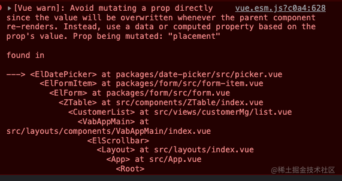

## 描述问题

在开发项目中，发现控制台上有好多如下图所示的报错信息。



有道翻译过来就是：`避免直接改变 prop，因为在父组件重新呈现时，prop 的值会被覆盖。 相反，应根据 prop 的值使用数据或计算属性。 prop是突变:"placement"。`

从控制台上根据堆栈报出来的错误信息加上翻译，大致可以得出结论就是 ElemetUI 中的 `ElDatePicker` 的组件中有对 `props` 中的 `placement` 属性进行了修改。

## 怎么处理？

一般我们分三步走。

1. 在 Github 提交 Pull Request，修改 Bug，等待合并
2. 合并 PR 后，等待新版本发包
3. 升级项目中的包

很合理很规范的一个流程，但是它一个最大的问题就是，太慢了，三步走完不知道到啥时候了，几天？几个月？都不确定。

此时可直接上手修改 `node_modules` 中 element-ui 代码，并修复问题！

新问题: `node_modules` 未纳入版本管理，在生产环境并没有用。请看流程

1. 本地修改 `node_modules/element-ui`，本地正常运行✅
2. 线上 `npm i element-ui`，element-ui 未被修改，线上运行失败❌

此时有一个简单的方案，临时将修复文件纳入工作目录，可以解决这个问题。

1. 本地修改 `node_modules/element-ui`，本地正常运行✅
2. 将修改文件复制到 `${work_dir}/patches/element-ui` 中，纳入版本管理
3. 线上 `npm i element-ui`，并将修改文件再度复制到 `node_modules/element-ui` 中，线上正常运行✅

但此时并不是很智能，且略有小问题，演示如下:

1. 本地修改 `node_modules/element-ui`，本地正常运行✅
2. 将修改文件复制到 `${work_dir}/patches/element-ui` 中，纳入版本管理✅
3. 线上 `npm i element-ui`，并将修改文件再度复制到 `node_modules/element-ui` 中，线上正常运行✅
4. 两个月后升级 `element-ui`，该问题得以解决，而我们代码引用了 element-ui 的新特性
5. 线上 `npm i element-ui`，并将修改文件再度复制到 `node_modules` 中，由于已更新了 element-ui，并且依赖了新特性，线上运行失败❌

用 `patch-package` 修复element-ui date-picker 的 bug

此时，有个万能之策，那么是 [patch-package](https://www.npmjs.com/package/patch-package)

## patch-package

根据控制台上报错的堆栈信息，找到我们编辑器中的 `node_modules > element-ui > packages > date-picker > src > picker.vue` 文件。然后找到报错对应的位置，581 行处，`this.placement = PLACEMENT_MAP[this.align] || PLACEMENT_MAP.left;` 我去，确实是给 `props` 中的 `placement` 属性重新赋值了。

我们进行修改后，保存。（我是把这行注释了）

```sh
# 对 element-ui 的修复生成一个 patch 文件，位于 patches/element-ui+2.15.9.patch
$ npx patch-package element-ui

# 将修复文件提交到版本管理之中
$ git add patches/element-ui+2.15.9.patch
$ git commit -m "fix(element-ui):日期组件的props patch"

# 此后的命令在生产环境或 CI 中执行

# 在生产环境装包
$ npm i

# 为生产环境的 element-ui 进行小修复
$ npx patch-package

# 大功告成！
```

再次看下 `patch-package` 自动生产 patch 文件的本来面目吧:

它实际上是一个 `diff` 文件，在生产环境中可自动根据 diff 文件与版本号(根据 patch 文件名存取)将修复场景复原！

```patch
diff --git a/node_modules/element-ui/packages/date-picker/src/picker.vue b/node_modules/element-ui/packages/date-picker/src/picker.vue
index 802e48c..b50990a 100644
--- a/node_modules/element-ui/packages/date-picker/src/picker.vue
+++ b/node_modules/element-ui/packages/date-picker/src/picker.vue
@@ -580,7 +580,7 @@ export default {
       boundariesPadding: 0,
       gpuAcceleration: false
     };
-    this.placement = PLACEMENT_MAP[this.align] || PLACEMENT_MAP.left;
+    // this.placement = PLACEMENT_MAP[this.align] || PLACEMENT_MAP.left;
 
     this.$on('fieldReset', this.handleFieldReset);
   },
```

## 最后附上修改的步骤和截图

1. 修改后执行`npx patch-package element-ui`


2. 生成 .patch 文件


3. 开发和生成环境都要配置命令

