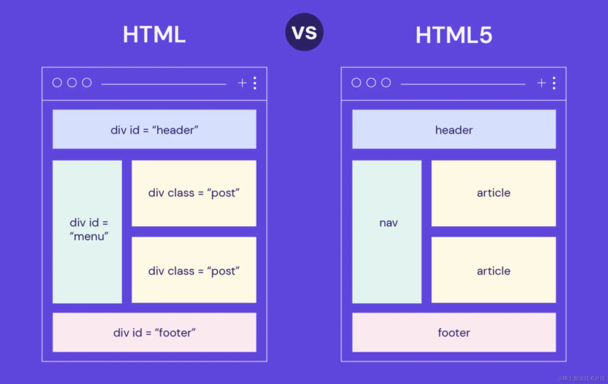

## 是什么？

在 HTML 中，语义化标签是指具有明确目的和含义的 HTML 标签，这些标签能够直观地描述它们所表示的内容，并且能够为搜索引擎和浏览器提供更准确的解释和指导。

使用语义化标签是一种良好的 HTML 编码习惯，能够提高代码的可读性和可维护性，同时也能够为用户提供更好的访问体验和搜索结果。



## 有哪些？

- `<header>` 标签用于表示页面或者页面中某个区域的**页眉**，通常包含网站的标志、导航菜单、搜索框等内容。
- `<nav>` 标签用于表示页面或者页面中某个区域的**导航菜单**。
- `main` 标签用于表示页面的**主要内容**，每个页面只能有一个 `<main>` 标签。
- `article` 标签用于表示一篇**独立的文章或者内容块**，通常包括标题、作者、日期和正文等内容。
- `section` 标签用于表示文档中的**一个区域**，通常包含一个标题。
- `<aside>` 标签用于表示页面或者页面中某个区域的附加内容，比如侧栏、广告、标签等。
- `<footer>` 标签用于表示页面或者页面中某个区域的**页脚**，通常包含页脚的内容，如版权限制、版权信息、作者信息等。
- `<figure>` 标签用于表示一个**独立的、完整的内容块**，可以包含多个 `<figure>` 标签或者其他的语义化标签。
- `<figcaption>` 标签用于表示 `<figure>` 标签中的**图片说明**，通常包含图片说明的文字内容。
- `<time>` 标签用于表示一个**时间**，通常包含一个时间戳，如 `2020-01-01`。
- `<mark>` 标签用于表示一个**标记**，通常用于高亮显示某个单词或短语。
- `<progress>` 标签用于表示一个**进度条**，通常用于表示某个任务的完成进度。
- `<meter>` 标签用于表示一个**度量器**，通常用于表示某个任务的完成程度或分数等。

## 语义与非语义化

代码就具有了更好的可读性和可维护性，而且能够为搜索引擎提供更多的信息，从而提高网站的排名和曝光度。

相比之下，非语义化编程则使用无意义的标签，比如 `<div>` 和 `<span>` 来描述页面的结构和内容。这样虽然能够很快地编写出页面，但是代码缺乏明确的含义和目的，使得代码难以理解和维护。

## 浏览器支持

对于 Internet Explorer 8 及更早版本的其他浏览器不支持 HTML5 语义化标签，开发者可以参考如下解决方案：

```html
<!--[if lt IE 9]>
<script src="https://cdn.static.runoob.com/libs/html5shiv/3.7/html5shiv.min.js"></script>
<![endif]-->
```

上述代码的含义是在**浏览器小于IE9版本时**会加载 `html5shiv.js` 文件，需要注意的是开发者必须将其放置于 `<head>` 元素中，因为浏览器需要在头部加载后渲染这些 HTML5 的新元素。