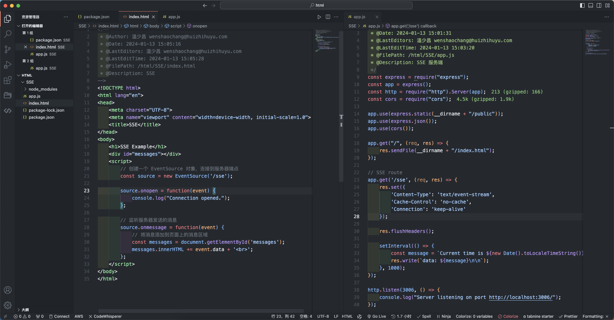

## 什么是SSE

服务端向客户端发送事件流（Event Stream），并在客户端自动更新。有更低的延迟和更高的可扩展性，因为它使用单个长连接保持数据流，而不是发送多个短连接。

## SSE 核心概念和 API 用法

### EventSource 对象

用于创建服务器发送事件流的连接。

- 单向通信：`EventSource` 对象只能从服务器接收数据，而不能向服务器发送数据。
- 自动重连：如果链接断开，`EventSource` 会自动尝试重新连接，直到连接成功或最大重连次数为止。
- 事件处理：`EventSource` 对象可以监听来自服务器的事件，并在事件发生触发相应的事件处理程序。

### 基础 API

- 链接服务器端点

使用 SSE，需要先创建一个 `EventSource` 对象并将其连接到指定路径上的服务器端点。`const eventSource = new EventSource("/backend-path");`

- `onopen` 事件

对象链接到服务器端点时，会触发 `onopen` 事件，该事件通常用于在连接建立后初始化客户端状态。`eventSource.onopen = function(event) { ... };`

- `onmessage` 事件

当 `EventSource` 对象接收到从服务器发来的事件时，会触发 `onmessage` 事件，该事件通常用于处理服务器接收到的数据。

```js
eventSource.onmessage = function(event) {
    console.log("Received data:", event.data);
};
```

- `onerror` 事件

对象与服务器连接发生错误，会触发 `onerror` 事件。

```js
eventSource.onerror = function(event) {
    console.log("Error occurred:", event.data);
}
```

## 一个完整 SSE 示例

HTML5 SSE 需要服务端的配合，服务端需要支持 SSE 所依赖的 `text/event-stream` 协议，然后客户端订阅服务器端点后才能自动获取服务端更新。

### SSE 服务端

```json
{
  "name": "sse-app",
  "version": "1.0.0",
  "description": "sse app",
  "main": "index.js",
  "scripts": {
    "test": "echo "Error: no test specified" && exit 1",
    "start": "node app.js"
  },
  "author": "",
  "license": "ISC",
  "dependencies": {
    "cors": "^2.8.5",
    "express": "^4.18.2",
    "http": "^0.0.1-security"
  }
}
```

```js
// app.js
const express = require("express");
const app = express();
const http = require("http").Server(app);
const cors = require("cors");

app.use(express.static(__dirname + "/public"));
app.use(express.json());
app.use(cors());

app.get("/", (req, res) => {
  res.sendFile(__dirname + "/index.html");
});

// SSE route
app.get('/sse', (req, res) => {
  res.set({
    'Content-Type': 'text/event-stream',
    'Cache-Control': 'no-cache',
    'Connection': 'keep-alive'
  });

  res.flushHeaders();

  setInterval(() => {
    const message = `Current time is ${new Date().toLocaleTimeString()}`
    res.write(`data: ${message}\n\n`);
  }, 1000);
});

http.listen(3006, () => {
  console.log("Server listening on port http://localhost:3006/");
});
```

在此后端服务中，定义了一个 `/sse` 的路由，此路由用于给客户端提供 SSE 服务，在此路由中，设置了响应头 `text/event-stream` 告诉客户端这是一个 SSE 连接，在接收到数据的时候将数据更新发送给客户端。

HTML5 SSE 后端需要注意如下几个事项，否则会导致连接成功后客户端也无法接收信息。

- **发送的数据格式不正确**：在 SSE 中，每条消息必须以 `data:` 开头，后跟消息内容，并以两个换行符结尾。例如，`data: hello world\n\n`。请确保服务器端代码正确地格式化 SSE 数据。
- **缓存问题**：浏览器可能会缓存 SSE 数据，导致无法接收新的数据。为了避免这种情况，开发者可以在服务器端向客户端发送一个 `Cache-Control` 响应头，以指示浏览器不要缓存 SSE 数据。例如，`Cache-Control: no-cache`。
- **CORS 问题**：如果 SSE 服务器与 HTML 页面位于不同的域，则可能会遇到跨域资源共享 (CORS) 问题。在这种情况下，开发者需要在服务器端设置适当的 CORS 响应头，以允许浏览器从其他域接收 SSE 数据。例如 `Access-Control-Allow-Origin: *`。



### SSE 客户端

```html
<!DOCTYPE html>
<html>
  <head>
    <meta charset="UTF-8">
    <title>SSE Example</title>
  </head>
  <body>
    <h1>SSE Example</h1>
    <div id="messages"></div>
    <script>
      // 创建一个 EventSource 对象，连接到服务器端点
      const source = new EventSource('/sse');

      source.onopen = function(event) {
        console.log("Connection opened.");
      };

      // 监听服务器发送的消息
      source.onmessage = function(event) {
        // 将消息添加到页面上的消息区域
        const messages = document.getElementById('messages');
        messages.innerHTML += event.data + '<br>';
      };
    </script>
  </body>
</html>
```

SSE 的客户端代码非常简单，就是初始化 `EventSource` 对象过后，通过 `onmessage` 事件监听后端发送过来的数据即可，在本示例中，我们还额外增加了一个更新按钮，调用 `/sse` 方法用于客户端触发服务端的 SSE 接口。

## 兼容编程

```js
if(typeof(EventSource) !== "undefined") {
  // 是的！支持服务器发送事件！..
  doSomething();
} else {
  // 抱歉！不支持服务器发送事件！
  alert('浏览器不支持服务器发送事件，请更换或升级到最新版本！');
}
```

替代方法：

- WebSockets：WebSockets 是一种全双工通信协议，它提供了双向通信的能力，可以在客户端和服务器之间实现实时通信。WebSocket API 提供了一组用于建立和管理 WebSocket 连接的方法和事件处理程序。更多内容请查看下一章节：《HTML5 WebScokets》
- Long polling：长轮询（Long Polling）是一种服务器推送技术，它通过客户端不断向服务器发送HTTP请求来模拟实时通信。服务器在接收到客户端请求后，不会立即响应，而是等待有新的数据时再返回响应。客户端接收到响应后，再立即发送新的请求，以保持连接。
- Comet：Comet 是一种通过 HTTP 长连接实现实时通信的技术。它可以使用 XHR（XMLHttpRequest）对象或 `<iframe>` 元素来保持连接，并通过服务器推送数据来实现实时通信。

`/Users/wenshaochang/Desktop/wen/learn/juejin/html/SSE/index.html`
