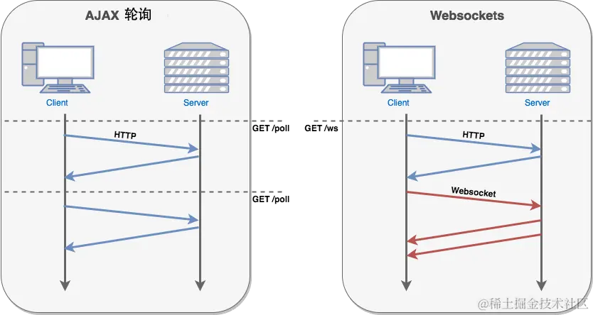
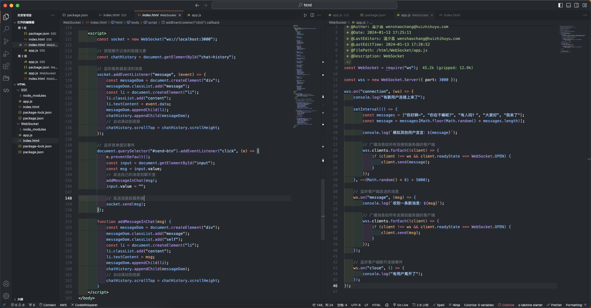

HTML5 WebSockets 是一种全新的建立在单个 TCP 连接上进行全双工通讯的协议。它允许在浏览器和服务器之间建立一个持久的、双向的通信通道，使得浏览器和服务器之间可以实时地进行双向数据传输，而无需像传统的 HTTP 请求那样每次都建立和关闭连接。

在 WebSocket API 中，浏览器和服务器只需要完成一次握手，两者之间就直接可以创建持久性的连接，并进行双向数据传输。

AJAX 轮询方案会浪费很多的网络带宽资源。



## WebSocket API 基础用法

### WebSocket 对象

```js
// 第一个参数 url 参数是 WebSocket 服务器的地址，可以是一个绝对 URL 或相对 URL；
// 第二个参数 protocols 参数是可选的，用来指定一组子协议，以便服务器选择最合适的子协议。如果没有指定子协议，则使用空字符串。
const Socket = new WebSocket(url, [protocols])
```

### WebSocket 属性

属性|说明
---|---
readyState|当前状态，0（`CONNECTING`）、1（`OPEN`）、2（`CLOSING`）和 3（`CLOSED`）
bufferedAmount|还有多少数据没有发送出去，如果值为 0，则表示数据全部发送出去了。
extensions|服务器选择的扩展协议，如果没有选择扩展协议，则返回空字符串
protocol|服务器选择的子协议，如果没有选择子协议，则返回空字符串

### WebSocket 事件

属性|描述
---|---
onopen|链接建立时触发
onmessage|客户端接收服务端数据时触发
onerror|通信发生错误时触发
onclose|连接关闭时触发

### WebSocket 方法

属性|描述
---|---
`send()`|发送数据
`close()`|关闭连接

## 一个完整的例子



## 兼容性编程

```js
if ("WebSocket" in window) {
  // 支持 WebSocket
  console.log("您的浏览器支持 WebSocket!");
} else {
  // 浏览器不支持 WebSocket
  alert("您的浏览器不支持 WebSocket!");
}
```

选择替代方案

- Long Polling	长轮询（Long Polling）是一种服务器推送技术，它通过客户端不断向服务器发送HTTP请求来模拟实时通信。服务器在接收到客户端请求后，不会立即响应，而是等待有新的数据时再返回响应。客户端接收到响应后，再立即发送新的请求，以保持连接。
- Comet 是一种通过 HTTP 长连接实现实时通信的技术。它可以使用 XHR（XMLHttpRequest）对象或 `<iframe>` 元素来保持连接，并通过服务器推送数据来实现实时通信。

WebSocket 连接具有更低的延迟和更高的吞吐量，能够更好地支持实时性和高并发性能需求，开发人员掌握了此技术后，可以将其应用在合适的场景，构建出体验更好和实时性更强的 Web 应用程序。
