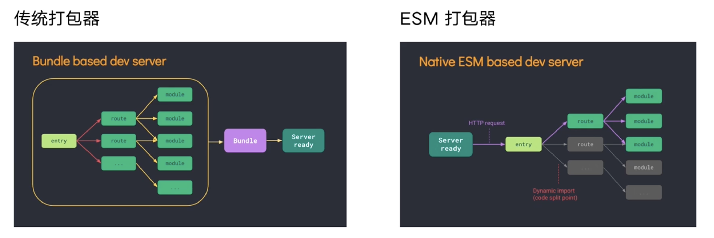
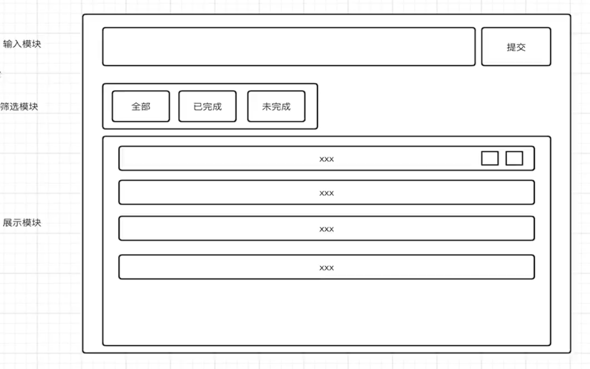

## 1、Vite 概念和设计思想

###  Vite 概念介绍

#### 如何定义 Vite

- Vite 是一种新型的前端构建工具，能够显著提升前端开发体验。
- Vite 由两部分组成：
   - 一个开发服务，服务于开发环境，ESM + HMR
   - 一套构建指令，服务于生成环境，用 Rollup 打包

打包：使用工具抓取、处理并将我们的源码模块串联成可以在浏览器运行的文件。

- webpack
- rollup
- parcel
- gulp 流程的串联

问题：

1. 缓慢的服务启动（当冷启动开发服务器时，基于打包器的方式启动必须优化抓取并构建你的整个应用，然后才能提供服务）。
2. 缓慢的更新（基于打包器启动时，重建整个包的效率很低。原因显而易见：因为这样更新速度会随着应用体积增长而直线下降）。

### 为什么用 Vite，esm 加载对比

- Vite 将模块区分为依赖和源码两类，提升开发服务启动时间。

> 依赖：在开发时不会变动的纯 JavaScript，Vite 会使用 esbuild 与构建依赖
> 源码：通常为 JSX、CSS 或者 Vue SFC 等，时常会被编辑，需要转换，基于路由拆分。

- Vite 已原生 ESM 方式提供源码，让浏览器接管打包工作。

### Vite 和 Create-React-App 对比

create 初始化和启动时间：`npx create-react-app cra-react` 时间：3min12s; `npm run start` 时间：11s

vite 初始化和启动时间：`yarn create vite` `cd demo` `yarn` `yarn serve` 时间：44s

打包时间：vite - 2s；react - 6s

产物大小：vite - 152kb；create - 565kb

## 2、Vite + React 开发 ToDoList

### 绘制原型图

### 部署上线

[netlify](https://app.netlify.com/)
