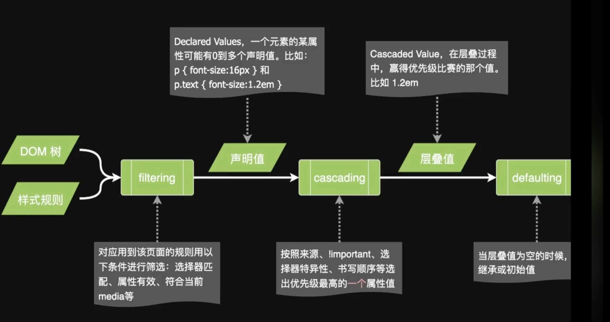
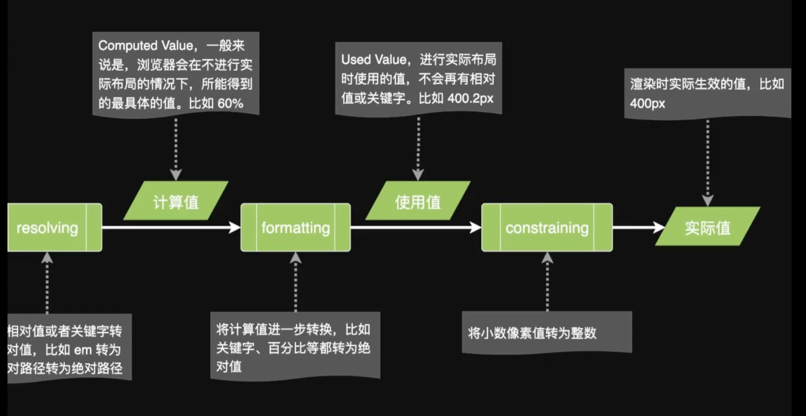

## CSS 选择器的特异度

id > 类/伪类 > 标签

## CSS 继承

> 某些属性会自动继承其父元素的*计算值*，除非显式指定一个值。

- `font-size`
- `color`
- `* { box-sizing: inherit; }` 显式继承
- `background-color: initial;` 显式初始值

## CSS 求值过程解析

## CSS 布局方式及相关技术

- 确定内容的大小和位置的算法
- 依据元素、容器、兄弟节点和内容等信息来计算

### 常规流

- 行级
- 块级
- 表格布局
- FlexBox
- Grid

### CSS 盒模型

content、padding、margin、border

margin collapse（外边距重叠）

`box-sizing: border-box;`：包含border、margin和padding。

`box-sizing: content-box;`：content 的宽和高。

块级|行级
---|---
Block Level Box | Inline Level Box
不和其它盒子并列摆放 | 其他行盒子一起放在一行或拆开成多行
适用所有的盒模型属性 | 盒模型中的 width、height 不适用

块级元素|行级元素
---|---
生成块级盒子|生成行级盒子，内容分散在多个行盒（line box）中
body、article、div、main、section、h1-6、p、ul、li 等 | span、em、strong、cite、code等
display: block|display: inline

### 块级排版上下文

- Block Formatting Context（BFC）
- 某些容器会创建一个BFC
    - 根元素
    - 浮动、绝对定位、inline-block
    - Flex 子项和 Grid 子项
    - overflow 值不是 visible 的块盒
    - display: flow-root 的元素

