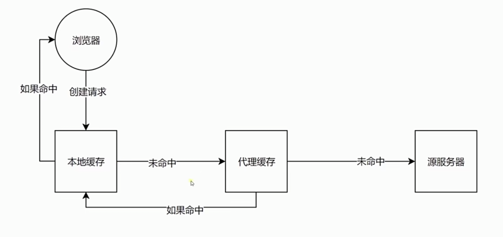

## 3.1 认识 HTTP 客户端

浏览器是最常见的客户端。

`curl www.baidu.com` 返回响应信息

`curl -v www.baidu.com` 返回请求和响应信息。

## 3.2 CORS 跨域请求的限制与解决

浏览器的安全策略。

- 响应头设置 `'Access-Control-Allow-Origin': '*'`
- Jsonp，利用了 link、image、script 标签上面 src 或者 ref。`<script src="http://127.0.0.1:8887"></script>`
- 限制请求域名。`'Access-Control-Allow-Origin': 'http://127.0.0.1:8887'`

## 3.3 CORS 跨域限制以及预请求验证

### 允许方法

GET HEAD POST 不需要预请求

### 允许 Content-Type

text/plain

multipart/form-data

application/x-www-form-urlencoded

除了这几种 Content-Type 外都需要发送预请求，才能进行发送。

### 其他限制

请求头限制

XMLHttpRequestUpload 对象均没有注册任何事件监听器。

请求中没有使用 ReadableStream 对象。

### 预检请求

```js
res.writeHead(200, {
  "Access-Control-Allow-Origin": "*",
  "Access-Control-Allow-Headers": "X-Test-Cors",
  "Access-Control-Allow-Methods": "GET, POST, PUT, Delete",
  "Access-Control-Max-Age": "1000", // 1000 s 内不需要发起预检请求，直接发起正式请求
});
```

## 3.4 缓存头 Cache-Control 的含义和使用

### 可缓存性

- `public` http 经过的所有地方都可以进行缓存
- `private` http 发起的这个浏览器才可以进行缓存
- `no-cache` 任何一个节点都不可以进行缓存。每次都必须去服务端做新鲜度校验，来决定从服务端获取新的资源（200）还是使用客户端缓存（304）。也就是所谓的协商缓存。

### 到期

- `max-age=<seconds>` 缓存到期，浏览器再次发起请求到服务端
- `s-maxage=<seconds>` 只有在代理服务器中才可以生效
- `max-stale=<seconds>` 即便 max-age 缓存过期了，只要还在 max-stale 时间内它还可以使用过期的缓存

### 重新验证

- `must-revalidate`
- `proxy-revalidate`

### 其他

- `no-store` 永远不能缓存。永远都不要在客户端存储资源，永远都去原始服务器去获取资源。
- `no-transform` 告诉代理服务器不要更改内容

```js
// hash 不变就缓存，变化再请求就重新更新缓存。hash 刷新浏览器缓存的方案。
if (req.url === "/script.js") {
  res.witeHead(200, {
    "Content-Type": "text/javascript",
    "Cache-Control": "max-age=20, public,",
  });
  res.end("script.js loaded successfully");
}
```

NetWork 中的 `size` 为 `from memony cache`。`Time` 为 `0ms`。

## 3.5 缓存验证 Last-Modified 和 Etag 的使用



### 验证头

- Last-Modified

  上次修改时间。配合 If-Modified-Since 或者 If-Unmodified-Since 使用。对比上次修改时间以验证是否需要更新。

- Etag

  数据签名（hash）。 配合 If-Match 或者 If-None-Match 使用。对比资源的签名判断是否使用缓存。

## 3.6 cookie 和 session

### Cookie

通过 Set-Cookie 设置。下次请求会自动带上。键值对，可以设置多个。

```js
response.writeHead(200, {
  "Content-Type": "text/html",
  "Set-Cookie": ["id=123; max-age=2", "abc=456; HttpOnly; domain=test.com"],
});
// 浏览器关闭就会清除掉 Cookie
```

- `max-age` 和 `expires` 设置过期时间
- `Secure` 只在 `https` 的时候发送
- `HttpOnly` 无法通过 `document.cookie` 访问
- `domain` 不同域名 cookie 不能共享。

## 3.7 HTTP 长连接

`Content-ID`

**http 请求是在 TCP 链接上进行发送的。http1.1 中，一个 TCP 链接最多可以发送 6 个 http 请求。http2.0 多个 http 请求只用在一个 TCP 链接上就够了。**

`Connection: Keep-Alive` 默认开启。

`Connection: close` 没有重复利用 TCP 链接。

## 3.8 数据协商

### 请求

- Accept
- Accept-Encoding
- Accept-language
- User-Agent

### 响应

- Content-Type
- Content-Encoding gizp 传输大小变小
- Content-Language

`X-Content-Type-Options: nosniff` 不会预测返回的内容。

## 3.9 Redirect

请求资源时，可能已经不在这个 url 所指定的这个位置了。

301 - 永久重定向 下一次访问不需要服务器再去指定 location。从缓存去读。
302 - 临时重定向

```js
res.writeHead(302, {
  Location: "/new",
});

if (req.url === "/new") {
  res.writeHead(200, {
    "Content-Type": "text/html",
  });
  res.end("<div>this is content</div>");
}
```

## 3.10 CSP

`Content-Security-Policy` 内容安全策略

### 作用

- 限制资源获取
- 报告资源获取越权

### 限制方式

- default-src 限制全局
- 制定资源类型（content-src、img-src、manifest-src、style-src、font-src、media-src、frame-src、script-src、etc...）

```js
res.writeHead(200, {
  "Content-Security-Policy": "default-src http: https:",
  // "Content-Security-Policy": "default-src '\self\'", 限制只能加载同域名
  // "Content-Security-Policy": "default-src '\self\'; https:www.baidu.com", 配置域名
  // "Content-Security-Policy": "default-src '\self\'; form-action \'self\'", 限制表单提交
  // "Content-Security-Policy": "script-src '\self\'; form-action \'self\'", 只限制 script
  "Content-Security-Policy-Report-Only":
    "script-src 'self'; form-action 'self'; report-uri /report", // 只做报告，不做拦截
});
```

```html
<meta http-equiv="Content-Security-Policy" content="script-src '\self\'; form-action \'self\';"></meta>
```
