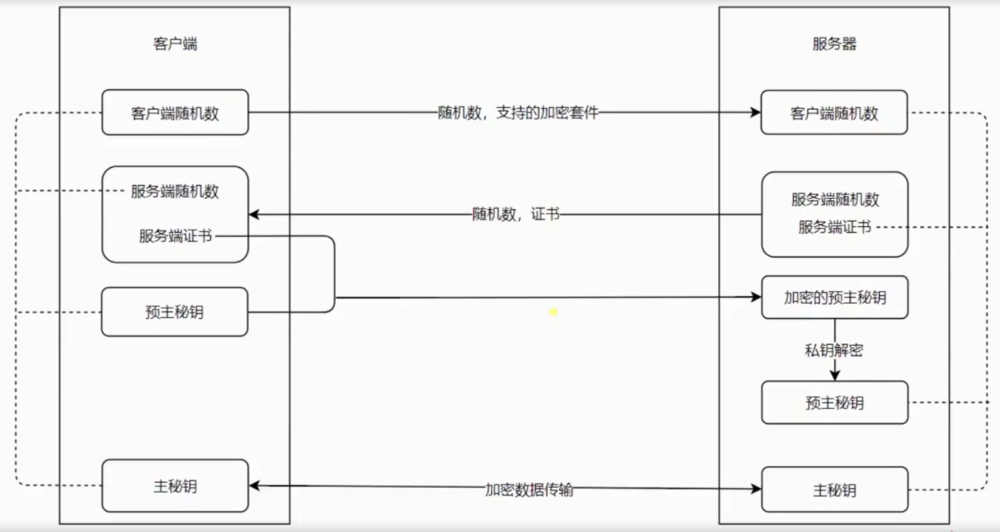

## 4.1 Nginx 安装和基础代理配置

```sh
# 安装
brew install nginx
```

```sh
# 检验安装是否成功
nginx -v
```

```sh
# cd 到根路径
cd /

# 安装成功后的目录文件位置

#1. nginx安装文件目录
/opt/homebrew/Cellar/nginx
#2.  nginx配置文件目录
/opt/homebrew/etc/nginx
#3.  config文件目录
/opt/homebrew/etc/nginx/nginx.conf
#4.  系统hosts位置
/private/etc/hosts

# 启动nginx
nginx
```

```sh
# 通过命令查看
ps -ef|grep nginx

501 17352     1   0  9:11下午 ??         0:00.00 nginx: master process /opt/homebrew/Cellar/nginx/1.23.0/bin/nginx
  501 17353 17352   0  9:11下午 ??         0:00.00 nginx: worker process
  501 17420 14075   0  9:15下午 ttys000    0:00.00 grep --color=auto --exclude-dir=.bzr --exclude-dir=CVS --exclude-dir=.git --exclude-dir=.hg --exclude-dir=.svn --exclude-dir=.idea --exclude-dir=.tox nginx
```

打开 `localhost:8080` 验证。有页面说明生效，如果不生效，可尝试：

```sh
# 重启nginx
nginx -s reload

# 停止nginx
nginx -s stop  # 快速停止或关闭Nginx
nginx -s quit   # 正常停止或关闭Nginx
```

```conf
# nginx.conf
include servers/*.conf;
```

```conf
# test.conf

server {
  listen 80;
  server_name test.com;

  location / {
    proxy_pass  http://127.0.0.1:8888;
    proxy_set_header Host $host;
  }
}
```

## 4.2 Nginx 代理配置和代理缓存的用处

配置代理缓存

```conf
# test.conf

proxy_cache_path cache levels=1:2 keys_zone=my_cache:10m

server {
  listen 80;
  server_name test.com;

  location / {
    proxy_cache my_cache;
    proxy_pass  http://127.0.0.1:8888;
    proxy_set_header Host $host;
  }
}
```

`s-maxage` 代理缓存设置的时间。

`private` 只有浏览器缓存，不允许代理服务器缓存。

`no-store` 浏览器和代理服务器都不会缓存。

`'Vary': 'X-Test-Cache'` 请求时带这个头的话，缓存。

```js
res.writeHead(200, {
  "cache-control": "s=maxage:200",
  Vary: "X-Test-Cache",
});
```

## 4.3 HTTPS 解析

http 是明文传输的过程。

https 是加密数据传输（主密钥，中间人拿不到）。

### 加密

- 私钥（放在服务器上，解密加密的公钥）
- 公钥（放在互联网上，所有人都能拿到的加密字符串）

公钥和私钥是在握手的时候进行传输。



## 4.4 使用 Nginx 部署 HTTPS 服务

生成公钥和秘钥文件。[地址](https://gist.github.com/Jokcy/5e73fd6b2a9b21c142ba2b1995150808)

`openssl req -x509 -newkey rsa:2048 -nodes -sha256 -keyout localhost-privkey.pem -out localhost-cert.pem`

```conf
# http 跳转 https 配置
server {
  listen    80 default_server;
  listen    [::]:80 default_server;
  server_name   test.com;
  return 302    https://$server_name$request_uri;
}

server {
  listen  443;
  server_name test.com;

  ssl on;
  ssl_certificate_key ../certs/localhost-privkey.pem;
  ssl_certificate ../cert/localhost-cert.pem;

  location / {
    proxy_pass  http://127.0.0.1:8888;
    proxy_set_header Host $host;
  }
}
```

## 4.5 HTTP2 的优势和 Nginx 配置 HTTP2 的简单使用

- 信道复用
- 分帧传输
- Server Push

```js
res.writeHead(200, {
  'Link': '</test.jpg>; as=image; rel=preload'
});
```

`Link` 是 http2 中服务端响应头的一个属性，指定这个请求推送哪些内容。

```conf
server {
  listen  443 http2;
  server_name test.com;
  http2_push_preload  on;

  ssl on;
  ssl_certificate_key ../certs/localhost-privkey.pem;
  ssl_certificate ../cert/localhost-cert.pem;

  location / {
    proxy_pass  http://127.0.0.1:8888;
    proxy_set_header Host $host;
  }
}
```

nginx 使用 http2 可以自动的兼容 1.1。

```sh
curl -v -k https://test.com
```

`ALPN, server accepted to use h2` 只要客户端支持 h2，服务端就会使用 h2 来传输。

指定使用 http1.1

```sh
curl -v -k --http1.1 https://test.com
```
