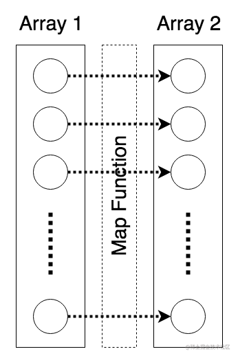

## 3.1 长度

```js
const array = [1, 2, 3, 4, 5];
console.log(array.length); //=> 5
```

## 3.2 修改内容

### 3.2.1 增加内容

- 末端新增内容（Append）`push`
- 首端新增内容（Prepend）`unshift`
- 插入到中间的某一个部分（insert）`splice`

#### 添加到末端 Append

Append 操作在 JavaScript 中使用 `array.push(element1[, ...[, elementN]])` 方法直接实现。

```js
const array = [];

array.push(1);
console.log(array); //=> [1]

array.push(2, 3);
console.log(array); //=> [1, 2, 3]
console.log(array.length); //=> 3
```

#### 添加到首端 Prepend

添加到首端的操作在 JavaScript 中可以使用 `array.unshift(element1[, ...[, elementN]])` 方法。

```js
const array = [4, 5];

array.unshift(3);
console.log(array); //=> [3, 4, 5]

array.unshift(1, 2);
console.log(array); //=> [1, 2, 3, 4, 5]
```

#### 插入到中间某个位置 Insert

在 JavaScript 中数组元素的位置是从 0 开始的，也就是数组的第一个元素的下标为 0，第二个为 1。

假设我们需要在数组 `[ 1, 2, 4, 5 ]` 中的第三个位置，即下标为 `2` 的位置上添加元素 `3`。这需要用到 `array.splice(start, deleteCount, element1[, ...[, elementN]])` 方法。你可以注意到该方法第二个参数是 `deleteCount`，因为这个方法也可以用来删除数组中某一个位置开始的若干个元素，而当我们将这个参数设置为 `0` 的时候，该方法第三个以及后面的参数便会插入到下标为 `start` 的位置，后面的元素自动往后推导。

```js
const array = [1, 2, 6, 7];

array.splice(2, 0, 3); // 下标为 2 的位置上添加元素 3
console.log(array); //=> [1, 2, 3, 6, 7]

array.splice(3, 0, 4, 5); // 下标为 3 的位置上添加元素 4, 5
console.log(array); //=> [1, 2, 3, 4, 5, 6, 7]
```

### 3.2.2 查找内容

最常用的内容查找方法便是 `filter` 过滤器。

```js
// 假设我们需要在数组 [1, 2, 3, 4, 5, 6, 7, 8] 中找出偶数项，即对元素进行对 2 求余结果为 0 时即为偶数。
const array = [1, 2, 3, 4, 5, 6, 7, 8];
const evenNumbers = array.filter(function (x) {
  return x % 2 == 0;
});

console.log(evenNumbers); //=> [2, 4, 6, 8]
```

### 3.2.3 删除内容

`array.splice(start, deleteCount)`

```js
// 比如我们要删除数组 [1, 2, 3, 10, 4, 5] 中下标为 3 的元素 10，就可以这样使用，删除从位置 3 开始的 1 个元素。
const array = [1, 2, 3, 10, 4, 5];

array.splice(3, 1);

console.log(array); //=> [1, 2, 3, 4, 5]
```

### 3.2.4 更新内容

```js
const array = [1, 2, 3, 4, 5];

array[0] = 10;
console.log(array); //=> [10, 2, 3, 4, 5]
```

### 3.2.5 “题外话”：封装数组操作工具

虽然绝大多数操作都可以直接使用 JavaScript 中自带的 API 来实现，但是如 `array.splice()` 这种方法看上去就很容易产生操作错误。那么为了避免开发中的失误，我们可以通过定义一个抽象对象来封装一个用于操作数组的工具库。

```js
const arrayUtils = {
  // methods
};
```

#### 添加内容

前面我们说道了为数组添加内容有三种模式：末端添加、首端添加和中间插入，那么我们就可以分别为它们封装好 `append`、`prepend` 和 `insert` 函数。

```js
const arrayUtils = {
  // ...

  append(array, ...elements) {
    array.push(...elements);
    return array;
  },

  prepend(array, ...elements) {
    array.unshift(...elements);
    return array;
  },

  insert(array, index, ...elements) {
    array.splice(index, 0, ...elements);
    return array;
  },
};

// 使用
const array = [];
arrayUtils.append(array, 3); // 末端添加元素 3
arrayUtils.prepend(array, 1); // 首端添加元素 1
arrayUtils.insert(array, 1, 2); // 在位置 1 添加元素 2

console.log(array); //=> [1, 2, 3]
```

#### 删除内容

因为要删除数组中的某一个元素同样需要用到 array.splice() 方法，为了避免歧义我们也可以将其封装到工具库中。

```js
const arrayUtils = {
  // ...
  remove(array, index) {
    array.splice(index, 1);
    return array;
  },
};

// 使用
const array = [1, 2, 3];
arrayUtils.remove(array, 1);

console.log(array); //=> [1, 3]
```

## 3.3 以数组为单位的基本处理方法

### 3.3.1 转化

转换便是将一个数组中的内容，以一定的方式规律地转换为另一个数组内容。

在 JavaScript 中对数组进行“扫描”有不少方法，如前面提到过的 `filter`、只进行循环的 `forEach`、与 `filter` 类似的但只返回第一个匹配值的 `find`，以及接下来我们需要用到的用于进行数据转换的 `map` 和用于聚合数据的 `reduce`。



假设我们需要将数组 `[ 1, 2, 3, 4, 5 ]` 中的每一个元素都转换为较其增 2 的数值，也就是说要给每一个元素做 `+ 2` 的操作，那么我们就可以使用 `array.map(callback)` 方法来实现。

```js
const array = [1, 2, 3, 4, 5];

const addedArray = array.map(function (x) {
  return x + 2;
});

console.log(addedArray); //=> [3,4,5,6,7]
```

当然我们也可以用来做不同数据类型之间的转换，比如由 ASCII 码组成的数组 `[ 72, 101, 108, 108, 111, 32, 87, 111, 114, 108, 100 ]`，我们需要把它转化为对应的字符串数组就可以这样做。

```js
const asciiArray = [72, 101, 108, 108, 111, 87, 111, 114, 108, 100];

const charArray = asciiArray.map(function (ascii) {
  return String.fromCharCode(ascii);
});

console.log(charArray); //=> ["H", "e", "l", "l", "o", "W", "o", "r", "l", "d"]
```

### 3.3.2 聚合

```js
const array = [1, 2, 3, 4];

const sumResult = array.reduce(function (left, right) {
  return left + right;
});

console.log(sumResult); //=> 10
```

为此我们就可以对这个聚合结果做一个小封装，比如求数组中数值相加的和与相乘的积。

```js
const array = [1, 2, 3, 4];

function sum(array) {
  return array.reduce(function (left, right) {
    return left + right;
  });
}

function multi(array) {
  return array.reduce(function (left, right) {
    return left * right;
  });
}

console.log(sum(array)); //=> 10
console.log(multi(array)); //=> 24
```

### 3.3.3 又一个“题外话”：Lodash 工具库

[Lodash](https://Lodash.com) 是一个包含了非常多实用工具函数的 JavaScript 工具库。

```html
<script
  type="application/javascript"
  src="https://cdn.staticfile.org/Lodash.js/4.17.5/Lodash.js"
></script>
```

#### 使用 Lodash 实现数组相加

```js
const array = [1, 2, 3, 4];

const sumResult = _.sum(array);

console.log(sumResult); //=> 20
```

## 3.4 “更强”的数组

### 让对象成为数组的元素内容

```javascript
const crew = [
  {
    name: "Peter",
    gender: "male",
    level: "Product Manager",
    age: 32,
  },
  {
    name: "Ben",
    gender: "male",
    level: "Senior Developer",
    age: 28,
  },
  {
    name: "Jean",
    gender: "female",
    level: "Senior Developer",
    age: 26,
  },
  {
    name: "Chang",
    gender: "male",
    level: "Developer",
    age: 23,
  },
  {
    name: "Siva",
    gender: "female",
    level: "Quality Assurance",
    age: 25,
  },
];
```

### 以数组为元素的数组

```js
const points = [
  [1, 1],
  [2, 3],
  [3, 5],
  [4, 7],
  [5, 10],
  [6, 15],
];
```

甚至我们有的时候还需要一个数组中有着不同类型的元素，比如混杂着字符串和数值。

```js
const array = [
  ["Hello", 1],
  ["World", 1],
];
```

## 3.5 习题

1. 将数组 `[ 1, 2, 3, 4, 5 ]` 转换为 `[ 'a1', 'a2', 'a3', 'a4', 'a5' ]`；
2. 将数组 `[ 1, 2, 3, 4, 5 ]` 转换为 `[ 'a1', 'b2', 'c3', 'd4', 'e5' ]`；
3. 将数组 `[ 1, 2, 3, 4, 5 ]` 转换为 `[ 1, 4, 9, 16, 25 ]`；
4. 查询 JavaScript 中 `Array.prototype.map` 方法的详细文档，并将数组 `[ 0, 0, 0, 0, 0 ]` 转换为 `[ 'A', 'B', 'C', 'D', 'E' ]`；
5. 提取数组 `[ 1, 2, 3, 4, 5 ]` 中的 `[ 2, 3, 4 ]`。

```js
[1, 2, 3, 4, 5].map((item) => "a" + item);

[1, 2, 3, 4, 5].map((item) => String.fromCharCode(96 + item) + item);

[1, 2, 3, 4, 5].map((item) => item * item);

[0, 0, 0, 0, 0].map((item, index) => String.fromCharCode(65 + index));

[1, 2, 3, 4, 5].filter((item) => item > 1 && item < 5);
```
