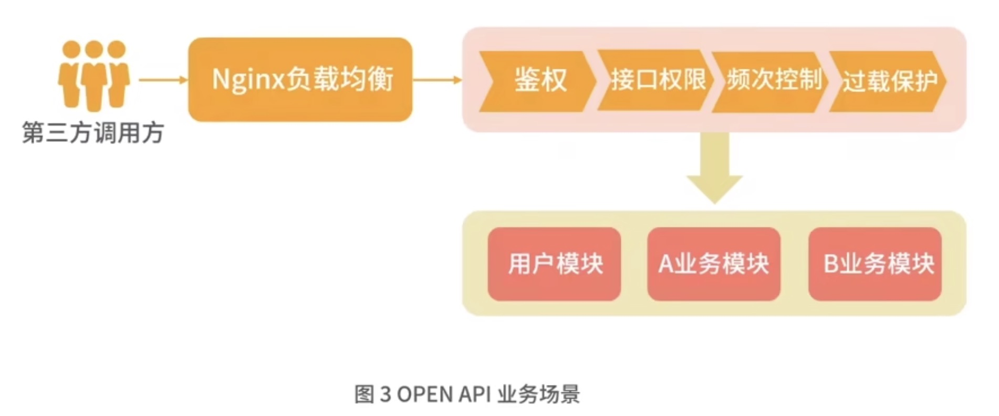
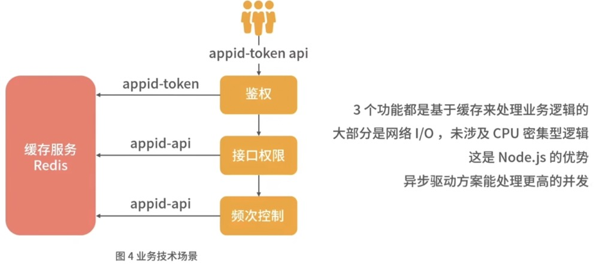
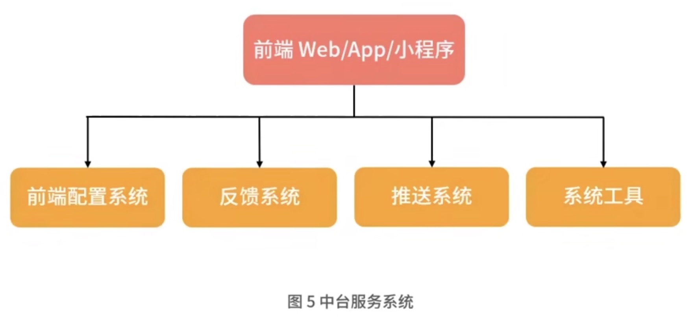
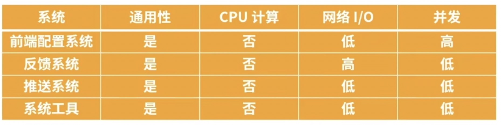
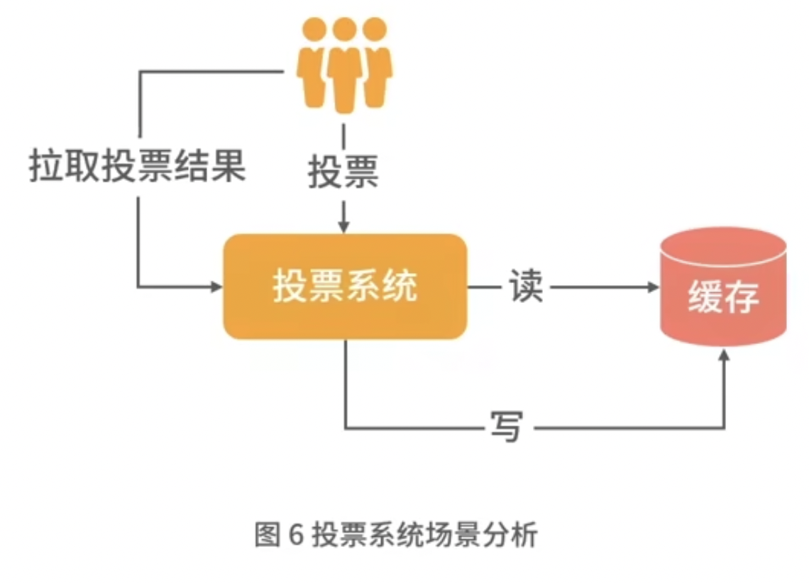

## 1. 前言

目前 Node.js 常被用作前端工程化，导致大家误解为 Node.js 只适合做前端工程化工具，而忽视了其作为后端服务的特性。

介绍 Node.js 的特性，以及适合哪些后端应用场景。

## 2. 服务分类

常听说的服务有 `RESTFUL` 和 `RPC`，但这都是架构设计规范。

- 前端
- 网关
- 业务网关
- 运营系统、业务系统、中台服务
- 各类基础层
- 数据缓存
- 数据存储层

不能代表所有的服务，但各个系统都或多或少包含这些服务。

### 网关

处理请求转发和一些通用的逻辑，例如常见的 Nginx。

### 业务网关

处理业务相关的逻辑，比如一些通用的协议转化，通用的鉴权处理以及其他统一的业务安全处理等。

### 运营系统

负责日常的运营活动或运营系统。

### 业务系统

负责核心的业务功能的系统。

### 中台服务

负责一些通用 App 类的服务，比如配置下发、消息系统及用户反馈等系统。

### 各类基础层

较单一的核心后台服务，例如用户模块，需根据不同业务设计不同的核心底层服务。

### 数据缓存和数据存储层

是相应的数据类的服务。

需要寻找网络 I/O 较多，但 CPU 计算较少、业务复杂度高的服务，可以分析出 Node.js 应用在业务网关中台服务以及运营系统几方面。

分别从系统的业务场景及系统特性来分析为什么 Node.js 更合适。

## 3. 业务网关

了解 Nginx 作为负载均衡转发层，负责负载分发，那么业务网关又是什么呢？

比如：后台管理系统有鉴权模块，以往是在管理后台服务中增加一个鉴权的类，然后在统一路由处增加鉴权判断。现在不仅是管理系统需要使用这个鉴权类，多个管理系统都需要这个鉴权类，这时你会考虑复制这个类到其他项目又或设计一个专门的服务来做鉴权。

一个实际的例子 OPEN API 的业务网关来介绍下这类服务场景。

### 业务场景

OPEN API 一般会有一个统一的 `token` 鉴权，通过 token 鉴权后还需要判断第三方 `appid` 是否有接口权限，其次判断接口是否到达了**请求频率上限**。

从计算层面看为什么 Node.js 更适合此类应用场景。

### 服务特性

Node.js 的代码核心是不阻塞主线程处理。而这类业务网关都是轻 CPU 运算服务，在这类场景技术选型中可以考虑使用 Node.js 作为服务端语言。

## 4. 中台服务

> 在 Web 或者 App 引用中都存在一些通用服务，以往都是独立接口、独立开发。

随着公司应用越来越多，需要将一些通用的业务服务进行集中，这也是中台的概念，而这部分业务场景往往也是网络 I/O 高，并发量大、业务关联性高、数据库读写压力相对较小。

### 业务场景

- 前端配置系统。在服务端根据客户端的版本、设备、地区和语言下发不同的配置。
- 反馈系统。用户可以在任务平台调用反馈接口并将反馈内容写入队列并落地到系统中进行综合分析。
- 推送系统。用于管理消息推送，用户红点和消息数的拉取以及消息列表的管理。
- 系统化工具。用于处理用户端日志捞取、用户端信息调式上报、性能定位问题分析提取。

具体看看每个系统的特性，从特性分析为什么 Node.js 适合作为服务端语言。

在中台系统的设计中，系统着重关注：网络 I/O、并发、通用性及业务复杂度，一般情况下不涉及复杂的 CPU 运算。

Node.js 作为中台服务，要求是：

- 通用性必须好
- 低 CPU 计算
- 网络 I/O 高或者低都行
- 并发高或者低都行

### 服务特性

这样的服务在 Node.js 主线程中，可快速处理各类业务场景不会存在阻塞的情况，因此这类场景也适合使用 Node.js 作为服务端语言。

## 5. 运营系统

在各类互联网项目中，经常用运营活动来做项目推广。这类运营系统往往逻辑复杂，需要根据业务场景进行多次迭代、不断优化，这些活动并发很高，可以不涉及底层数据库读写，更多的是缓存数据处理。比如常见的一些投票活动、排行榜活动等。

## 6. 不适合场景

事件循环，在原理中突出的是不能阻塞主线程，而一些密集型 CPU 运算的服务则非常不适合使用 Node.js 来处理。

比如：

- 图片处理，图片的裁剪、图片的缩放，这些非常损耗 CPU 计算，应该用其他进程来处理。
- 大字符串、大数组类处理。当涉及这些数据时，应考虑如何通过切割来处理，或在其他进程异步处理。
- 大文件读写处理。有时会使用 Node.js 服务来处理 Excel，但遇到 Excel 过大时会导致 Node.js 内存溢出，因为 V8 内存上线是 1.4G。

总之两个关键因素：大内存和 CPU 密集。这样的场景不适用使用 Node.js 来提供服务。

## 7. 总结

本讲中介绍的各类系统，都遵循了 Node.js 事件循环原理，减少或者避免在 Node.js 主线程中被阻塞或进行一些 CPU 密集型计算。
