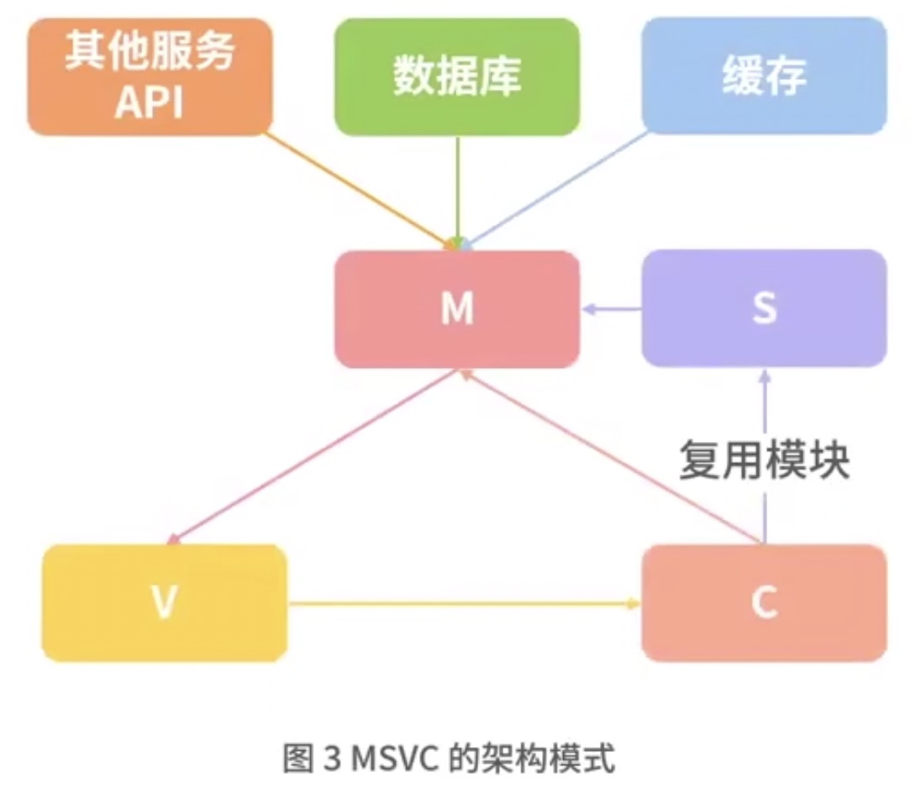
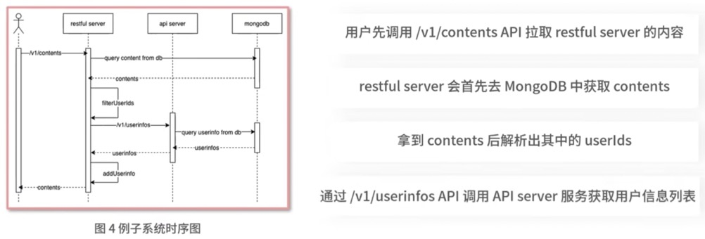
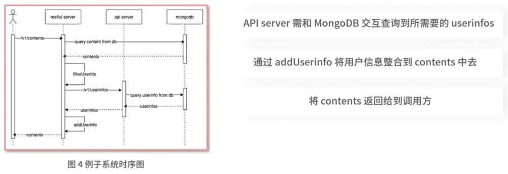

## 1. 涉及的一些技术知识点

### 什么是 RESTful 规范

是一种架构的约束条件和规则。在倡导前后端分离后，该架构规范的应用愈加广泛。

### 目前常用的 MVC 架构模式及后续专栏所应用的一套新的、独创的 MSVC 架构模式

- M层处理数据库相关的操作。
- C层处理业务逻辑。
- V层则是页面显示和交互。

服务划分交细情况下，M层不仅仅是数据库操作，这种架构模式显得有些力不从心。

MSVC(Model、Service、View、Controller)

## 2. 系统实践

先实现一个简单版本的 RESTful 服务，其次为能更清晰了解 MVC 架构和 SMVC 架构的优缺点，会分别实现两个版本的 RESTful 服务。

要实现的是一个获取用户发帖列表信息 API，该 API 列表内容包含两部分，一部分是从数据库获取的发帖内容，但这部分只包含用户 ID，另外一部分则是需要通过 ID 批量拉取用户信息。

先设计 RESTful API，由于是拉取列表内容接口，这里设计为一个 GET 接口，根据 RESTful 约束规则设计为：GET /v1/contents

要需要设计一个独立的服务来获取用户信息，将接口设计为：GET /v1/userinfos

在不考虑任务架构模式的情况下，实现一个简单版本的 restful 服务，上面分析了实现 2 个 server，分别叫做 `API server` 和 `restful server`。

### API Server

包括 2 个部分：解析请求**路径**和解析请求**参数**。

参数和请求路径解析成功后，再进行路径的判断和校验。如果不满足当前要求，调用 setResInfo 报错返回相应的数据给前端。

路径和参数解析成功后，在根据当前参数查询 Mongodb 中的 userinfo 数据。find 查询返回的数据需要使用 toArray 进行转化处理，拿到 Mongodb 查询结果后，在调用 setResInfo 返回查询结果给到前端。

### restful Server

和 API server 相似，前端 2 个过程是解析请求路径和请求参数。解析成功后，根据时序图先从 Mongodb 拉取 10 条 content 数据。

在 Mongodb 中查询到具体的 contents 后，再调用 filterUserinfo 这个函数 contents 中的 user_id 转化为 userinfo。

以上实现了一个简单 restful 服务的功能，可以看到代码都堆积到 index.js 中，且代码逻辑较简单，如果稍微复杂一点，这种架构模式没法进行团队合作或后端维护，因此就需要 MVC 和 MVCS 架构模式优化这种场景。

