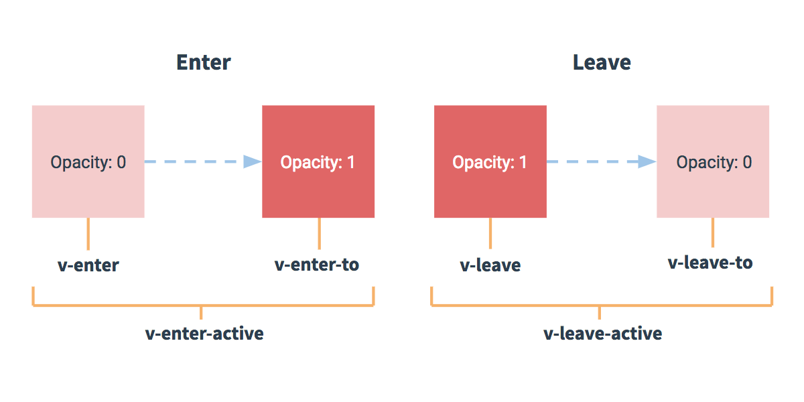

## 1. 安装

在用 Vue 构建大型应用时推荐使用 NPM 安装。

```sh
# 最新稳定版
npm install vue
```

## 2. 介绍

Vue 是一套用于构建用户界面的**渐进式框架**。

1. 声明式渲染
  ```vue
  {{ variable }}
  ```
2. 条件与循环（`v-if`、`v-for`）
3. 处理用户输入(`v-on`、`v-model`)
4. 组件化应用构建
  ```vue
    Vue.component(
      'name',
      {
        props: ['todo'],
        template: '<li>{{ todo.text }}</li>'
      }
    )
  ```

## 3. Vue 实例

创建一个根 Vue 实例：`var vm = new Vue({ 选项对象 })`

`Object.freeze()`，这会阻止修改现有的 property，也意味着响应系统无法再追踪变化。Vue 实例还暴露了一些有用的实例 property 与方法。它们都有前缀 `$`，以便与用户定义的 property 区分开来。`$data`、`$el`、`$watch`

每个 Vue 实例在被创建时都要经过一系列的初始化过程——例如，需要设置数据监听、编译模板、将实例挂载到 DOM、在数据变化时更新 DOM 等。同时在这个过程中也会运行一些叫做**生命周期钩子**的函数，给予用户机会在一些特定的场景下添加他们自己的代码。


## 4. 模版语法

### 4.1 插值

1. **文本**（“Mustache”语法 (双大括号) 的文本插值）。通过使用 `v-once` 指令，你也能执行一次性地插值，当数据改变时，插值处的内容不会更新。(`<span v-once>这个将不会改变: {{ msg }}</span>`)
2. **原始 HTML**（`v-html='rawHtml'`）
3. **Attribute**（`v-bind:id`、`v-bind:disabled`）
4. **使用 JavaScript 表达式**（`number + 1`、`ok ? 'YES' : 'NO'`、`message.split('').reverse().join('')`、`<div v-bind:id="'list-'+id"></div>`）

### 4.2 指令

`v-` 前缀的特殊 attribute。指令的职责是，当表达式的值改变时，将其产生的连带影响，响应式地作用于 DOM。

**1. 参数**

  `v-bind` 指令可以用于响应式地更新 HTML attribute。`<a v-bind:href="url">...</a>`

  `v-on` 指令，它用于监听 DOM 事件）。`<a v-on:click="doSomething">...</a>`

**2. 动态参数**

  用方括号括起来的 JavaScript 表达式作为一个指令的参数：

  `<a v-bind:[attributeName]="url"> ... </a>`

  `<a v-on:[eventName]="doSomething"> ... </a>`

  对动态参数的值的约束：动态参数预期会求出一个字符串，异常情况下值为 null。这个特殊的 null 值可以被显性地用于移除绑定。任何其它非字符串类型的值都将会触发一个警告。

  对动态参数表达式的约束：动态参数表达式有一些语法约束，因为某些字符，如空格和引号，放在 HTML attribute 名里是无效的。`<a v-bind:['foo' + bar]="value"> ... </a>`变通的办法是使用没有空格或引号的表达式，或用计算属性替代这种复杂表达式。还需要避免使用大写字符来命名键名，因为浏览器会把 attribute 名全部强制转为小写：

  ```html
  <!--
  在 DOM 中使用模板时这段代码会被转换为 `v-bind:[someattr]`。
  除非在实例中有一个名为“someattr”的 property，否则代码不会工作。
  -->
  <a v-bind:[someAttr]="value"> ... </a>
  ```

**3. 修饰符**

  修饰符 (modifier) 是以半角句号 `.` 指明的特殊后缀，用于指出一个指令应该以特殊方式绑定。例如，`.prevent` 修饰符告诉 `v-on` 指令对于触发的事件调用 `event.preventDefault()`:

  ```html
  <form v-on:submit.prevent="onSubmit">...</form>
  ```

### 4.3 缩写

1. v-bind 缩写 `:`

  ```html
  <!-- 完整语法 -->
  <a v-bind:href="url">...</a>

  <!-- 缩写 -->
  <a :href="url">...</a>

  <!-- 动态参数的缩写 (2.6.0+) -->
  <a :[key]="url"> ... </a>
  ```

2. v-on 缩写 `@`

  ```html
  <!-- 完整语法 -->
  <a v-on:click="doSomething">...</a>

  <!-- 缩写 -->
  <a @click="doSomething">...</a>

  <!-- 动态参数的缩写 (2.6.0+) -->
  <a @[event]="doSomething"> ... </a>
  ```

## 5. 计算属性和侦听器

初衷：在模板中放入太多的逻辑会让模板过重且难以维护。

计算属性是基于它们的响应式依赖进行缓存的。**只在相关响应式依赖发生改变时它们才会重新求值**。如果没有发生改变，访问计算属性会立即返回之前的计算结果，而不必再次执行函数。

当需要在数据变化时执行异步或开销较大的操作时，这个方式是最有用的。使用 watch 选项允许我们执行异步操作 (访问一个 API)，限制我们执行该操作的频率，并在我们得到最终结果前，设置**中间状态**。这些都是计算属性无法做到的。

## 6. Class 与 Style 绑定

### 6.1 绑定 HTML Class

1. 对象语法

  `v-bind:class="{ active: isActive, 'text-danger': hasError }"`

  ```vue
  <div v-bind:class="classObject"></div>

  data: {
    classObject: {
      active: true,
      'text-danger': false
    }
  },

  // 渲染的结果和上面一样。我们也可以在这里绑定一个返回对象的计算属性。这是一个常用且强大的模式
  data: {
    isActive: true,
    error: null
  },
  computed: {
    classObject: function () {
      return {
        active: this.isActive && !this.error,
        'text-danger': this.error && this.error.type === 'fatal'
      }
    }
  }
  ```

2. 数组语法

数组：`<div v-bind:class="[activeClass, errorClass]"></div>` `data: { activeClass: 'active', errorClass: 'text-danger' }`

三元表达式：
`<div v-bind:class="[isActive ? activeClass : '', errorClass]"></div>` 不过，当有多个条件 class 时这样写有些繁琐。所以在数组语法中也可以使用对象语法：

`<div v-bind:class="[{ active: isActive }, errorClass]"></div>`

3. 用在组件上

`<my-component v-bind:class="{ active: isActive }"></my-component>`

### 6.2 绑定内联样式

1. 对象语法

  `<div v-bind:style="{ color: activeColor, fontSize: fontSize + 'px' }"></div>`

  `data: { activeColor: 'red', fontSize: 30 }`

  直接绑定到一个样式对象通常更好，这会让模板更清晰：

  ```html
  <div v-bind:style="styleObject"></div>
  ```

  ```js
  data: { styleObject: { activeColor: 'green', fontSize: 30 } }
  ```

2. 数组语法

`<div v-bind:style="[baseStyles, overridingStyles]"></div>`

3. 自动添加前缀

当 `v-bind:style` 使用需要添加浏览器引擎前缀的 CSS property 时，如 `transform`，Vue.js 会自动侦测并添加相应的前缀。

4. 多重值

从 2.3.0 起你可以为 style 绑定中的 property 提供一个包含多个值的数组，常用于提供多个带前缀的值，例如：

```html
<div :style="{ display: ['-webkit-box', '-ms-flexbox', 'flex'] }"></div>
```

这样写只会渲染数组中最后一个被浏览器支持的值。在本例中，如果浏览器支持不带浏览器前缀的 flexbox，那么就只会渲染 `display: flex`。

## 7. 条件渲染

`v-if`、`v-else`、`v-else-if`

用 key 管理可复用的元素：添加一个具有唯一值的 key attribute。来表达“这两个元素是完全独立的，不要复用它们”。

`v-show`：元素始终会被渲染并保留在 DOM 中。`v-show` 只是简单地切换元素的 CSS property `display`。

`v-if` 是“真正”的条件渲染，因为它会确保在切换过程中条件块内的**事件监听器**和**子组件**适当地被销毁和重建。

`v-if` 也是惰性的：如果在初始渲染时条件为假，则什么也不做——直到条件第一次变为真时，才会开始渲染条件块。

`v-show` 就简单得多——不管初始条件是什么，元素总是会被渲染，并且只是简单地基于 CSS 进行切换。

一般来说，`v-if` 有更高的**切换开销**，而 `v-show` 有更高的**初始渲染开销**。因此，如果需要非常频繁地切换，则使用 v-show 较好；如果在运行时条件很少改变，则使用 v-if 较好。

当 `v-if` 与 `v-for` 一起使用时，**`v-for` 具有比 `v-if` 更高的优先级**。

## 8. 列表渲染

`v-for="(item, index) in items"`

也可以用 `of` 替代 `in` 作为分隔符，因为它更接近 JavaScript 迭代器的语法：`<div v-for="item of items"></div>`

也可以用 v-for 来遍历一个对象的 property。`<li v-for="(value, name, index) in object">{{ value }}</li>`

为了给 Vue 一个提示，以便它能跟踪每个节点的身份，从而**重用和重新排序现有元素**，你需要为每项提供一个唯一 `key` attribute。

### 数组更新检查：

Vue 将**被侦听的数组的变更方法进行了包裹**，所以它们也将会触发视图更新。这些被包裹过的方法包括：

- `push()`
- `pop()`
- `shift()`
- `unshift()`
- `splice()`
- `sort()`
- `reverse()`

不会变更原始数组，而总是返回一个新数组。当使用非变更方法时，可以用新的数组替换旧数组：

```js
example1.items = example1.items.filter(function (item) {
  return item.message.match(/Foo/)
})
```

> 由于 JavaScript 的限制，**Vue 不能检测数组和对象的变化**。

### 显示过滤/排序后的结果

有时，我们想要显示一个数组经过过滤或排序后的版本，而不实际变更或重置原始数据。在这种情况下，可以创建一个计算属性，来返回过滤或排序后的数组。

```html
<li v-for="n in evenNumbers">{{ n }}</li>
```

```js
data: {
  numbers: [ 1, 2, 3, 4, 5 ]
},
computed: {
  evenNumbers: function () {
    return this.numbers.filter(function (number) {
      return number % 2 === 0
    })
  }
}
```

在计算属性不适用的情况下 (例如，在嵌套 v-for 循环中) 你可以使用一个方法：

```html
<ul v-for="set in sets">
  <li v-for="n in even(set)">{{ n }}</li>
</ul>
```

```js
data: {
  sets: [[ 1, 2, 3, 4, 5 ], [6, 7, 8, 9, 10]]
},
methods: {
  even: function (numbers) {
    return numbers.filter(function (number) {
      return number % 2 === 0
    })
  }
}
```

### 在 `v-for` 里使用范围值

`v-for` 也可以接受**整数**。在这种情况下，它会把模板重复对应次数。

```html
<div>
  <span v-for="n in 10">{{ n }} </span>
</div>
```

### 在 `<template>` 上使用 `v-for`

```html
<ul>
  <template v-for="item in items">
    <li>{{ item.msg }}</li>
    <li class="divider" role="presentation"></li>
  </template>
</ul>
```

### `v-for` 与 `v-if` 一同使用

> 注意我们不推荐在同一元素上使用 `v-if` 和 `v-for`。

当它们处于同一节点，**`v-for` 的优先级比 `v-if` 更高**，这意味着 `v-if` 将分别重复运行于每个 `v-for` 循环中。当你只想为部分项渲染节点时，这种优先级的机制会十分有用。

### 在组件上使用 `v-for`

```html
<my-component
  v-for="(item, index) in items"
  v-bind:item="item"
  v-bind:index="index"
  v-bind:key="item.id"
></my-component>
```

```html
<div id="todo-list-example">
  <form v-on:submit.prevent="addNewTodo">
    <label for="new-todo">Add a todo</label>
    <input
      v-model="newTodoText"
      id="new-todo"
      placeholder="E.g. Feed the cat"
    >
    <button>Add</button>
  </form>
  <ul>
    <li
      is="todo-item"
      v-for="(todo, index) in todos"
      v-bind:key="todo.id"
      v-bind:title="todo.title"
      v-on:remove="todos.splice(index, 1)"
    ></li>
  </ul>
</div>
```

> 注意这里的 `is="todo-item"` attribute。这种做法在使用 DOM 模板时是十分必要的，因为在 `<ul>` 元素内只有 `<li>` 元素会被看作有效内容。这样做实现的效果与 `<todo-item>` 相同，但是可以避开一些潜在的浏览器解析错误。

```js
Vue.component('todo-item', {
  template: '\
    <li>\
      {{ title }}\
      <button v-on:click="$emit(\'remove\')">Remove</button>\
    </li>\
  ',
  props: ['title']
})
```

## 9. 事件处理

1. 监听事件（`v-on`）
2. 事件处理方法（`<button v-on:click="greet">Greet</button>` `greet(event)`）
3. 内联处理器（`<button v-on:click="say('hi')">Say hi</button>`）

  有时也需要在内联语句处理器中访问原始的 DOM 事件。可以用特殊变量 `$event` 把它传入方法：

  ```html
  <button v-on:click="warn('Form cannot be submitted yet.', $event)">
    Submit
  </button>
  ```

  ```js
  // ...
  methods: {
    warn: function (message, event) {
      // 现在我们可以访问原生事件对象
      if (event) {
        event.preventDefault()
      }
      alert(message)
    }
  }
  ```

4. 事件修饰符（`.stop`（阻止单击事件继续传播）、`.prevent`（提交事件不再重载页面）、`.capture`（添加事件监听器时使用事件捕获模式，即内部元素触发的事件先在此处理，然后才交由内部元素进行处理）、`.self`（只当在 event.target 是当前元素自身时触发处理函数，即事件不是从内部元素触发的）、`.once`（点击事件将只会触发一次）、`.passive`（能够提升移动端的性能））
5. 按键修饰符（`.enter`（回车键）、`.tab`（Tab 键）、`.delete`（删除和退格键）、`.esc`（Escape 键）、`.space`（空格键）、`.up`（上键）、`.down`（下键）、`.right`（右键）、`.left`（左键））
6. 系统修饰键（`.ctrl`（Ctrl 键）、`.alt`（Alt 键）、`.shift`（Shift 键）、`.meta`（Windows 键））
7. 鼠标按钮修饰符（`.left`（左键）、`.right`（右键）、`.middle`（中键））
8. 为什么在 HTML 中监听事件？


   使用 `v-on` 有几个好处：

   - 扫一眼 HTML 模板便能轻松定位在 JavaScript 代码里对应的方法。
   - 因为你无须在 JavaScript 里手动绑定事件，你的 ViewModel 代码可以是非常纯粹的逻辑，和 DOM 完全解耦，更易于测试。
   - 当一个 ViewModel 被销毁时，所有的事件处理器都会自动被删除。你无须担心如何清理它们。


## 10. 表单输入绑定

修饰符

- `.lazy` 在“change”时而非“input”时更新 `<input v-model.lazy="msg">`
- `.number` 自动将用户的输入值转为**数值类型**
- `.trim` 自动过滤用户输入的**首尾空白字符**

## 11. 组件基础

组件可以进行任意次数的复用。每个组件都会各自维护它的状态，因为每用一次组件，就会有一个**新的 Vue 实例**被创建。

**一个组件的 `data` 选项必须是一个函数**，因此每个实例可以维护一份被**返回对象的独立的拷贝**。

1. 全局注册（`Vue.component('my-component-name', { ... })`）和局部注册。
2. 通过 Prop 向子组件传递数据。
3. 单个根元素（每个组件必须只有一个根元素）。
4. 监听子组件事件（`v-on:xxx` `$emit('xxx')`）；使用事件抛出一个值（`$emit('xxx', val)`）。
5. 在组件上使用 `v-model`（`v-bind`和`v-on`的组合）。
6. 通过插槽分发内容（只要在需要的地方加入插槽就行了——就这么简单！`<slot></slot>`）。
7. 动态组件（`<component :is="currentTabComponent"></component>`），`currentTabComponent` 是已注册组件的名字。
8. 解析 DOM 模版时的注意事项。

## 12. 组件注册

定义组件名的方式有两种：

- 使用 kebab-case（`Vue.component('my-component-name', { /* ... */ })`）
- 使用 PascalCase（`Vue.component('MyComponentName', { /* ... */ })`）

全局注册：`Vue.component('component-a', { /* ... */ })`

局部注册：`components: { 'component-a': { /* ... */ } }`

基础组件的自动化全局注册：

使用 require.context 只全局注册这些非常通用的基础组件(`BaseButton`、`BaseIcon`、`BaseInput`)。这里有一份可以让你在应用入口文件 (比如 src/main.js) 中全局导入基础组件的示例代码：

```js
import Vue from 'vue'
import upperFirst from 'lodash/upperFirst'
import camelCase from 'lodash/camelCase'

const requireComponent = require.context(
  // 其组件目录的相对路径
  './components',
  // 是否查询其子目录
  false,
  // 匹配基础组件文件名的正则表达式
  /Base[A-Z]\w+\.(vue|js)$/
)

requireComponent.keys().forEach(fileName => {
  // 获取组件配置
  const componentConfig = requireComponent(fileName)

  // 获取组件的 PascalCase 命名
  const componentName = upperFirst(
    camelCase(
      // 获取和目录深度无关的文件名
      fileName
        .split('/')
        .pop()
        .replace(/\.\w+$/, '')
    )
  )

  // 全局注册组件
  Vue.component(
    componentName,
    // 如果这个组件选项是通过 `export default` 导出的，
    // 那么就会优先使用 `.default`，
    // 否则回退到使用模块的根。
    componentConfig.default || componentConfig
  )
})
```

> **全局注册的行为必须在根 Vue 实例（`new Vue`）创建之前发生。**

## 13. Prop

Prop 的大小写 (camelCase vs kebab-case)。在 JS 中是驼峰命名，在 HTML 中是短横线命名。

Prop 类型（`String`、`Number`、`Boolean`、`Array`、`Object`、`Function`、`Promise`、`Date`、`Symbol`）

### 单项数据流

父级 prop 的更新会向下流动到子组件中，但是反过来则不行。这样会防止从子组件意外改变父级组件的状态，从而导致你的应用的数据流向难以理解。**不应该在一个子组件内部改变 `prop`**。

1. 定义一个本地的 data prototype 并将这个 prop 用作其初始值：

```js
props: ['initialCounter'],
data: function () {
  return {
    counter: this.initialCounter
  }
}
```

2. 这个 prop 以一种原始的值传入且需要进行转换。在这种情况下，最好使用这个 prop 的值来定义一个计算属性：

```js
props: ['size'],
computed: {
  normalizedSize: function () {
    return this.size.trim().toLowerCase()
  }
}
```

### Prop 验证

```js
Vue.component('my-component', {
  props: {
    // 基础的类型检查 (`null` 和 `undefined` 会通过任何类型验证)
    propA: Number,
    // 多个可能的类型
    propB: [String, Number],
    // 必填的字符串
    propC: {
      type: String,
      required: true
    },
    // 带有默认值的数字
    propD: {
      type: Number,
      default: 100
    },
    // 带有默认值的对象
    propE: {
      type: Object,
      // 对象或数组默认值必须从一个工厂函数获取
      default: function () {
        return { message: 'hello' }
      }
    },
    // 自定义验证函数
    propF: {
      validator: function (value) {
        // 这个值必须匹配下列字符串中的一个
        return ['success', 'warning', 'danger'].includes(value)
      }
    }
  }
})
```

当 prop 验证失败的时候，(开发环境构建版本的) Vue 将会产生一个控制台的警告。

> 注意那些 prop 会在一个组件实例创建**之前**进行验证，所以实例的属性 (如 `data`、`computed` 等) 在 `default` 或 `validator` 函数中是不可用的。

`type` 还可以是一个自定义的构造函数，并且通过 `instanceof` 来进行检查确认。例如，给定下列现成的构造函数：

```js
Vue.component('blog-post', {
  props: {
    author: Person
  }
})

function Person (firstName, lastName) {
  this.firstName = firstName
  this.lastName = lastName
}
```

来验证 `author` prop 的值是否是通过 `new Person` 创建的。

#### 禁用 Attribute 继承

如果你不希望组件的**根元素**继承 attribute，你可以在组件的选项中设置 `inheritAttrs: false`。

有了 `inheritAttrs: false` 和 `$attrs`，你就可以手动决定这些 attribute 会被赋予哪个元素。

> 注意 `inheritAttrs: false` 选项不会影响 `style` 和 `class` 的绑定。

## 14. 自定义事件

### 事件名

```js
this.$emit('myEvent')
```

```html
<!-- 没有效果 -->
<my-component v-on:my-event="doSomething"></my-component>
```

`v-on` 事件监听器在 DOM 模板中会被自动转换为全小写 (因为 HTML 是大小写不敏感的)，所以 `v-on:myEvent` 将会变成 `v-on:myevent` ——导致 `myEvent` 不可能被监听到。

因此，我们推荐你**始终使用 kebab-case 的事件名**。

### 自定义组件的 `v-model`

`model` 选项可以自定义组件的 `value` 的 prop 和名为 `input` 的事件。

```js
Vue.component('base-checkbox', {
  model: {
    prop: 'checked',
    event: 'change'
  },
  props: {
    checked: Boolean
  },
  template: `
    <input
      type="checkbox"
      v-bind:checked="checked"
      v-on:change="$emit('change', $event.target.checked)"
    >
  `
})
```

### 将原生事件绑定到组件

想要在一个组件的根元素上直接监听一个原生事件。这时，你可以使用 `v-on` 的 `.native` 修饰符：`<base-input v-on:focus.native="onFocus"></base-input>`

Vue 提供了一个 `$listeners` property，它是一个对象，里面包含了作用在这个组件上的所有监听器。

### `.sync` 修饰符

在有些情况下，我们可能需要对一个 prop 进行“双向绑定”。不幸的是，真正的双向绑定会带来维护上的问题，因为子组件可以变更父组件，且在父组件和子组件两侧都没有明显的变更来源。

这也是为什么我们推荐以 `update:myPropName` 的模式触发事件取而代之。举个例子，在一个包含 `title` prop 的假设的组件中，我们可以用以下方法表达对其赋新值的意图：

`this.$emit('update:title', newTitle)`

```html
<text-document
  v-bind:title="doc.title"
  v-on:update:title="doc.title = $event"
></text-document>
```

为了方便起见，我们为这种模式提供一个缩写，即 `.sync` 修饰符：

`<text-document v-bind:title.sync="doc.title"></text-document>`

当我们用一个对象同时设置多个 prop 的时候，也可以将这个 .sync 修饰符和 v-bind 配合使用：

`<text-document v-bind.sync="doc"></text-document>`

## 15. 插槽

### 插槽内容

将 `<slot>` 元素作为承载分发内容的出口。如果组件的 `template` 中没有包含一个 `<slot>` 元素，则该组件起始标签和结束标签之间的任何内容都会被抛弃。

### 编译作用域

**父级模版里的所有内容都是在父级作用域中编译的；子模版里的所有内容都是在子作用域中编译的。**

### 后备内容

```html
<button type="submit">
  <slot>Submit</slot>
</button>
```

即：默认内容。父级组件中使用并不提供任何插槽内容时显示。提供内容则被覆盖。

### 具名插槽

```html
<div class="container">
  <header>
    <slot name="header"></slot>
  </header>
  <main>
    <slot></slot>
  </main>
  <footer>
    <slot name="footer"></slot>
  </footer>
</div>
```

在一个 `<template>` 元素上使用 `v-slot` 指令，并以 `v-slot` 的参数的形式提供其名称：

```html
<base-layout>
  <template v-slot:header>
    <h1>Here might be a page title</h1>
  </template>

  <!-- 任何没有被包裹在带有 v-slot 的 <template> 中的内容都会被视为默认插槽的内容。 -->
  <!-- <template v-slot:default> -->
  <p>A paragraph for the main content.</p>
  <p>And another one.</p>

  <template v-slot:footer>
    <p>Here's some contact info</p>
  </template>
</base-layout>
```

> `v-slot` 只能添加在 `<template>` 上。

### 作用域插槽

为了让 `user` 在父级的插槽内容中可用，我们可以将 `user` 作为 `<slot>` 元素的一个 attribute 绑定上去：

```html
<span>
  <slot v-bind:user="user">
    {{ user.lastName }}
  </slot>
</span>
```

绑定在 `<slot>` 元素上的 attribute 被称为**插槽 prop**。现在在父级作用域中，我们可以使用带值的 `v-slot` 来定义我们提供的插槽 prop 的名字：

```html
<current-user>
  <template v-slot:default="slotProps">
    {{ slotProps.user.firstName }}
  </template>
</current-uer>
```

在这个例子中，我们选择将包含所有插槽 prop 的对象命名为 `slotProps`，但你也可以使用任意你喜欢的名字。

独占默认插槽的缩写语法：`v-slot="slotProps"`

解构插槽 Prop:

```html
<current-user v-slot="{ user }">
  {{ user.firstName }}
</current-user>
```

prop 重命名

```html
<current-user v-slot="{ user: person }">
  {{ person.firstName }}
</current-user>
```

你甚至可以定义后备内容，用于插槽 prop 是 undefined 的情形：

```html
<current-user v-slot="{ user = { firstName: 'Guest' } }">
  {{ user.firstName }}
</current-user>
```

### 动态插槽名

```html
<base-layout>
  <template v-slot:[dynamicSlotName]>
    ...
  </template>
</base-layout>
```

### 具名插槽的缩写

例如 `v-slot:header` 可以被重写为 `#header`：

```html
<base-layout>
  <template #header>
    <h1>Here might be a page title</h1>
  </template>
</base-layout>
```

### 其他示例

我们可以将每个 todo 作为父级组件的插槽，以此通过父级组件对其进行控制，然后将 todo 作为一个插槽 prop 进行绑定：

```html
<ul>
  <li
    v-for="todo in filteredTodos"
    v-bind:key="todo.id"
  >
    <!-- 我们为每个 todo 准备了一个插槽，将 `todo` 对象作为一个插槽的 prop 传入。-->
    <slot name="todo" v-bind:todo="todo">
      <!-- 后备内容 -->
      {{ todo.text }}
    </slot>
  </li>
</ul>
```
现在当我们使用 `<todo-list>` 组件的时候，我们可以选择为 todo 定义一个不一样的 `<template>` 作为替代方案，并且可以从子组件获取数据：

```html
<todo-list v-bind:todos="todos">
  <template v-slot:todo="{ todo }">
    <span v-if="todo.isComplete">✓</span>
    {{ todo.text }}
  </template>
</todo-list>
```

## 16. 动态组件 & 异步组件

### 在动态组件上使用 `keep-alive`

我们之前在一个多标签的界面中使用 `is` attribute 来切换不同的组件。当在这些组件之间切换的时候，你有时会**想保持这些组件的状态**，以避免反复重新渲染导致的性能问题。我们可以用一个 `<keep-alive>` 元素将其动态组件包裹起来。

```vue
<!-- 失活的组件将会被缓存！-->
<keep-alive>
  <component v-bind:is="currentTabComponent"></component>
</keep-alive>
```

> 注意这个 `<keep-alive>` 要求被切换到的组件都有自己的名字，不论是通过组件的 name 选项还是局部/全局注册。

### 异步组件

```js
components: {
  'my-component': () => import('./my-async-component')
}
```

处理加载状态:

```js
const AsyncComponent = () => ({
  // 需要加载的组件 (应该是一个 `Promise` 对象)
  component: import('./MyComponent.vue'),
  // 异步组件加载时使用的组件
  loading: LoadingComponent,
  // 加载失败时使用的组件
  error: ErrorComponent,
  // 展示加载时组件的延时时间。默认值是 200 (毫秒)
  delay: 200,
  // 如果提供了超时时间且组件加载也超时了，
  // 则使用加载失败时使用的组件。默认值是：`Infinity`
  timeout: 3000
})

const helloWorld = () => AsyncComponent(import('@/components/helloWorld'))
```

## 17. 处理边界情况

1. 访问根实例（`this.$root`）
2. 访问父级组件实例（`this.$parent`）
3. 访问子组件实例或子元素（`this.refs`）
4. 依赖注入

   `provide` 选项允许我们指定我们想要提供给后代组件的数据/方法。`provide: function() { return getMap: this.getMap }`

   使用 `inject` 选项来接收指定的我们想要添加在这个实例上的 property：`inject: ['getMap']`

5. 程序化的事件侦听器:

  - 通过 `$on(eventName, eventHandler)` 侦听一个事件
  - 通过 `$once(eventName, eventHandler)` 一次性侦听一个事件
  - 通过 `$off(eventName, eventHandler)` 停止侦听一个事件

6. 循环引用

  - 递归组件（组件是可以在它们自己的模板中调用自身的。不过它们只能通过 `name` 选项来做这件事）`name: 'stack-overflow', template: '<div><stack-overflow></stack-overflow></div>'`
  - 组件之间的循环引用（我们先把两个组件称为 A 和 B。模块系统发现它需要 A，但是首先 A 依赖 B，但是 B 又依赖 A，但是 A 又依赖 B，如此往复。这变成了一个循环，不知道如何不经过其中一个组件而完全解析出另一个组件。为了解决这个问题，我们需要给模块系统一个点，在那里“A 反正是需要 B 的，但是我们不需要先解析 B。”）所以我们会等到生命周期钩子 beforeCreate 时去注册它：

  ```js
  beforeCreate: function () {
    this.$options.components.TreeFolderContents = require('./tree-folder-contents.vue').default
  }
  ```
  或者，在本地注册组件的时候，你可以使用 webpack 的异步 `import`：

  ```js
  components: {
    TreeFolderContents: () => import('./tree-folder-contents.vue')
  }
  ```

7. 控制更新

  - 强制更新（`$forceUpdate`）。如果你发现你自己需要在 Vue 中做一次强制更新，99.9% 的情况，是你在某个地方做错了事。
  - 通过 `v-once` 创建低开销的静态组件。（渲染普通的 HTML 元素在 Vue 中是非常快速的，但有的时候你可能有一个组件，这个组件包含了**大量静态内容**。在这种情况下，你可以在根元素上添加 `v-once` attribute 以确保这些内容只计算一次然后缓存起来）

## 18. 进入/ 离开 & 列表过度



```vue
<div id="example-1">
  <button @click="show = !show">
    Toggle render
  </button>
  <transition name="slide-fade">
    <p v-if="show">hello</p>
  </transition>
</div>

new Vue({
  el: '#example-1',
  data: {
    show: true
  }
})

/* 可以设置不同的进入和离开动画 */
/* 设置持续时间和动画函数 */
.slide-fade-enter-active {
  transition: all .3s ease;
}
.slide-fade-leave-active {
  transition: all .8s cubic-bezier(1.0, 0.5, 0.8, 1.0);
}
.slide-fade-enter, .slide-fade-leave-to
/* .slide-fade-leave-active for below version 2.1.8 */ {
  transform: translateX(10px);
  opacity: 0;
}
```

### 多个组件的过渡

我们只需要使用动态组件：

```html
<transition name="component-fade" mode="out-in">
  <component v-bind:is="view"></component>
</transition>
```

```js
new Vue({
  el: '#transition-components-demo',
  data: {
    view: 'v-a'
  },
  components: {
    'v-a': {
      template: '<div>Component A</div>'
    },
    'v-b': {
      template: '<div>Component B</div>'
    }
  }
})
```

```css
.component-fade-enter-active, .component-fade-leave-active {
  transition: opacity .3s ease;
}
.component-fade-enter, .component-fade-leave-to
/* .component-fade-leave-active for below version 2.1.8 */ {
  opacity: 0;
}
```

## 19. 状态过度

## 20. 混入

### 选项合并

当组件和混入对象含有同名选项时，这些选项会以恰当的方式进行“合并”。

比如，数据对象在内部会进行递归合并，并在发生冲突时以**组件数据优先**。

同名钩子函数将合并为一个数组，因此都将被调用。另外，**混入对象的钩子将在组件自身钩子之前调用**。

值为对象的选项，例如 `methods`、`components` 和 `directives`，将被合并为同一个对象。两个对象键名冲突时，取**组件对象的键值对**。

注意：`Vue.extend()` 也使用同样的合并策略。

### 全局混入

全局混入，它将影响**每一个**之后创建的 Vue 实例。

```js
// 为自定义的选项 'myOption' 注入一个处理器。
Vue.mixin({
  created: function () {
    var myOption = this.$options.myOption
    if (myOption) {
      console.log(myOption)
    }
  }
})

new Vue({
  myOption: 'hello!'
})
// => "hello!"
```

> 请谨慎使用全局混入，因为它会影响每个单独创建的 Vue 实例 (包括第三方组件)。大多数情况下，只应当应用于自定义选项，就像上面示例一样。推荐将其作为插件发布，以避免重复应用混入。

### 自定义选项合并策略

`Vue.config.optionMergeStrategies` 添加一个函数：

```js
Vue.config.optionMergeStrategies.myOption = function (toVal, fromVal) {
  // 返回合并后的值
}
```

```js
const merge = Vue.config.optionMergeStrategies.computed
Vue.config.optionMergeStrategies.vuex = function (toVal, fromVal) {
  if (!toVal) return fromVal
  if (!fromVal) return toVal
  return {
    getters: merge(toVal.getters, fromVal.getters),
    state: merge(toVal.state, fromVal.state),
    actions: merge(toVal.actions, fromVal.actions)
  }
}
```

## 21. 自定义指令

需要对普通 DOM 元素进行底层操作，这时就会用到自定义指令。

```js
// 注册一个全局自定义指令 `v-focus`
Vue.directive('focus', {
  // 当被绑定的元素插入到 DOM 中时……
  inserted: function (el) {
    // 聚焦元素
    el.focus()
  }
})
```

如果想注册局部指令，组件中接受一个 `directives` 的选项：

```js
directives: {
  focus: {
    // 指令的定义
    inserted: function (el) {
      el.focus()
    }
  }
}
```

### 钩子函数

- `bind`：只调用一次，指令第一次绑定到元素时调用。在这里可以进行一次性的初始化设置。
- `inserted`：被绑定元素插入父节点时调用。
- `update`：所在组件的 VNode 更新时调用，但是可能发生在其子 VNode 更新之前。
- `componentUpdated`：指令所在组件的 VNode 及其子 VNode 全部更新后调用。
- `unbind`：只调用一次，指令与元素解绑时调用。

接下来我们来看一下钩子函数的参数 (即 `el`、`binding`、`vnode` 和 `oldVnode`)。

### 钩子函数参数

- `el`：指令所绑定的元素，可以用来直接操作 DOM。
- `binding`：一个对象
   - `name`：指令名，不包括 `v-` 前缀。
   - `value`：指令的绑定值，例如：`v-my-directive="1 + 1"` 中，绑定值为 `2`。
   - `oldValue`：指令绑定的前一个值，仅在 `update` 和 `componentUpdated` 钩子中可用。无论值是否改变都可用。
   - `expression`：字符串形式的指令表达式。例如 `v-my-directive="1 + 1"` 中，表达式为 `"1 + 1"`。
   - `arg`：传给指令的参数，可选。例如 `v-my-directive:foo` 中，参数为 `"foo"`。
   - `modifiers`：一个包含修饰符的对象。例如：`v-my-directive.foo.bar` 中，修饰符对象为 `{ foo: true, bar: true }`。
- `vnode`：Vue 编译生成的虚拟节点
- `oldVnode`：上一个虚拟节点，仅在 `update` 和 `componentUpdated` 钩子中可用。

> 除了 `el` 之外，其他参数都应该是只读的，切勿修改。如果需要在钩子之间共享数据，建议通过元素的 `dataset` 来进行。

#### 动态指令参数

指令的参数可以是动态的。例如，在 `v-mydirective:[argument]="value"` 中，`arguments` 参数可以根据组件实例数据进行更新！这使得自定义指令可以在应用中被灵活使用。

### 函数简写

在很多时候，你可能想在 `bind` 和 `update` 时触发相同行为，而不关心其它的钩子。比如这样写：

```js
Vue.directive('color-swatch', function (el, binding) {
  el.style.backgroundColor = binding.value
})
```

### 对象字面量

```html
<div v-demo="{ color: 'white', text: 'hello!' }"></div>
```

```js
Vue.directive('demo', function (el, binding) {
  console.log(binding.value.color) // => "white"
  console.log(binding.value.text)  // => "hello!"
})
```

## 22. 渲染函数 & JSX

```js
Vue.component('anchored-heading', {
  render: function (createElement) {
    return createElement(
      'h' + this.level,   // 标签名称
      this.$slots.default // 子节点数组
    )
  },
  props: {
    level: {
      type: Number,
      required: true
    }
  }
})
```

### 节点、树以及虚拟 DOM

Vue 通过建立一个虚拟 DOM 来追踪自己要如何改变真实 DOM。请仔细看这行代码：

`return createElement('h1', this.blogTitle)`

`createElement` 到底会返回什么呢？其实不是一个实际的 DOM 元素。它更准确的名字可能是 `createNodeDescription`，因为它所包含的信息会告诉 Vue 页面上需要渲染什么样的节点，包括及其子节点的描述信息。我们把这样的节点描述为“虚拟节点 (virtual node)”，也常简写它为“**VNode**”。“虚拟 DOM”是我们对由 Vue 组件树建立起来的整个 VNode 树的称呼。

### createElement 参数

```js
// return { VNode }
createElement(
  // {String | Object | Function}
  // 一个 HTML 标签名、组件选项对象，或者 resolve 了上述任何一种的一个 async 函数。必填项。
  'div',

  // {Object}
  // 一个与模版中 attribute 对应的数据对象。可选。
  {
    // ...
  },

  // {String | Array}
  // 子级虚拟节点 (VNodes)，由 `createElement()` 构建而成，也可以使用字符串来生成“文本虚拟节点”。可选。
  [
    '先写一些文字',
    createElement('h1', '一则头条'),
    createElement(MyComponent, {
      props: {
        someProp: 'foobar'
      }
    })
  ]
)
```

### 使用 JavaScript 代替模版功能

#### `v-if` 和 `v-for`

```html
<ul v-if="items.length">
  <li v-for="item in items">{{ item.name }}</li>
</ul>
<p v-else>No items found.</p>
```

```js
props: ['items'],
render: function (createElement) {
  if (this.items.length) {
    return createElement('ul', this.items.map(function (item) {
      return createElement('li', item.name)
    }))
  } else {
    return createElement('p', 'No items found.')
  }
}
```

#### `v-model`

```js
props: ['value'],
render: function (createElement) {
  var self = this
  return createElement('input', {
    domProps: {
      value: self.value
    },
    on: {
      input: function (event) {
        self.$emit('input', event.target.value)
      }
    }
  })
}
```

#### 插槽

你可以通过 `this.$slots` 访问静态插槽的内容，每个插槽都是一个 VNode 数组：

```js
render: function (createElement) {
  // `<div><slot></slot></div>`
  return createElement('div', this.$slots.default)
}
```

也可以通过 `this.$scopedSlots` 访问作用域插槽，每个作用域插槽都是一个返回若干 VNode 的函数：

```js
props: ['message'],
render: function (createElement) {
  // `<div><slot :text="message"></slot></div>`
  return createElement('div', [
    this.$scopedSlots.default({
      text: this.message
    })
  ])
}
```

如果要用渲染函数向子组件中传递作用域插槽，可以利用 VNode 数据对象中的 `scopedSlots` 字段：

```js
render: function (createElement) {
  // `<div><child v-slot="props"><span>{{ props.text }}</span></child></div>`
  return createElement('div', [
    createElement('child', {
      // 在数据对象中传递 `scopedSlots`
      // 格式为 { name: props => VNode | Array<VNode> }
      scopedSlots: {
        default: function (props) {
          return createElement('span', props.text)
        }
      }
    })
  ])
}
```

### JSX

```js
import AnchoredHeading from './AnchoredHeading.vue'

new Vue({
  el: '#demo',
  render: function (h) {
    return (
      <AnchoredHeading level={1}>
        <span>Hello</span> world!
      </AnchoredHeading>
    )
  }
})
```

> 将 `h` 作为 `createElement` 的别名是 Vue 生态系统中的一个通用惯例，实际上也是 JSX 所要求的。

### 函数式组件

```js
Vue.component('my-component', {
  // 这意味它无状态 (没有响应式数据)，也没有实例 (没有 this 上下文)。
  functional: true,
  // Props 是可选的
  props: {
    // ...
  },
  // 为了弥补缺少的实例
  // 提供第二个参数作为上下文
  render: function (createElement, context) {
    // ...
  }
})
```

组件需要的一切都是通过 `context` 参数传递，它是一个包括如下字段的对象：

- `props`：提供所有 prop 的对象
- `children`：VNode 子节点的数组
- `slots`：一个函数，返回了包含所有插槽的对象
- `scopedSlots`：(2.6.0+) 一个暴露传入的作用域插槽的对象。也以函数形式暴露普通插槽。
- `data`：传递给组件的整个数据对象，作为 `createElement` 的第二个参数传入组件
- `parent`：对父组件的引用
- `listeners`：(2.3.0+) 一个包含了所有父组件为当前组件注册的事件监听器的对象。这是 `data.on` 的一个别名。
- `injections`：(2.3.0+) 如果使用了 `inject` 选项，则该对象包含了应当被注入的 property。


在添加 `functional: true` 之后，需要更新我们的锚点标题组件的渲染函数，为其增加 `context` 参数，并将 `this.$slots.default` 更新为 `context.children`，然后将 `this.level` 更新为 `context.props.level`。

因为函数式组件只是函数，所以渲染开销也低很多。

## 23. 插件

插件通常用来为 Vue 添加全局功能。插件的功能范围没有严格的限制——一般有下面几种：

1. 添加全局方法或者 property。如：`vue-custom-element`
2. 添加全局资源：指令/过滤器/过渡等。如 `vue-touch`
3. 通过全局混入来添加一些组件选项。如 `vue-router`
4. 添加 Vue 实例方法，通过把它们添加到 `Vue.prototype` 上实现。
5. 一个库，提供自己的 API，同时提供上面提到的一个或多个功能。如 `vue-router`

### 使用插件

通过全局方法 `Vue.use()` 使用插件。它需要在你调用 `new Vue()` 启动应用之前完成：

```js
// 调用 `MyPlugin.install(Vue)`
Vue.use(MyPlugin)

new Vue({
  // ...组件选项
})
```

也可以传入一个可选的选项对象：

```js
Vue.use(MyPlugin, { someOption: true })
```

`Vue.use` 会自动阻止多次注册相同插件，届时即使多次调用也只会注册一次该插件。

### 开发插件

Vue.js 的插件应该暴露一个 `install` 方法。这个方法的第一个参数是 `Vue` 构造器，第二个参数是一个可选的选项对象：

```js
MyPlugin.install = function (Vue, options) {
  // 1. 添加全局方法或 property
  Vue.myGlobalMethod = function () {
    // 逻辑
  }

  // 2. 添加全局资源
  Vue.directive('my-directive', {
    bind (el, binding, vnode, oldVnode) {
      // 逻辑
    }
    ...
  })

  // 3. 注入组件选项
  Vue.mixin({
    created: function () {
      // 逻辑
    }
    ...
  })

  // 4. 添加实例方法
  Vue.prototype.$myMethod = function (methodOptions) {
    // 逻辑...
  }
}
```

## 24. 过滤器

过滤器可以用在两个地方：**双花括号插值和 `v-bind` 表达式** (后者从 2.1.0+ 开始支持)。

```html
<!-- 在双花括号中 -->
{{ message | capitalize }}

<!-- 在 `v-bind` 中 -->
<div v-bind:id="rawId | formatId"></div>
```

或者在创建 Vue 实例之前全局定义过滤器：

```js
Vue.filter('capitalize', function (value) {
  if (!value) return ''
  value = value.toString()
  return value.charAt(0).toUpperCase() + value.slice(1)
})

new Vue({
  // ...
})
```

当全局过滤器和局部过滤器重名时，会采用局部过滤器。

```html
{{ message | filterA | filterB }}
```

`filterA` 被定义为接收单个参数的过滤器函数，表达式 `message` 的值将作为参数传入到函数中。然后继续调用同样被定义为接收单个参数的过滤器函数 `filterB`，将 `filterA` 的结果传递到 `filterB` 中。

```html
{{ message | filterA('arg1', arg2) }}
```

`filterA` 被定义为接收三个参数的过滤器函数。其中 `message` 的值作为第一个参数，普通字符串 `'arg1'` 作为第二个参数，表达式 `arg2` 的值作为第三个参数。

## 25. 单文件组件

文件扩展名为 `.vue` 的 **single-file components (单文件组件)**。

- 完整语法高亮
- CommonJS 模块
- 组件作用域的样式

## 26. 测试

## 27. TypeScript 支持

推荐配置

```js
// tsconfig.json
{
  "compilerOptions": {
    // 与 Vue 的浏览器支持保持一致
    "target": "es5",
    // 这可以对 `this` 上的数据 property 进行更严格的推断
    "strict": true,
    // 如果使用 webpack 2+ 或 rollup，可以利用 tree-shake:
    "module": "es2015",
    "moduleResolution": "node"
  }
}
```

要让 TypeScript 正确推断 Vue 组件选项中的类型，您需要使用 `Vue.component` 或 `Vue.extend` 定义组件：

```js
import Vue from 'vue'
const Component = Vue.extend({
  // 类型推断已启用
})

const Component = {
  // 这里不会有类型推断，
  // 因为 TypeScript 不能确认这是 Vue 组件的选项
}
```

## 28. 生产环境部署

在 webpack 4+ 中，你可以使用 mode 选项：

```js
module.exports = {
  mode: 'production'
}
```

### 模版预编译

如果你使用 webpack，并且喜欢分离 JavaScript 和模板文件，你可以使用 `vue-template-loader`，它也可以**在构建过程中把模板文件转换成为 JavaScript 渲染函数**。

### 跟踪运行时错误

如果在组件渲染时出现运行错误，错误将会被传递至全局 `Vue.config.errorHandler` 配置函数 (如果已设置)。利用这个钩子函数来配合错误跟踪服务是个不错的主意。比如 Sentry，它为 Vue 提供了官方集成。

## 29. 路由

对于大多数单页面应用，都推荐使用官方支持的 [vue-router](https://router.vuejs.org/) 库。

如果你只需要非常简单的路由而不想引入一个功能完整的路由库，可以像这样动态渲染一个页面级的组件：

```js
const NotFound = { template: '<p>Page not found</p>' }
const Home = { template: '<p>home page</p>' }
const About = { template: '<p>about page</p>' }

const routes = {
  '/': Home,
  '/about': About
}

new Vue({
  el: '#app',
  data: {
    currentRoute: window.location.pathname
  },
  computed: {
    ViewComponent () {
      return routes[this.currentRoute] || NotFound
    }
  },
  render (h) { return h(this.ViewComponent) }
})
```

## 30. 状态管理

我们应用中的任何部分，在任何数据改变后，都不会留下变更过的记录。

## 31. 服务端渲染

从头搭建一个服务端渲染的应用是相当复杂的。幸运的是，我们有一个优秀的社区项目 [Nuxt.js](https://v2.nuxt.com/) 让这一切变得非常简单。Nuxt 是一个基于 Vue 生态的更高层的框架，为开发服务端渲染的 Vue 应用提供了极其便利的开发体验。更酷的是，你甚至可以用它来做为静态站生成器。推荐尝试。

## 32. 安全

### Vue 的安全措施

1. HTML 内容会被转义，因此避免了脚本注入。该转义通过诸如 `textContent` 的浏览器原生的 API 完成，所以除非浏览器本身存在安全漏洞，否则不会存在安全漏洞。
2. Attribute 绑定。该转义通过诸如 `setAttribute` 的浏览器原生的 API 完成，所以除非浏览器本身存在安全漏洞，否则不会存在安全漏洞。

### 潜在危险

1. 注入 HTMl

   - 使用模版 `<div v-html="userProvidedHtml"></div>`
   - 使用渲染函数 `h('div', { domProps: { innerHTML: this.userProvideHtml } })`
   - 使用基于 JSX 的渲染函数：`<div domPropsInnerHTML={this.userProvidedHtml}></div>`

2. 注入 URl（如果没有对该 URL 进行“过滤”以防止通过 javascript: 来执行 JavaScript，则会有潜在的安全问题。有一些库如 sanitize-url 可以帮助你做这件事）
3. 注入样式
4. 注入 JavaScript

## 33. 深入响应式原理

### 如何追踪变化

当你把一个普通的 JavaScript 对象传入 Vue 实例作为 `data` 选项，Vue 将遍历此对象所有的 property，并使用 `Object.defineProperty` 把这些 property 全部转为 `getter/setter`。这些 `getter/setter` 对用户来说是不可见的，但是在内部它们让 Vue 能够追踪依赖，在 property 被访问和修改时通知变更。

每个组件实例都对应一个 **watcher** 实例，它会在组件渲染的过程中把“接触”过的数据 property 记录为依赖。之后当依赖项的 setter 触发时，会通知 watcher，从而使它关联的组件重新渲染。


### 检测变化的注意事项

由于 JavaScript 的限制，Vue **不能检测**数组和对象的变化。尽管如此我们还是有一些办法来回避这些限制并保证它们的响应性。

#### 对于对象

对于对象而言，Vue 无法检测 property 的添加和删除，因为 Vue 会在初始化实例时对 property 执行 getter/setter 转化，所以property 必须在 `data` 对象上存在才能让 Vue 将它转换为响应式的。

对于已经创建的实例，Vue 不允许动态添加根级别的响应式 property。但是，可以使用 `Vue.set(object, propertyName, value)` 方法向嵌套对象添加响应式 property。`Vue.set(vm.someObject, 'b', 2)`

有时你可能需要为已有对象赋值多个新 property，比如使用 `Object.assign()` 或 `_.extend()`。但是，这样添加到对象上的新 property 不会触发更新。在这种情况下，你应该用原对象与要混合进去的对象的 property 一起创建一个新的对象。

```js
// 代替 `Object.assign(this.someObject, { a: 1, b: 2 })`
this.someObject = Object.assign({}, this.someObject, { a: 1, b: 2 })
```

#### 对于数组

Vue 不能检测以下数组的变动：

1. 当你利用索引直接设置一个数组项时，例如：`vm.items[indexOfItem] = newValue`
2. 当你修改数组的长度时，例如：`vm.items.length = newLength`

为了解决第一类问题，以下两种方式都可以实现和 `vm.items[indexOfItem] = newValue` 相同的效果，同时也将在响应式系统内触发状态更新：

```js
// Vue.set
Vue.set(vm.items, indexOfItem, newValue)

// Array.prototype.splice
vm.items.splice(indexOfItem, 1, newValue)
```

为了解决第二类问题，你可以使用 splice：

```js
vm.items.splice(newLength)
```

### 声明响应式 prototype

由于 Vue 不允许动态添加根级响应式 property，所以你必须在初始化实例前声明所有根级响应式 property，哪怕只是一个空值：

```js
var vm = new Vue({
  data: {
    // 声明 message 为一个空值字符串
    message: ''
  },
  template: '<div>{{ message }}</div>'
})
// 之后设置 `message`
vm.message = 'Hello!'
```

如果你未在 `data` 选项中声明 `message`，Vue 将警告你渲染函数正在试图访问不存在的 property。

这样的限制在背后是有其技术原因的，它消除了在依赖项跟踪系统中的一类边界情况，也使 Vue 实例能更好地配合类型检查系统工作。但与此同时在代码可维护性方面也有一点重要的考虑：`data` 对象就像组件状态的结构 (schema)。提前声明所有的响应式 property，可以让组件代码在未来修改或给其他开发人员阅读时更易于理解。

### 异步更新队列

可能你还没有注意到，Vue 在更新 DOM 时是异步执行的。只要侦听到数据变化，Vue 将开启一个队列，并缓冲在同一事件循环中发生的所有数据变更。如果同一个 watcher 被多次触发，只会被推入到队列中一次。这种在缓冲时去除重复数据对于避免不必要的计算和 DOM 操作是非常重要的。然后，在下一个的事件循环“tick”中，Vue 刷新队列并执行实际 (已去重的) 工作。Vue 在内部对异步队列尝试使用原生的 `Promise.then`、`MutationObserver` 和 `setImmediate`，如果执行环境不支持，则会采用 `setTimeout(fn, 0)` 代替。

例如，当你设置 `vm.someData = 'new value'`，该组件不会立即重新渲染。当刷新队列时，组件会在下一个事件循环“tick”中更新。多数情况我们不需要关心这个过程，但是如果你想基于更新后的 DOM 状态来做点什么，这就可能会有些棘手。虽然 Vue.js 通常鼓励开发人员使用“数据驱动”的方式思考，避免直接接触 DOM，但是有时我们必须要这么做。为了在数据变化之后等待 Vue 完成更新 DOM，可以在数据变化之后立即使用 `Vue.nextTick(callback)`。这样回调函数将在 DOM 更新完成后被调用。例如：

```html
<div id="example">{{message}}</div>
```

```js
var vm = new Vue({
  el: '#example',
  data: {
    message: '123'
  }
})
vm.message = 'new message' // 更改数据
vm.$el.textContent === 'new message' // false
Vue.nextTick(function () {
  vm.$el.textContent === 'new message' // true
})
```

在组件内使用 `vm.$nextTick()` 实例方法特别方便，因为它不需要全局 `Vue`，并且回调函数中的 `this` 将自动绑定到当前的 Vue 实例上：

```js
Vue.component('example', {
  template: '<span>{{ message }}</span>',
  data: function () {
    return {
      message: '未更新'
    }
  },
  methods: {
    updateMessage: function () {
      this.message = '已更新'
      console.log(this.$el.textContent) // => '未更新'
      this.$nextTick(function () {
        console.log(this.$el.textContent) // => '已更新'
      })
    }
  }
})
```

因为 `$nextTick()` 返回一个 `Promise` 对象，所以你可以使用新的 ES2017 async/await 语法完成相同的事情：

```js
methods: {
  updateMessage: async function () {
    this.message = '已更新'
    console.log(this.$el.textContent) // => '未更新'
    await this.$nextTick()
    console.log(this.$el.textContent) // => '已更新'
  }
}
```

