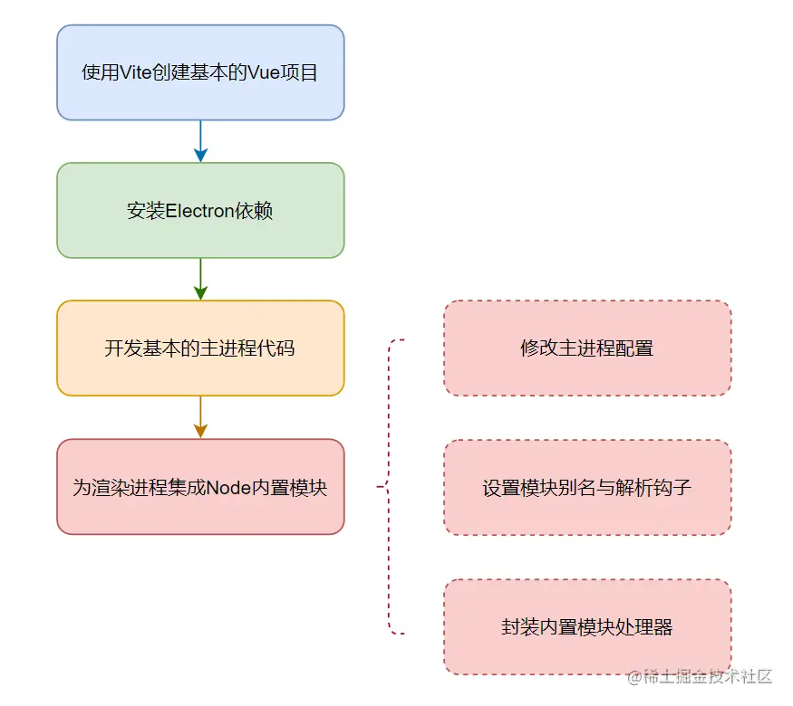
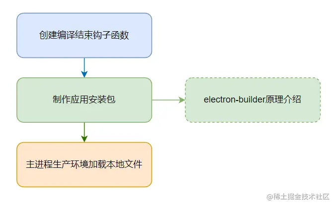

[项目地址](https://github.com/wenreq/Electron-V3)

## 1、开篇

**通过浏览器为用户提供服务太被动了**，用户主动来找你，你才可以为他提供服务；用户不找你，你就没有机会，也没有能力为用户提供服务。但，这是浏览器的本质，任谁也改变不了，要想解决这个问题，办法只有一个，那就是：`自己提供本地桌面应用`。

**Electron 内部封装了 Chromium 浏览器核心和 Node.js，而且还为开发者暴露出了很多必要的操作系统 API**。有了它，前端开发者就可以使用前端开发技术来开发桌面应用了。基于 Electron 开发应用不会遇到浏览器兼容性问题。

Vite，以另一种更现代化、更高效的技术方案实现了 Webpack 的大部分功能。它与 Webpack 的主要区别在于，使用 Vite 构建的开发环境，在**开发过程中不存在捆绑（bundle）过程**。源代码中的 import 语句会直接以 `script module` 的形式提供给浏览器，Vite 内置的开发服务会拦截模块请求并在必要时执行代码转换。例如，页面渲染一个名为 `component.vue` 的文件时，Vite 内置的开发服务会接到页面的请求，然后动态编译这个 `component.vue` 文件，再把编译结果响应给页面。

- 由于**不需要做捆绑**工作，服务器启动速度非常快。
- 代码是**按需编译**的，因此只编译当前界面上实际导入的代码。你不必等到整个应用被捆绑后才开始开发，这对于拥有非常多界面的应用来说是一个巨大的性能提升。
- 热更新（HMR）的性能与模块数量无关。这使得 HRM 始终快速，无论你的应用程序有多大。

## 2、Electron 是什么？可以做什么？

为了弥补 Node.js 和前端技术访问系统 API 方面的不足，这两个框架内部都对系统 API 做了封装，比如：系统对话框、系统托盘、系统菜单、剪切板等。

Electron 框架的内部原理图如下所示：


每个 Electron 都是由 1 个主进程、1 个或多个渲染进程组成的，开发者的主要工作就是完成主进程的逻辑和渲染进程的逻辑。

缺点：

1. 打包后的应用提交较大。
2. 版本发布过快。
3. 安全性问题。
4. 性能问题。

## 3、如何开发 Vite3 插件构建 Electron 开发环境？

如下几个步骤构建一个 Vite+Electron 的开发环境：



### 创建项目

`npm create vite@latest electron-jun-jin -- --template vue-ts`

`npm install electron -D`

### 创建主进程代码

创建主进程的入口程序：`src\main\mainEntry.ts`。

```ts
//src\main\mainEntry.ts
import { app, BrowserWindow } from "electron";

let mainWindow: BrowserWindow;

app.whenReady().then(() => {
  mainWindow = new BrowserWindow({});
  mainWindow.loadURL(process.argv[2]);
});
```

**`mainWindow` 被设置成一个全局变量，这样可以避免主窗口被 JavaScript 的垃圾回收器回收掉。**另外，窗口的所有配置都使用了默认的配置。

这个窗口加载了一个 Url 路径，这个路径是以命令行参数的方式传递给应用程序的，而且是命令行的第三个参数。

### 开发环境 Vite 插件

主进程的代码写好之后，只有编译过之后才能被 Electron 加载，我们是**通过 Vite 插件的形式来完成这个编译工作和加载工作**的，如下代码所示：

```ts
//plugins\devPlugin.ts
import { ViteDevServer } from "vite";
export let devPlugin = () => {
  return {
    name: "dev-plugin",
    configureServer(server: ViteDevServer) {
      require("esbuild").buildSync({
        entryPoints: ["./src/main/mainEntry.ts"],
        bundle: true,
        platform: "node",
        outfile: "./dist/mainEntry.js",
        external: ["electron"],
      });
      server.httpServer.once("listening", () => {
        let { spawn } = require("child_process");
        let addressInfo = server.httpServer.address();
        let httpAddress = `http://${addressInfo.address}:${addressInfo.port}`;
        let electronProcess = spawn(require("electron").toString(), ["./dist/mainEntry.js", httpAddress], {
          cwd: process.cwd(),
          stdio: "inherit",
        });
        electronProcess.on("close", () => {
          server.close();
          process.exit();
        });
      });
    },
  };
};
```

这是一个简单的 Vite 插件，在这个插件中我们注册了一个名为 configureServer 的钩子，**当 Vite 为我们启动 Http 服务的时候，`configureServer` 钩子会被执行**。

这个钩子的输入参数为一个类型为 `ViteDevServer` 的对象 `server`，这个对象持有一个 `http.Server` 类型的属性 `httpServer`，这个属性就代表着我们调试 Vue 页面的 http 服务，一般情况下地址为：`http://127.0.0.1:5173/`。

我们可以**通过监听 `server.httpServer` 的 `listening` 事件来判断 httpServer 是否已经成功启动**。如果已经成功启动了，那么就启动 Electron 应用，并给它传递两个命令行参数，第一个参数是主进程代码编译后的文件路径，第二个参数是 Vue 页面的 http 地址，这里就是 `http://127.0.0.1:5173/`。

为什么这里传递了两个命令行参数，而主进程的代码接收第三个参数（`process.argv[2]`）当作 http 页面的地址呢？因为**默认情况下 electron.exe 的文件路径将作为第一个参数**。也就是我们通过 `require("electron")` 获得的字符串。

> 这个路径一般是：`node_modules\electron\dist\electron.exe`，如果这个路径下没有对应的文件，说明你的 Electron 模块没有安装好。

我们是**通过 `Node.js` `child_process` 模块的 `spawn` 方法启动 `electron` 子进程的**，除了两个命令行参数外，还传递了一个配置对象。

这个对象的 `cwd` 属性用于设置当前的工作目录，`process.cwd()` 返回的值就是当前项目的根目录。`stdio` 用于设置 electron 进程的控制台输出，这里设置 `inherit` 可以让 electron 子进程的控制台输出数据同步到主进程的控制台。这样我们在主进程中 `console.log` 的内容就可以在 VSCode 的控制台上看到了。

当 electron 子进程退出的时候，我们要关闭 Vite 的 http 服务，并且控制父进程退出，准备下一次启动。

http 服务启动之前，我们**使用 `esbuild` 模块完成了主进程 TypeScript 代码的编译工作**，这个模块是 `Vite` 自带的，所以我们不需要额外安装，可以直接使用。

主进程的入口文件是通过 `entryPoints` 配置属性设置的，编译完成后的输出文件是通过 `outfile` 属性配置的。

编译平台 `platform` 设置为 `node`，排除的模块 `external` 设置为 `electron`，**正是这两个设置使我们在主进程代码中可以通过 `import` 的方式导入 electron 内置的模块**。非但如此，Node 的内置模块也可以通过 import 的方式引入。

这个 Vite 插件的代码编写好后，在 `vite.config.ts` 文件中引入一下就可以使用了，如下代码所示：

```ts
// vite.config.ts
import { defineConfig } from "vite";
import vue from "@vitejs/plugin-vue";
import { devPlugin } from "./plugins/devPlugin";

export default defineConfig({
  plugins: [devPlugin(), vue()],
});
```

现在执行命令 `npm run dev`，你会看到 Electron 应用加载了 Vue 的首页，如下图所示：

关闭窗口，主进程和子进程也会跟着退出。修改一下 Vue 组件里的内容，窗口内显示的内容也会跟着变化，说明热更新机制在起作用。

### 渲染进程集成内置模块

```ts
// src\main\mainEntry.ts
import { app, BrowserWindow } from "electron";
process.env.ELECTRON_DISABLE_SECURITY_WARNINGS = "true";
let mainWindow: BrowserWindow;

app.whenReady().then(() => {
  let config = {
    webPreferences: {
      nodeIntegration: true,
      webSecurity: false,
      allowRunningInsecureContent: true,
      contextIsolation: false,
      webviewTag: true,
      spellcheck: false,
      disableHtmlFullscreenWindowResize: true,
    },
  };
  mainWindow = new BrowserWindow(config);
  mainWindow.webContents.openDevTools({ mode: "undocked" });
  mainWindow.loadURL(process.argv[2]);
});
```

在这段代码中，有以下几点需要注意：

1. `ELECTRON_DISABLE_SECURITY_WARNINGS` 用于设置渲染进程开发者调式工具的警告，这里设置为 true 就不会再显示任何警告了。
2. `nodeIntegration` 配置项的作用是把 Node.js 环境集成到渲染进程中，`contextIsolation` 配置项的作用是在同一个 JavaScript 上下文中使用 Electron API。其他配置项与本文主旨无关，大家感兴趣的话可以自己翻阅官方文档。
3. `webContents` 的 `openDevTools` 方法用于打开开发者调试工具

完成这些工作后我们就可以在开发者调试工具中访问 Node.js 和 Electron 的内置模块了。

### 设置 Vite 模块别名与模块解析钩子

虽然我们可以在开发者调试工具中使用 Node.js 和 Electron 的内置模块，但现在还不能在 Vue 的页面内使用这些模块。

这是因为 Vite 主动屏蔽了这些内置的模块，如果开发者强行引入它们，那么大概率会得到如下报错：

```rust
Module "xxxx" has been externalized for browser compatibility and cannot be accessed in client code.
```

接下去我们就介绍如何让 Vite 加载 Electron 的内置模块和 Node.js 的内置模块。

首先我们为工程安装一个 Vite 组件：[vite-plugin-optimizer](https://github.com/vite-plugin/vite-plugin-optimizer)。

`npm i vite-plugin-optimizer -D`

然后修改 vite.config.ts 的代码，让 Vite 加载这个插件，如下代码所示：

```ts
// vite.config.ts
import { defineConfig } from "vite";
import vue from "@vitejs/plugin-vue";
import { devPlugin, getReplacer } from "./plugins/devPlugin";
import optimizer from "vite-plugin-optimizer";

export default defineConfig({
  plugins: [optimizer(getReplacer()), devPlugin(), vue()],
});
```

**vite-plugin-optimizer 插件会为你创建一个临时目录：node_modules.vite-plugin-optimizer。**

然后把类似 `const fs = require('fs'); export { fs as default }` 这样的代码写入这个目录下的 fs.js 文件中。

渲染进程执行到：`import fs from "fs"` 时，就会请求这个目录下的 fs.js 文件，这样就达到了在渲染进程中引入 Node 内置模块的目的。

`getReplacer` 方法是我们为 `vite-plugin-optimizer` 插件提供的内置模块列表。代码如下所示：

```ts
// plugins\devPlugin.ts
export let getReplacer = () => {
  let externalModels = ["os", "fs", "path", "events", "child_process", "crypto", "http", "buffer", "url", "better-sqlite3", "knex"];
  let result = {};
  for (let item of externalModels) {
    result[item] = () => ({
      find: new RegExp(`^${item}$`),
      code: `const ${item} = require('${item}');export { ${item} as default }`,
    });
  }
  result["electron"] = () => {
    let electronModules = ["clipboard", "ipcRenderer", "nativeImage", "shell", "webFrame"].join(",");
    return {
      find: new RegExp(`^electron$`),
      code: `const {${electronModules}} = require('electron');export {${electronModules}}`,
    };
  };
  return result;
};
```

我们在这个方法中把一些常用的 Node 模块和 electron 的内置模块提供给了 `vite-plugin-optimizer` 插件，以后想要增加新的内置模块只要修改这个方法即可。而且 **`vite-plugin-optimizer` 插件不仅用于开发环境，编译 Vue 项目时，它也会参与工作**。

再次运行你的应用，看看现在渲染进程是否可以正确加载内置模块了呢？你可以通过如下代码在 Vue 组件中做这项测试：

```ts
//src\App.vue
import fs from "fs";
import { ipcRenderer } from "electron";
import { onMounted } from "vue";
onMounted(() => {
  console.log(fs.writeFileSync);
  console.log(ipcRenderer);
});
```

### 总结

现在我们迈出了万里长征的第一步，**构建好了 Vue3+Vite3+Electron 的开发环境** ，而且完成这项工作并`不依赖于市面上任何一个现成的构建工具`，这个开发环境是我们自己动手一点一点搭起来的，以后我们想增加或者修改一项功能，都可以很从容地自己动手处理。

非但如此，我们还通过本讲内容向你介绍了 Vite 插件的`开发技巧`和如何创建一个简单的 Electron 应用等知识。下一讲我们将在本节课的基础上，进一步介绍如何使用 Vite 插件制作 Electron 应用的安装包。

## 4、如何引入 Vite3 插件打包 Electron 应用？

本节课我将按照如下几个步骤带领大家制作 Vite 打包 Electron 应用的插件：



### 创建编译结束钩子函数

首先我们为 vite.config.ts 增加一个新的配置节，如下代码所示：

```ts
//vite.config.ts
//import { buildPlugin } from "./plugins/buildPlugin";
build: {
    rollupOptions: {
        plugins: [buildPlugin()],
    },
},
```

其中，buildPlugin 方法的代码如下：

```ts
//plugins\buildPlugin.ts
export let buildPlugin = () => {
  return {
    name: "build-plugin",
    closeBundle: () => {
      let buildObj = new BuildObj();
      buildObj.buildMain();
      buildObj.preparePackageJson();
      buildObj.buildInstaller();
    },
  };
};
```

这是一个**标准的 Rollup 插件**（Vite 底层就是 Rollup，所以 Vite 兼容 Rollup 的插件），我们在这个插件中注册了 `closeBundle` 钩子。

在 Vite 编译完代码之后（也就是我们执行 `npm run build` 指令，而且这个指令的工作完成之后），这个钩子会被调用。我们在这个钩子中完成了安装包的制作过程。

### 制作应用安装包

Vite 编译完成之后，将在项目 dist 目录内会生成一系列的文件（如下图所示），此时 `closeBundle` 钩子被调用，我们在这个钩子中把上述生成的文件打包成一个应用程序安装包。

这些工作是通过一个名为 `buildObj` 的对象完成的，它的代码如下所示：

```ts
//plugins\buildPlugin.ts
import path from "path";
import fs from "fs";

class BuildObj {
  //编译主进程代码
  buildMain() {
    require("esbuild").buildSync({
      entryPoints: ["./src/main/mainEntry.ts"],
      bundle: true,
      platform: "node",
      minify: true,
      outfile: "./dist/mainEntry.js",
      external: ["electron"],
    });
  }
  //为生产环境准备package.json
  preparePackageJson() {
    let pkgJsonPath = path.join(process.cwd(), "package.json");
    let localPkgJson = JSON.parse(fs.readFileSync(pkgJsonPath, "utf-8"));
    let electronConfig = localPkgJson.devDependencies.electron.replace("^", "");
    localPkgJson.main = "mainEntry.js";
    delete localPkgJson.scripts;
    delete localPkgJson.devDependencies;
    localPkgJson.devDependencies = { electron: electronConfig };
    let tarJsonPath = path.join(process.cwd(), "dist", "package.json");
    // 安装这些依赖
    fs.writeFileSync(tarJsonPath, JSON.stringify(localPkgJson));
    fs.mkdirSync(path.join(process.cwd(), "dist/node_modules"));
  }
  //使用electron-builder制成安装包
  buildInstaller() {
    //收集应用程序的配置信息
    let options = {
      config: {
        directories: {
          output: path.join(process.cwd(), "release"),
          app: path.join(process.cwd(), "dist"),
        },
        files: ["**"],
        extends: null,
        productName: "JueJin",
        appId: "com.juejin.desktop",
        asar: true, // 把输出目录下的文件合并成一个 asar 文件。
        nsis: {
          oneClick: true,
          perMachine: true,
          allowToChangeInstallationDirectory: false,
          createDesktopShortcut: true,
          createStartMenuShortcut: true,
          shortcutName: "juejinDesktop",
        },
        publish: [{ provider: "generic", url: "http://localhost:5500/" }],
      },
      project: process.cwd(),
    };
    return require("electron-builder").build(options);
  }
}
```

这个对象通过三个方法提供了三个功能，按照这三个方法的执行顺序我们一一介绍它们的功能。

1. `buildMain`。由于 Vite 在编译之前会清空 dist 目录，所以我们在上一节生成的 mainEntry.js 文件也被删除了，此时我们通过 `buildMain` 方法再次编译主进程的代码。不过由于此处是为生成环境编译代码，所以我们增加了 `minify: true` 配置，生成压缩后的代码。如果你希望与开发环境复用编译进程的代码，也可以把这一部分代码抽象成一个独立的方法。
2. `preparePackageJson`。用户安装我们的产品后，在**启动我们的应用程序时，实际上是通过 Electron 启动一个 Node.js 的项目**，所以我们要为这个项目准备一个 package.json 文件，这个文件是以当前项目的 package.json 文件为蓝本制作而成的。里面注明了主进程的入口文件，移除了一些对最终用户没用的配置节。
> 生成完 package.json 文件之后，还创建了一个 node_modules 目录。此举是为了阻止 electron-builder 的一些默认行为

> 这段脚本还明确指定了 Electron 的版本号，如果 Electron 的版本号前面有"^"符号的话，需把它删掉。这是 electron-builder 的一个 Bug，这个 bug 导致 electron-builder 无法识别带 ^ 或 ~ 符号的版本号。
3. `buildInstaller` 这个方法负责调用 `electron-builder` 提供的 API 以生成安装包。最终生成的安装包被放置在 `release` 目录下，这是通过 `config.directories.output` 指定的。静态文件所在目录是通过 `config.directories.app` 配置项指定。其他配置项，请自行查阅[官网文档](https://www.electron.build/)。
> 在真正创建安装包之前，你应该已经成功通过 `npm install electron-builder -D` 安装了 electron-builder 库。

做好这些配置之后，执行npm run build就可以制作安装包了，最终生成的安装文件会被放置到 release 目录下。

### electron-builder 原理

你如果不了解 `electron-builder` 原理的话，可能会觉得奇怪：为什么执行 `require("electron-builder").build(options)` 就会为我们生成应用程序的安装包呢？

所以，接下来我们得介绍一下 electron-builder 背后为我们做了什么工作。

首先 `electron-builder` 会**收集应用程序的配置信息**。比如应用图标、应用名称、应用 id、附加资源等信息。有些配置信息可能开发者并没有提供，这时 `electron-builder` 会使用默认的值，总之，这一步工作完成后，会生成一个全量的配置信息对象用于接下来的打包工作。

接着 electron-builder 会检查我们在输出目录下准备的 package.json 文件，查看其内部是否存在 dependencies 依赖，如果存在，electron-builder 会帮我们在输出目录下安装这些依赖。

然后 electron-builder 会根据用户配置信息：asar 的值为 true 或 false，来判断是否需要把输出目录下的文件合并成一个 asar 文件。

然后 electron-builder 会把 Electron 可执行程序及其依赖的动态链接库及二进制资源拷贝到安装包生成目录下的 win-ia32-unpacked 子目录内。

然后 electron-builder 还会检查用户是否在配置信息中指定了 extraResources 配置项，如果有，则把相应的文件按照配置的规则，拷贝到对应的目录中。

然后 electron-builder 会根据配置信息使用一个二进制资源修改器修改 electron.exe 的文件名和属性信息（版本号、版权信息、应用程序的图标等）。

如果开发者在配置信息中指定了签名信息，那么接下来 electron-builder 会使用一个应用程序签名工具来为可执行文件签名。

接着 electron-builder 会使用 7z 压缩工具，把子目录 win-ia32-unpacked 下的内容压缩成一个名为 yourProductName-1.3.6-ia32.nsis.7z 的压缩包。

接下来 electron-builder 会使用 NSIS 工具生成卸载程序的可执行文件，这个卸载程序记录了 win-ia32-unpacked 目录下所有文件的相对路径，当用户卸载我们的应用时，卸载程序会根据这些相对路径删除我们的文件，同时它也会记录一些安装时使用的注册表信息，在卸载时清除这些注册表信息。

最后 electron-builder 会使用 NSIS 工具生成安装程序的可执行文件，然后把压缩包和卸载程序当作资源写入这个安装程序的可执行文件中。当用户执行安装程序时，这个可执行文件会读取自身的资源，并把这些资源释放到用户指定的安装目录下。

> 如果开发者配置了签名逻辑，则 electron-builder 也会为安装程序的可执行文件和卸载程序的可执行文件进行签名。

至此，一个应用程序的安装包就制作完成了。这就是 electron-builder 在背后为我们做的工作。

### 主进程生成环境加载本地文件

虽然我们成功制作了安装包，而且这个安装包可以正确安装我们的应用程序，但是这个应用程序无法正常启动，这是因为应用程序的主进程还在通过 `process.argv[2]` 加载首页。显然用户通过安装包安装的应用程序没有这个参数。

所以，接下来**我们就要让应用程序在没有这个参数的时候，也能加载我们的静态页面**。

首先创建一个新的代码文件：`src\main\CustomScheme.ts`，为其创建如下代码：

```ts
//src\main\CustomScheme.ts
import { protocol } from "electron";
import fs from "fs";
import path from "path";

//为自定义的app协议提供特权
let schemeConfig = { standard: true, supportFetchAPI: true, bypassCSP: true, corsEnabled: true, stream: true };
protocol.registerSchemesAsPrivileged([{ scheme: "app", privileges: schemeConfig }]);

export class CustomScheme {
  //根据文件扩展名获取mime-type
  private static getMimeType(extension: string) {
    let mimeType = "";
    if (extension === ".js") {
      mimeType = "text/javascript";
    } else if (extension === ".html") {
      mimeType = "text/html";
    } else if (extension === ".css") {
      mimeType = "text/css";
    } else if (extension === ".svg") {
      mimeType = "image/svg+xml";
    } else if (extension === ".json") {
      mimeType = "application/json";
    }
    return mimeType;
  }
  //注册自定义app协议
  static registerScheme() {
    // 为名为 app 的 scheme 注册了一个回调函数。当我们加载类似app://index.html这样的路径时，这个回调函数将被执行。
    protocol.registerStreamProtocol("app", (request, callback) => {
      let pathName = new URL(request.url).pathname;
      let extension = path.extname(pathName).toLowerCase();
      if (extension == "") {
        pathName = "index.html";
        extension = ".html";
      }
      let tarFile = path.join(__dirname, pathName);
      callback({
        statusCode: 200,
        headers: { "content-type": this.getMimeType(extension) },
        data: fs.createReadStream(tarFile),
      });
    });
  }
}
```

这段代码在主进程app ready前，通过 protocol 对象的 registerSchemesAsPrivileged 方法为名为 app 的 scheme 注册了特权（可以使用 FetchAPI、绕过内容安全策略等）。

在app ready之后，通过 protocol 对象的 registerStreamProtocol 方法为名为 app 的 scheme 注册了一个回调函数。当我们加载类似app://index.html这样的路径时，这个回调函数将被执行。

这个函数有两个传入参数 request 和 callback，我们可以通过 request.url 获取到请求的文件路径，可以通过 callback 做出响应。

给出响应时，要指定响应的 statusCode 和 content-type，这个 content-type 是通过文件的扩展名得到的。这里我们通过 getMimeType 方法确定了少量文件的 content-type，如果你的应用要支持更多文件类型，那么可以扩展这个方法。

响应的 data 属性为目标文件的可读数据流。这也是为什么我们用 registerStreamProtocol 方法注册自定义协议的原因。当你的静态文件比较大时，不必读出整个文件再给出响应。

接下来在 `src\main\mainEntry.ts` 中使用这段代码，如下所示：

```ts
//src\main\mainEntry.ts
if (process.argv[2]) {
  mainWindow.loadURL(process.argv[2]);
} else {
  CustomScheme.registerScheme();
  mainWindow.loadURL(`app://index.html`);
}
```

这样当存在指定的命令行参数时，我们就认为是开发环境，使用命令行参数加载页面，当不存在命令行参数时，我们就认为是生产环境，通过app:// scheme 加载页面。

再次打包、安装你的应用程序，看这次是不是可以正常运行了呢？

> 如果你不希望在开发环境中通过命令行参数的形式传递信息，那么你也可以在上一节介绍的代码中，为electronProcess 附加环境变量（使用spawn方法第三个参数的env属性附加环境变量）。

### 总结

本节我们通过 Vite 插件（实际上是 Rollup 插件）开发了制作应用程序安装包的功能，而且还粗略介绍了 electron-builder 的原理。

本节介绍的知识虽然有一些技巧性，但还称不上完美，我们将在后续的章节中进一步完善这部分的知识，但现在还不是时候，为了让大家尽快了解 Vue3+Electron 的开发乐趣，我们将在下一章介绍如何使用 vue-router 管控工程架构。

## 5、如何引入 vue-router 及控制工程架构？

### 设计工程结构

在继续引入新的模块或组件之前，我们先调整一下工程的结构，如下图所示：


这个工程结构从上到下主要目录的含义如下。

- dist 目录是我们打包过程的临时产物放置目录。
- plugins 目录放置我们的开发环境 Vite 插件和打包 Vite 插件。
- release 目录放置最终生成的安装包。
- resource 目录放置一些外部资源，比如应用程序图标、第三方类库等。
- src/common 目录放置主进程和渲染进程都会用到的公共代码，比如日期格式化的工具类、数据库访问工具类等，主进程和渲染进程的代码都有可能使用这些- 类。
- src/main 目录放置主进程的代码。
- src/model 目录放置应用程序的模型文件，比如消息类、会话类、用户设置类等，主进程和渲染进程的代码都有可能使用这些类。
- src/renderer 目录放置渲染进程的代码。
- src/renderer/assets 放置字体图标、公共样式、图片等文件。
- src/renderer/Component 放置公共组件，比如标题栏组件、菜单组件等。
- src/renderer/store 目录存放 Vue 项目的数据状态组件，用于在不同的 Vue 组件中共享数据。
- src/renderer/Window 目录存放不同窗口的入口组件，这些组件是通过 vue-router 导航的，这个目录下的子目录存放对应窗口的子组件。
- src/renderer/App.vue 是渲染进程的入口组件，这个组件内只有一个用于导航到不同的窗口。
- src/renderer/main.ts 是渲染进程的入口脚本。
- index.html 是渲染进程的入口页面。
- vite.config.ts 是 Vite 的配置文件。

调整好工程结构后，要修改一下 index.html 的代码才能让这些调整生效。实际上就是修改一下渲染进程入口脚本的引入路径，如下代码所示：

```html
<script type="module" src="/src/renderer/main.ts"></script>
```

### 使用 vue-router 支持工程管控策略

`npm install vue-router@4 -D`

安装完成后，为 src/renderer/router.ts 添加如下代码逻辑：

```ts
//src/renderer/router.ts
import * as VueRouter from "vue-router";
//路由规则描述数组
const routes = [
  { path: "/", redirect: "/WindowMain/Chat" },
  {
    path: "/WindowMain",
    component: () => import("./Window/WindowMain.vue"),
    children: [
      { path: "Chat", component: () => import("./Window/WindowMain/Chat.vue") },
      { path: "Contact", component: () => import("./Window/WindowMain/Contact.vue") },
      { path: "Collection", component: () => import("./Window/WindowMain/Collection.vue") },
    ],
  },
  {
    path: "/WindowSetting",
    component: () => import("./Window/WindowSetting.vue"),
    children: [{ path: "AccountSetting", component: () => import("./Window/WindowSetting/AccountSetting.vue") }],
  },
  {
    path: "/WindowUserInfo",
    component: () => import("./Window/WindowUserInfo.vue"),
  },
];
//导出路由对象
export let router = VueRouter.createRouter({
  history: VueRouter.createWebHistory(),
  routes,
});
```

这段代码导出了一个 router 对象，这个 router 对象是基于 WebHistory 模式创建路由的，也就是说我们的页面路径看起来是这样的：`http://127.0.0.1:5173/WindowMain/PageChat`（开发环境），`app://index.html/WindowMain/PageChat`（生产环境）。使用 WebHistory 模式创建路由可以与我们前一节中讲解的 CustomScheme 兼容得很好。

上述代码中 routes 数组里的内容就是导航的具体配置了，我们在这些配置中使用 import 方法动态引入 Vue 组件，**Vite 在处理这种动态引入的组件时，会把对应的组件编译到独立的源码文件中**，类似 WindowUserInfo.689249b8.js 和 WindowSetting.6354f6d6.js，这种编译策略可以帮助我们很好控制最终编译产物的大小，避免应用启动时就加载一个庞大的 JavaScript 文件。

在应用启动时请求的路径是："/"，这个路径被重定向到"/WindowMain/Chat"，也就是说 WindowMain 组件和 Chat 组件是我们的首页组件（这是在第一个导航配置对象中设置的）。

上述代码完成后，需要在 main.ts 中使用它，代码如下：

```ts
import { router } from "./router";
createApp(App).use(router).mount("#app");
```

接下来把 App.vue 的代码修改成如下内容：

```html
<template>
  <router-view />
</template>
```

这样应用启动时，第一个窗口（主窗口）就会加载 src\renderer\Window\WindowMain.vue 组件的代码了。

当我们在主窗口内打开别的子窗口时（弹出一个子窗口），只要加载类似这样的路径/WindowUserInfo，就可以让子窗口加载 src\renderer\Window\WindowUserInfo.vue 这个组件了。

大家有没有发现，无论工程将来增加什么业务，我们只要创建对应的业务组件，并添加对应的路由配置，就可以按照工程管控策略来管控我们的工程了，这就是 vue-router 带给我们的好处。

创建了路由对象，我们还要使用这个路由对象，让用户也有权力控制应用内组件的加载逻辑，接下来我们就介绍这部分知识。

### 菜单组件及路由跳转

如果你仔细看了我们的的项目结构图，那么你会发现 src\renderer\Component 目录下有一个名为 BarLeft.vue 的组件，这是整个应用的侧边栏组件，里面放置应用程序的菜单。它的代码如下所示：

```ts
<script setup lang="ts">
//src\renderer\Component\BarLeft.vue
import { ref, watch } from "vue";
import { useRoute } from "vue-router";
//菜单列表数组
let mainWindowRoutes = ref([
  { path: `/WindowMain/Chat`, isSelected: true, icon: `icon-chat`, iconSelected: `icon-chat` },
  { path: `/WindowMain/Contact`, isSelected: false, icon: `icon-tongxunlu1`, iconSelected: `icon-tongxunlu` },
  { path: `/WindowMain/Collection`, isSelected: false, icon: `icon-shoucang1`, iconSelected: `icon-shoucang` },
]);
let route = useRoute();
//注册路由变化监听器
watch(
  () => route,
  () => mainWindowRoutes.value.forEach((v) => (v.isSelected = v.path === route.fullPath)),
  {
    immediate: true,
    deep: true,
  }
);
</script>
```

```html
<template>
  <div class="BarLeft">
    <div class="userIcon">
      
    </div>
    <div class="menu">
      <router-link v-for="item in mainWindowRoutes" :to="item.path" :class="[`menuItem`, { selected: item.isSelected }]">
        <i :class="[`icon`, item.isSelected ? item.iconSelected : item.icon]"></i>
      </router-link>
    </div>
    <div class="setting">
      <div class="menuItem">
        <i class="icon icon-setting"></i>
      </div>
    </div>
  </div>
</template>
```

这段代码有以下几点需要注意。

- 样式为 menu 的 Div 用于存放主窗口的菜单，我们是通过 mainWindowRoutes 数组里的数据来渲染这里的菜单。
- router-link 组件会被渲染成 a 标签，当用户点击菜单时，主窗口的二级路由发生跳转（src\renderer\Window\WindowMain.vue）。下面是主窗口的 html 代码：

```html
<template>
  <BarLeft />
  <div class="pageBox">
    <router-view />
  </div>
</template>
```

- 我们通过 watch 方法监控了路由跳转的行为，当路由跳转后，我们会遍历 mainWindowRoutes 数组内的对象，取消以前选中的菜单，选中新的菜单。
- 由于 mainWindowRoutes 是一个 Ref 对象，所以菜单被选中或取消选中之后，相应的菜单样式（和菜单内的字体图标）也会跟着变化。

### 引入字体图标及避免文件编译

第一点，**引入必要的字体图标文件**。 iconfont 默认会为我们生成很多字体图标文件，但这些文件都是为了兼容不同的浏览器准备的，Electron 使用 Chromium 核心，所以没必要把所有这些文件都集成到应用中。一般情况下我只使用 `iconfont.css` 和 `iconfont.ttf` 这两个文件。把这两个文件放置到项目中后，在 main.ts 导入一下 `iconfont.css` 即可全局使用字体图标了。代码如下：

```ts
//src\renderer\main.ts
//全局导入字体图标
import "./assets/icon/iconfont.css";
```

```html
<!--使用字体图标-->
<i class="icon icon-chat"></i>
```

第二点，**关闭小文件编译的行为**。如果你的 iconfont.ttf 足够小，那么 Vite 会把它转义成 base64 编码的字符串，直接嵌入到我们的样式文件中。Vite 之所以这样做，主要是为了减少请求数量。但我们的应用是本地应用，每个请求都会在极短的时间内完成，所以**没必要为了减少请求数量而增加单个文件的解析开销**，开发者可以通过在 vite.config.ts 中增加 build.assetsInlineLimit 配置（值设置为 0 即可）来关闭 Vite 的这个行为。

## 6、如何管控应用的窗口（上）

### 什么时候显示主窗口

主窗口对象 `mainWindow` 初始化时，把配置属性 `show` 设置为 `false`，就可以让主窗口初始化成功后处于隐藏状态。接下来再在合适的时机让渲染进程控制主窗口显示出来即可。这里我们在 `WindowMain.vue` 组件渲染完成之后来完成这项工作，如下代码所示，`showWindow` 事件是在我们上一节讲的 `CommonWindowEvent` 类注册的。

```ts
// src\renderer\Window\WindowMain.vue
import { ipcRenderer } from "electron";
import { onMounted } from "vue";
onMounted(() => {
  ipcRenderer.invoke("showWindow");
});
```

### 自定义窗口标题栏

与菜单组件 `BarLeft.vue` 同级目录下还有一个组件名为 `BarTop.vue`，这是我们为窗口设计的标题栏组件。这个组件的代码如下所示：

```ts
<script setup lang="ts">
import { onMounted, ref, onUnmounted } from "vue";
import { ipcRenderer } from "electron";
defineProps<{ title?: string }>();
let isMaximized = ref(false);
//关闭窗口
let closeWindow = () => {
  ipcRenderer.invoke("closeWindow");
};
//最大化窗口
let maxmizeMainWin = () => {
  ipcRenderer.invoke("maxmizeWindow");
};
//最小化窗口
let minimizeMainWindow = () => {
  ipcRenderer.invoke("minimizeWindow");
};
//还原窗口
let unmaximizeMainWindow = () => {
  ipcRenderer.invoke("unmaximizeWindow");
};
//窗口最大化事件
let winMaximizeEvent = () => {
  isMaximized.value = true;
};
//窗口取消最大化事件
let winUnmaximizeEvent = () => {
  isMaximized.value = false;
};
onMounted(() => {
  ipcRenderer.on("windowMaximized", winMaximizeEvent);
  ipcRenderer.on("windowUnmaximized", winUnmaximizeEvent);
});
onUnmounted(() => {
  ipcRenderer.off("windowMaximized", winMaximizeEvent);
  ipcRenderer.off("windowUnmaximized", winUnmaximizeEvent);
});
</script>
```

```html
<template>
  <div class="topBar">
    <div class="winTitle">{{ title }}</div>
    <div class="winTool">
      <div @click="minimizeMainWindow">
        <i class="icon icon-minimize" />
      </div>
      <div v-if="isMaximized" @click="unmaximizeMainWindow">
        <i class="icon icon-restore" />
      </div>
      <div v-else @click="maxmizeMainWin">
        <i class="icon icon-maximize" />
      </div>
      <div @click="closeWindow">
        <i class="icon icon-close" />
      </div>
    </div>
  </div>
</template>
```

```css
.topBar {
  display: flex;
  height: 25px;
  line-height: 25px;
  -webkit-app-region: drag; /* 可拖拽区域 */
  width: 100%;
}
.winTitle {
  flex: 1;
  padding-left: 12px;
  font-size: 14px;
  color: #888;
}
.winTool {
  height: 100%;
  display: flex;
  -webkit-app-region: no-drag; /* 可拖拽区域内的不可拖拽区域 */
}
.winTool div {
  height: 100%;
  width: 34px;
  text-align: center;
  color: #999;
  cursor: pointer;
  line-height: 25px;
}
.winTool .icon {
  font-size: 10px;
  color: #666666;
  font-weight: bold;
}
.winTool div:hover {
  background: #efefef;
}
.winTool div:last-child:hover {
  background: #ff7875;
}
.winTool div:last-child:hover i {
  color: #fff !important;
}
```

以上代码有以下几点需要注意。

- 要想自定义一个窗口的标题栏必须把窗口默认的标题栏取消掉才行。只要我们在初始化 `mainWindow` 对象时（主进程里的逻辑），把窗口配置对象的`frame`属性设置为`false`就可以使这个窗口成为无边框窗口了。
- 窗口标题是通过 props 数据传递给标题栏组件的，也就是说标题栏的标题是由其父组件来确定的。
- 标题栏中可拖拽区域是通过样式`-webkit-app-region: drag`定义的，鼠标在这个样式定义的组件上拖拽可以移动窗口，双击可以放大或者还原窗口，如果这个组件内有子组件不希望拥有该能力，可以通过`-webkit-app-region: no-drag`;取消此能力。
- 最大化、最小化、还原、关闭窗口等按钮的点击事件，都是通过`ipcRenderer.invoke`方法来调用主进程`CommonWindowEvent`类提供的消息管道来实现对应的功能的，这个类的代码稍后会介绍。
- 由于窗口最大化（或还原）不一定是通过点击最大化按钮（或还原按钮）触发的，有可能是通过双击标题栏可拖拽区域触发的，所以这里我们只能通过`ipcRenderer.on`来监听窗口的最大化或还原事件，以此来改变对应的最大化或还原按钮的显隐状态。不能在按钮点击事件中来完成这项工作。`windowMaximized`消息和`windowUnmaximized`消息也是由主进程的`CommonWindowEvent`类发来的。
- 由于多个二级路由页面会引用`BarTop.vue`，为了避免在切换路由的时候，反复通过`ipcRenderer.on`注册消息监听器，所以我们在组件的`onUnmounted`事件内注销了消息监听器，避免事件泄漏。

`CommonWindowEvent`类的实现代码如下所示：

```ts
//src\main\CommonWindowEvent.ts
import { BrowserWindow, ipcMain, app } from "electron";
// 主进程公共消息处理逻辑
export class CommonWindowEvent {
  private static getWin(event: any) {
    return BrowserWindow.fromWebContents(event.sender);
  }
  public static listen() {
    ipcMain.handle("minimizeWindow", (e) => {
      this.getWin(e)?.minimize();
    });

    ipcMain.handle("maxmizeWindow", (e) => {
      this.getWin(e)?.maximize();
    });

    ipcMain.handle("unmaximizeWindow", (e) => {
      this.getWin(e)?.unmaximize();
    });

    ipcMain.handle("hideWindow", (e) => {
      this.getWin(e)?.hide();
    });

    ipcMain.handle("showWindow", (e) => {
      this.getWin(e)?.show();
    });

    ipcMain.handle("closeWindow", (e) => {
      this.getWin(e)?.close();
    });
    ipcMain.handle("resizable", (e) => {
      return this.getWin(e)?.isResizable();
    });
    ipcMain.handle("getPath", (e, name: any) => {
      return app.getPath(name);
    });
  }
  //主进程公共事件处理逻辑
  public static regWinEvent(win: BrowserWindow) {
    win.on("maximize", () => {
      win.webContents.send("windowMaximized");
    });
    win.on("unmaximize", () => {
      win.webContents.send("windowUnmaximized");
    });
  }
}
```

上述代码中`listen`方法和`regWinEvent`方法都是静态的，所以可以直接在类型上调用这个方法：`CommonWindowEvent.listen()`;（不用实例化这个类，可以直接使用类型调用这个方法），由于`listen`方法是静态的，而`listen`方法内部又调用了`getWin`私有方法，所以`getWin`方法也应该是静态的。

我们在`listen`方法内部注册了一系列消息管道，方便渲染进程控制主进程的一些行为，标题栏组件的窗口的最大化、最小化、还原等功能都是在这里实现的。在 `app ready` 之后调用`CommonWindowEvent.listen()`;这个方法即可注册这些消息管道。

`regWinEvent`方法负责为窗口对象注册事件，当窗口最大化或还原后，这些事件的处理函数负责把消息发送给渲染进程。标题栏的对应按钮的图标也会发生相应的变化，同样也是在 `app ready` 之后调用`CommonWindowEvent.regWinEvent(mainWindow)`;这个方法即可。

### 窗口池解决方案

对于重要资源的管控，软件世界很早就有应对方案，比如：线程池和数据库的连接池，按照这个思路，我们可以**创建一个窗口池**来解决这个问题。

这个方案有以下三个缺点。

1. 无法优化整个应用的第一个窗口。
2. 系统内部始终会有 1 到 2 个隐藏窗口处于待命状态，这无形中增加了用户的内存消耗。
3. 虽然这个方案看上去逻辑比较简单，但要控制好所有的细节（比如，窗口间的通信、界面代码如何控制窗口的外观、如何实现模态子窗口等）还是非常繁琐的。

## 7、如何管控应用的窗口（下）

### window.open 解决方案

Electron 允许渲染进程通过 `window.open` 打开一个新窗口，但这需要一些额外的配置。

首先需要为主窗口的 `webContents` 注册 `setWindowOpenHandler` 方法。

```ts
//src\main\CommonWindowEvent.ts
mainWindow.webContents.setWindowOpenHandler((param) => {
  return { action: "allow", overrideBrowserWindowOptions: yourWindowConfig };
});
```

我们在上面的代码中使用`setWindowOpenHandler`方法的回调函数返回一个对象，这个对象中`action: "allow"`代表允许窗口打开，如果你想阻止窗口打开，那么只要返回`{action: "deny"}`即可。

返回对象的`overrideBrowserWindowOptions`属性的值是被打开的新窗口的配置对象。

在渲染进程中打开子窗口的代码如下所示:

```ts
//src\renderer\Component\BarLeft.vue
window.open(`/WindowSetting/AccountSetting`);
```

`window.open` 打开新窗口之所以速度非常快，是因为用**这种方式创建的新窗口不会创建新的进程**。这也就意味着一个窗口崩溃会拖累其他窗口跟着崩溃（主窗口不受影响）。

使用`window.open`打开的新窗口还有一个问题，这类窗口在关闭之后虽然会释放掉大部分内存，但**有一小部分内存无法释放**（无论你打开多少个子窗口，全部关闭之后总会有那么固定的一小块内存无法释放），这与窗口池方案的内存损耗相当。

同样使用这个方案也无法优化应用的第一个窗口的创建速度。而且 `<webview>` 和 `BrowserView` 慢的问题无法使用这个方案解决（这类需求还是应该考虑“池”方案）。

但是**通过`window.open`打开的新窗口更容易控制**，这是这个方案最大的优点。接下来我们就介绍如何使用这个方案控制子窗口。

### 子窗口的标题栏消息

在上一节中，我们自定义了主窗口的标题栏`BarTop.vue`，我们知道标题栏组件需要监听主进程发来的`windowMaximized`消息和`windowUnmaximized`消息，子窗口当然也希望复用这个组件，然而子窗口的窗口对象是在 Electron 内部创建的，不是我们开发者创建的，没有子窗口的窗口对象，我们该如何使用上一节介绍的`regWinEvent`方法为子窗口注册最大化和还原事件呢？

这就需要用到 app 对象的`browser-window-created`事件，代码如下：

```ts
//src\main\mainEntry.ts
app.on("browser-window-created", (e, win) => {
  CommonWindowEvent.regWinEvent(win);
});
```

每当有一个窗口被创建成功后，这个事件就会被触发，主窗口和使用`window.open`创建的子窗口都一样，所以之前我们为主窗口注册事件的代码 `CommonWindowEvent.regWinEvent(mainWindow)`也可以删掉了。这个事件的第二个参数就是窗口对象。

### 动态设置子窗口的配置

虽然我们可以在渲染进程中用 `window.open` 方法打开一个子窗口，但这个子窗口的配置信息目前还是在主进程中设置的（`overrideBrowserWindowOptions`），大部分时候我们要根据渲染进程的要求来改变子窗口的配置，所以最好的办法是**由渲染进程来设置这些配置信息**。

我们为上一节介绍的`CommonWindowEvent`类的`regWinEvent`方法增加一段逻辑，代码如下：

```ts
//src\main\CommonWindowEvent.ts
//注册打开子窗口的回调函数
win.webContents.setWindowOpenHandler((param) => {
  //基础窗口配置对象
  let config = {
    frame: false,
    show: true,
    webPreferences: {
      nodeIntegration: true,
      webSecurity: false,
      allowRunningInsecureContent: true,
      contextIsolation: false,
      webviewTag: true,
      spellcheck: false,
      disableHtmlFullscreenWindowResize: true,
      nativeWindowOpen: true,
    },
  };
  //开发者自定义窗口配置对象
  let features = JSON.parse(param.features);
  for (let p in features) {
    if (p === "webPreferences") {
      for (let p2 in features.webPreferences) {
        config.webPreferences[p2] = features.webPreferences[p2];
      }
    } else {
      config[p] = features[p];
    }
  }
  if (config["modal"] === true) config.parent = win;
  //允许打开窗口，并传递窗口配置对象
  return { action: "allow", overrideBrowserWindowOptions: config };
});
```

在这段代码中，config对象和主窗口的config对象基本上是一样的，所以最好把它抽象出来，我们这里为了演示方便没做这个工作。

param参数的features属性是由渲染进程传过来的，是一个字符串，这里我们把它当作一个 JSON 字符串使用，这个字符串里包含着渲染进程提供的窗口配置项，这些配置项与 config 对象提供的基础配置项结合，最终形成了子窗口的配置项。

如果配置项中modal属性的值为true的话，说明渲染进程希望子窗口为一个模态窗口，这时我们要为子窗口提供父窗口配置项：parent，这个配置项的值就是当前窗口。

之所以把这段逻辑放置在CommonWindowEvent类的regWinEvent方法中，就是希望更方便地为应用内的所有窗口提供这项能力，如果你不希望这么做，也可以把这段逻辑放置在一个独立的方法中。

现在渲染进程中打开子窗口的代码可以变成这样了：

```ts
//src\renderer\Component\BarLeft.vue
let openSettingWindow = () => {
  let config = { modal: true, width: 2002, webPreferences: { webviewTag: false } };
  window.open(`/WindowSetting/AccountSetting`, "_blank", JSON.stringify(config));
};
```

`window.open` 方法的第三个参数官方定义为一个逗号分割的 `key-value` 列表，但这里我们把它变成了一个 JSON 字符串，这样做主要是为了方便地控制子窗口的配置对象。

使用`window.open`打开新窗口速度非常快，所以这里我们直接让新窗口显示出来了 `config.show = true`。如果你需要在新窗口初始化时完成复杂耗时的业务逻辑，那么你也应该手动控制新窗口的显示时机。就像我们控制主窗口一样。

### 封装子窗口加载成功的事件

我们要自己封装一个事件，在我们的业务代码真正执行完成时，手动发射这个事件，告知主窗口：“现在子窗口已经加载成功啦，你可以给我发送消息了！”

在封装这个事件前，我们先来把 `window.open` 打开子窗口的逻辑封装到一个 `Promise` 对象中，如下代码所示：

```ts
//src\renderer\common\Dialog.ts
export let createDialog = (url: string, config: any): Promise<Window> => {
  return new Promise((resolve, reject) => {
    let windowProxy = window.open(url, "_blank", JSON.stringify(config));
    let readyHandler = (e) => {
      let msg = e.data;
      if (msg["msgName"] === `__dialogReady`) {
        window.removeEventListener("message", readyHandler);
        resolve(windowProxy);
      }
    };
    window.addEventListener("message", readyHandler);
  });
};
```

在这段代码中，我们把渲染进程的一些工具方法和类放置在 `src\renderer\common\` 目录下（注意，有别于 `src\common\目录`）。

当渲染进程的某个组件需要打开子窗口时，可以使用 `Dialog.ts` 提供的 `createDialog` 方法。

在这段代码中，我们把window.open的逻辑封装到一个Promise对象中， 通过window.open打开子窗口后，当前窗口马上监听message事件，子窗口有消息发送给当前窗口时，这个事件将被触发。

我们在message事件的处理函数中完成了下面三个工作。

1. `e.data` 里存放着具体的消息内容，我们把它格式化成一个 JSON 对象。
2. 如果这个 JSON 对象的 `msgName` 属性为 `__dialogReady` 字符串，我们就成功 `resolve`。
3. `Promise` 对象成功 `resolve` 之前要移除掉 `message` 事件的监听函数，避免内存泄漏（如果不这么做，用户每打开一个子窗口，就会注册一次message事件）。

`window.open` 方法返回的是目标窗口的引用，我们可以使用这个引用对象向目标窗口发送消息，或执行其他相关操作。

Dialog.ts并非只导出了createDialog这么一个方法，它还导出了dialogReady方法，代码如下所示：

```ts
//src\renderer\common\Dialog.ts
export let dialogReady = () => {
  let msg = { msgName: `__dialogReady` };
  window.opener.postMessage(msg);
};
```

这个方法是为子窗口服务的，当子窗口完成了必要的业务逻辑之后，就可以执行这个方法，通知父窗口自己已经加载成功。

这个方法通过`window.opener`对象的`postMessage`方法向父窗口发送了一个消息，这个消息的内容是一个 JSON 对象，这个 JSON 对象的`msgName`属性为`__dialogReady`字符串。

父窗口收到子窗口发来的这个消息后，将触发`message`事件，也就会执行我们在`createDialog`方法中撰写的逻辑了。

### 父子窗口互相通信

我们可以使用 `createDialog` 方法返回的对象向子窗口发送消息，代码如下所示：

```ts
//src\renderer\Component\BarLeft.vue
let config = { modal: true, width: 800, webPreferences: { webviewTag: false } };
let dialog = await createDialog(`/WindowSetting/AccountSetting`, config);
let msg = { msgName: "hello", value: "msg from your parent" };
dialog.postMessage(msg);
```

想要接收子窗口发来的消息，只要监听 window 对象的 message 事件即可，代码如下所示：

```ts
//src\renderer\Component\BarLeft.vue
window.addEventListener("message", (e) => {
  console.log(e.data);
});
```

子窗口发送消息给父窗口的代码如下所示：

```ts
window.opener.postMessage({ msgName: "hello", value: "I am your son." });
```

子窗口接收父窗口发来的消息的代码，与父窗口接收消息的代码相同，我们就不再赘述了。

相对于使用 `ipcRender` 和 `ipcMain` 的方式完成窗口间通信来说，使用这种方式完成跨窗口通信有以下几项优势：

- 消息传递与接收效率都非常高，均为毫秒级；
- 开发更加简单，代码逻辑清晰，无需跨进程中转消息。

## 8、如何引入 Pinia 并管控应用的数据状态？

相对于 Vuex 来说，Pinia 有以下几方面的优势。

- Pinia 没有 mutations，相应的工作都在 actions 中完成，而且 actions 支持异步函数。
- Pinia 完美支持 TypeScript，Vuex 在这方面做的不是很好。
- Pinia 对开发工具支持很好，尤其是 VS Code，智能提示很完善，这方面 Vuex 做得不是很好。Pinia 对调试工具（vue-devtools）也支持得很好。
- 不需要再使用命名空间来控制 store，也不需要再考虑 store 的嵌套问题。
- Pinia 性能优于 Vuex

### 项目引入 Pinia

`npm install pinia -D`

```ts
// src\renderer\main.ts
import { createApp } from "vue";
import "./assets/style.css";
import "./assets/icon/iconfont.css";
import App from "./App.vue";
import { router } from "./router";
import { createPinia } from "pinia";

createApp(App).use(createPinia()).use(router).mount("#app");
```

### 创建 Store

接下来，我们在 `src\renderer\store` 目录下为我们的应用创建第一个 Store 程序，代码如下：

```ts
//src\renderer\store\useChatStore.ts
import { defineStore } from "pinia";
import { Ref, ref } from "vue";
import { ModelChat } from "../../model/ModelChat";
//初始化模拟数据
let prepareData = () => {
  let result = [];
  for (let i = 0; i < 10; i++) {
    let model = new ModelChat();
    model.fromName = "聊天对象" + i;
    model.sendTime = "昨天";
    model.lastMsg = "这是此会话的最后一条消息" + i;
    model.avatar = `https://pic3.zhimg.com/v2-306cd8f07a20cba46873209739c6395d_im.jpg?source=32738c0c`;
    result.push(model);
  }
  return result;
};
//定义一个Store
export const useChatStore = defineStore("chat", () => {
  let data: Ref<ModelChat[]> = ref(prepareData());
  let selectItem = (item: ModelChat) => {
    if (item.isSelected) return;
    data.value.forEach((v) => (v.isSelected = false));
    item.isSelected = true;
  };
  return { data, selectItem };
});
```

在这个文件中，我们通过 export 暴露了一个 `useChatStore` 方法，这个方法是通过 Pinia 的 `defineStore` 方法创建的，在 Vue 业务组件中执行这个函数实例才会得到真正的 Store。

我们使用`defineStore(name,function)`的形式创建 Store，这种形式的 Store 叫作Setup Stores。Pinia 还提供了另一种形式的 Store ：Option Stores，具体可以参阅 Pinia 的官方文档。你如果也像我一样倾向于使用 Vue 组件的 Setup API（这也是 Vue 作者推荐的方式），那么使用 Pinia 的 `Setup Stores` 会更方便，编码风格也一致。

这个 Store 的状态数据存储在：`data` 属性中，这是一个被 `Ref` 对象包裹着的数组，数组里的内容是我们通过 `prepareData` 方法模拟的（模拟了十个聊天会话对象）。

这个 Store 还提供了一个 `Action` 方法：`selectItem`，这个方法用于选中某个具体的聊天会话。

代码中的 ModelChat 是数据模型定义类，接下来我们就介绍这个数据模型。

### 数据模型

ModelChat模型的代码如下所示：

```ts
// src\model\ModelChat.ts
import { ModelBase } from "./ModelBase";
export class ModelChat extends ModelBase {
  fromName?: string;
  sendTime?: number | string;
  isSelected = false;
  lastMsg?: string;
  avatar?: string;
  /**
   * 0单聊，1群聊，2公众号，3文件传输助手
   */
  chatType?: number;
}
```

**模型主要用于描述对象携带的信息**，所以模型里的类并没有具体的方法。

由于所有的模型都会拥有一些共同的字段，所以我们把这些字段放置在模型的基类 `ModelBase` 中，这个类的代码如下所示：

```ts
// src\model\ModelBase.ts
import crypto from "crypto";
export class ModelBase {
  id: string;
  constructor() {
    this.id = crypto.randomUUID();
  }
}
```

这里我们暂时只提供了一个公共字段：`id`，凡继承于 `ModelBase` 的子类都将拥有这个字段，而且这个字段是随模型实例化的时候自动创建的。也就是说，只有`new ModelXXXX`时才会创建这个字段，`let model = obj as ModelXXXX`时不会创建这个字段。

我们使用 Node.js `crypto`模块的`randomUUID`方法来生成每个聊天会话的 ID，这将为我们把数据存储在数据库中打下基础。

### 使用 Store

首先我们把模型中模拟的 10 个聊天会话显示在界面上，代码如下所示：

```ts
<script setup lang="ts">
// src\renderer\Window\WindowMain\Chat\ChatBoard.vue
import { onMounted } from "vue";
import { useChatStore } from "../../../store/useChatStore";
import ChatItem from "./ChatItem.vue";
import ChatSearch from "./ChatSearch.vue";
let store = useChatStore();
onMounted(() => {
  //选中第七个会话
  store.selectItem(store.data[6]);
});
</script>
```

```vue
<template>
  <div class="ChatList">
    <ChatSearch />
    <div class="ListBox">
      <ChatItem :data="item" v-for="item in store.data" :key="item.id" />
    </div>
  </div>
</template>
```

在这段代码中，我们通过 Vue 的 `v-for` 指令渲染了一个自定义组件列表（`ChatItem`）。

store 对象是通过 `useChatStore` 方法获取的，`useChatStore`方法就是我们前面介绍的`useChatStore.ts`导出的方法。得到 store 对象之后，可以直接使用 `store.data` 获取 Store 对象里的数据。

在当前组件ChatBoard渲染完成后，我们调用了store对象的selectItem方法，选中了第 7 个会话

具体每一个聊天会话对象是通过自定义组件的 data 属性传递到组件内部的。

实际上我们在ChatBoard组件渲染完成时，还可以通过如下代码来选中某个聊天会话：

```ts
store.$patch((v) => (v.data[5].isSelected = true));
```

ChatItem自定义组件的代码如下所示：

```ts
<script setup lang="ts">
// src\renderer\Window\WindowMain\Chat\ChatItem.vue
import { ModelChat } from "../../../../model/ModelChat";
import { useChatStore } from "../../../store/useChatStore";
defineProps<{ data: ModelChat }>();
let store = useChatStore();
let itemClick = (item: ModelChat) => {
  //选中当前会话
  store.selectItem(item);
};
</script>
```

```vue
<template>
  <div @click="itemClick(data)" :class="['chatItem', { chatItemSelected: data.isSelected }]">
    <div class="avatar">
      
    </div>
    <div class="chatInfo">
      <div class="row">
        <div class="fromName">{{ data.fromName }}</div>
        <div class="timeName">{{ data.sendTime }}</div>
      </div>
      <div class="row">
        <div class="lastMsg">{{ data.lastMsg }}</div>
        <div class="subscribe"></div>
      </div>
    </div>
  </div>
</template>
```

在这段代码中，我们使用 `defineProps` 方法接收父组件传来的数据。

聊天会话对象里的数据在这个自定义组件中被展开，渲染给用户。

当用户点击这个自定义组件的时候，程序执行了 Store 对象的 `selectItem` 方法，这个方法负责选中用户点击的组件，改变了用户点击组件的样式，同时还取消了原来选中的组件。

### 订阅 Store

无论是用户点击ChatItem组件选中一个聊天会话，还是ChatBoard渲染完成后选中一个聊天会话，我们都应该通知其他组件，选中的聊天会话变更了。

这里我们在MessageBoard组件中演示这个功能，代码如下所示：

```ts
<script setup lang="ts">
//src\renderer\Window\WindowMain\Chat\MessageBoard.vue
import { ref } from "vue";
import BarTop from "../../../Component/BarTop.vue";
import { useChatStore } from "../../../store/useChatStore";
let store = useChatStore();
let logInfo = ref("");
let curId = "";
//订阅Store内数据的变化
store.$subscribe((mutations, state) => {
  let item = state.data.find((v) => v.isSelected);
  let id = item?.id as string;
  if (id != curId) {
    logInfo.value = `现在应该加载ID为${item?.id}的聊天记录`;
    curId = id;
  }
});
</script>
```

```vue
<template>
  <div class="MessageBord">
    <BarTop />
    <div class="MessageList">{{ logInfo }}</div>
  </div>
</template>
```

在上面代码中我们使用 `store` 对象的 `$subscribe` 方法订阅了数据变更事件，无论什么时候 store 内的数据发生了变化，都会执行我们为 `$subscribe` 方法提供的回调函数。

> 用户点击ChatItem组件选中一个聊天会话时，无论是通过selectItem方法更新数据，还是通过$patch方法更新数据，都会触发订阅事件。

订阅回调函数有两个参数 ，第一个是 mutations 参数，这个参数的events属性携带着变更前的值和变更后的值，但这个属性只有在开发环境下存在，生产环境下不存在。**订阅的第二个参数是 state，这个参数包含 store 中的数据。**

以这种方式更新 store 里的数据，不利于复用数据更新的逻辑，接下来我就介绍可以复用数据更新逻辑的方案。

### store 的互访

让我们新建一个模型类，代码如下所示：

```ts
//src\model\ModelMessage.ts
import { ModelBase } from "./ModelBase";
export class ModelMessage extends ModelBase {
  createTime?: number;
  receiveTime?: number;
  messageContent?: string;
  chatId?: string;
  fromName?: string;
  avatar?: string;
  //** 是否为传入消息 */
  isInMsg?: boolean;
}
```

这个模型用于描述聊天的消息，聊天会话模型与这个模型之间的关系是一对多的关系（1:n），它们之间的关系字段就是ModelChat模型的 id 字段和ModelMessage模型的chatId字段。后面的代码中我们还会进一步描述这种关系。

然后创建useMessageStore，用于管理消息的状态数据，代码如下：

```ts
//src\renderer\store\useMessageStore.ts
import { ModelChat } from "./../../model/ModelChat";
import { ModelMessage } from "./../../model/ModelMessage";
import { defineStore } from "pinia";
import { ref } from "vue";

export const useMessageStore = defineStore("message", () => {
  let data = ref<ModelMessage[]>([]);
  let msg1 = `醉里挑灯看剑，梦回吹角连营。八百里分麾下灸，五十弦翻塞外声。沙场秋点兵。马作的卢飞快，弓如霹雳弦惊。了却君王天下事，嬴得生前身后名。可怜白发生`;
  let msg2 = `怒发冲冠，凭栏处，潇潇雨歇。抬望眼，仰天长啸，壮怀激烈。 三十功名尘与土，八千里路云和月。莫等闲，白了少年头，空悲切！ 靖康耻，犹未雪；臣子恨，何时灭?驾长车，踏破贺兰山缺！ 壮志饥餐胡虏肉，笑谈渴饮匈奴血。待从头，收拾旧山河，朝天阙！`;
  let initData = (chat: ModelChat) => {
    let result = [];
    for (let i = 0; i < 10; i++) {
      let model = new ModelMessage();
      model.createTime = Date.now();
      model.isInMsg = i % 2 === 0;
      model.messageContent = model.isInMsg ? msg1 : msg2;
      model.fromName = model.isInMsg ? chat.fromName : "我";
      model.avatar = chat.avatar;
      model.chatId = chat.id;
      result.push(model);
    }
    data.value = result;
  };
  return { data, initData };
});
```

如你所见，消息数据我们也是模拟出来的，这里模拟了 10 条消息，我们预期用户切换会话的时候，执行initData方法，初始化当前会话的消息。

现在我们修改一下MessageBoard组件的的代码，如下所示：

```ts
<script setup lang="ts">
import { ModelChat } from "../../../../model/ModelChat";
import BarTop from "../../../Component/BarTop.vue";
import { useChatStore } from "../../../store/useChatStore";
import { useMessageStore } from "../../../store/useMessageStore";
import MessageItem from "./MessageItem.vue";
let chatStore = useChatStore();
let messageStore = useMessageStore();
let curId = "";
//订阅Store内数据的变化
chatStore.$subscribe((mutations, state) => {
  let item = state.data.find((v) => v.isSelected) as ModelChat;
  if (item.id != curId) {
    messageStore.initData(item);
    curId = item.id;
  }
});
</script>
```

```vue
<template>
  <div class="MessageBord">
    <BarTop />
    <div class="MessageList">
      <MessageItem :data="item" v-for="item in messageStore.data" :key="item.id" />
    </div>
  </div>
</template>
```

**现在当选中的聊天会话切换时，我们执行了messageStore对象的initData方法，这样就初始化了messageStore内部的状态数据。**

MessageItem是我们新创建的一个 Vue 组件，这个组件用于显示一条消息的具体信息。代码如下所示：

```ts
<script setup lang="ts">
//src\renderer\Window\WindowMain\Chat\MessageItem.vue
import { ModelMessage } from "../../../../model/ModelMessage";
defineProps<{ data: ModelMessage }>();
</script>
```

```vue
<template>
  <template v-if="data.isInMsg">
    <div class="messageItem left">
      <div class="avatar">
        
      </div>
      <div class="msgBox">
        <div class="fromName">{{ data.fromName }}</div>
        <div class="msgContent">{{ data.messageContent }}</div>
      </div>
    </div>
  </template>
  <template v-else>
    <div class="messageItem right">
      <div class="msgBox">
        <div class="msgContent">{{ data.messageContent }}</div>
      </div>
      <div class="avatar">
        
      </div>
    </div>
  </template>
</template>
```

有心的读者可能已经发现了，如果我们在切换选中的聊天会话时，直接初始化messageStore里的数据，就完全不需要在MessageBord组件里订阅chatStore的数据变更了。

pinia是支持这种操作的，现在我们修改一下useChatStore的代码，如下所示：

```ts
// src\renderer\store\useChatStore.ts
import { useMessageStore } from "./useMessageStore";
export const useChatStore = defineStore("chat", () => {
  let data: Ref<ModelChat[]> = ref(prepareData());
  let selectItem = (item: ModelChat) => {
    if (item.isSelected) return;
    data.value.forEach((v) => (v.isSelected = false));
    item.isSelected = true;
    let messageStore = useMessageStore(); //新增的行
    messageStore.initData(item); //新增的行
  };
  return { data, selectItem };
});
```

你会发现我们完全可以在 selectItem 方法内使用 messageStore 提供的方法。

删除掉订阅逻辑之后，不但提升了性能，减少了内存消耗，还使我们的代码逻辑变得更加清晰了。

## 9、如何引入客户端数据库及相关工具？

把数据存储在 SQLite 中，这是一个关系型数据库，**天生对复杂条件查询支持良好**。接下来我们就介绍如何把 SQLite 引入到 Electron 应用中。

`npm install better-sqlite3 -D`

`npm install electron-rebuild -D`

然后，在你的工程的 package.json 中增加如下配置节（scripts配置节）：`"rebuild": "electron-rebuild -f -w better-sqlite3"` 接着，在工程根目录下执行如下指令： `npm run rebuild`

### 引入 Knex.js

使用better-sqlite3读写数据库中的数据时，要书写 SQL 语句，这种语句是专门为数据库准备的指令，是不太符合现代编程语言的习惯的，下面是为 sqlite 数据库建表和在对应表中完成增删改查的 SQL 语句：

···sql
create table admin(username text,age integer);
insert into admin values('allen',18);
select * from admin;
update admin set username='allen001',age=88 where username='allen' and age=18;
delete from admin where username='allen001';
```

我们完全可以使用 Knex.js 库来完成对应的操作，Knex.js 允许我们使用 JavaScript 代码来操作数据库里的数据和表结构，它会帮我们把 JavaScript 代码转义成具体的 SQL 语句，再把 SQL 语句交给数据库处理。我们可以把它理解为一种 SQL Builder。

安装Knex.js的指令如下：`npm install knex -D`

## 10、桌面应用开发需要掌握哪些数据库知识？

## 11、如何为 Electron 应用开发原生模块？

## 12、如何升级 Electron 应用？

## 13、Electron 应用具备哪些特征？

## 14、如何调式 Electron 应用？

## 15、Electron 疑难杂症解决方案

## 16、结语：期望与未来