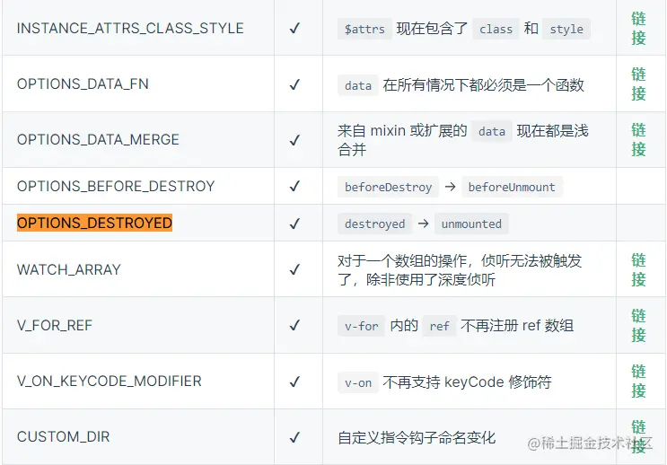
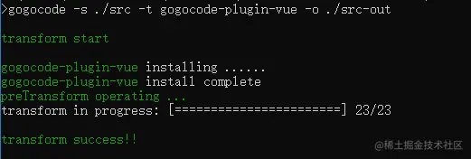
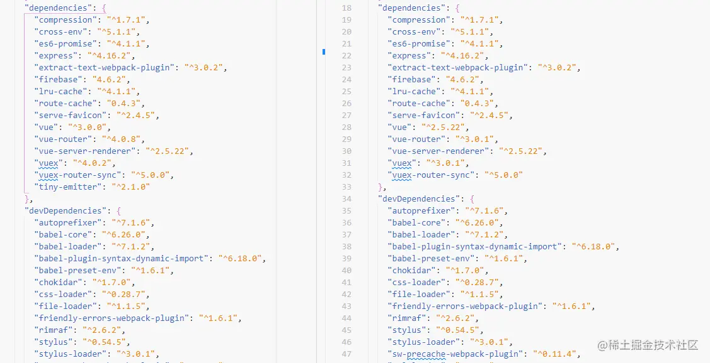

## 4.1 Vue2 项目的基础配置

我们使用的是通过 vue-cli 来搭建的 Vue2 项目，项目中引入了 `vue-router`，`vuex`，`axios`，UI 组件库使用的是 `Element-ui`，还添加了一些自定义指令之类的，项目中我们会包含部分非兼容性改变的内容，以此来展示如何进行修改。

我们不可能在一个项目中把所有升级时会碰到的问题全部展示出来，我们会尽量模仿一个正常的项目所包含的部分问题，通过修改的过程让大家明白升级是要如何去做，遇到问题要如何解决，只要大家掌握了方法，那其他的问题都会迎刃而解的。

## 4.2 Vue2 项目升级

首先，我们需要尽可能的将 vue-cli 升级到高版本，我们演示的代码使用的版本已经足够了。

```perl
"@vue/cli-service": "~4.5.0"
```

将我们的 Vue 的依赖版本更新到 Vue3（我们演示更新到 3.1 版本），同时我们需要安装`@vue/compat`，**注意`@vue/compat` 的版本号需要与 Vue 的版本号保持一致。**

```perl
"vue": "^3.1.0",
"@vue/compat": "^3.1.0",
```

大家可以理解 `@vue/compat` 是 Vue2 和 Vue3 的一个过渡产物，`@vue/compat` 可以运行在 Vue2 的环境下，但**会对 Vue3 不兼容或者废弃的部分进行警告**，我们引入`@vue/compat` 后，只需要根据警告的内容进行修改就可以了。

这里额外插一句，有的同学可能会认为@vue/compat 比较鸡肋，直接升级 Vue3 版本，运行报错，根据报错进行修改不也可以嘛，为什么还要用@vue/compat？

@vue/compat 的存在保证了我们项目的基本运行正常，一种是在正常运行的情况下根据警告去修改，修改一个警告，刷新下页面就可以马上查看验证功能是否正常，另一种则要把所有的报错信息全部改完，才能看到最终效果是否正常，而且当我们项目比较大的时候，需要修改的地方比较多，通过@vue/compat 也可以**对警告进行分类过滤**，单独针对某一些问题进行修改，所以@vue/compat 还是能给我们研发带来更多方便的。

好了，我们继续，安装完 Vue 和@vue/compat 的依赖后，还需要在项目根目录下新增 vue.config.js 文件，包含以下内容。

```arduino
module.exports = {
    chainWebpack: config => {
      config.resolve.alias.set('vue', '@vue/compat')

      config.module
        .rule('vue')
        .use('vue-loader')
        .tap(options => {
          return {
            ...options,
            compilerOptions: {
              compatConfig: {
                MODE: 2
              }
            }
          }
        })
    }
 }
```

现在我们运行代码（如果项目代码有编译的错误，需要针对错误进行修改）项目应该是可以正常运行的，我们项目默认运行在 8080 端口，我们在浏览器中打开 `http://localhost:8080/` ，可以在浏览器的控制台中看到大量的警告信息。

大家可以根据警告信息的内容去 Vue 官网的[特性参考](https://v3.cn.vuejs.org/guide/migration/migration-build.html#%E7%89%B9%E6%80%A7%E5%8F%82%E8%80%83)中查询具体的错误原因，以及修改方案。

比如我们以警告信息中的 OPTIONS_DESTROYED 为例，去官网中查询这个特性。



可以看到已经很清楚地告诉我们在 Vue3 中 destroyed 已经被替换成了 unmounted，我们要做的就是将代码中对应的部分进行替换。

我们项目中还使用了 vue-router、vuex 和 Element-ui，因为它们都有对应支持 Vue3 的版本，所以 vue-router 和 vuex 都要升级到 v4，Element-ui 也要更新到 Vue3 对应的版本。

```json
"vue-router": "^4.0.12",
"vuex": "^4.0.2"
```

这是因为升级后的写法上会与之前有所不同，也需要我们进行修改，下面是 Vue2 版本的 router 写法。

```js
import Vue from "vue";
import VueRouter from "vue-router";

import Home from "../pages/home.vue";
import Login from "../pages/login.vue";

Vue.use(VueRouter);

export default new VueRouter({
  routes: [
    {
      path: "/home",
      component: Home,
    },
    {
      path: "/",
      component: Login,
    },
  ],
});
```

我们上一节的非兼容性改变里已经提到过，Vue3 中的全局对象的操作不再直接操作 Vue 实例了，全局的配置，插件的使用，都是在 creatApp 创建的 App 实例上进行的，所以这里我们要修改成如下的代码。

```js
import { createRouter, createWebHashHistory } from "vue-router";

import Home from "../pages/home.vue";
import Login from "../pages/login.vue";

const routes = [
  {
    path: "/home",
    component: Home,
  },
  {
    path: "/",
    component: Login,
  },
];

export default createRouter({
  history: createWebHashHistory(),
  routes,
});
```

然后在 main.js 中引入 router 文件，在 app 实例上使用组件。

```js
import { createApp } from "vue";

import App from "./App.vue";
import routers from "./router";

const app = createApp(App);
app.use(routers).mount("#app");
```

vuex 也需要进行类似的修改，并在 main.js 中增加 app.use(store)，关于 vue-router 和 vuex 的使用，我们会在后面的章节详细说明。

当我们按照提示信息把所有非兼容性的警告全部修改完成后，其实就已经完成了 Vue3 的代码升级了，直接更换 Vue 的版本就可以正确运行了，我们这里只是展示给大家看升级需要安装什么插件，要如何根据提示信息来查询文档进行修改，相比较真实项目的复杂程度，错误信息也会更多，但修改的步骤都是一样的。

当然，这个过程还是有相当的工作量的，那么如果我们项目工期比较紧急，有没有快速升级的办法呢？答案是有的，下面就让我们一起来看下使用 `GOGOCode` 工具来升级 Vue3。

## 4.3 使用 GoGoCode 工具升级 Vue3

GOGOCode 升级 Vue3 的原理，其实就是**将 Vue2 的代码抽象成 AST，再通过 AST 反编译成 Vue3 的语法。**

首先，我们需要安装最新的`gogocode-cli`。

安装完成后，在需要升级的项目根目录下，运行下面的指令。

```she
gogocode -s ./src -t gogocode-plugin-vue -o ./src-out
```

`-s` 后面指的是需要升级的源码文件夹，`-o` 后面的参数指的是升级后的代码输出位置，执行后的效果如下。



代码转换了还不够，我们项目的依赖都要升级到对应版本，GOGOCode 可以帮我们把 `package.json` 里面的 `Vue/Vuex/Vue-router/Vue` 编译工具升级到适配 Vue3 的版本，在项目根目录下执行以下指令。

```sh
gogocode -s package.json -t gogocode-plugin-vue -o package.json
```

参数格式与代码的一致，我们就直接将原 package.json 文件覆盖了，转化成功后，我们来看下 package.json 依赖版本的变化。



左边是我们升级后的 package.json，可以看到 Vue/Vuex/Vue-router 的版本都已经被更新了。

虽然使用了 GOGOCode，但也不代表我们的项目就可以直接完成升级，项目中如果用到了其他 Vue2 版本的组件库，还是需要我们自己去升级 Vue3 对应的版本，包括一些 Api 的变化都要我们自己去手动调整，并且使用 GOGOCode 也有一些转化规则是不支持的，具体的可以参考 [GOGOCode 的转化规则覆盖](https://gogocode.io/zh/docs/vue/vue2-to-vue3#%E8%BD%AC%E6%8D%A2%E8%A7%84%E5%88%99%E8%A6%86%E7%9B%96)。

即使如此，GOGOCode 也可以帮助我们节省大量的时间，但这升级之路依然是个漫漫长路，有条件的同学可以尝试走一遍相关项目的升级，对你理解 Vue3 的差异和新特性会有很大的帮助。

## 4.4 总结

总结一下，本节我们学习了一个 Vue2 的项目如何升级到 Vue3，并且介绍了 Vue 官网提供的迁移方法和使用 GOGOCode 来升级，这两种方法都不能帮助我们一蹴而就的完成升级，依然需要我们做大量的迁移工作，但这是一个很好的学习过程，完整的完成一次 Vue 项目的升级，你对 Vue3 的理解也会上升一个新的高度。
