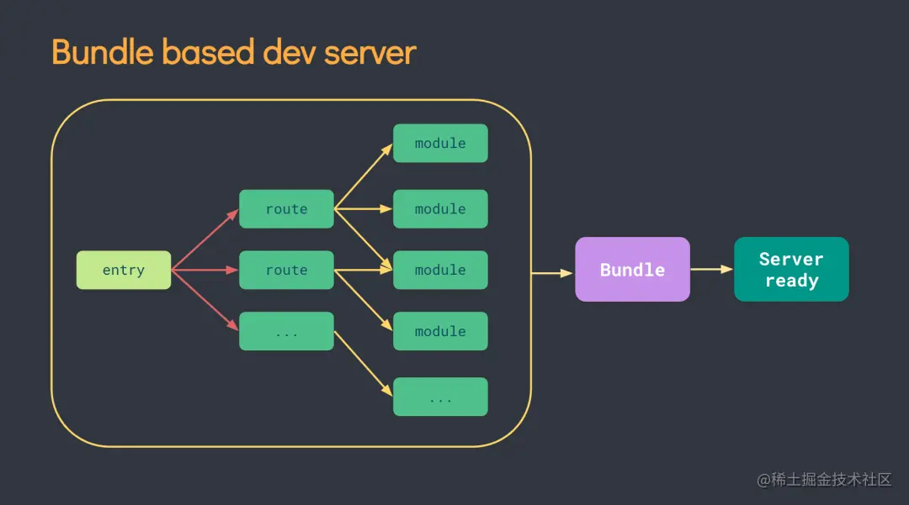
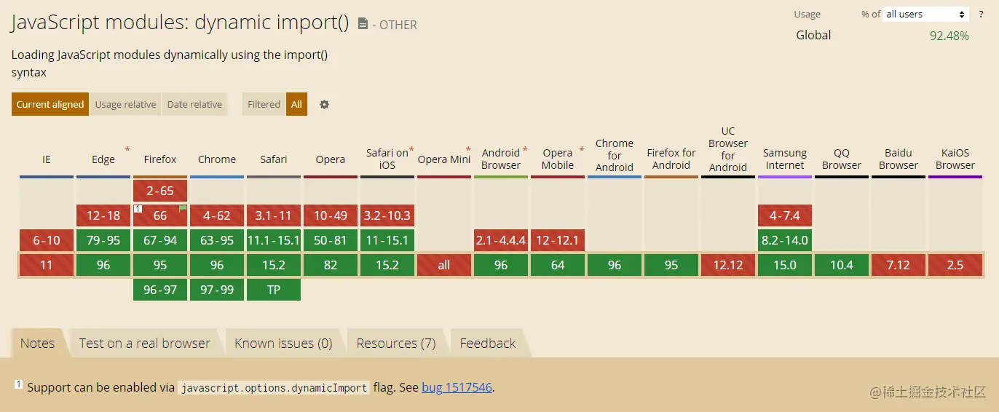
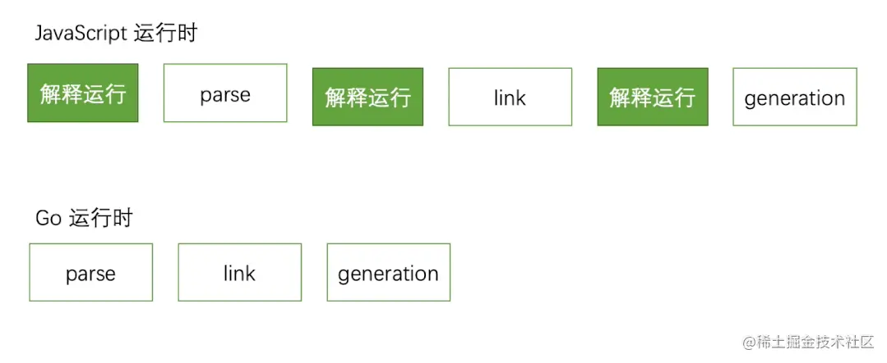
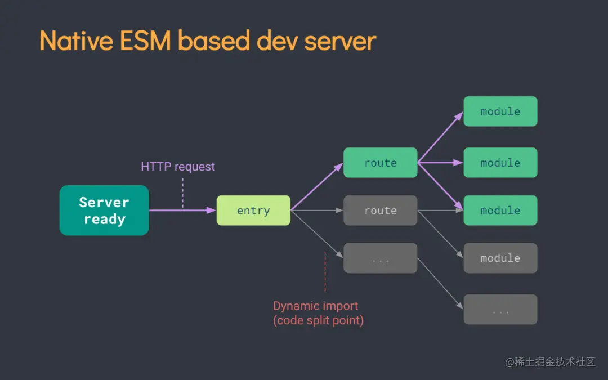

现在前端工程化的概念大行其道，研发基本上离不开模块化，框架我们有 React，Vue，对应有 jsx、vue 文件，样式文件也有 less，sass 等等，这些东西浏览器本身是不认识的，但我们最终都要把它们统一起来，可以放到任意一个浏览器中去运行，那么我们就需要使用 **“前端构建工具”** 来帮我们完成这个工作。

一个高效的构建工具对前端来说是非常重要的，不管是项目冷启动，还是热更新，我们都希望构建工具可以快速响应，显示结果。随着 Vue3 的发布，新一代的工程化工具 Vite 也被尤大大力推荐，甚至高呼再也不会使用 webpack 了，那么 Vite 它到底为什么那么“快”呢？

## 5.1 常见构建工具的原理解析

我们先来看看一些日常常用的构建工具，包括 `npm script`、`grunt`、`gulp`、`webpack` 等等，其中 webpack 应用是非常广泛的，但随着项目的扩大，使用 webpack 的同学应该会发现**项目启动打包等待的时间也会越来越久**了，那么 webpack 到底是怎么实现整个项目构建的呢？

```lua
const path = require('path');

module.exports = {
  entry: './path/to/my/entry/file.js',
  output: {
    path: path.resolve(__dirname, 'dist'),
    filename: 'my-first-webpack.bundle.js',
  }
}
```

上面的代码是一个常见的 webpack 配置项文件，webpack 在打包项目的时候，会**从我们定义的入口文件（file.js）开始，依次往下遍历查找其他依赖文件**，在这个过程中，webpack 会**分析代码，转化代码，编译代码，最终输出成浏览器可以识别的代码，直到 webpack 将项目中所有依赖的文件全部遍历解析完成后**，会将所有的模块合并成一个完成的 `my-first-webpack.bundle.js` 文件，放到浏览器中去加载。

如果我们项目的模块和依赖越来越多，webpack 的打包时间也会成倍的增加。



那么我们已经知道 webpack 越来越慢的原因后，另一个问题就来了，为什么 webpack 要把所有的文件都解析完成后打包到一起呢？

## 5.2 现代浏览器支持 ES 模块带来了什么

webpack 之所以要这么做，主要是因为早期的浏览器不支持 `ES Modules`，对于浏览器来说，没有什么模块化的概念，我们都知道浏览器的顺序就是**从上往下的同步加载**。

```xml
<body>
  <script src="./a.js"></script>
  <script src="./b.js"></script>
</body>
```

如上所示，浏览器一定会先加载 a.js 文件，再去加载 b.js，如果 a.js 中需要依赖 b.js 中的变量或者内容，浏览器就会报错，所以依赖的顺序很重要，其实如果 a.js 和 b.js 中都定义了某个同名的全局变量，b.js 后加载，所以 b 中的全局变量会把 a 中定义的覆盖。

以上的这些原因，都注定了 **webpack 需要把所有的文件都遍历完成，理清依赖关系，定义每个模块的全局变量和全局变量的覆盖顺序，打包成完成的文件后才能交给浏览器去进行加载。**

时过境迁，现代浏览器大多数都已经实现了对 `ES Modules` 的原生支持。



ES Modules 是什么，官方定义是将 JavaScript 程序拆分为可按需导入的单独模块

## 5.3 Vite 为什么这么快？

所以 Vite 这么快，是利用了 EsModules 吗？这只是其中的一部分。

Vite 在冷启动的时候，将代码分为**依赖**和**源码**两部分，源码部分通常会使用 `ESModules` 或者 `CommonJS` 拆分到大量小模块中，而对于依赖部分，Vite 使用 `Esbuild` 对依赖进行预构建。而 `Esbuild` 有以下优势。

1. 语言优势，Esbuild 使用 Go 语言开发，相对于 JavaScript，Go 语言是一种**编译型语言**，在**编译阶段就已经将源码转译为机器码**。
   
2. 多线程，Rollup 和 webpack 都没有使用多线程的能力，而 Esbuild 在算法上进行了大量的优化，充分的利用了多 CPU 的优势。

以上这些原因，导致 Esbuild 构建模块的速度比 webpack 快到 10-100 倍。

其次，对于源码部分，Vite 省略了 webpack 遍历打包的时间，这部分工作**让浏览器来执行**，基本没有打包的时间，Vite 只是在浏览器发送对模块的请求时，拦截请求，对源码进行转换后提供给浏览器，实现了**源码的动态导入**。

以我们上面的读技术文章的例子来看，我们不关心 webpack，Rollup 和 Parcel 相关链接的内容是什么，这些内容不影响我们阅读当前的文章，只有当我们**需要使用到相关链接内容**的时候，我们才去点击链接查看对应的内容。



这两方面加起来，让 Vite 的冷启动快到不可思议。

而在热更新方面，基于已经启动的服务，我们不应该对所有的改动都完全重构打包项目，我们**只需要对失活的模块进行热重载**，而不影响页面的其他部分，但 webpack 依然会随着项目规模的扩大而变得更慢，因为 **webpack 包含了完整的打包项目，对失活模块的替换和查找都会因为体积的增大而更加耗时**。

相比之下，Vite 的热更新也是在原生的 ESM 上进行的，**热更新的范围只在当前模块上**，无论项目的规模多大，也只会加载当前使用到的模块，编辑一般也是在当前加载的模块上进行，**控制住了体积，热更新的速度自然不受影响**。

我们已经从冷启动，热更新，使用的语言方面，解释了 Vite 为什么会这么快，但是 Vite 也存在一些短板。

1. Vite 的生态与 webpack 相差甚远，webpack 的 `loader` 和 `plugin` 已经非常丰富，而 Vite 在这方面还缺少积累。
2. Vite 开发环境很快，但是生产环境还达不到如此惊艳的程度，Vite 生产环境使用 `Rollup` 进行构建的，还是需要打包的，虽然在研发环境下，Vite 不需要打包，快的惊人，但相应的也增加了网络请求的次数，而在生产环境使用 ESM 效率仍然低下，综合考虑，在生产环境依然需要进行打包，而 Esbuild 对 css 的处理和代码分割并不友好，最终选择了 Rollup。
3. Vite 作为新出来的构建工具，还没有经历过大量的项目考验，“实战经验”不够成熟，可能会存在没有发现的问题。

> 当我们开始构建越来越大型的应用时，需要处理的 JavaScript 代码量也呈指数级增长。包含数千个模块的大型项目相当普遍。我们开始遇到性能瓶颈 —— 使用 JavaScript 开发的工具通常需要很长时间（甚至是几分钟！）才能启动开发服务器，即使使用 HMR，文件修改后的效果也需要几秒钟才能在浏览器中反映出来。如此循环往复，迟钝的反馈会极大地影响开发者的开发效率和幸福感。
> Vite 旨在利用生态系统中的新进展解决上述问题：浏览器开始原生支持 ES 模块，且越来越多 JavaScript 工具使用编译型语言编写。

引用 Vite 官网的话，Vite 具有很大的潜力，生态和实战的问题都会慢慢的得到补充和解决，通过使用和对比前端的构建工具，也有助于我们理解前端模块化的概念，新一代的构建工具即将大放异彩。
