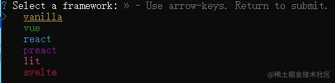

## 6.1 环境准备

系统：Window10。

浏览器环境：Chrome。

Nodejs：v16.13.0。

开发工具：VS Code。

因为我们是使用 Vite 来构建 Vue3 项目，所以对 Nodejs 的版本和浏览器有一定的要求。

## 6.2 搭建第一个 Vite 项目

```kotlin
npm init vite@latest
```

```yaml
√ Project name: ... myApp
√ Package name: ... myapp
√ Select a framework: » vue
√ Select a variant: » vue
```

选择框架的时候，我们可以看到 Vite 支持很多框架，我们这里选择 Vue。



```arduino
cd myApp
npm install
npm run dev
```

运行 `npm run dev` 后，项目就可以成功启动了，第一次使用 Vite 的同学有没有被这种秒启动的速度震惊到呢？

## 6.3 目录结构划分

```lua
|-- src
    |-- App.vue
    |-- main.js
    |-- api           -- 请求数据，接口文件
    |-- assets        -- 静态资源
    |-- commons       -- 公共文件（公共方法，封装函数）
    |-- components    -- Vue组件
    |-- pages         -- 模块页面
    |-- router        -- 路由文件
    |-- store         -- 数据管理
```

我们新增了几个文件夹，并重新划分了文件模块。

- api 下存放网络请求相关的文件。
- commons 存放一些公共的方法和函数。
- components 存放 Vue 的公共组件，如果是与业务的耦合度较高的组件，我们会在 pages 下另建 components 子文件夹。
- pages 下存放不同功能模块的页面文件，基本上我们会根据功能模块来拆分需求，一个功能模块有一个入口 page。
- router 用来管理我们的系统路由。
- store 是负责数据管理的地方。我们的业务逻辑都会在 store 中实现，比如业务数据接口的调用就会放在 store 中去做，组件内包含的都是与业务无关的内容。

vue-router 的最新版本已经支持 Vue3 项目了，所以我们来安装 vue-router 的 4.x 版本。

`npm install vue-router@4`

```js
import { createRouter, createWebHashHistory } from "vue-router";

import Login from "../pages/login.vue";
import Home from "../pages/home.vue";

const routes = [
  {
    path: "/login",
    component: Login,
  },
  {
    path: "/home",
    component: Home,
  },
];

const router = createRouter({
  history: createWebHashHistory(),
  routes,
});

export default router;
```

在上面代码中，我们从 vue-router 引入了两个方法：`createRouter`，`createWebHashHistory`。

`createRouter` 用来创建一个可以被 Vue 应用程序使用的路由实例，需要传入两个参数，`history` 是表示路由的历史记录，我们可以选择使用 `createWebHistory`、`createWebHashHistory` 来分别创建 `HTML5` 历史记录和 `hash` 历史记录，我们这里选择创建 hash 历史记录。

我们还定义了 routes 数组，用来配置各个页面的路由信息，包括路由地址，对应的组件，最后通过 createRouter 方法来创建一个路由实例并向外导出。

```js
import { createApp } from 'vue'

import App from './App.vue'
+ import router from './router/router';

+ const app = createApp(App);
+ app.use(router).mount('#app');
```

## 6.4 总结

这一节我们从零开始搭建了一个 Vue3+Vite 的项目，重新划分了目录结构，引入了路由管理，并且成功的实现了路由的跳转，从下一节开始，我们会逐渐触到 Vue3 的组件化开发、vue-router、Vuex 等等，最终帮助大家掌握 Vue3 的完整开发流程。
