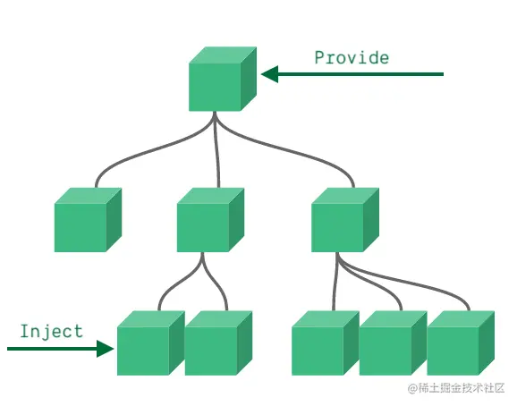
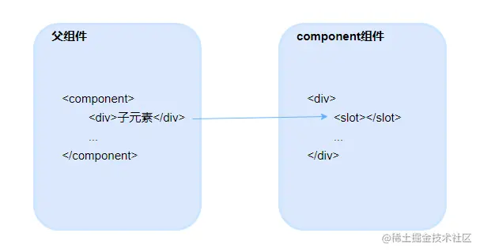

## 7.1 为什么需要组件化开发

业务逻辑比较庞大的时候，我们就需要根据功能对需求模块进行划分，研发的最小单元就是每个组件了，最终按照约定去拼接各个组件就能得到完整的页面了。

## 7.2 Vue3 怎么开发一个组件

Vue 中的组件基本可以分为以下几种。

- 页面组件。
- 公共组件，与逻辑无关，页面的任何地方都可以调用，比如常用的日期选择组件，弹框提示组件等等。
- 业务组件，和业务强耦合，基本不太可复用，但因为较为复杂，可能需要拆分成多个组件来开发。

## 7.3 defineProps 和 defineEmits

Vue3 的 `<script setup>` 写法中，我们需要通过 `defineProps` 来声明 props，`type` 表示数据的类型，可以规范参数的格式。

```go
import { defineProps } from 'vue';

const props = defineProps({
  visible: {
    // 参数类型
    type: Boolean,
    // 参数默认值
    default: false,
  },
})
```

在 Vue 中，我们一般使用 $emit 来触发父组件的事件。而 Vue3 中，我们使用 `defineEmits` 来定义组件的触发事件。

```js
import { defineEmits } from 'vue'
const emit = defineEmits(['handleCancel', 'handleOk'])

// 点击取消按钮
const onCancel = () => {
  emit('handleCancel', false);
}

// 点击确认按钮
const onOk = () => {
  ...
}
```

## 7.4 Vue3 的 v-model

其实 `v-model="modalVisible"` 本质上就是数据绑定和事件监听的语法糖。

```ini
<Modal
  ...
  :modelValue="modalVisible"
  @update:modelValue="modalVisible = $event"
/>
```

```go
<script>
  import {(defineProps, defineEmits)} from 'vue';

  const emit = defineEmits(['update:modelValue', 'handleCancel', 'handleOk'])

  const conCancel = () => {
    // 触发 update:modelValue 事件
    emit("update:modelValue", false)
  }
</script>
```

相对于 Vue2 来说，Vue3 中的 v-model 使用更加方便，具体差异如下。

1. Vue3 中的 v-model 默认名称修改为 `modelValue` 和 `update:modelValue`。
2. Vue3 中的 v-model:text 的方式之定义属性名，如上的 `v-model="modalVisible"` 可以修改为 `v-model:status="modalValue"`，在 Modal 组件中名称就可以修改为 `status`。
3. 同一个组件支持绑定多个 `v-model`。

## 7.5 Provide 和 Inject

组件的多层嵌套需要使用 `Provide` 和 `Inject`。



```vue
<script setup>
// 全局api都需要import导入，Vue3的非兼容性变更
import { ref, provider } from "vue";

// provide有两个参数，第一个是我们传递的key，第二个就是value了
provide("modalType", "default");
</script>
```

```vue
<script setup>
import { inject } from "vue";

const type = inject("modalType", "default");
</script>
```

## 7.6 插槽

在组件中使用`<slot>`作为一个占位符，调用组件时，使用组件的子元素替换掉`<slot>`占位符。


