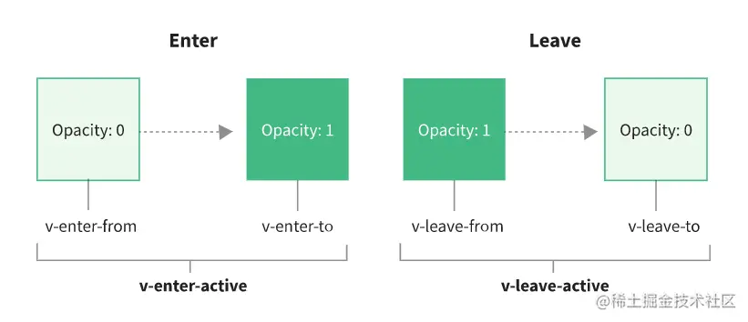

## 9.1 前端怎么实现动画效果？

css3 的 `transition` 和 `animation` 属性。

```css
/* transition */
<style>
  div {
    margin: 100px;
    width: 100px;
    height: 60px;
    background-color: bisque;
  }
  div:hover {
    width: 200px;
    transition: width 1s linear;
  }
</style>
```

```css
/* animation */
div {
  margin: 100px;
  width: 100px;
  height: 60px;
  background-color: bisque;
  animation: turn 2s linear infinite;
}

@keyframes turn {
  0% {
    transform: rotate(0deg);
  }
  25% {
    transform: rotate(90deg);
  }
  50% {
    transform: rotate(180deg);
  }
  75% {
    transform: rotate(270deg);
  }
  100% {
    transform: rotate(360deg);
  }
}
```

- 过渡一般需要一个**触发条件**，比如鼠标的点击、滑入，而动画不需要。
- 过渡只需要关注开始和结束这两个**关键帧**，而动画可以通过百分比设置过程中各个时刻的效果。

我们在实现动画的过程中，很少会使用 top、left 之类的属性，而是使用 `transform` 来代替，主要是因为 top、margin 等属性会触发重绘，而 transform 不会，可以更好的保障页面的流畅，提升性能。

## 9.2 transition 组件

`transition` 主要使用在组件进入和离开的时候，当然我们也可以自己通过 css 去定义动画。

transition 组件有 6 个过渡的 class。

- `v-enter-from`/`v-leave-from` 对应过渡进入/离开的**开始状态**
- `v-enter-active`/`v-leave-active` 对应过渡进入/离开**生效时的状态**。
- `v-enter-to`/`v-leave-to` 对应过渡进入/离开的**结束状态**。



因为同时有多个属性过渡，使用 `transition-property` 可以同时设置多个属性。

## 9.3 transition-group 组件

```vue
<template>
  <button @click="add">按钮</button>
  <transition-group tag="ul" name="list">
    <li v-for="item in array" :key="item">{{ item }}</li>
  </transition-group>
</template>
```

这里就要用到 transition-group 组件了，transition-group 的 `tag` 属性可以指定 transition-group 渲染成一个页面元素，这里我们将 transition-group 组件渲染成 `ul` 标签，name 属性与 transition 的 name 属性作用相同。

```css
.list-enter-from {
  transform: translateX(30px);
}
.list-enter-active {
  transition: transform 0.5s linear;
}
```

transition-group 提供了一个 `v-move` 类，会在元素定位被改变时应用。

```css
.list-move {
  transition: transform 0.5s ease;
}
```

## 9.4 组件之间的过度

```vue
<transition name="component-fade">
    <component :is="Component" />
</transition>
...
<style>
.component-fade-enter-from {
  opacity: 0;
}
.component-fade-enter-active {
  transition: opacity 0.5s linear;
}
</style>
```
