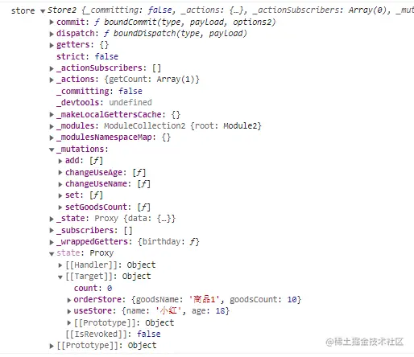

## 11.1 哪些数据需要管理？

**组件内部**的数据和**组件之间共用**的数据。

组件内的数据就交给各个组件去管理就好了，反正也不会对外界产生影响，所以我们主要关注的还是组件之间共用的数据要如何管理。

我们将一个响应式的数据绑定到全局就是状态管理工具 Vuex 的基本实现原理。

## 11.2 Vuex 在 Vue3 中的使用

对数据进行集中定义管理，统一对外暴露更新方法。

### 1. 安装 Vuex

```sh
npm install vuex@next --save
```

### 2. 在 store 文件夹下新建 index.js，创建 Store 示例

```js
import { createStore } from "vuex";

const store = createStore({
  state() {
    return {
      count: 0,
    };
  },
  mutations: {
    add(state) {
      state.count++;
    },
  },
});

export default store;
```

### 3. 在 main.js 中注入 store

```js
  import { createApp } from 'vue'

  import App from './App.vue'
  import router from './router/router';
+ import store from './store';

  ...
  const app = createApp(App);

+ app.use(router).use(store).mount('#app');
```

### 4. 在组件中通过 useStore 引入 store 实例，访问 count 数据并触发 count 的更新事件

```vue
<template>
  <div>{{ count }}</div>
  <button @click="add">加1</button>
</template>

<script setup>
import { useStore } from "vuex";

const store = useStore();
let count = computed(() => store.state.count);

function add() {
  // 调用 mutations 中 add 方法
  store.commit("add");
}
</script>
```

## 11.3 自定义 Vuex 的实现

我们来新建一个 newStore.js 文件，在使用 Vuex 的过程中，我们一共使用了 `createStore` 和 `useStore` 两个方法，createStore 方法返回一个实例，所以 newStore.js 中有如下内容。

```js
// 根据参数创建store实例
const createStore = (params) => {
  // 返回空的store实例
  return {};
};

// 返回store实例
const useStore = () => {};

export { createStore, useStore };
```

与 createRouter 方法一样，createStore 方法在使用的时候传入的参数是个对象，并返回一个 store 实例，我们这里同样先返回一个空的对象。

我们看一下调用 createStore 方法时传入的参数长什么样：

```js
createStore({
  state() {
    return {
      count: 0,
    };
  },
  mutations: {
    add(state) {
      state.count++;
    },
  },
});
```

传入的参数是个对象，对象中有 state 和 mutations，所以我们将这两个内容都保存到我们的 store 实例中：

```js
const createStore = (params) => {
  return {
    // 传入的state是个方法，我们真正需要的是返回的结果
    state: params.state(),
    mutations: params.mutations,
  };
};
```

上面我们说过要将一个响应式的数据绑定到全局，Vuex 中的数据都保存在 state 中，所以我们的 state 必须是个响应式对象，params.state()返回的是个复杂数据类型，那么我们就使用 `reactive` 来定义：

```js
const createStore = (params) => {
  return {
    // state声明成响应式
    state: reactive(params.state()),
    mutations: params.mutations,
  };
};
```

同样在 app.use 的时候，我们需要提供一个 install 方法，将 store 实例注册到全局。

```js
import { reactive, provide, inject } from "vue";

const createStore = (params) => {
  return {
    state: reactive(params.state()),
    mutations: params.mutations,
    // 增加install方法
    install(app) {
      app.provide("STORE", this);
    },
  };
};
```

createStore 方法我们基本上就实现了，还有个 useStore 方法，我们在组件中调用 useStore 方法时可以获取到 store 实例，而实例已经被我们注册到 app.provide('STORE', this)全局了，那么使用 inject 去获取就可以了。

```js
// 返回store实例
const useStore = () => {
  return inject("STORE");
};
```

使用 useStore 获取到实例后，我们还需要有个 commit 方法来更新数据 `store.commit('add')`，所以我们实例下还有个 commit 方法，接收 mutations 下的方法名作为参数。

好了，简单版本的 Vuex 我们就已经完成了，完整代码如下：

```js
import { reactive, inject } from "vue";

const createStore = (params) => {
  return {
    state: reactive(params.state()),
    mutations: params.mutations,
    // commit用来执行mutations下的方法
    commit(fun, payload) {
      // mutations下的方法接受state作为参数
      this.mutations[fun](this.state, payload);
    },
    install(app) {
      app.provide("STORE", this);
    },
  };
};

const useStore = () => {
  return inject("STORE");
};

export { createStore, useStore };
```

## 11.4 Vuex 的更多应用

mutations 下的方法都是同步执行，业务的接口请求是异步的，需要用到 actions。

```js
mutations: {
  set(state, count) {
    state.count = count;
  }
},
actions: {
  getCount({ commit }) {
    // 异步接口获取 count 值
  }
}
```

我们使用 promise 模拟一个异步操作。

```js
function getCountApi() {
  return new Promise(function (resolve, reject) {
    setTimeout(() => {
      resolve(3);
    }, 2000);
  });
}
```

```js
actions: {
  getCount ({ commit }) {
    getCountApi().then(res => {
      commit('set', res)
    })
  }
}
```

actions 不能直接操作数据，但是 actions 的参数解构可以得到 commit 方法，通过 commit 触发 mutations 下的 set 方法来更新数据，引用 Vuex 官网的规则如下：

> 1. 提交 **mutation** 是更改状态的唯一方法，并且这个过程是同步的。
> 2. 异步逻辑都应该封装到 **action** 里面。

用 `Module` 的概念来管理 store。我们可以根据模块来创建 store，比如我们同时存在用户模块和商品模块，需要如下创建 store。

```js
// useStore.js 用户模块
const useStore = {
  state: () => {
    return {
      name: "小明",
      age: 18,
    };
  },
  mutations: {
    changeUseName(state, name) {
      state.name = name;
    },
    changeUseAge(state, age) {
      state.age = age;
    },
  },
  getters: {
    birthday: (state) => {
      return new Date().getFullYear() - state.age;
    },
  },
};

export default useStore;
```

```js
// goodsStore.js 商品模块
const goodsStore = {
  state: () => {
    return {
      goodsName: "商品1",
      goodsCount: 10,
    };
  },
  mutations: {
    setGoodsCount(state, count) {
      state.goodsCount = count;
    },
  },
};

export default goodsStore;
```

从上面的代码中，我们新增了两个 store，在 useStore 中，存储了用户的姓名和年龄，提供了修改姓名和年龄的方法，还有一个新增的 `getters` 属性，getters 的作用与 computed 类似，可以根据 state 中的值，返回计算后的响应式结果。goodsStore 中则保存了商品相关的信息，这样在两个文件中，我们就分模块定义了 store。

在 index.js 中引入各个模块：

```js
import { createStore } from 'vuex';

import useStore from './useStore';
import goodsStore from './goodsStore';

const store = createStore({
    state() {
        ...
    },
    mutations: {
        ...
    },
    actions: {
        ...
    },
    // 引入模块
    modules: {
      useStore,
      orderStore
    }
})
```

我们打印下 store 实例，看看引入的模块放在了哪里。



从控制台打印的结果可以看到，modules 引入的模块与 state 下定义的变量在同一级，这里我们做个区分，在 createStore 下定义的变量和方法，我们划分到根 store 下，每个模块中定义的在模块 store 下，那我们要怎么调用模块 store 下的数据和方法呢？

**获取模块 store 下的 state 需要携带上模块的名称**：

```js
store.state.[模块名称].[变量名称]
例：store.state.useStore.name
```

调用模块 store 下的 getters、mutations 和 actions 与调用根 store 一致就不多提了。

模块与根 store 的 state 在同一级中，如果模块与 state 存在同名情况会不会互相覆盖呢？

答案是会的，同名的模块会覆盖掉根 state 下的内容，我们可以通过**添加命名空间来避免同名之间的覆盖**。

```js
const useStore = {
  // 添加命名空间
  namespaced: true,
  ...
}
```

添加了命名空间后，在访问模块 getters、mutations 和 actions 的时候，就需要添加名称来区分具体是哪个命名空间下的方法。

```js
store.getters["useStore/birthday"];
store.commit("useStore/name", "小红");
store.dispatch("useStore/xxx", "参数");
```

## 11.5 总结

本节中我们介绍了 Vue3 中的数据管理，首先大家需要区分数据类型，与外部业务无关，只关系到组件本身状态的数据放到组件内部，通过 ref，reactive 管理。与业务逻辑强关联，需要在多个组件中被使用的数据可以通过 Vuex 来进行管理。

然后我们介绍了 Vuex 的基本使用和原理，并手动实现了一个简单的 Vuex，进一步加深对原理的理解。还说明了 mutations 和 actions 的使用原则，mutations 中是对数据进行同步的操作，异步的操作要放到 actions 中，所以我们建议将业务请求的 api 都放到 store 中去处理，并说明了这种模式的优点。

最后结合实际的业务情形，对 Vuex 的扩展使用进一步介绍，丰富了 Vuex 在实战中的更多应用。
