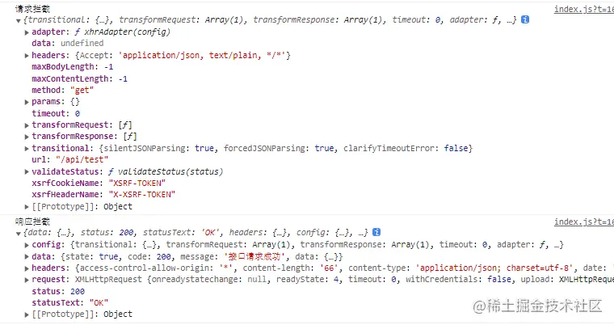

## 12.1 axios 的引用

```sh
npm install axios
```

在 server.js 文件夹下，运行 `node server.js` 启动服务。

```js
const express = require("express");
const http = require("http");

const app = express();
const server = http.createServer(app);

app.get("/api/test", (req, res) => {
  res.send({ state: true, code: 200, message: "接口请求成功", data: {} });
});

server.listen(9527);
console.log("服务已经启动，端口9527");
```

我们可以通过代理的方式解决跨域的问题，因为使用的前端构建工具是 vite，添加 proxy 代理需要在 vite.config.js 中，在 vite.config.js 中添加如下代码：

```js
import { defineConfig } from "vite";
import vue from "@vitejs/plugin-vue";

export default defineConfig({
  plugins: [vue()],
  server: {
    proxy: {
      // 添加代理
      "/api": "http://127.0.0.1:9527",
    },
  },
});
```

## 12.2 axios 的二次封装

我们在 api 文件夹下封装我们的网络请求模块，新增 index.js 文件。

```js
import axios form 'axios';

export default axios;
```

目前我们只是引入了 axios 并进行导出，在这个模块中，我们要完成以下功能的封装：

1. 添加请求和响应的拦截
2. 增加重复请求的取消
3. 对外统一接口

首先思考下，添加请求和响应的拦截目的是什么？一般的网站都存在登录模块，需要用户登录后才可以访问网站内容，那服务是如何**判断用户身份和登录状态**，相信大家都知道使用 token，在用户操作发送请求时携带用户的 token 信息到后端进行验证。我们肯定不希望在每个请求中都要添加 token 处理的代码，那就可以在请求拦截器中进行统一处理。

相应的，如果我们对接口返回的结果有统一的处理逻辑，比如对登录失效的错误码进行跳转登录页的操作，也可以放在我们的响应拦截中处理。

总结一下，当我们的网络请求存在相同的处理逻辑时，可以在统一的拦截入口中进行处理，保证对每一个请求都生效。

我们可以通过 `axios.interceptors.request.use` 和 `axios.interceptors.response.use` 来分别对请求和响应实现拦截：

```js
// 添加请求拦截器
axios.interceptors.request.use(
  function (config) {
    console.log("请求拦截", config);
    return config;
  },
  function (error) {
    return Promise.reject(error);
  }
);

// 响应拦截
axios.interceptors.response.use(
  function (response) {
    console.log("响应拦截", response);
    return response;
  },
  function (error) {
    return Promise.reject(error);
  }
);
```



我们可以获取到请求的 `config` 和响应的 `response` 信息，`headers` 中就可以添加 `token` 信息，当然我们也可以根据其他参数进行更多的处理，比如取消重复请求。

在网页中，如果一些触发事件没有增加节流防抖，可能会出现用户多次点击，这样的重复并没有什么意义反而会消耗资源，我们在 axios 的请求中，可以通过内部提供的 `CancelToken` 来**取消重复的网络请求**。

先来看一下取消重复请求的原理，我们**对每个请求生成一个独一无二的 key 值**，在发送请求的时候，将这个 key 值保存起来，当有重复的请求发送时，我们判断当前 key 值的请求正在进行中，就调用 axios 提供的取消请求的方法取消当前的请求，请求返回后，再将 key 值从保存中移除，让下一次请求可以成功发送。

原理看上去很简单，增加一个开关来控制请求的发送，我们来看下具体的实现。

首先我们需要一个独一无二的 key 值来区分当前的请求，对相同的请求过滤，相同的概念不仅仅是指请求的路径方法相同，而是要包括参数也要相同，比如在查询列表的时候，用户可能修改了查询条件再次调用，两次调用会得到不同的结果，这就是两个不同的请求了。

所以我们可以根据**请求的地址**，**方式**，**参数**，统一计算出当前请求的 md5 值作为 key：

```js
import md5 from "md5";

const getRequestKey = (config) => {
  if (!config) {
    // 如果没有获取到请求的相关配置信息，根据时间戳生成
    return md5(+new Date());
  }
  const data =
    typeof config.data === "string" ? config.data : JSON.stringify(config.data);
  return md5(config.url + "&" + config.method + "&" + data);
};
```

通过 getRequestKey 方法，在请求拦截中，就可以**根据请求的 config 计算出当前请求的 key 值**了，除了 getRequestKey 外，我们还需要能够检查 key **是否存在**的方法以及**删除** key 的方法。

```js
// 存储 key 值
const pending = {};
// 检查 key 值
const checkPending = (key) => !!pending[key];
// 删除 key 值
const removePending = (key) => {
  delete pending[key];
};
```

现在我们已经可以计算请求的 key 值，并且可以判断是否有相同的 key 值正在请求中以及删除完成了请求的 key 值。

接下来只需要在请求拦截器中存储判断 key 值，调用 axios 的取消请求方法即可：

```js
const CancelToken = axios.CancelToken;

// 请求拦截器
axios.interceptors.request.use(function (config) {
  // 计算当前请求 key 值
  const key = getRequestKey(config);
  if (checkPending(key)) {
    // 重复请求则取消当前请求
    const source = CancelToken.source();
    config.cancelToken = source.token;
    source.cancel('重复请求')；
  } else {
    // 加入请求字典
    pending[key] = true;
  }
  return config;
});

// 响应拦截器
axios.interceptors.response.use(function(config) {
  // 请求完成，删除请求中状态
  const key = getRequestKey(response.config);
  removePending(key);
  return response;
});
```

完成了 axios 的一些拦截配置后，我们还需要对外统一 get，post 等方法：

```js
/**
 * get方法，对应get请求
 * @param {String} url [请求的url地址]
 * @param {Object} params [请求时携带的参数]
 */
export function get(url, params = {}, config = {}) {
  return axios.get(url, {
    params: params,
    ...config,
  });
}

/**
 * post方法，对应post请求
 * @param {String} url [请求的url地址]
 * @param {Object} params [请求时携带的参数]
 */
export function post(url, params, config = {}) {
  return axios({
    url,
    method: "post",
    data: params,
    ...config,
  });
}
```

除了上面对重复请求的封装，在实际开发过程中，我们还会遇到跨域，超时，错误码处理等功能，这些都是可以在 axios 封装的时候进行处理。

```js
// 设置请求头
axios.defaults.headers["xxx"] = "xxx";
// 设置接口超时时间
axios.defaults.timeout = 30000;
// 配置请求的根路径
axios.defaults.baseURL = "xxx";
// 跨域时，是否携带用户凭证
axios.defaults.withCredentials = true;
```
