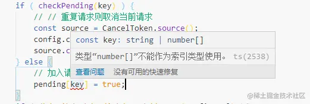

## 13.1 为什么要引入 TypeScript

> TypeScript 是 JavaScript 类型的超集，它可以编译成纯 JavaScript。

JavaScript 是一个弱类型的语言，在 js 中定义一个变量后，随意给这个变量进行赋值，而不用关心赋值的数据类型，这让 JavaScript 变的非常灵活。

与弱类型相对应的就是强类型语言，比如 Java，C/C++之类的服务端语言，每个变量只能赋值定义时规定的类型，Typescript 就是在 Javascript 的基础上添加了类型的限制。

显而易见，当我们给数据加上了强类型的限制以后，因为类型导致的问题在**开发的过程中**就可以被发现，传参赋值也变得**更加规范**。

## 13.2 TypeScript 基础介绍

```typescript
// 变量声明
let somevaule1: number = 1;
let somevaule2: string = "1";
let somevaule3: boolean = true;
```

在上面的代码中，我们定义了三个变量，不同的是，在我们定义的时候，我们就通过:`xxx` 的方式规定了变量的类型，如果我们给 `somevalue1` 赋值`"abc"`，那么就会得到一个错误提示。虽然 TypeScript 会报错，但还是可以得到编译后的结果。

变量声明很好理解，就是在定义的时候添加一个类型嘛，除了变量的声明，TypeScript 中还存在**接口**的概念。

```typescript
// 接口
interface person {
  name: string;
  age: number;
}
```

**变量声明**是给 JavaScript 中的**基础类型**使用的，**接口**就是给**对象这种复杂的类型**使用的，当我们有一个对象的时候，可以通过接口整体的来描述这个对象，定义对象下的所有属性类型。

```typescript
interface person {
  name: string;
  age: number;
}

const xiaoming: person = {
  name: "小明",
  age: 18,
};
```

因为 `xiaoming` 是一个对象，而 JavaScript 中没有 `xiaoming` 这种数据类型，我们定义的接口 `person` 就可以用来描述 `xiaoming` 的数据类型，接口的概念是 TypeScript 中才有的，所以接口的内容在编译后的 JavaScript 中不存在的。

接口还有更多的功能，比如**某个属性不确定是否存在**，可以使用 `age?: number`，表示 age 这个属性可能存在，也可能不存在。

除了对象，JavaScript 中还存在**函数和类**，它们在 TypeScript 中也有自己的定义方式：

```typescript
// 函数
interface Fun {
  (num: number, str: string): string;
}
const fun: Fun = (num, str) => {
  return "123";
};

// 类
class Person {
  name: string;
  constructor(name: string) {
    this.name = name;
  }
}
let xiaohong = new Person("小红");
```

当我们给函数添加了类型后，在我们调用的时候，就可以清楚的看到这个函数需要什么类型的参数，会返回什么样的参数，如果这个函数是由其他人实现再提供给你调用的话，添加了类型后**传参会更加清晰明了**。

## 13.3 vue3 中的 TypeScript

我们都说在 Vue2 中对 TypeScript 的支持不够友好，在 Vue2 中，所有的属性都是挂载在 this 对象下面，我们**很难定义一个满足 this 对象的类型**，而在 Vue3 中我们只需要在 script 标签上添加 `lang="ts"` 就可以在内部使用 TypeScript 来定义对象了。

从前面的章节中，我们知道在 Vue3 中可以使用 `ref` 和 `reactive` 来定义响应式的变量，ref 默认就实现了**对变量类型的推导**，在我们定义的时候，ref 会根据默认值的类型来给变量规定类型：

```vue3
<script setup lang="ts">
  let count = ref(1);
  count.value = '1';
</script>
```

如上代码中，我们定义 count 的时候，默认值给的是数字 1，然后对 count 的 value 赋值字符串格式，会得到如下的错误提示：


我们也可以手动规定 ref 的数据类型：

```ts
// 定义一个字符串或数字类型的响应式变量
let count = ref<string | number>("1");
count.value = 1;
```

这样 count 就可以赋值数字和字符串类型了，除了 ref，还有 reactive，我们在响应式章节中说 reactive 用来定义复杂的数据类型，而**在 TypeScript 中定义复杂数据类型需要用到接口**：

```ts
<script setup lang="ts">
  interface Person {
    name: string,
    age: number,
  }

  let person = reactive<Person>({
    name: '小明'，
    age: 18,
  })

  // 还有一下两种写法也是可以的
  let person2:Person = reactive({
    name: '小明',
    age: 18,
  })

  let person3 = reactive({
    name: '小明',
    age: 18,
  }) as Person
</script>
```

ref 和 reactive 的 TypeScript 写法我们已经明白了（其实我们不规定 `ref`/`reactive` 的类型也不会报错，TypeScript 具备**类型推论**的功能，**在我们没有明确定义类型的时候，可以根据默认值自动推导出数据类型**）。

我们将 `router.js` -> `router.ts`，可以看到 router.ts 中，我们引入的两个组件都出现了报错：


因为在 TypeScript 中，并**不认识.vue 文件**，我们需要添加一个声明文件，在根目录下新建 `env.d.ts` 文件，输入如下代码：

```typescript
declare module "*.vue" {
  import type { DefineComponent } from "vue";
  // eslint-disable-next-line @typescript-eslint/no-explicit-any, @typescript-eslint/ban-types
  const component: DefineComponent<{}, {}, any>;
  export default component;
}
```

再看 router.ts 中，错误提示已经没有了（注意：引入的文件必须要添加.vue 后缀）。

在 router.ts 中，我们定义了两个变量 routes 和 router：

```javascript
import { createRouter, createWebHashHistory } from "vue-router";

import Login from "../pages/login.vue";
import Home from "../pages/home.vue";

const routes = [
  {
    path: "/login",
    component: Login,
  },
  {
    path: "/home",
    component: Home,
  },
];

const router = createRouter({
  history: createWebHashHistory(),
  routes,
});

export default router;
```

vue-router 也提供了这两种类型的定义，我们可以直接导入使用。

```typescript
import {
  createRouter,
  createWebHashHistory,
  Router,
  RouteRecordRaw,
} from "vue-router";

import Login from "../pages/login.vue";
import Home from "../pages/home.vue";

const routes: Array<RouteRecordRaw> = [
  {
    path: "/login",
    component: Login,
  },
  {
    path: "/home",
    component: Home,
  },
];

const router: Router = createRouter({
  history: createWebHashHistory(),
  routes,
});

export default router;
```

同样，我们将 store 下的 index.js 替换成 index.ts，会有如下的错误提示。


可以看到 state 下定义的 count 类型不存在，对照 [Vuex 的文档对 TypeScript 的支持](https://vuex.vuejs.org/zh/guide/typescript-support.html)，我们需要定义一个接口：

```ts
...
interface State {
  count: number;
}

export const store = createStore<State>({
  state() {
    return {
      count: 0,
    };
  },
  mutations: {
    add(state) {
      state.count++;
    },
    set(state, count) {
      state.count = count;
    },
  },

  actions: {
    getCount({ commit }) {
      getCountApi().then((res) => {
        commit("set", res);
      });
    },
  },
  modules: {
    useStore,
    orderStore,
  },
});
```

修改完成后，当我们在其他文件中使用 `const store = useStore();`时，得到的 store 类型却是 `const store: Store<any>`，any 类型意味着我们无法直观的观察到 store 下的数据类型，为了解决这个问题，Vuex 提供了 `injection key`，在 router.ts 中增加如下代码：

```ts
import { createStore, Store } from 'vuex';
import { InjectionKey } from 'vue'

export const key: InjectionKey<Store<State>> = Symbol()
...
```

在 main.ts 中，安装 store 时传入 key:

```ts
import {store, key} from './stores/modules';
...
app.use(store, key).mount('#app');
```

useStore 传入 key 参数，即可得到携带类型的 store:


接下来，我们继续看 axios 如何修改成 TypeScript 类型，在 axios 的封装中，我们主要新增了两个拦截器，axios 中已经替我们定义了拦截器的参数类型：

```ts
import axios, { AxiosResponse, AxiosRequestConfig } from "axios";

axios.interceptors.request.use((config:AxiosRequestConfig) => {
  ...
})

axios.interceptors.response.use((response: AxiosResponse) => {
  ...
})
```

除了拦截器外，我们还增加了对重复请求的取消，当我们存储请求的 key 值时，**提示 key 值的类型不确定**，不能作为索引：



我们这里确定返回的 key 是 md5 字符串，可以直接断言成 string 类型：

```ts
// 加入请求字典
pending[key as string] = true;
```

## 13.4 TypeScript 高阶用法

```ts
export function ref<T>(value: T): Ref<UnwrapRef<T>>;
```

上面的实例中定义了 ref 的函数类型接口，使用到了泛型的概念，我们先简化下这段代码：

```ts
export function ref<T>(value: T): T;
```

我们知道定义函数的时候，需要确定参数类型，但有的时候，我们的**函数不确定传入的类型，或者支持任何类型的传入，但要求返回的类型与参数类型一致**，这里就可以用到泛型了，代码中的 `T` 是一种类型变量，简单理解，就是我们定义了一个类型 `T`，它可以被赋值为任何类型，我们将参数 `value` 的类型也赋值成 `T`，那么参数就可以是任意类型，并且返回的也必须是 `T` 类型。

结合 ref 来理解下泛型，我们使用 ref 去定义响应式变量的时候，是可以传入任何类型的值：

```ts
let str = ref("string"); // ref<string>('string');
let num = ref(123); // ref<number>(123);
```

我们也可以不用插入泛型，会自动根据传入的参数进行类型推导出来，所以上面的源码就可以解释为，ref 定义变量时，可以传入任何类型的变量，返回 `Ref<UnwrapRef<T>>`的变量。

那么 `Ref<UnwrapRef<T>>` 类型的变量又是什么意思呢？

```ts
export interface Ref<T = any> {
  value: T;
  [RefSymbol]: true;
}

// str的类型是Ref<string>
let str = ref("string");
```

从上面的代码中我们知道 Ref 是用来描述 ref 定义的响应式变量的类型，代码中的 str 是个响应式对象，通过 str.value 去访问具体的值，所以 Ref 的类型下定义了一个 value 属性，类型为 T，[RefSymbol]是一个唯一标识，用来判断当前数据类型是否为 Ref 类型。

所以`Ref<UnwrapRef<T>>` 其实与 `Ref<string>`没什么区别，那我们继续来看`UnwrapRef<T>`又是什么。

```ts
export type UnwrapRef<T> = T extends ShallowRef<infer V>
  ? V
  : T extends Ref<infer V>
  ? UnwrapRefSimple<V>
  : UnwrapRefSimple<T>;
```

这段代码就有点多了，看上去非常的吓人，乍一看根本看不懂啊，那我们就先来做个简化：

```typescript
export type UnwrapRef<T> = T extends ShallowRef<infer V> ? V : other;
```

一下就舒服很多了，那么这里就可以简单分析下了，如果 T 类型是继承自`ShallowRef<infer V>`，那么返回类型 V，否则返回其他。

`ShallowRef`是 Vue3 中新增的方法，用来**定义浅层响应式变量**的，什么是浅层响应式变量呢？我们通过 reactive 定义的响应式变量，会对变量下所有的属性都进行监听，比如：

```js
const obj = ref({
  text: "第一层",
  a: {
    text: "第二层",
    b: {
      text: "第三层",
      c: {
        text: "第四层",
      },
    },
  },
});
```

当我们去修改第四层的值时可以直接操作第四层的 text 修改，也会被监听到:

```vue
<template>
  <div>
    <div>{{ obj.a.b.c.text }}</div>
    <button @click="changeFour">修改第四层</button>
  </div>
</template>

<script setup>
...
const changeFour = () => {
    obj.a.b.c.text = '修改后的第四层';
}
</script>
```

而使用 ShallowRef 定义的对象，**只会监听一层**，如果直接去修改第四层的 text，不会生效，而是需要通过修改第一层的 value 来实现重新渲染所有更深的层级

```js
const changeFour = () => {
  // 需要修改obj的value才可以重新渲染所有的子层级
  obj.value = {
    a: {
      text: "第二层",
      b: {
        text: "第三层",
        c: {
          text: "修改后的第四层",
        },
      },
    },
  };
};
```

好了，简单的介绍了下 ShallowRef 方法，我们接着回到 TypeScript 的内容 `T extends ShallowRef<infer V>`，这句代码就是用来判断 T 类型是否是继承自 ShallowRef 类型的对象，如果是返回 V，不是再进行其他判断，这里又有一个新的概念 infer V。

infer V 的概念有点不好理解，它也可以表示任意类型，跟 T 类型有点类似，但它是用来做类型推断的，举个简单的例子帮助大家理解。

比如想判断一个类型是不是数组类型，如果是数字数组，那么返回数字类型，是字符串数组，返回字符串类型，不是数组就返回本身的类型，那么就可以使用 infer 来表示一个未知类型的数组 `Array<infer V>`，这里的 V 可以指代任何未知的类型：

```typescript
T extends Array<infer V> ? V : T
```

如果 T 是字符串数组，上面的代码就相当于：

```typescript
T extends Array<infer string> ? string : T
```

如果 T 是数字数组，上面的代码就相当于：

```typescript
T extends Array<infer number> ? number : T
```

好了，对 infer 有了一定的了解后，上面的代码我们就可以解决了：

```typescript
export type UnwrapRef<T> = T extends ShallowRef<infer V> ? V : other;
```

如果 T 是 ShallowRef 定义的类型，那么就返回定义时的传入的参数类型，否则返回其他。T 如果是 ShallowRef('string')，那么返回的就是 string 类型了。

我们接着来看 other 中的内容：

```typescript
T extends Ref<infer V>
? UnwrapRefSimple<V>
: UnwrapRefSimple<T>
```

经过上面的学习，这段代码我们已经可以分析出来了，我们先不去管 `UnwrapRefSimple` 是什么，那么这段代码的意思就是如果 T 是 Ref 类型，那么返回定义 Ref 变量时传入的参数类型，否则返回 T 本身的类型。

```ini
t1 = ref('string');
UnwrapRef(t1); // t1是Ref<string>类型，那么返回的结果就是string类型

t2 = 123;
UnwrapRef(t2); // t2是number类型，不是Ref类型，那么就返回本身类型number
```

不管返回的是 V 还是本身的 T，都被 UnwrapRefSimple 包裹了一层，那我们就再来深入看下 UnwrapRefSimple 的代码长什么样：

```typescript
export type UnwrapRefSimple<T> = T extends
  | Function
  | CollectionTypes
  | BaseTypes
  | Ref
  | RefUnwrapBailTypes[keyof RefUnwrapBailTypes]
  ? T
  : T extends Array<any>
  ? { [K in keyof T]: UnwrapRefSimple<T[K]> }
  : T extends object & { [ShallowReactiveMarker]?: never }
  ? {
      [P in keyof T]: P extends symbol ? T[P] : UnwrapRef<T[P]>;
    }
  : T;
```

这段代码虽然看着很长，其实逻辑很简单，如果 T 类型是某些类型则返回 T，否则分别判断 T 为数组和对象时的情况，依次对数组和对象下的内容进行处理，这里需要关注的点是 keyof。

keyof 可以得到对象下的属性 key 值集合：

```typescript
type Person = {
  name: string,
  age: number
}

keyof Person; // name | age
```

也可以用来遍历：

```r
// [P in keyof T] 遍历对象类型T下的所有key，T[P]获取key对应的value
[P in keyof T]: T[P]
```

所以上面的代码中，当 T 是数组或者对象时，通过 keyof 方法对数组和对象的子级进行遍历处理。

## 13.5 总结

本节中，我们介绍了 TypeScript 的概念，TypeScript 是 JavaScript 的超集，在 JavaScript 的基础上添加了类型的限制，让我们的代码变得更加安全和易于维护，然后我们简单的改造了下 Vue3 项目到 TypeScript 格式，包括了 Vuex，vue-router 的 TypeScript 的改造，最后我们以 Vue3 的部分源码为例，进一步介绍了 TypeScript 中的一些高阶用法。

TypeScript 是一个很好的工具，可能一开始就做前端的同学对这种类型的限制感到不习惯，但随着你项目的积累和个人的成长，你会发现 TypeScript 可以帮助你打造一个结实的“地基”，不要把 TypeScript 和 JavaScript 当成两种语言来看待，把 TypeScript 当成一种工具来使用，就好像 Vue,React 这些框架一样，这样可能更容易去接受它。他们的目的都是为了让我们的项目开发更加方便，更加易于维护。我们不使用框架，不使用 TypeScript 可以嘛，当然可以，JavaScript 才是我们的重点。但你迟早会发现，这些工具替你节省的时间远远的超过了你的学习成本，最终你可能会忍不住的说一声“真香”。
