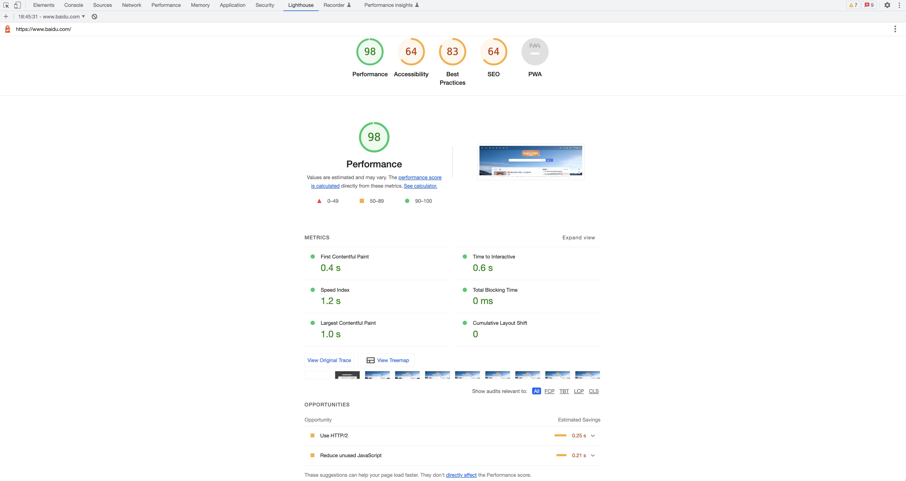
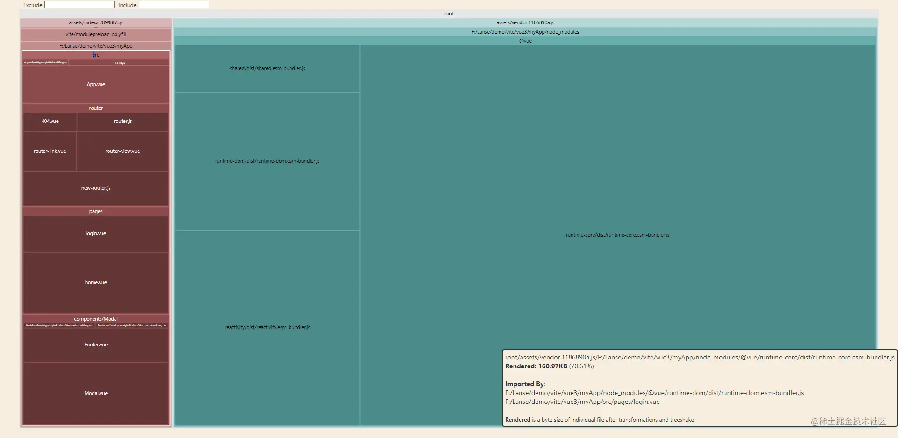

## 14.1 不要盲目的去优化你的项目

1. 优化是为用户产品服务的。
2. 优化这件事有的时候是过犹不及的，合适项目的才是最好的。

项目中或多或少都会使用一些优化方案，比如图片压缩，静态资源使用 CDN 等等，除此之外，我们的优化方向需要根据我们的项目类型来动态调整，不可能有一套优化方案可以适用于所有的项目。

比如，我们做的是一个企业官网的首页，那么对于我们来说，最重要的目标就是确保我们的网页可以被搜索引擎搜索到，并且尽量排在考前的位置，其次当用户打开我们的页面时，要保证第一次的加载速度够快，让用户尽快获取我们的企业信息，把我们的消息推送给用户，才能提高用户合作的可能，而不是用户等个 5，6 秒钟都没有加载出来，那么用户大概率不会等待下去。那么我们的优化重点就是 **SEO** 以及**首页的渲染加载速度**。

再比如，我们开发的是企业的 OA 系统，这种公司内部使用的系统，SEO 可以不需要了，加载渲染速度相对来说也没有那么的高优先级，OA 系统场景更看重的是**系统功能的稳定**和**操作的便捷**，可以从代码和交互多个层面结合进行优化。

通过上面的两个例子，只是想告诉大家，优化只是一种手段，不是将你知道的优化方案全部堆上去就能提升性能，要结合项目的实际需求，分析项目的性能瓶颈，适配出最适合的优化方案。

## 14.2 常用的优化方案

当我们明确了项目的定位后，接下来就需要去针对项目进行优化，这里我们将优化划分到四个方向：

- 1. 代码层面优化
- 2. 交互层面优化
- 3. 框架层面优化
- 4. 配置层面优化

代码层面优化：代码是完成我们项目的基础，同样的功能可以有多种代码层面的实现方式，最终的体验效果也是天差地别的，可能最显著的代码层面优化就是各种**算法**了，可以明显的提高代码的运行速度，还有一些**设计模式**也会让我们的代码更加精简，除此之外更多的就是一些细节了，比如条件判断很多的话，我们会使用 `switch` 代替 `if-else` 来判断，当然更不要让条件嵌套很多层了，还有页面渲染相关的，**节流和防抖**，`Web Worker` 等等。

交互层面：虽然代码是项目的基础，但大家在开发的过程中总会碰到一些无法用代码去修复的问题吧，那么这个时候我们就需要寻求外部的帮助了，交互设计是与前端开发有强关联性的，当研发角度难以去解决时可以考虑从交互的角度来优化，比如我们常用的**懒加载**，**列表分页**展示就是一种交互优化的体现。

框架层面：框架层面我们主要讨论 Vue 相关的 api 优化，比如循环渲染给数据增加 `key` 值，使用**计算属性**让数据缓存，避免多次计算，使用 `keep-alive` 保留组件状态，使用模板编译优化等等，包括我们在组件开发的章节中提到的，在 Vue2 中，使用函数式组件可以提高性能（这个在 Vue3 中已经得到优化了）。Vue 框架已经替我们做了很多的优化工作，我们只需要按照文档提供的最优方案来开发就可以了。

配置层面：配置层面主要是指项目打包相关的优化工作，比如**代码图片的压缩**，`gzip`，`CDN` 等等。

## 14.3 前端性能分析

以我们常用的 Chrome 浏览器为例，在开发者工具中有个 Lighthouse 工具，可以帮助我们监测网站的各个数据，我们以百度为例来生成我们的检测报告如下：



从 Performance 页的表现结果来看，得分 98 分，并提供了很多的时间信息，我们来解释下这些选项代表的意思：

- FCP(First Contentful Paint)：**首次内容绘制的时间**，浏览器第一次绘制 DOM 相关的内容，也是用户第一次看到页面内容的事件。
- Speed Index：页面各个可见部分的显示平均时间，当我们的页面上存在轮播图或者需要从后端获取内容加载时，这个数据会被影响到。
- LCP(Largest Contentful Paint)：**最大内容绘制时间**，页面最大的元素绘制完成的时间。
- TTI（Time to Interactive）：从页面开始渲染到用户可以与页面进行交互的时间，内容必须渲染完毕，交互元素绑定的事件已经注册完成。
- TBT（Total Blocking Time）：记录了首次内容绘制到用户可交互之间的时间，这段时间内，主进程被阻塞，会阻碍用户的交互，页面点击无反应。
- CLS（Cumulative Layout Shift）：计算布局偏移值得分，会比较两次渲染帧的内容偏移情况，可能导致用户想点击 A 按钮，但下一帧中，A 按钮被挤到旁边，导致用户实际点击了 B 按钮。

我们简单的介绍了几个数值的概念，从这几个数值中我们就可以分析出来页面的交互情况是否优良，这些数值我们可以作为参考来针对优化相应的部分，我们还可以通过火焰图来分析具体的任务耗时情况，找到耗时时间长的任务进行优化处理。

除了浏览器为我们提供的工具以外，我们还可以通过 vite 打包工具来查看打包后的项目各个模块的体积。

这里我们就需要借助一下 rollup 插件了，`rollup-plugin-visualizer` 插件可以帮助我们分析打包的项目体积。

```sh
# 安装依赖
npm install rollup-plugin-visualizer
```

在 vite.config.js 文件中添加如下代码：

```javascript
import { defineConfig } from "vite";
import vue from "@vitejs/plugin-vue";
import { visualizer } from "rollup-plugin-visualizer";

// https://vitejs.dev/config/
export default defineConfig({
  plugins: [vue(), visualizer()],
});
```

当我们执行 `npm run build` 打包指令时，在项目的根目录下就会多一个 stats.html 文件，打开这个文件，我们就可以看到打包后的项目中各个模块的大小，进而针对性的进行优化，比如分模块按需导入依赖等等。



## 14.4 vite 配置优化

vite 工具在前面的章节中，我们就已经介绍过了，特点就一个字——快，那么在 Vue3 项目中，我们使用 vite 打包上线时有哪些配置和优化呢？

```ini
// 预构建依赖
optimizeDeps: {
  entries: [],
  include: [],
  exclude: [],
}
```

预构建依赖，默认情况下，vite 会**自动寻找引入的依赖文件并进行预编译**，将预编译好的内容缓存到 `node_modules/.vite` 文件下，当启动 DevServer 的时候，会直接从缓存中获取内容，如果编译后引入新得依赖，会重新进行构建并刷新页面，节省了大量的服务启动时间。

1. 静态资源配置，低于配置阈值内联成 base64 编码。

```yaml
assetsInlineLimit: 4096
```

2. 是否启用 css 动态拆分

```yaml
cssCodeSplit: true
```

3. 是否生成 sourcemap 文件

```yaml
sourcemap: false
```

4. 是否禁用最小化混淆，esbuild 打包速度最快，terser 打包体积最小

```yaml
minify: false, // boolean | 'terser' | 'esbuild'
```

5. chunk 大小警告限制，避免打出过大的 chunk 包，影响请求速度

```yaml
chunkSizeWarningLimit: 500
```

除了 vite 本身的配置信息以外，还有各种的外部插件：

1. `rollup-plugin-terser` 是一款解析压缩的工具，类似于 webpack 中的 uglifyJs，但 `rollup-plugin-terser` 可以支持 ES6 的 JavaScript 代码。

```javascript
import { terser } from "rollup-plugin-terser";

plugins: [terser()];
```

2. 图片压缩工具，支持多种图片格式，配置压缩级别

```js
import viteImagemin from "vite-plugin-imagemin";

export default () => {
  plugins: [
    viteImagemin({
      gifsicle: {
        optimizationLevel: 7,
        interlaced: false,
      },
      optipng: {
        optimizationLevel: 7,
      },
      mozjpeg: {
        quality: 20,
      },
      pngquant: {
        quality: [0.8, 0.9],
        speed: 4,
      },
      svgo: {
        plugins: [
          {
            name: "removeViewBox",
          },
          {
            name: "removeEmptyAttrs",
            active: false,
          }
        ],
      },
    })
  ],
}
```

3. 开启 gzip 或者 brotli 压缩。

```javascript
import viteCompression from "vite-plugin-compression";

plugins: [viteCompression()];
```

4. rollup-plugin-visualizer，我们上面介绍过的打包依赖分析插件。

5. 让你的 Vue 项目开启 PWA 功能。

```javascript
import { VitePWA } from "vite-plugin-pwa";

plugins: [VitePWA()];
```

vite 上有很多插件，不仅可以帮助我们优化项目，还可以让我们的开发更加方便，比如 vite-plugin-components 帮我们省去了组件 import 的步骤，懒人必备等等，大家可以去搜索下相关插件体验一下 [Vite Rollup Plugins](https://vite-rollup-plugins.patak.dev/)。

## 14.5 总结

本章节中，我们首先说明了项目优化的原则，优化是为了用户的体验服务的，要从用户的角度出发，并不是所有的优化都需要做到极致，而是要根据项目的类型来选择合适的优化方向，适合的才是最好的。

其次，我们从四个层面概括的介绍了前端优化的常用方法，当我们遇到性能问题时，能够明确的分析从那个层面可以解决问题，如果代码层面难以修复时可以考虑从交互层面入手解决。

明确了优化的方案后，我们介绍了浏览器中常用的页面性能检测和分析工具，以及 vite 的打包项目体积分析工具，帮助我们快速的定位到具体的性能模块，进行针对性的优化，最后我们简单的介绍了下 vite 中与性能优化相关的配置项和外部插件。

性能优化是提升用户体验的重要手段，研发的过程中有很多的方向和重点可以优化，我们只要围绕为用户体验负责的原则，找准项目定位，就可以把握住最适合的优化方案。
