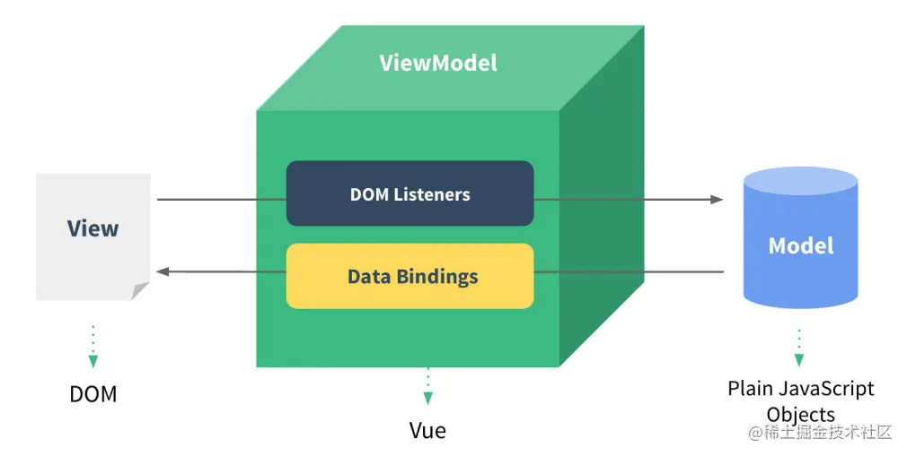

## 16.1 什么是 MVVM

viewModel 其实就是一个调度中心，将我们的页面和数据关联起来，model 不直接与 view 关联，而是 viewModel 中的数据与我们展示的页面存在对应关系，model 有变化会改变 viewModel，viewModel 来同步 view 改变，view 改变也是一样。



通过上面这张图可以看到，viewModel 通过数据绑定来通知页面更新，通过 DOM 监听来更改 model 数据。

它就是数据和页面同步的控制中心，而通过数据来驱动页面也是现在各大框架的核心理念。

## 16.2 数据是如何驱动页面的

数据发生改变了，要怎么去通知页面重新渲染呢？接下来我们就来看看各个框架给出来的答卷。

## 16.3 React

React 框架最出名的莫过于它的虚拟 DOM 的设计理念，什么是**虚拟 DOM**，虚拟 DOM 其实就是将真实的 DOM 结构转换成一种特定的数据格式保存到内存中（看，是不是也是加了个中间层，中间层永远的神），虚拟 DOM 的结构与真实的 DOM 结构一一对应，转换的方法大概如下：

```html
<div id="parent">
  <div id="child1">child1</div>
  <span id="child2">child2</span>
</div>
```

上面这段代码是我们真实的 DOM 结构，转换后的虚拟 DOM 结构如下：

```json
{
  "tag": "div",
  "attrs": { "id": "parent" },
  "children": [
    {
      "tag": "div",
      "attrs": { "id": "child1" },
      "children": ["child1"]
    },
    {
      "tag": "span",
      "attrs": { "id": "child2" },
      "children": ["child2"]
    }
  ]
}
```

就是将我们的真实 DOM 结构转换成一种 json 结构的数据，这个应该很好理解吧，那么这个 json 结构是怎么触发数据结构变化的呢？

**当数据发生变化的时候，我们通过 diff 算法从虚拟 DOM 结构中找到发生变化的位置，然后通过虚拟 DOM 和真实 DOM 的对应关系再去重新渲染真实 DOM。**（其实就是比较两个 json 结构，看看哪里不同）

我们都知道频繁的渲染页面会导致页面卡顿，那么相对于频繁的操作 DOM 结构来说，操作内存中的虚拟 DOM 是不是就快捷方便很多呢。而且如果短时间内发生了大量的 DOM 结构变动，**通过虚拟 DOM 这个中间层，我们完全可以将多次的变化合并，统一修改**。

页面上有个数字 5，我们将这个数字修改 1000 次，最后重新改成 5，如果这个改动的间隔非常短（间隔小到用户没有明显的改动感知），直接对 DOM 动手的话，就可能会导致页面性能问题，但如果通过虚拟 DOM，将多次的改变合并，最后发现，改了半天值根本没有变化，真实页面甚至都不需要重新渲染，只不过在内存里走了一遍计算而已，用户完全无感知。

而且有了这个中间层后，带来的好处还不止这些，同时也解决了**跨端开发**的问题，React 好一招一石多鸟。顺便解释下虚拟 DOM 给跨端开发带来的可行性，我们前端其实包括很多，比如 web 端，window，Mac，小程序，安卓，ios 等等，一个按钮组件，在不同端的实现方式都不一样，但我们只需要定义好统一的虚拟 DOM 结构，比如规定好 json 结构中 tag:'button'的就是按钮，具体的上层使用什么组件展示由各端自己实现即可。

虚拟 DOM 的设计方案确实让人拍案叫绝，同时还解决了跨平台开发的问题，但是虚拟 DOM 也存在它的问题，当我们的项目足够庞大时，虚拟的 DOM 树也会变的很庞大，如果我们 **diff 计算一次的时间大于浏览器一帧渲染的时间**时，那么在渲染的时候我们就无法将最终的内容显示到页面上，同样会导致卡顿。

## 16.4 Vue

**Vue 中数据的驱动是通过响应式来实现的**，而且在不同版本的 Vue 中实现响应式的方式都是有区别的，我们可以认为在 Vue1 中，我们每定义的一个响应式数据，就有一个 watch 对象监听，当数据发生改变的时候，就会通知更新。

与虚拟 DOM 通过 diff 算法计算出来具体的改变内容的不同之处在于，**响应式是主动告诉**你哪个数据发生了改变，再去对应修改 DOM 就好，这也是非常优秀的设计，相对于 diff 来说，节省了计算的时间，同样，当我们的项目足够大时，会存在非常多的响应式数据，对应的为了监听每一个响应式数据，也会定义**相同数量的 watch 监听对象**，而定义了太多的 watch 对象也会导致内存占用率过高，影响性能。

所以在 Vue2 中，就大胆地引入了虚拟 DOM 的设计，并且 Vue 将虚拟 DOM 限制在了**组件级别**，换句话说，**Vue 里的一个组件，就有一个对应的虚拟 DOM 树，在组件内部，数据发生改变时通过虚拟 DOM 来更新，组件级别还是通过 watch 对象来进行监听的。**

这样做的好处也是明显的，减少了 watch 对象的数量，同时也限制了虚拟 DOM 树的大小，不会因为 watch 太多导致内存被占用，也不会因为虚拟 DOM 树太大导致渲染卡顿，很好地平衡了各个方面。

当然 React 为了解决虚拟 DOM 树过大会导致页面卡顿也提出了自己的解决办法，就是**利用每一帧除去渲染的空闲时间去进行 diff 计算**，避免了页面的卡顿。

这种处理的方法虽然可以解决渲染卡顿的问题，但给人的感觉是 React 在一个极端的方向去优化虚拟 DOM 和 diff 算法，将优化做到极致。相比之下 Vue 解决 watch 过多的办法就显得平衡了各个方面，不追求极端。

Vue 的平衡特点还体现在其他方面，比如 template 模板的使用，不像 React 中所有的功能都通过 jsx 来实现，所以 React 中基本完整的保留了 js 的特性，却没有特别多的自定义的接口，而 Vue 引入了 template，提供的 api 就非常丰富了，比如页面需要渲染一个数组，我们来对比下 Vue 和 React 的写法：

React 写法：

```javascript
<div>
  {listArr.map((list) => {
    return <span>{list}</span>;
  })}
</div>
```

Vue 写法：

```vue
<div>
  <span v-for="list in listArr">{{list}}</span>
</div>
```

从上面代码的例子中，我们就可以看出来，Vue 相对来说，api 的使用更加丰富和灵活。

因为 api 的丰富，对于开发同学来说，Vue 的写法就要简单的多，类似情况的还有根据条件来控制页面元素的显示和隐藏等等，感兴趣的同学可以比较下 React 和 Vue 的写法不同。

这就是 template 带来的好处，Vue 选择抛弃了一部分的特性，而拥抱了 template 的设计。

## 总结

本节中，我们介绍了 MVVM 模式的概念，说明了数据-视图-视图模型之间的关系，希望大家对 MVVM 模式有一个相对清晰的概念，然后我们分别介绍了在 React 和 Vue 中是如何实现数据驱动的，React 通过虚拟 DOM 和 diff 算法来更新页面，Vue 则吸收了虚拟 DOM 的优秀设计，并结合自己的实际情况，将虚拟 DOM 和响应式结合，解决了虚拟 DOM 过大的问题。最后我们对比了 React 和 Vue 的设计，并通过 Vue 中的 template 为例，发现 React 更倾向于走向一个极端，而 Vue 呢则更加平衡。

回到我们开头的那句话，条条大路通罗马，没有哪条路是最好的最优秀的，只是大家在不同的方向上都找到了适合自己的方式，不同的框架给我们带来了不同的设计理念，每个框架也都有自己的优势和特长，我们要做的就是理解不同的思路并根据情况选择最适合自己的。
