## 17.1 什么是虚拟 DOM

```json
{
  "tag": "div",
  "attrs": { "id": "parent" },
  "children": [
    {
      "tag": "div",
      "attrs": { "id": "child1" },
      "children": ["child1"]
    },
    {
      "tag": "span",
      "attrs": { "id": "child2" },
      "children": ["child2"]
    }
  ]
}
```

从上面的代码中，我们可以看到虚拟 DOM 的结构主要包含三个内容，“DOM 标签类型”、“DOM 属性”和“DOM 的子节点”，通过这样的 js 对象来描述真实的 DOM 元素，为什么如此的受欢迎呢？

我们都知道，当页面中的元素过多时，会有一个无法绕过去的问题——页面性能，哪怕我们只是改动一个小小的文案内容，但是对于页面来说，可能需要重新渲染整个页面，而一旦渲染的时间过长，交互卡顿的时间每多一秒钟，用户的感知体验就会断崖式的下降，而这正是虚拟 DOM 可以解决的问题。

虽然我们可以将真实的 DOM 转换成 js 的对象放到内存中操作，内存中进行增删改确实要比页面上快很多，但最终还是要渲染到页面上的，相比直接操作真实的 DOM，还多了一层虚拟 DOM，并不一定能提升效率，仅仅靠虚拟 DOM 还是不够的，还需要配合 `diff` 算法，才能准确定位到需要更新的 DOM 节点，针对性的**更新局部的 DOM 内容**，才能最大程度上优化页面渲染的性能。

讲到 diff 算法，Vue 和 React 中都有各自的实现方式，那我们接下来就来剖析下不同框架中的 diff 算法的实现原理。

## 17.2 React 中的 diff 算法

在 React 中，假设现有已经存在两个虚拟 DOM，`newDOM`（改动后的新的虚拟 DOM），`oldDOM`（当前页面展示真实 DOM 对应的虚拟 DOM），diff 算法要做的事情就是对比出两个 DOM 中的不同点，最终将不同点渲染到真实的 DOM 中。

在 diff 算法中，为了避免遍历节点的复杂度，**只会对比同一层的虚拟节点**，我们以英文字母来代表一个虚拟 DOM 节点，那么对比的规则如下：

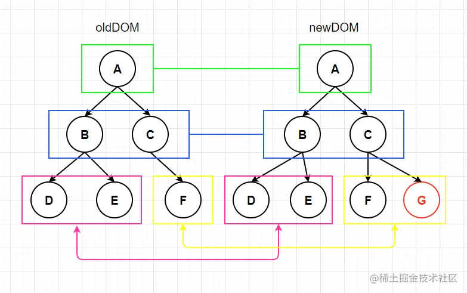

diff 算法会在这个过程中依次对比每个节点，存在以下几种情况：

1. newDOM 中的节点存在，oldDOM 中不存在，比如上图中的“G 节点”，那么就新增一个节点。
2. newDOM 中的节点不存在，oldDOM 中存在，那么就删除 oldDOM 中的节点。
3. newDOM 和 oldDOM 的节点都存在，对比是否为同一个节点，是同一节点再比较子元素是否相同。

newDOM 和 oldDOM 中有一个不存在节点时的情形较为简单，只需要新增节点和删除对应节点就可以了，我们着重来分析下第三种情形，当两个节点都存在时，比较它们的子节点，如果子节点是文本节点，那更新子节点的文本为 new 节点的文本，如果子节点不是文本节点且不相同时，比如有子节点如下：

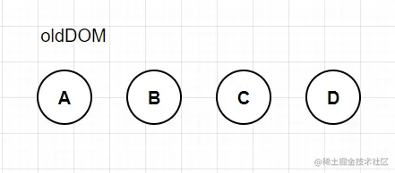

修改后的子节点如下：

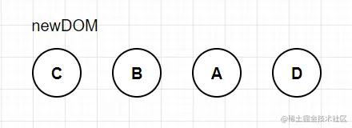

这种情况是子节点的顺序发生了改变，React 要如何去渲染更新呢？

在 React 中使用的是**下标递增**的方式来判断节点的位置是否需要调整的，具体来说，我们给 oldDOM 中的节点都标上下标：

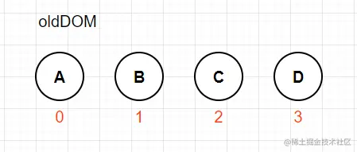

然后我们开始遍历 newDOM，依次查询 newDOM 中的节点在 oldDOM 中的下标位置，并记录下来，如果**新的下标小于之前保存的下标说明位置需要调整，调整到 newDOM 的前一个真实节点之后，如果不小于，则保持位置不用调整**。这么说可能比较抽象，我们还是以上面的例子来走一遍帮助理解：

我们例子中已经标好了 oldDOM 的下标了，开始遍历 newDOM，newDOM 中的第一个节点时“C”，那么我们就拿 C 去 oldDOM 中去查找，发现 C 的下标是 2，因为 C 是第一个节点，在 C 之前没有记录保存其他节点的信息，那么我们就将这个下标存起来，`indexFlag = 2`，因为 C 节点是第一个，那我们就在真实 DOM 中把 C 节点移动到 oldDOM 第一个节点的前面（这里需要注意，我们对比的都是虚拟 DOM，但是移动删除，新增操作的是页面上的真实 DOM），这个时候页面上的 DOM 顺序如下。

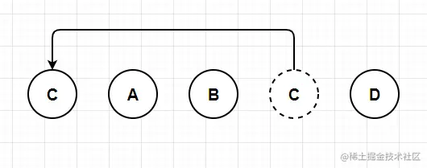

我们继续往下查找，newDOM 中的第二个节点是 B，B 在 oldDOM 中的下标是 1，我们将 1 与之前保存的 `indexFlag` 比较，发现 `1 < indexFlag(2)`，小于则需要调整，所以 B 节点的位置也需要移动，移动到哪里呢？移动到 newDOM 中前一个 DOM 节点的后面，newDOM 中前一个节点是刚刚移动的 C 节点，那么 B 节点就移动到 C 节点的后面，并且将 indexFlag 更新为 1，所以过程如下。

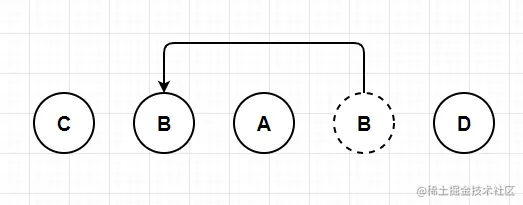

newDOM 中的下一个节点是 A，A 的下标是 0，`0 < indexFlag(1)`，同样如上过程，将 A 移动到 newDOM 中前一个节点的后面，此时的 A 正好就在 B 的后面。

再往下，newDOM 中的 D 节点，在 oldDOM 中的下标是 3，`3 > indexFlag(0)`，所以 D 对应的 DOM 节点位置就不需要调整，而此时页面上的节点经过一番移动后，已经渲染成了 newDOM 对应的顺序了。

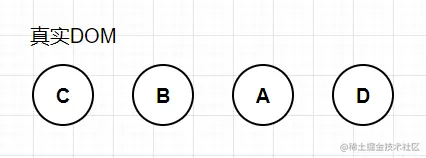

以上是节点移动的情况，如果存在某个节点是新增节点，比如：

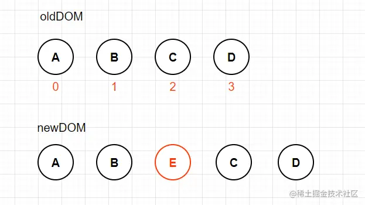

E 为新增节点，前面的计算还是相同的，当我们查找到 newDOM 中的 E 节点时，发现在 oldDOM 中不存在这个节点下标，我们就新增一个真实节点，同样插入 newDOM 的前一个节点之后，indexFlag 不用更新。

同样，也存在某个节点是需要删除的，如下：

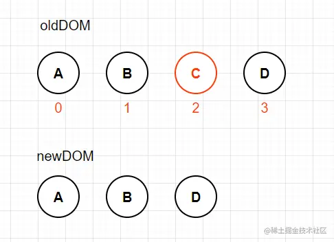

当我们遍历完 newDOM 中的节点后，再去 oldDOM 中检索一遍是否有节点不存在 newDOM 中，发现 C 节点没有查到，那么在真实 DOM 中，删除 C 节点 `parent.removeChild(C)`。

如上是 React 中 diff 算法的主要对比部分解析，而在 Vue 中，对子节点的对比也有自己的一套逻辑算法。

## 17.3 Vue2 中的 diff 算法

在 Vue2 中也是引入了虚拟 DOM 的设计，并且我们知道，Vue 将虚拟 DOM 和 watcher 相结合，每个组件都有自己对应的虚拟 DOM，那么当组件内部的数据发生改变时，Vue 是怎么样同步渲染页面的呢？

当组件内部数据发生改变时，会触发数据的 setter 方法，进而通知到 watcher 对象，watcher 会触发更新函数，通过 render 函数获取到新的虚拟 DOM 结构，然后将 newDOM 和 oldDOM 进行解析获取到最小变动，根据最小变动内容更新页面 DOM。

可见 Vue 也是获取到新老虚拟 DOM 进行比对，新增、删除节点的逻辑与 React 类似，我们就不展示说明，主要还是关注下新老节点相同时，并且子节点不同的情况，Vue 中是如何处理的。

上面我们已经解释了 React 中是通过**下标递增**的方式来判断一个节点是否需要调整的，但存在一种情况：

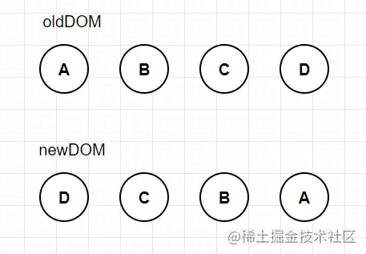

如上图所示，newDOM 结构其实就是将 oldDOM 颠倒了一下，对于 React 的 diff 算法来说，几乎每一个新节点都需要将老节点全部遍历一遍，针对这种情形，Vue2 提出了首尾比对的 diff 算法。

在新老虚拟 DOM 节点中，都存在**首尾两个指针**，每次按照如下的顺序比对：

1. newDOM 的首位和 oldDOM 的首位比对，如果相同，将两个节点的下标往后移动一位，节点位置不需要调整。
2. newDOM 的末位和 oldDOM 的末位比对，如果相同，将两个节点的下标往前移动一位，节点位置不需要调整。
3. newDOM 的末位和 oldDOM 的首位比对，如果相同，newDOM 下标往前移动一位，oldDOM 的下标往后移动一位，将当前节点移动到 oldDOM 未比对节点的最后一个节点的后面。
4. newDOM 的首位和 oldDOM 的末位比对，如果相同，newDOM 下标往后移动一位，oldDOM 的下标往前移动一位，将当前节点移动到 oldDOM 未，比对节点的第一个节点的前面。

我们同样举个例子来帮助理解这个过程：

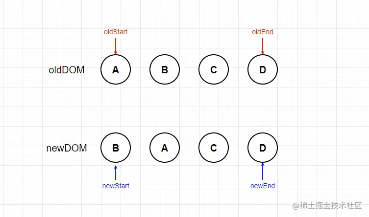

如上图所示，我们已经标出了四个节点，接下来我们按照上面的顺序进行比对，看看最终是怎样移动页面元素的。

首先我们比较两个开始节点，`newStart` 和 `oldStart`，发现这两个节点不相同，那么再比较 `newEnd` 和 `oldEnd`，这次两个节点相同，按照第二步的描述，此时末位的 D 节点相同，将两个节点的指针往前移动一位，节点位置不需要调整：

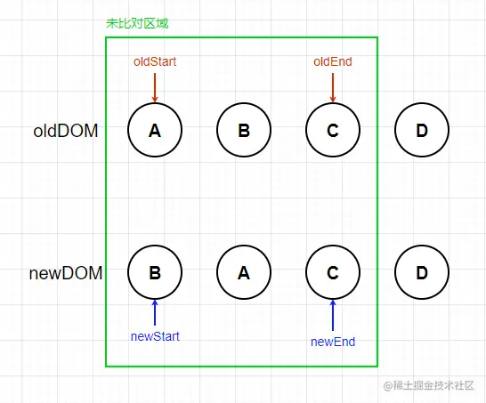

我们已经确定了 D 节点的位置后，开始新一轮的对比，继续按照上面的顺序，同样在第二步，末位的 C 节点相同，不需要移动，往前移动下标：

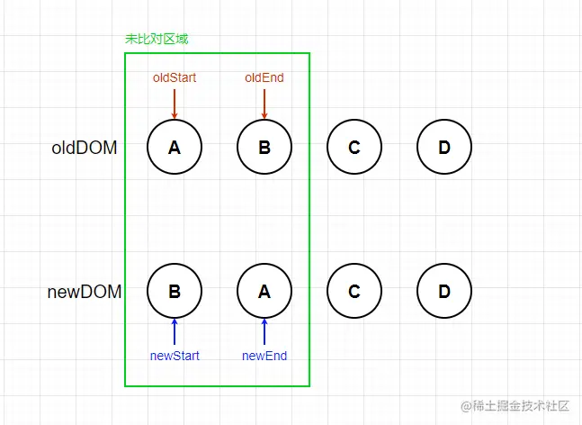

我们继续对比，第一步，第二步的比对结果都不相同，第三步将 newDOM 的末位与 oldDOM 的首位对比，A 节点相同，将 oldDOM 的下标往后移动，newDOM 下标往前移动，同时将真实的 A 节点移动到 oldDOM 未比对区域的最后一个节点之后，oldDOM 未比对的最后一个节点是 B 节点，所以真实 DOM 中将 A 节点移动到 B 节点之后。

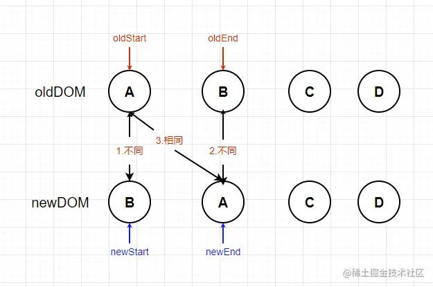

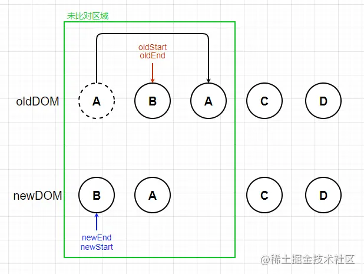

此时 oldDOM 和 newDOM 的指针重合，B 节点相同不需要移动，页面 DOM 调整完成。

上面提到的 newDOM 将 oldDOM 节点顺序颠倒的情况，大家可以自己画图尝试下，根据上面的四个步骤，看看需要几次才能完成页面元素的调整。

我们举的例子是理想情况下，所有的节点都可以通过这四步匹配到，当然也会存在通过这四步无法匹配到节点的情况：

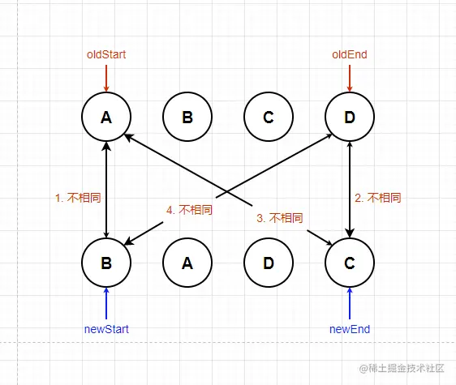

上图中，我们按照四个步骤比对完，并没有相同的节点，这种情况下，就需要将 newDOM 中的第一个节点 B，去 oldDOM 中遍历查询，查找到后，将节点移动到 oldDOM 的第一个节点之前，并且将 newStart 往后移动一位：

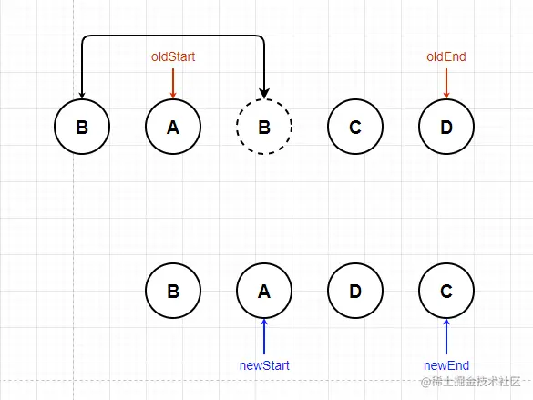

然后重复上面的过程，直到遍历结束。

在实际场景中，也可能在 oldDOM 中并不能找到对应的节点，说明 newDOM 中存在新增的节点，此时需要创建一个新节点，插入到真实 DOM 中，具体的插入位置有如下几种情形：

1. 新增节点在最前面

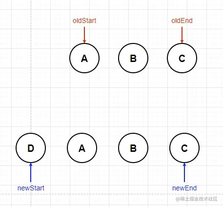

我们依次比对，因为每次都是末位位置匹配，end 下标不断前移，最终会得到如下的结果：

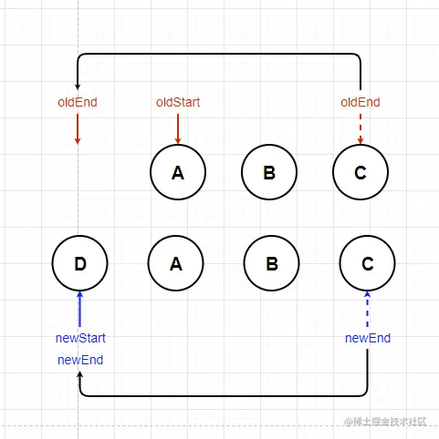

将创建 D 节点，插入 oldDOM A 节点之前。

2. 新增节点在最后面，同理最终结果如下：

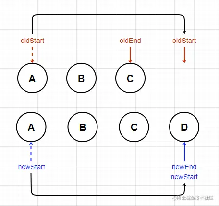

将创建 D 节点，插入 oldDOM C 节点之后。

3. 新增节点在中间时，将前后的节点匹配完成后，最终会成为 1，2 的情形。

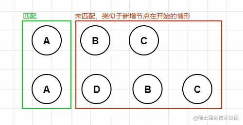

除了有新增节点外，还会有已经被删除的节点，删除的情况下很好判断，当 newDOM 中的 `newStart > newEnd` 时，说明已经遍历完成了，此时 oldDOM 中剩余的节点即为待删除节点，在父节点中依次删除就可以了。

## 17.4 Vue3 中的 diff 算法

在 Vue2 的四种对比基础上，Vue3 只保留了**首首对比**和**尾尾对比**，将首首对比和尾尾对比的结果排除后，获取**剩下的 newDOM 节点的最大递增子序列**，然后将**不在递增子序列中的节点根据子序列的位置进行插入**。

我们还是以例子来说明原理：

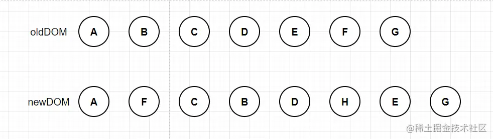

现有如上的两个虚拟 DOM，我们先使用首首比对和尾尾比对，可以发现 A 节点和 G 节点的位置不需要调整，那么就剩下中间的一段内容。

接下来我们需要获取 newDOM 中的最大递增子序列。首先我们来明确下什么是最大递增子序列：

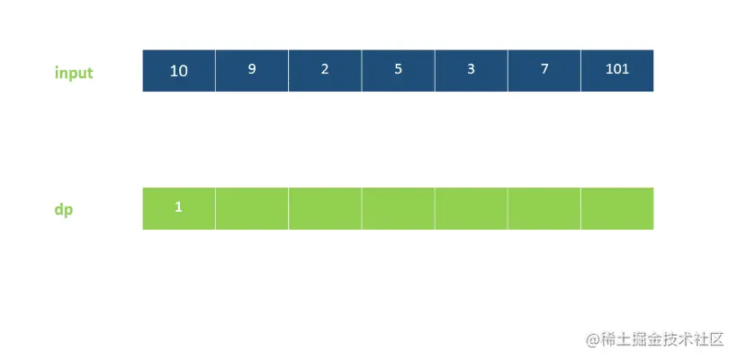

通过上面的动画我们来简单理解下，比如数组`[5, 2, 4, 9, 6]`，`[5, 2, 4]`，`[2, 9, 6]` 都是数组的子序列，如果子序列中的数字是按照递增的方式排列的，就是递增子序列，比如`[2, 4]`, `[4, 6]`, `[5, 9]`, `[2, 4, 9]`，其中递增子序列中长度最长的是`[2, 4, 9]`，所以这就是数组的最大递增子序列。

我们回到 Vue3 的 diff 算法中，我们现在给 oldDOM 中的节点添加下标，并在 newDOM 中标出更新后的节点下标：

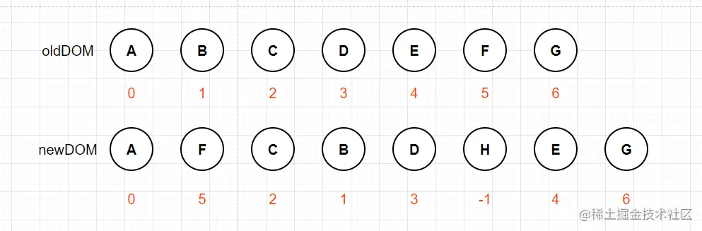

H 节点是新增节点，在 oldDOM 中不存在，标记为-1，A，G 节点已经匹配过了，我们就排除这两个节点，看中间部分的节点下标，得到数组[5, 2, 1, 3, -1, 4]，我们从后往前求取最大递增子序列，以[2, 3, 4]作为最大递增子序列为例。

我们给数组[5, 2, 1, 3, -1, 4]也添加一个下标，那么[2, 3, 4]对应的下标就是[2, 4 ,6]:

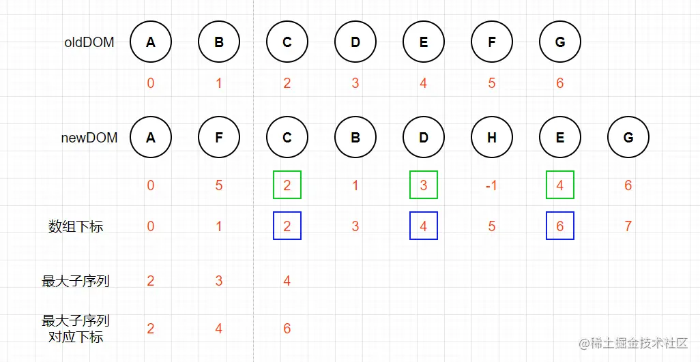

上图中绿色边框的内容就是数组的**最大子序列**，蓝色边框的内容是**最大子序列对应的数组下标**。

那我们要怎么判断节点的更新呢？我们从后往前遍历数组，如果数组当前的内容也是最大子序列的内容，那么当前节点保持不变，如果不是，那么就根据最大子序列的位置插入节点。

比如我们最后一个节点 E（G 节点尾尾比对了就不考虑了），E 节点的下标是 6，存在最大子序列中，所以 E 节点的位置保持不变，再往前找，节点 H，下标 5 不在最大子序列中，并且值是-1，说明是新增节点，那么就需要创新新节点 H，根据下标 5，我们知道应该插入下标为 6 的节点之前，所以我们的页面会更新成如下的内容：

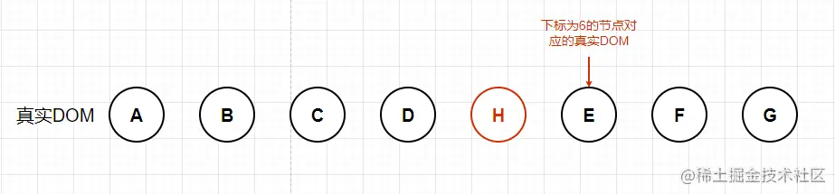

继续往前遍历数组，下标为 4，属于最大递增子序列，节点保持不变，再往前下标为 3，不属于子序列了，说明该下标对应的 B 节点需要调整位置，根据最大子序列的值 4 我们知道，下标为 3 的应该移动到下标为 4 的节点之前，所以 B 节点应该移动到 D 节点之前，页面更新：

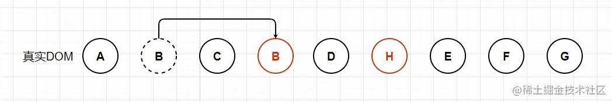

按照这个逻辑，我们依次往前遍历，**存在最大序列中的节点保持不变，不存在的根据最大序列的值来判断插入位置，最终完成 newDOM 的节点更新。**

## 总结

本节中，我们介绍了虚拟 DOM 和 diff 算法的概念，并且我们分别解析了 React，Vue2 和 Vue3 中的 diff 算法核心功能的原理，React 中使用**下标递增**的方法来判断节点更新，Vue2 中则是使用**首尾对比**的方式，而在 Vue3 中采用更加复杂的**最大递增子序列**的概念，在这个过程中，我们还是以原理说明为主，并没有结合对应的代码，希望大家在理解清楚原理之后，结合相关的代码实现来进一步加深理解。
