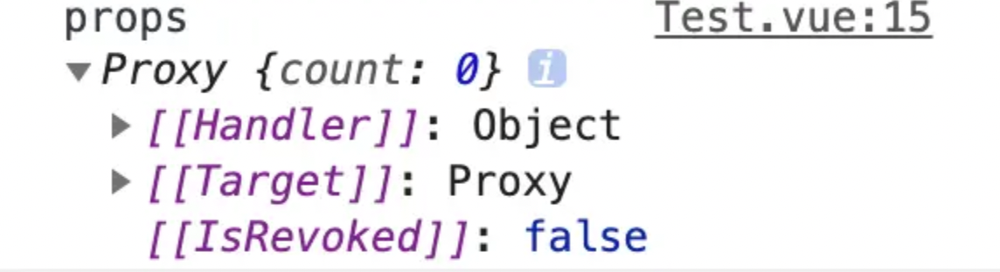

本章节将通过实例代码的形式，深入分析 `setup` 的使用技巧。对标 `Vue 2.x` 模式下同样形式的新写法，如子组件如何接收父组件的传值及注意事项、子组件如何触发父组件的方法等。

## setup 简介

介绍 `setup` 之前，我们先来解释一下什么叫组合 API（Composition API）。

`Vue3` 将 `Vue 2.0` 的选项 API（options API）制作成一个个 `hook` （钩子）函数，如 `watch`、`computed` 等方法，在 `Vue 2.0` 中是以选项 API 的形式出现，如下：

```javascript
// options API
export default {
  name: "App",
  watch: {},
  computed: {},
};
```

而 `Vue3` 新增的 `setup` 方法，也是以选项的形式出现在抛出的对象中，但是诸如上述代码中的 `watch`、`computed` 等属性，都变成 `hook` 函数的形式，通过 `vue` 解构出来，在 `setup` 方法中使用，如下所示：

```js
// Composition API
import { watch, computed } from 'vue'
export default {
  name: 'App',
  setup() {
    watch(() => {
      // do something
    }, () => {
      // do something
    })
    const a = computed(() => {
      // do something
    })
  }
}

// Vue 3.2.x 推出的特有语法
<script setup>
  import { watch, computed } from 'vue'
  watch(() => {
    // do something
  }, () => {
    // do something
  })
  const a = computed(() => {
    // do something
  })
</script>
```

`setup` 存在的意义，就是为了让你能够使用新增的组合 API。并且这些组合 API 只能在 `setup` 函数内使用。

`setup` 调用的时机是创建组件实例，然后初始化 `props`，紧接着就是调用 `setup` 函数。从生命周期钩子的角度来看，它会在 `beforeCreate` 钩子之前被调用，所以 `setup` 内是拿不到 `this` 上下文的，这在后面的会详细分析。

不妨先看看生命周期的对照表：
Vue2.0 | Vue3.0
---|:---
beforeCreate|setup()
created|setup()
beforeMount|onBeforeMount
mounted|onMounted
beforeUpdate|onBeforeUpdate
updated|onUpdated
beforeDestroy|onBeforeUnmount
destroyed|onUnmounted
activated|onActivated
deactivated|onDeactivated
errorCaptured|onErrorCaptured

除去 `beforeCreate` 和 `created` 之外，在我们的 `setup` 方法中，有 9 个旧的生命周期钩子，我们可以在 `setup` 方法中访问。

1、`setup()`：开始创建组件之前，在 `beforeCreate` 和 `created` 之前执行。创建的是 `data` 和 `method`。
2、onBeforeMount()： 组件挂载到节点上之前执行的函数。
3、onMounted()：组件挂载完成后执行的函数。
4、onBeforeUpdate()：组件更新之前执行的函数。
5、onUpdated()：组件更新完成之后执行的函数。
6、onBeforeUnmount()：组件卸载之前执行的函数。
7、onUnmounted()：组件卸载完成后执行的函数。
8、onActivated()：被 `keep-alive` 缓存的组件激活时调用。
9、onDeactivated()：被 keep-alive 缓存的组件停用时调用，比如从 A 组件，切换到 B 组件，A 组件消失时执行。
10、onErrorCaptured()：当捕获一个来自子孙组件的异常时激活钩子函数。

## template 模版中使用 setup

在上一章节中我们介绍过了如何初始化 `Vue3` 项目，本小册我们采用 `Vite` 做初始化工作，温故一下命令行：

```sh
npm init vite-app vue3-setup
```

创建成功之后，安装依赖，通过 `npm run dev` 启动项目。

接下来我们修改 `src/App.vue` 文件如下：

```vue
<template>
  <div>{{ count }} {{ state.foo }}</div>
</template>

<script setup>
import { ref, reactive } from "vue";
const count = ref(0);
const state = reactive({ foo: "bar" });
</script>
```

上述代码，通过 `ref`、`reactive` 创建两个变量，给 `script` 标签附上 `setup` 属性后，内部将不再通过 `export default` 抛出方式的语法。`template` 模板可以直接拿到 `script` 标签内声明的变量，并且支持响应式，这将使得代码变得简洁明了。

这里插播一则小知识，通过 `ref`、`reactive` 方法包裹的变量，会被赋予响应式的能力，也就是说你改变他们的值，模板内也会响应展示改变后的值，如下所示：

```html
<template>
  <div>{{ count }} {{ state.foo }}</div>
</template>

<script setup>
  import { ref, reactive } from "vue";
  const count = ref(0);
  const state = reactive({ foo: "bar" });
  setTimeout(() => {
    // 通过 ref 包裹的变量，需要通过 .value 的形式修改变量，在模板中使用无需使用 .value ，因为在 setup 内 return 的时候，已经帮你接开。
    count.value = 1;
    state.foo = "foo";
  }, 2000);
</script>
```

## h 渲染函数中使用 setup

> h 函数是 createElement 的别名。

`setup` 也可以返回一个函数，函数中也能使用当前 `setup` 函数作用域中的响应式数据，我们将代码修改为如下：

```html
<script>
  import { ref, reactive, h } from "vue";

  export default {
    setup() {
      const count = ref(1);
      const object = reactive({ foo: "bar" });
      return () => h("h1", [count.value, object.foo]);
    },
  };
</script>
```

通过 `h` 函数，将 `count.value`（在 setup 函数作用域内，需要使用 .value 获取值） 和 `object.foo` 渲染到 `h1` 标签内。

## 组件如何接受外部传入的参数

Vue 3.2 为我们在 `script` **内默认添加了三个方法**，这三个方法分别是 `defineProps` 、 `defineEmits` 和 `defineExpose`

### defineProps

我们现在需要一个父子组件的传值例子，修改上述 `src/App.vue` 文件如下：

```html
<template>
  <Test :count="count"></Test>
</template>

<script setup>
  import { ref } from "vue";
  import Test from "./components/Test.vue";

  const count = ref(0);
</script>
```

在 `src/components` 下新增 `Test.vue` 组件：

```html
<template>
  <div>{{ props.count }}</div>
</template>

<script setup>
  const props = defineProps({ count: Number });
  console.log("props", props);
</script>
```

在页面中我们打印了 `props`，可以发现它被 `Proxy` 代理过，这是 `Vue3` 实现响应式的核心 API，也就是说从父亲组件传到子组件的 `count` 变量，已经是**响应式数据**。



并且在子组件内，可以通过 `watchEffect` 和 `watch` 观察到数据的变化情况，我们来试试让数据在父组件变化起来，分别做如下修改：

```html
// App.vue
<template>
  <Test :count="count"></Test>
</template>

<script setup>
  import { ref } from "vue";
  import Test from "./components/Test.vue";

  const count = ref(0);
  setTimeout(() => {
    count.value = 100;
  }, 2000);
</script>
```

```html
// Test.vue
<template>
  <div>{{ props.count }}</div>
</template>

<script setup>
  import { watchEffect } from "vue";
  const props = defineProps({ count: Number });
  watchEffect(() => {
    console.log("props.count = ", props.count);
  });
</script>
```

### defineEmits

该属性的作用是在**子组件获取父组件传递进来的方法**，我们同样用一个例子来演示该属性的作用，在 `App.vue` 添加一个 `add` 方法如下：

```html
<template>
  <Test :count="count" @add="add"></Test>
</template>

<script setup>
  import { ref } from "vue";
  import Test from "./components/Test.vue";

  const count = ref(0);
  const add = () => {
    count.value += 1;
  };
</script>
```

这里声明 `add` 方法，就不用再像 `setup` 函数那样，将其 `return` 出去。 在子组件内，通过 `defineEmits` 接受方法，如下所示：

```html
<template>
  <div>{{ props.count }}</div>
  <button @click="add">+1</button>
</template>

<script setup>
  const props = defineProps({ count: Number });
  // 获取父组件传进来的add方法
  const emit = defineEmits(["add"]);

  const add = () => {
    // 执行父组件传进来的add方法
    emit("add");
  };
</script>
```

使用上，和 `Vue 2` 的区别不大，主要区别在于如何获取上。

### defineExpose

在 `Vue 3.2.x` 版本出来前，我们使用 `Vue3` 开发项目都是用 `setup` 函数的方式，在这种方式下，父组件通过 `ref` 去获取子组件 `return` 出来的方法是比较方便的，我们修改 `App.vue` 和 `Test.vue` 组件如下：

```html
// App.vue
<template>
  <Test :count="count" ref="TestRef"></Test>
</template>

<script setup>
  import { ref } from "vue";
  import Test from "./components/Test.vue";

  const count = ref(1);
  const TestRef = ref();
  console.log("TestRef", TestRef);
</script>
```

```html
// Test.vue
<template>
  <div>{{ props.count }}</div>
</template>

<script>
  export default {
    name: "Test",
    props: {
      count: Number,
    },
    setup(props) {
      const testFn = () => {
        console.log("我是测试方法");
      };
      return {
        props,
        testFn, // 将这个测试方法 return 出去
      };
    },
  };
</script>
```

但是到了 `Vue 3.2.x` 版本，使用 `script setup` 后，父组件就拿不到子组件的内部方法了，修改 `Test.vue` 如下所示：

```html
// Test.vue
<template>
  <div>{{ props.count }}</div>
</template>

<script setup>
  const props = defineProps({ count: Number });
  const testFn = () => {
    console.log("这是测试方法");
  };
</script>
```

此时，`defineExpose` 的作用就得以体现了。在 `Test.vue` 中，将想要往外抛出的方法作为参数放到 `defineExpose` 中，如下所示：

```js
defineExpose({ testFn });
```

## 总结

在 `Vue3` 的迭代过程中，书写形式会变得越来越优雅，这从 `setup` 函数写法，到 `script setup` 写法的转变就能看出，老的写法比较累赘，每声明一个变量或者方法都要通过 `return` 方法返回给模板才能使用，而 `script setup` 则简洁明了，甚至**引入的组件都帮你自动注册**。这说明我们需要不断的学习才能更上时代的步伐。
