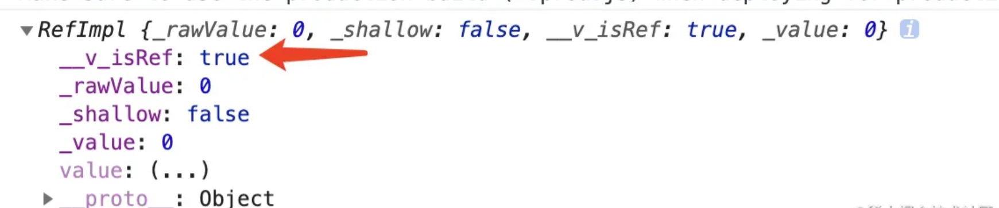
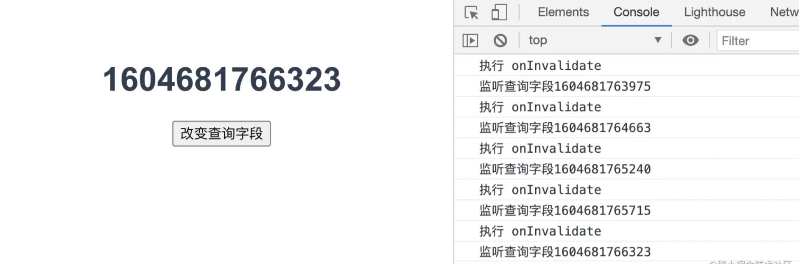
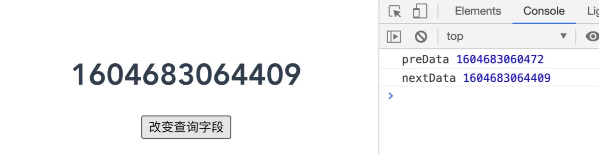

## 前言

响应式系统 API，顾名思义，就是指在新的特性中是如何去实现 `Vue` 的响应式功能。我们通过简单实例的形式讲解分析 `reactive`、`ref`、`computed`、`readonly`、`watchEffect`、`watch` 六个响应式 API 的使用方法。

## reactive

`reactive` 是 `Vue 3` 中提供的实现响应式数据的方法。在 `Vue 2` 中实现响应式数据是通过 `Object` 的 [defineProPerty](https://developer.mozilla.org/zh-CN/docs/Web/JavaScript/Reference/Global_Objects/Object/defineProperty) 属性来实现的，而在 `Vue 3` 中的响应式是通过 `ES2015` 的 [Proxy](https://developer.mozilla.org/zh-CN/docs/Web/JavaScript/Reference/Global_Objects/Proxy) 来实现。

那么在业务开发使用中，我们需要注意几个要点，下面我们来进一步分析。

### reactive 参数必须是对象

`reactive` 方法接受一个对象（json 或 Array）。1

```html
<!--App.vue-->
<template>
  <p>{{ state.title }}</p>
</template>

<script setup>
  import { reactive } from "vue";
  const state = reactive({
    title: "json",
  });
</script>
```

尝试着修改上面的 `reactive` 参数为：

```html
<template>
  <p>{{ state }}</p>
</template>
```

```javascript
const state = reactive(["arr1", "arr2", "arr3"]);
```

同学们可能会有疑问，为什么数组也可以直接渲染呢。这里你可以把数组理解为特殊的对象。我们平时常用的普通对象如下所示：

```javascript
const obj = { a: "1", b: "2" };
```

数组作为特殊的对象，如下：

```javascript
const arr = ["a", "b"];
```

此时你可以把它看作：

```javascript
const arr = { 0: "a", 1: "b" };
```

所以我们同样可以使用键值对的形式获取值，如 `arr[0]`。所以这就解释了为什么 `reactive` 还可以接受数组的原因。

`reactive` 包裹的对象，已经通过 `Proxy` 进行响应式赋能，所以我们可以通过如下形式修改值，会直接体现在 `template` 模板上。

```html
<template>
  <p>{{ state.title }}</p>
</template>

<script setup>
  import { reactive } from "vue";
  const state = reactive({
    title: "十三",
  });

  setTimeout(() => {
    state.title = "十六";
  }, 2000);
</script>
```

2 秒后你将会在浏览器上看到“十三”变成了“十六”。

> 响应式转换是“深层的”，会影响对象内部所有嵌套的属性。基于 `ES2015` 的 `Proxy` 实现，返回的代理对象不等于原始对象。建议仅使用代理对象而避免依赖原始对象。

上述是官方文档描述 `reactive` 返回的代理后的对象，内部的二级三级属性，都会被赋予响应式的能力，所以官方建议，使用 `reactive` 返回的值，而不要去使用原始值。

## ref

`ref` 和 `reactive` 一样，同样是实现响应式数据的方法。在业务开发中，我们可以使用它来定义一些**简单数据**，如下所示：

```html
<template>
  <p>{{ count }}</p>
</template>

<script setup>
  import { ref } from "vue";
  const count = ref(0);
</script>
```

修改数据，可以通过 `count.value = 1` 类似这样的语法去修改。但是为什么它需要这样去修改变量，而 `reactive` 返回的对象可以直接修改如 `state.count = 1` 。

原因是 **`Vue 3` 内部将 `ref` 悄悄的转化为 `reactive`**，如上述代码会被这样转换：

```javascript
ref(0) => reactive({ value: 0 })
```

所以 `count` 相当于 `reactive` 返回的一个值，根据 `reactive` 修改值的方式，就可以理解为什么 `ref` 返回的值是通过 `.value` 的形式修改值了。

还有一点需要注意，当 `ref` 作为渲染上下文的属性返回（即在 `setup()` 返回的对象中）并在模板中使用时，它会**自动解套**，无需在模板内额外书写 `.value`。之所以会自动解套，是因为 `template` 模板在被解析的时候，`Vue3` 内部通过判断模板内的变量是否是 `ref` 类型。如果是，那就加上 `.value`，如果不是则为 `reactive` 创建的响应集代理数据。

我们不妨打印一下 `ref` 创建的对象 `console.log(count)`，浏览器控制台如下图所示：



没错，就是通过上图 `__v_isRef` 变量去判断，模板内的变量是否为 `ref` 类型。判断类型也可以通过 `isRef` 方法，如下：

```html
<template>
  <p>{{ count }}</p>
</template>

<script setup>
  import { ref, isRef } from "vue";
  const count = ref(0);
  console.log(isRef(count)); // true
</script>
```

在 `Vue 2` 中，我们可以通过给元素添加 `ref="xxx"` 属性，然后在逻辑代码中通过 `this.$refs.xxx` 获取到对应的元素。

到了 `Vue 3` 后，`setup` 函数内没有 `this` 上下文，因此我们可以通过 `ref` 方法去获取，并且还需要**在页面挂载以后才能拿到元素**。

```html
<template>
  <div ref="shisanRef">十三</div>
</template>
<script setup>
  import { ref, onMounted } from "vue";
  const shisanRef = ref(null);
  onMounted(() => {
    console.log(shisanRef);
  });
</script>
```

如图所示：


## computed

`Vue 2` 时代，`computed` 作为选项出现在页面中，而到了 `Vue 3` 时代，它将会以**钩子函数**的形式出现。我们先来修改 `App.vue` 下的代码，如下所示：

```html
<template>
  <p>{{ text }}</p>
</template>

<script setup>
  import { reactive, computed } from "vue";
  const state = reactive({
    name: "十三",
    desc: "你好",
  });

  const text = computed(() => {
    console.log("11");
    return state.name + state.desc;
  });

  setTimeout(() => {
    state.name = "十六";
  }, 2000);
</script>
```

上述代码通过 `computed` 函数将 `name` 和 `desc` 变量拼接，返回 `text` 渲染在模板上。

这里要注意的是 2 秒后，`name` 变量将会被重新赋值，那么 `computed` 函数内带有 `state.name`，所以会被动态计算，重新返回 `text` 值，浏览器会有变化。

若是将 `computed` 方法内的函数做如下改动：

```javascript
...
const text = computed(() => {
  console.log('11')
  return state.desc
})
...
```

少了 `state.name`，2 秒后，你将不会看到控制台打印 `11`，因为函数内不会被检测执行。

上述形式 `computed` 返回的值是不可修改的，通过 `get` 和 `set` 的形式返回的值是可修改的，不过这种情况的使用场景不多，这里不作深究。

## readonly

`readonly` 顾名思义，用于创建一个**只读的数据**，并且所有的内容都是只读，**不可修改**。我们看如下代码：

```html
<template>
  <p>{{ state.name }}</p>
  <p>{{ state.desc }}</p>
  <button @click="fn">修改</button>
</template>

<script setup>
  import { reactive, computed, readonly } from "vue";
  const state = readonly({
    name: "十三",
    desc: "你好",
  });

  const fn = () => {
    state.name = "十六";
    state.desc = "他好";
    console.log("state", state);
  };
</script>
```

我们用 `readonly` 创建一个数据，将其渲染在 `template` 模板下，并且通过 `fn` 函数，修改这个数据，看看浏览器会有什么反馈。

点击按钮之后，如上图所示，**控制台报警告了**，并且 `state` 打印出来之后，**内部数据也没有变化**。

## watchEffect

首先 `watchEffect` 会**追踪响应式数据的变化**，并且还会**在第一次渲染的时候立即执行**，我们来看看下面的例子：

```html
<template>
  <div>
    <h1>{{ state.search }}</h1>
    <button @click="handleSearch">改变查询字段</button>
  </div>
</template>

<script setup>
  import { reactive, watchEffect } from "vue";
  let state = reactive({
    search: Date.now(),
  });
  watchEffect(() => {
    console.log(`监听查询字段${state.search}`);
  });

  const handleSearch = () => {
    state.search = Date.now();
  };
</script>
```

`watchEffect` 接受一个**回调函数**作为参数，并且**该回调函数内如果有响应式变量**，那么当我执行 `handleSearch` 方法改变 `search` 变量时，**回调函数也会被执行**。

`watchEffect` 函数**返回一个新的函数**，我们可以通过**执行这个函数或者当组件被卸载的时候，来停止监听行为**。来看下面代码：

```js
let timer = null;
let state = reactive({
  search: Date.now(),
});

// 返回停止函数
const stop = watchEffect((onInvalidate) => {
  console.log(`监听查询字段${state.search}`);
});

const handleSearch = () => {
  state.search = Date.now();
};

setTimeout(() => {
  console.log("执行 stop 停止监听");
  stop(); // 2 秒后停止监听行为
}, 2000);
```

我们一直点击按钮，控制台会一直打印改变的数据。当 2 秒是 `stop` 方法被执行，停止监听后，控制台不再打印数据。

`watchEffect` 的回调方法内有一个很重要的方法，用于**清除副作用**。它接受的回调函数也接受一个函数 `onInvalidate`。名字不重要，重要的是它将会在 `watchEffect` 监听的**变量改变之前被调用一次**，具体执行顺序我们通过代码来解释：

```html
<template>
  <div>
    <h1>{{ state.search }}</h1>
    <button @click="handleSearch">改变查询字段</button>
  </div>
</template>

<script setup>
  import { reactive, watchEffect } from "vue";
  let state = reactive({
    search: Date.now(),
  });
  const stop = watchEffect((onInvalidate) => {
    console.log(`监听查询字段${state.search}`);
    onInvalidate(() => {
      console.log("执行 onInvalidate");
    });
  });

  const handleSearch = () => {
    state.search = Date.now();
  };
</script>
```



每当我点击按钮，改变 `search` 值时，`onInvalidate` 会在监听打印之前被执行一次。

那么要它何用呢？用处非常大。举个例子，我们需要监听 `search` 的变化，去请求接口数据，此时接口是异步返回的，每当我改变 `search` 都会去请求一次接口，那么有可能 `search` 改变的很频繁，那就会频繁的去请求接口，导致服务端压力倍增。我们可以通过这个特性去**降低服务端的压力**，具体逻辑如下：

```html
<template>
  <div>
    <h1>{{ state.search }}</h1>
    <button @click="handleSearch">改变查询字段</button>
  </div>
</template>

<script setup>
  import { reactive, watchEffect } from "vue";
  let timer = null;
  let state = reactive({
    search: Date.now(),
  });
  watchEffect((onInvalidate) => {
    console.log(`监听查询字段${state.search}`);
    timer = setTimeout(() => {
      console.log("模拟接口异步请求，3 秒之后返回详情信息");
    }, 3000);
    onInvalidate(() => {
      console.log("清除");
      clearInterval(timer);
    });
  });

  const handleSearch = () => {
    state.search = Date.now();
  };
</script>
```

在 `watchEffect` 回调函数内，我用 `setTimeout` 的形式去模拟响应时间为 3 秒的异步请求，上面代码可以理解为 3 秒之内如果你不去改变 `search` 变量，那么页面就成功返回接口数据，如果在 3 秒之内你再次点击按钮改变了 `search` 变量，`onInvalidate` 将会被触发，从而清理掉上一次的接口请求，然后根据新的 `search` 变量去执行新的请求。

## watch

`watch` 的功能和之前的 `Vue 2` 的 `watch` 是一样的。和 `watchEffect` 相比较，区别在 `watch` **必须指定一个特定的变量，并且不会默认执行回调函数，而是等到监听的变量改变了，才会执行**。并且你可以拿到改变前和改变后的值。

```html
<template>
  <div>
    <h1>{{ state.search }}</h1>
    <button @click="handleSearch">改变查询字段</button>
  </div>
</template>

<script setup>
  import { reactive, watch } from "vue";
  let timer = null;
  let state = reactive({
    search: Date.now(),
  });
  watch(
    () => {
      return state.search;
    },
    (nextData, preData) => {
      console.log("preData", preData);
      console.log("nextData", nextData);
    }
  );

  const handleSearch = () => {
    state.search = Date.now();
  };
</script>
```



## 总结

上述这六个响应式系统 `API` 会是你日后使用频率最高的几个。细心阅读每一个响应式 `API`，这将会对后面的实战项目很有帮助。将这些 `API` 灵活的运用于项目中，可以让代码变得更加优雅，增加代码的可读性。

理解了这些知识点，对于掌握整个 `Vue 3` 具有举足轻重的意义。
