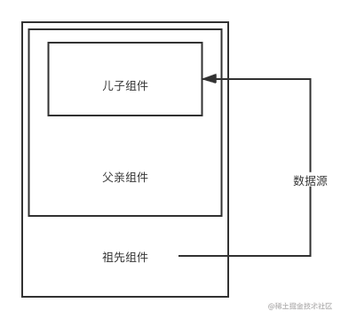
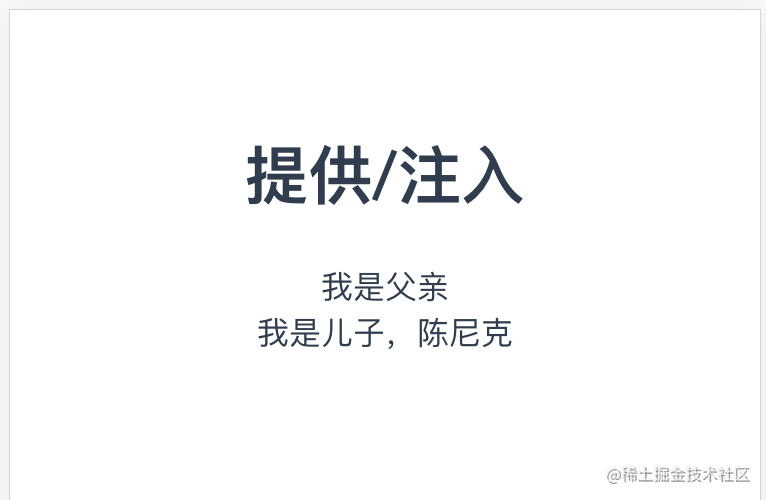
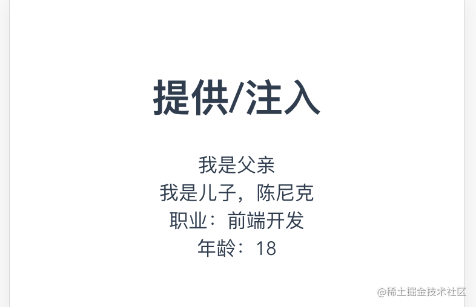
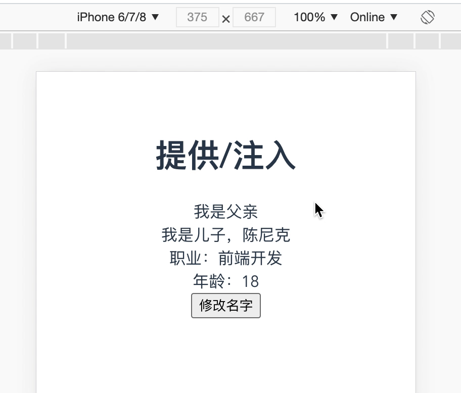

## 前言

世间万物都有生死轮回，Vue 同样也有属于自己的生命周期。

本章节通过对比 `Vue2` 和 `Vue3` 的生命周期，来更好的理解 `Vue 3` 的生命周期，以便日后写业务代码时，不会犯一些低级错误。

## Vue 2 生命周期解读

我们首先来看一张 `Vue 2` 时期的生命周期示意图。


我将上述生命周期标点，以便接下来的讲解，首先我们看标记 1，`new Vue()` 初始化实例，想必学过 `Vue` 的同学都有所了解，来到标记 2 是初始化事件和组件生命周期，此时会执行 `beforeCreate` 钩子函数，这是在组件创建之前执行的。接下来，来到标记 3，初始化注入和响应式，也就是说在这个时候，`data` 数据就已经创建了。接下来执行 `created` 钩子函数，它会判断你是否有 `el` 选项，`el` 就是在项目入口页初始化的选项，代码如下所示：

```js
new Vue({
  el: "#app",
});
```

如果你没有，通过 `vm.$mount(el)` 的形式去手动挂载，其实和 `el` 的本质没有区别。然后我们来到标记 5，判断是否有 `template` 模板。用代码解释的话如下：

```js
new Vue({
  el: "#app",
  template: "<p>十三</p>",
});
```

大致如上述代码，如果有 `template` 选项，会进入标记 6 进行模板编译。如果没有，会获取 `el` 的 `outerHTML` 作为模板进行编译。

走到这一步，`beforeMount` 钩子函数被触发，标记 8 内将模板转化为 `AST` 树，再将 `AST` 树转成 `render` 函数，最后转化为虚拟 `DOM` 挂在到真实 `DOM` 节点上。

标记 9 代表组件已经加载完了，在组件内部更新数据时候的生命周期，更新前和更新后各自触发的钩子函数。

标记 10 代表组件被卸载，包括监听器也会被卸载，你可以在这里做一些组件销毁后的事情。

## Vue 3 生命周期解读

上文我们对 `Vue 2` 的生命周期知识点进行了一个简单的回顾，也让大家的脑海里有一个初步的印象，和接下来的 `Vue 3` 生命周期能形成一个对比。

生命周期钩子函数，`Vue 2` 对应 `Vue 3` 的写法如下：

- `beforeCreate` -> `setup`。
- `created` -> `setup`。
- `beforeMount` -> `onBeforeMount`。
- `mounted` -> `onMounted`。
- `beforeUpdate` -> `onBeforeUpdate`。
- `updated` -> `onUpdated`。
- `beforeDestroy` -> `onBeforeUnmount`。
- `destroyed` -> `onUnmounted`。
- `errorCaptured` -> `onErrorCaptured`。

> Composition API 里没有 beforeCreate 和 created 对应的生命周期，统一改成 setup 函数。

我们来看看在 `Vue 3` 中生命周期运行顺序和使用情况，通过 `Vite` 新建文件，修改 `App.vue` 文件：

```html
<!--App.vue-->
<template>
  <div>
    <h1>生命周期{{ state.count }}</h1>
    <div v-if="state.show">
      <Test />
    </div>
  </div>
</template>

<script setup>
  import Test from "./components/Test.vue";
  import {
    onBeforeMount,
    onMounted,
    onBeforeUpdate,
    onUpdated,
    onBeforeUnmount,
    onUnmounted,
    onErrorCaptured,
    reactive,
  } from "vue";

  const state = reactive({
    count: 0,
    show: true,
  });
  setTimeout(() => {
    state.count = 2;
    state.show = false;
  }, 2000);

  onBeforeMount(() => {
    console.log("onBeforeMount");
  });

  onMounted(() => {
    console.log("onMounted");
  });

  onBeforeUpdate(() => {
    console.log("onBeforeUpdate");
  });

  onUpdated(() => {
    console.log("onUpdated");
  });

  onBeforeUnmount(() => {
    console.log("onBeforeUnmount");
  });

  onUnmounted(() => {
    console.log("onUnmounted");
  });

  onErrorCaptured(() => {
    console.log("onErrorCaptured");
  });
</script>
```

```html
<!--src/components/Test.vue-->
<template>
  <div>我是子组件</div>
</template>

<script setup>
  import { onBeforeUnmount, onUnmounted } from "vue";
  onBeforeUnmount(() => {
    console.log("子组件-onBeforeUnmount");
  });

  onUnmounted(() => {
    console.log("子组件-onUnmounted");
  });
</script>
```

执行页面，我们观察控制台的打印。

首先是页面渲染前执行 `onBeforeMount`，紧接着是 `onMounted`。当组件有变量更新导致页面变化的时候，先执行 `onBeforeUpdate`，但是没有马上执行 `onUpdated`，而是先执行了子组件的销毁生命周期钩子 `onBeforeUnmount` 和 `onUnmounted`，这是因为子组件在父组件中渲染，在页面变化没有完全结束前，是不会执行父组件的 `onUpdated` 生命周期钩子函数。

我们请求数据还是写在 `onMounted` 钩子函数内，它支持 `async` `await` 写法，如下：

```js
onMounted(async () => {
  const data = await serviceApi(params);
});
```

从这可以看出，写过 `Vue 2` 的同学，只要对照着生命周期，就能很轻松的将 `Vue 2` 的项目升级至 `Vue 3`。

## 提供/注入（provide/inject）

这是一个很重要的特性，可以说在很多业务场景下有了它的存在，你就能更加如鱼得水。我们假设一个业务场景，你有一个 `祖先组件`，在组件中你引入了一个 `父亲组件`，`父亲组件` 内又引入了一个 `儿子组件`，此时你想给 `儿子组件` 传递一个数据，但是你的数据源必须在 `祖先组件` 获取，看下面的示意图：



`祖先` 想要传递数据给 `儿子` 的的话，正常情况下，需要先传递给 `父亲` 组件，然后 `父亲` 组件再将数据传给 `儿子` 组件。

现在我们有了 `provide/inject`，便可以在 `祖先组件` 声明 `provide`，然后在 `儿子组件` 通过 `inject` 拿到数据。下面我们用代码来诠释上面的分析。

### Vue 2 写法

清空上述 `App.vue` 的代码，将其作为 `祖先组件`，代码如下：

```html
<template>
  <div>
    <h1>提供/注入</h1>
    <Father />
  </div>
</template>

<script>
  import Father from "./components/Father.vue";

  export default {
    components: {
      Father,
    },
    provide: {
      name: "陈尼克",
    },
  };
</script>
```

在 `src/components` 文件夹新建两个文件 `Father.vue` 和 `Son.vue` 如下：

```html
<!--Father.vue-->
<template>
  <div>我是父亲</div>
  <Son />
</template>

<script>
  import Son from "./Son.vue";
  export default {
    name: "Father",
    components: {
      Son,
    },
  };
</script>
```

```html
<!--Son.vue-->
<template>
  <div>我是儿子，{{ name }}</div>
</template>

<script>
  export default {
    name: "Son",
    inject: ["name"],
  };
</script>
```

浏览器表现如下所示：



### Vue 3 写法

之前说过 `Vue 3` 作出最大的改动就是将 `options` 的书写形式改成了 `hooks` 的钩子函数形式。`provide/inject` 也不例外，我们使用它们需要通过 `vue` 去**解构出来**，下面我们修改上述代码如下：

```html
<!--App.vue-->
<template>
  <div>
    <h1>提供/注入</h1>
    <Father />
  </div>
</template>

<script setup>
  import { provide } from "vue";
  import Father from "./components/Father.vue";

  provide("name", "陈尼克"); // 单个声明形式
  provide("info", {
    work: "前端开发",
    age: "18",
  }); // 多个声明形式
</script>
```

```html
<!--Son.vue-->
<template>
  <div>我是儿子，{{ name }}</div>
  <div>职业：{{ info.work }}</div>
  <div>年龄：{{ info.age }}</div>
</template>

<script setup>
  import { inject } from "vue";
  const name = inject("name", "嘻嘻"); // 第二个参数为默认值，可选
  const info = inject("info");
</script>
```

浏览器展示如下所示：



当我们需要修改传入的数据时，`Vue` 不建议我们直接在接收数据的页面修改数据源，用上述的例子就是不建议在 `Son.vue` 组件内去修改数据源，我们可以在 `App.vue` 组件内通过 `provide` **传递一个修改数据的方法**给 `Son.vue`，通过在 `Son.vue` 内调用该方法去改变值。我们将代码做如下修改：

```html
<!--App.vue-->
<template>
  <div>
    <h1>提供/注入</h1>
    <Father />
  </div>
</template>

<script setup>
  import { provide, ref } from "vue";
  import Father from "./components/Father.vue";

  const name = ref("陈尼克");
  provide("name", name); // 单个声明形式
  provide("info", {
    work: "前端开发",
    age: "18",
  }); // 多个声明形式

  const changeName = () => {
    name.value = "李尼克";
  };

  provide("changeName", changeName);
</script>
```

```html
<!--Son.vue-->
<template>
  <div>我是儿子，{{ name }}</div>
  <div>职业：{{ info.work }}</div>
  <div>年龄：{{ info.age }}</div>
  <button @click="changeName">修改名字</button>
</template>

<script setup>
  import { inject } from "vue";
  const name = inject("name", "嘻嘻"); // 第二个参数为默认值，可选
  const info = inject("info");
  const changeName = inject("changeName");
</script>
```

浏览器表现如下：



这里解释一下，在 `Son.vue` 组件中，你可以直接修改 `inject` 传进来的 `name` 值。但是你细想，数据源存在于 `App.vue` 中，你在 `Son.vue` 中私自修改了数据源传进来的值，那**两边的值就会产生紊乱**，上述业务逻辑属于简单的，当你在公司正式项目中这样做的时候，**数据源就会变得杂乱无章，页面组件变得难以维护**。综上所述，**一定要控制好数据源，保持单一数据流**。

## 总结

本实验带大家了解了一遍 `Vue 3` 的生命周期，以及对业务逻辑很重要的 `provide/inject`，细节方面还需同学们去文档里好好的研究。
