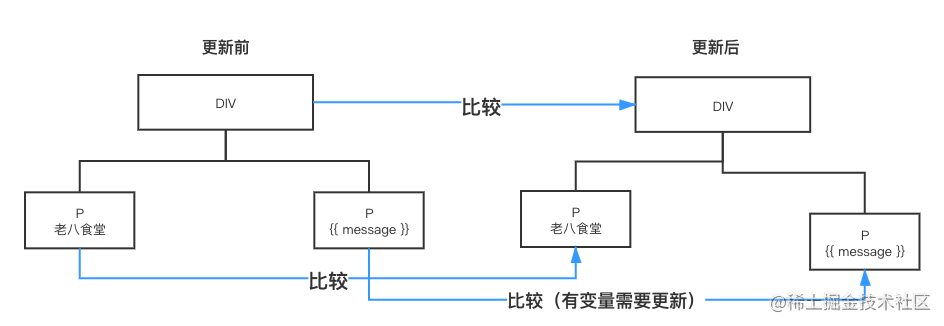

## 前言

当你和别的开发在聊到 `Vue 3` 有哪些亮点时，你的答案之一肯定有:

- 性能更好了，比 `Vue 2` 快上 2.2 倍。（静态标记、静态提升、事件监听缓存、ssr、静态节点）
- 支持 `Tree-shaking`。

本章节着重分析这两个亮点。

## 虚拟 DOM 性能优化

### PatchFlag（静态标记）

`Vue 2` 中的虚拟 `DOM` 是**全量对比的模式**，而到了 `Vue 3` 开始，新增了静态标记（`PatchFlag`）。在更新前的节点进行对比的时候，只会去**对比带有静态标记的节点**。并且 `PatchFlag` 枚举定义了十几种类型，用以更精确的定位需要对比节点的类型。下面我们通过图文实例分析这个对比的过程。假设我们有下面一段代码：

```html
<div>
  <p>老八食堂</p>
  <p>{{ message }}</p>
</div>
```

在 `Vue 2` 的全量对比模式下，如下图所示：



通过上图，我们发现，`Vue 2` 的 `diff` 算法将**每个标签都比较了一次**，最后发现带有 `{{ message }}` 变量的标签是需要被更新的标签，显然这还有优化的空间。

在 `Vue 3` 中，对 `diff` 算法进行了优化，在创建虚拟 `DOM` 时，根据 `DOM` 内容是否会发生变化，而给予相对应类型的静态标记（PatchFlag），如下图所示：


观察上图，不难发现视图的更新只对带有 `flag` 标记的标签进行了对比（diff），所以只进行了 1 次比较，而相同情况下，`Vue 2` 则进行了 3 次比较。这便是 `Vue 3` 比 `Vue 2` 性能好的第一个原因。

我们再通过把模板代码转译成虚拟 `DOM`，来验证我们上述的分析是否正确。我们可以打开模板转化[网站](https://vue-next-template-explorer.netlify.app/)，对上述代码进行转译：

```js
import {
  createElementVNode as _createElementVNode,
  toDisplayString as _toDisplayString,
  openBlock as _openBlock,
  createElementBlock as _createElementBlock,
} from "vue";

export function render(_ctx, _cache, $props, $setup, $data, $options) {
  return (
    _openBlock(),
    _createElementBlock("div", null, [
      _createElementVNode("p", null, "老八食堂"),
      _createElementVNode(
        "p",
        null,
        _toDisplayString(_ctx.message),
        1 /* TEXT */
      ),
    ])
  );
}

// Check the console for the AST
```

转译后的虚拟 `DOM` 节点，第一个 `p` 标签为写死的静态文字，而第二个 `p` 标签则为绑定的变量，所以打上了 1 标签，代表的是 `TEXT`（文字），标记枚举类型如下：

```js
export const enum PatchFlags {

  TEXT = 1,// 动态的文本节点
  CLASS = 1 << 1,  // 2 动态的 class
  STYLE = 1 << 2,  // 4 动态的 style
  PROPS = 1 << 3,  // 8 动态属性，不包括类名和样式
  FULL_PROPS = 1 << 4,  // 16 动态 key，当 key 变化时需要完整的 diff 算法做比较
  HYDRATE_EVENTS = 1 << 5,  // 32 表示带有事件监听器的节点
  STABLE_FRAGMENT = 1 << 6,   // 64 一个不会改变子节点顺序的 Fragment
  KEYED_FRAGMENT = 1 << 7, // 128 带有 key 属性的 Fragment
  UNKEYED_FRAGMENT = 1 << 8, // 256 子节点没有 key 的 Fragment
  NEED_PATCH = 1 << 9,   // 512
  DYNAMIC_SLOTS = 1 << 10,  // 动态 solt
  HOISTED = -1,  // 特殊标志是负整数表示永远不会用作 diff
  BAIL = -2 // 一个特殊的标志，指代差异算法
}
```

### hoistStatic（静态提升）

我们平时在开发过程中写函数的时候，定义一些写死的变量时，都会将变量提升出去定义，如下所示：

```js
const PAGE_SIZE = 10;
function getData() {
  $.get("/data", {
    data: {
      page: PAGE_SIZE,
    },
  });
}
```

诸如上述代码，如果将 `PAGE_SIZE = 10` 写在 `getData` 方法内，每次调用 `getData` 都会重新定义一次变量。

`Vue 3` 在这方面也做了同样的优化，继续用我们上一个例子写的代码，观察编译之后的虚拟 `DOM` 结构，如下所示。

选择 Option 下的 `hoistStatic`：

```javascript
import {
  createElementVNode as _createElementVNode,
  toDisplayString as _toDisplayString,
  openBlock as _openBlock,
  createElementBlock as _createElementBlock,
} from "vue";

const _hoisted_1 = /*#__PURE__*/ _createElementVNode(
  "p",
  null,
  "老八食堂",
  -1 /* HOISTED */
);

export function render(_ctx, _cache, $props, $setup, $data, $options) {
  return (
    _openBlock(),
    _createElementBlock("div", null, [
      _hoisted_1,
      _createElementVNode(
        "p",
        null,
        _toDisplayString(_ctx.message),
        1 /* TEXT */
      ),
    ])
  );
}

// Check the console for the AST
```

细心的同学会发现， `老八食堂` 被提到了 `render` 函数外，每次渲染的时候只要取 `_hoisted_1` 变量便可。认真看文章的同学又会发现一个细节， `_hoisted_1` 被打上了 `PatchFlag` ，静态标记值为 `-1` ，特殊标志是负整数表示永远不会用作 `diff`。也就是说被打上 `-1` 标记的，将**不在参与 `diff` 算法**，这又提升了 `Vue` 的性能。

### cacheHandler（事件监听缓存）

默认情况下 `@click` 事件被认为是动态变量，所以每次更新视图的时候都会追踪它的变化。但是正常情况下，我们的 `@click` 事件在视图渲染前和渲染后，都是同一个事件，基本上不需要去追踪它的变化，所以 `Vue 3` 对此作出了相应的优化叫 `事件监听缓存`，我们在上述代码中加一段：

```html
<div>
  <p @click="handleClick">屋里一giao</p>
</div>
```

编译后如下图所示（还未开启 cacheHandler）：


在未开启 `事件监听缓存` 的情况下，我们看到这串代码编译后被静态标记为 8，之前讲解过被静态标记的标签就会被拉去做比较，而静态标记 8 对应的是“动态属性，不包括类名和样式”。 `@click` 被认为是动态属性，所以我们需要开启 `Options` 下的 `cacheHandler` 属性，如下图所示：

```js
import {
  createElementVNode as _createElementVNode,
  openBlock as _openBlock,
  createElementBlock as _createElementBlock,
} from "vue";

export function render(_ctx, _cache, $props, $setup, $data, $options) {
  return (
    _openBlock(),
    _createElementBlock("div", null, [
      _createElementVNode(
        "p",
        {
          onClick:
            _cache[0] ||
            (_cache[0] = (...args) =>
              _ctx.handleClick && _ctx.handleClick(...args)),
        },
        "屋里一giao"
      ),
    ])
  );
}

// Check the console for the AST
```

细心的同学又会发现，开启 `cacheHandler` 之后，编译后的代码已经没有静态标记（PatchFlag），也就表明图中 `p` 标签不再被追踪比较变化，进而提升了 `Vue` 的性能。

### SSR 服务端渲染

当你在开发中使用 `SSR` 开发时，`Vue 3` 会**将静态标签直接转化为文本**，相比 `React` 先将 `jsx` 转化为虚拟 `DOM`，再将虚拟 `DOM` 转化为 `HTML`，`Vue 3` 已经赢了。

```html
<div>
  <p>老八</p>
  <p>giao</p>
  <p>药水哥</p>
  <p>南水北giao</p>
  <p>画画的babe</p>
  <p @click-"handleClick">屋里一{{ msg }}</p>
</div>
```

```js
import { mergeProps as _mergeProps } from "vue";
import {
  ssrRenderAttrs as _ssrRenderAttrs,
  ssrInterpolate as _ssrInterpolate,
} from "vue/server-renderer";

export function ssrRender(
  _ctx,
  _push,
  _parent,
  _attrs,
  $props,
  $setup,
  $data,
  $options
) {
  const _cssVars = { style: { color: _ctx.color } };
  _push(
    `<div${_ssrRenderAttrs(
      _mergeProps(_attrs, _cssVars)
    )}><p>老八</p><p>giao</p><p>药水哥</p><p>南水北giao</p><p>画画的babe</p><p>屋里一${_ssrInterpolate(
      _ctx.msg
    )}</p></div>`
  );
}
```

### StaticNode（静态节点）

上述 `SSR` 服务端渲染，会将静态标签直接转化为文本。在客户端渲染的时候，只要标签嵌套得足够多，编译时也会将其转化为 `HTML` 字符串，如下图所示：


> 需要开启 Options 下的 hoistStatic

```html
<div>
  <p>画画的babe</p>
  <p>画画的babe</p>
  <p>画画的babe</p>
  <p>画画的babe</p>
  <p>画画的babe</p>
  <p>画画的babe</p>
  <p>画画的babe</p>
  <p>画画的babe</p>
  <p>画画的babe</p>
  <p>画画的babe</p>
  <p>画画的babe</p>
  <p>画画的babe</p>
  <p>画画的babe</p>
  <p>画画的babe</p>
  <p>画画的babe</p>
</div>
```

```js
import {
  createElementVNode as _createElementVNode,
  createStaticVNode as _createStaticVNode,
  openBlock as _openBlock,
  createElementBlock as _createElementBlock,
} from "vue";

const _hoisted_1 = /*#__PURE__*/ _createStaticVNode(
  "<p>画画的babe</p><p>画画的babe</p><p>画画的babe</p><p>画画的babe</p><p>画画的babe</p><p>画画的babe</p><p>画画的babe</p><p>画画的babe</p><p>画画的babe</p><p>画画的babe</p><p>画画的babe</p><p>画画的babe</p><p>画画的babe</p><p>画画的babe</p><p>画画的babe</p>",
  15
);
const _hoisted_16 = [_hoisted_1];

export function render(_ctx, _cache, $props, $setup, $data, $options) {
  return _openBlock(), _createElementBlock("div", null, _hoisted_16);
}
```

## Tree-shaking

说到 `Tree-shaking` 这个属于，官方的解释用大白话说就是，没有被应用到的代码，编译后自动将其剔除。

我个人是这么记住 `Tree-shaking` 的，翻译成中文就是 `摇树`，树上有枯叶和绿叶，我摇动树干，枯叶掉了，新叶留着。这里的枯叶就是指没用到的代码，新叶指被应用到的代码，这么记就完全可以记忆这个技术点。

在 `Vue 2` 中，无论有没有用到全部的功能，这些功能的代码都会被打包到生产环境中。究其原因，主要还是怪 `Vue 2` 生成实例是单例，这样**打包的时候就无法检测到实例中的各个方法是否被引用到**。如下：

```js
import Vue from "vue";

Vue.nextTick(() => {});
```

而 `Vue 3` 经过改良之后，引入了 `Tree-shaking` 的特性，**所有的方法通过模块化导入的形式。**如下：

```js
import { nextTick, onMounted } from "vue";

nextTick(() => {});
```

个人理解：这就是 `hooks` 的重要作用。

`nextTick` 方法会被打进生产包，而 `onMounted` 在代码里没有用到，最终不会出现在编译后的代码里。

`Tree-shaking` 做了两件事：

- 编译阶段利用 `ES` 的模块化判断有哪些模块已经加载。
- 判断哪些模块和变量，没有被使用或引用到，从而删除对应的代码。

`Vue 3` 的 `Tree-shaking` 为我们带来了一下几个升级：

- 减少打包后的静态资源体积
- 程序执行更快

## 总结

本章节我们分析了 `Vue 3` 在性能和业务能力上的重大改变，可以推测出，随着周边插件的升级，`Vue 3` 将很快被大众所接受，慢慢的会取代 `Vue 2` 版本，包括市面上面试官的问题，也将会从 `Vue 2` 相关迁移到 `Vue 3` 相关。
